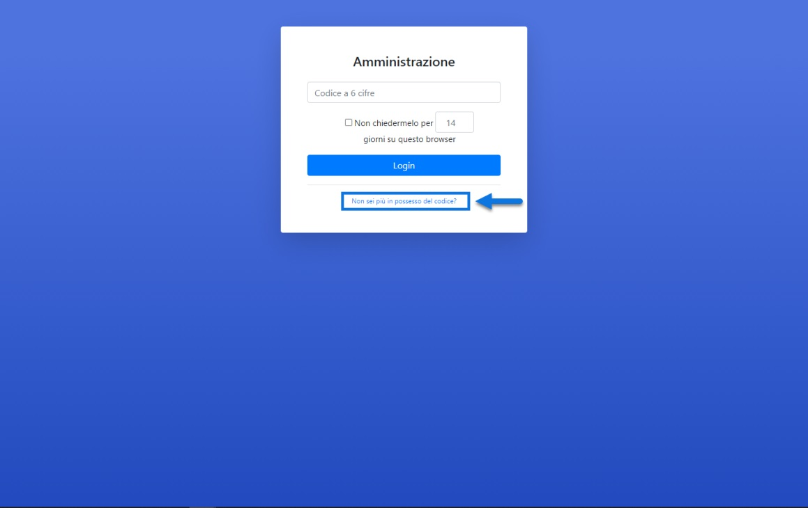
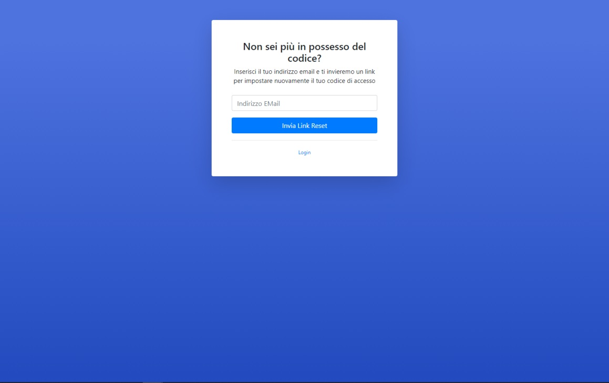

# RESET DELL' AUTENTICAZIONE A DUE FATTORI

Nel momento in cui dopo aver attivato l'autenticazione a due fattori,
non si dovesse più avere, per una qualsiasi ragione, la possibilità di
generare i codici necessari per completare il processo, sarà comunque
possibile resettare la propria utenza ponendola nelle stesse esatte
condizioni in cui si trovava al primo accesso.

Per fare questo sarà necessario cliccare sul link "**Non sei più in
possesso del codice?**" presente nella maschera di inserimento del
codice a 6 cifre

{width="5.259722222222222in"
height="3.3180555555555555in"}

In questo modo si verrà infatti ricondotti ad una pagina in cui poter
inserire l'indirizzo mail associato al proprio utente, indirizzo questo
cui verrà inviata un'apposita mail contente il link da utilizzare per
resettare la propria utenza.

{width="5.259722222222222in"
height="3.3180555555555555in"}

Cliccando sul link presente all'interno di questa mail, l'utente verrà
riportato nelle stesse condizioni in cui si trovava al primo accesso,
per cui una volta inserite le proprie credenziali (Username e Password)
verrà nuovamente mostrato il QR code necessario per attivare all'interno
dell' App o del plugin descritto nel capitolo precedente, la generazione
del codice a 6 cifre richiesto per completare il processo di
autenticazione.

**ATTENZIONE! In questo senso è di fondamentale importanza verificare di
aver associato al proprio account utente un indirizzo mail al quale
poter poi accedere. In caso contrario per effettuare il reset della
propria utenza sarà necessario fare apposita richiesta direttamente a
Passepartout**

Volendo, infine, sarà possibile resettare la propria utenza anche agendo
direttamente dalla pagina "**I Tuoi Dati**" accessibile cliccando sulla
voce di menu "**Profilo**" evidenziata in figura:

{width="5.065277777777778in"
height="3.298611111111111in"}

Cliccando sul pulsante "**Resetta**" l'utenza verrà riportata nelle
condizioni iniziali e, al prossimo accesso, dopo aver inserito le
proprie credenziali verrà quindi mostrato nuovamente il QR Code
necessario per attivare all'interno dell'App Google Authenticator la
generazione del codice a 6 cifre.

Lo stesso QR Code, come si può facilmente notare, sarà sempre
accessibile all'interno dalle pagina i "Tuoi Dati" e, all'occorrenza,
potrà quindi essere utilizzato per attivare nuovamente la generazione
del codice all'interno della propria app di autenticazione.

