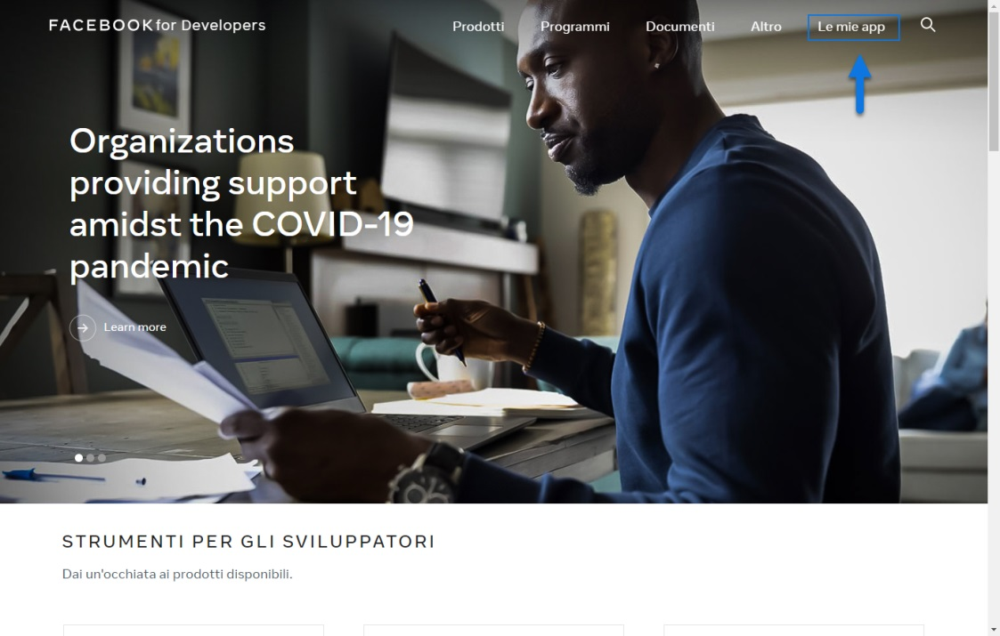

# FACEBOOK

Di seguito è indicata la procedura da seguire per realizzare
l'integrazione tra il proprio sito Passweb e **Facebook** al fine di
consentire agli utenti del sito di effettuare la registrazione e/o
l'autenticazione utilizzando il proprio profilo social.

**ATTENZIONE! Per poter realizzare questo tipo di integrazione è
necessario, ovviamente, che l'amministratore del sito disponga di un
proprio account Facebook regolarmente funzionante**

1.  Accedere al sito Facebook per sviluppatori
    (<https://developers.facebook.com> ) con il proprio account e
    selezionare la voce "**Le mie app**"

{width="5.104166666666667in"
height="3.2534722222222223in"}

2.  Una volta avuto accesso alla sezione delle App crearne una nuova
    cliccando per questo sul pulsante "**Aggiungi una nuova app**"

{width="5.259722222222222in"
height="2.714583333333333in"}

3.  All'interno della maschera di selezione della tipologia di App da
    realizzare selezionare la voce **"Altri Usi"**

{width="5.259722222222222in"
height="2.714583333333333in"}

4.  Compilare la maschera relativa ai dati anagrafici dell'App che si
    sta realizzando (Nome App, Indirizzo Mail, Account Business Manager
    collegato) e cliccare sul pulsante "**Crea ID app**"

{width="5.259722222222222in"
height="2.714583333333333in"}

5.  Nella Dashboard di gestione delle App selezionare "**Facebook
    login**" e cliccare sul pulsante "**Configura**"

{width="5.104166666666667in"
height="3.2534722222222223in"}

> Successivamente selezionare, tra le opzioni proposte, quella relativa
> al sito web

{width="5.104166666666667in"
height="3.2534722222222223in"}

6.  Nella successiva maschera inserire all'interno del campo **"URL del
    sito"** l'indirizzo del proprio sito Passweb e cliccare su
    "**Continua**"

{width="5.104166666666667in"
height="3.2534722222222223in"}

> A questo punto l'App è stata creata. E' quindi possibile saltare i
> successivi passaggi e andare direttamente nella Dashboard di questa
> stessa app dove sarà possibile verificarne la corretta creazione.

7.  Utilizzando sempre il menu presente sulla sinistra della pagina,
    portarsi all'interno della sezione "**Impostazioni -- Di Base**" e
    prelevare i dati da inserire poi in Passweb per realizzare
    l'integrazione tra le due piattaforme.

{width="5.104166666666667in"
height="3.2534722222222223in"}

> Nello specifico i dati richiesti saranno quelli presenti all'interno
> dei campi "**ID app**" e "**Chiave Segreta**"

{width="5.104166666666667in"
height="3.2534722222222223in"}

> Copiare quindi il codice presente all'interno del campo "**ID app**"
> ed inserirlo alla pagina "*Sito -- Preferenze -- Social Media*" del
> Wizard nel campo **App ID** presente nella sezione Facebook
>
> **ATTENZIONE!** **l'App ID inserito all'interno di questo campo verrà
> poi utilizzato anche per valorizzare il Meta Tag "fb:app" nel momento
> in cui si dovesse decidere di abilitare, per il proprio sito, il
> protocollo Opengraph in maniera tale da poter indicare in maniera più
> precisa quali informazioni di una pagina web dovranno essere condivise
> sui vari social.**
>
> Per maggiori informazioni relativamente all'attivazione del protocollo
> Opengraph e alla condivisone dei contenuti di una pagina web si veda
> anche la sezione *"Sito -- Preferenze -- SEO Keywords Description e
> Permalink"* di questo manuale.
>
> Allo stesso modo copiare il codice presente all'interno del campo
> "**Chiave Segreta**" dell'App di Facebook e incollarlo all'interno del
> campo **App Secret** del Wizard di Passweb
>
> **ATTENZIONE!** Per visualizzare il codice presente all'Interno del
> campo "Chiave Segreta" dell'App di facebook è necessario cliccare sul
> pulsante "Mostra" ed inserire la password del proprio account facebook
>
> Una volta inseriti in Passweb i due parametri di configurazione
> richiesti cliccare sul pulsante "**Salva**" presente nella parte bassa
> della maschera.

8.  Utilizzando sempre il menu presente sulla sinistra della pagina,
    portarsi all'interno della sezione "**Facebook Login --
    Impostazioni**"

{width="5.104166666666667in"
height="3.2534722222222223in"}

> e inserire all'interno del campo "**URI di reindirizzamento OAUTH
> validi**" l'indirizzo del proprio sito web seguito dalla stringa
> **/callbackSocial/Facebook** come evidenziato in figura

{width="5.104166666666667in"
height="3.2534722222222223in"}

9.  Arrivati a questo punto e completata l'integrazione tra le due
    piattaforme per terminare il processo sarà necessario effettuare
    altre piccole configurazioni all'interno della propria App facebook
    dovute, essenzialmente, al fatto che, appena creta, la nostra App
    sarà in modalità di sviluppo e per renderla effettivamente
    utilizzabile dovremo ovviamente pubblicarla.

> Tornare quindi all'interno della sezione "**Impostazioni -- Di Base**"
> e completare il form con tutti i dati richiesti

{width="5.104166666666667in"
height="3.2534722222222223in"}

10. Il passaggio dallo stato di Test a quello pubblico avviene
    all'interno della sezione **"Status & Reviews"** spostando il
    relativo interruttore sulla voce **SI**

{width="5.149305555555555in"
height="3.7465277777777777in"}

> Prima di pubblicare definitivamente la nostra App potrebbe però essere
> utile effettuare alcuni test di corretto funzionamento in maniera tale
> da verificare la possibilità di accedere al nostro sito Passweb
> utilizzando un profilo Facebook
>
> Per far questo è possibile coinvolgere alcuni dei nostri amici
> facebook oppure creare apposite utenze di test. Scegliamo quest'ultima
> strada e procediamo quindi alla creazione all'interno della nostra App
> Facebook di un nuovo utente di test

11. Accedere alla sezione **Ruoli** dell'App e cliccare sulla voce
    **Utenti Test**

{width="5.104166666666667in"
height="3.2534722222222223in"}

12. Cliccare quindi sul pulsante **Aggiungi,** indicare nella successiva
    maschera il numero di utenti di test che si intende creare e,
    ovviamente, autorizzarli come utenti di test per la nostra App

{width="5.104166666666667in"
height="3.2534722222222223in"}

> Una volta creati gli utenti di test è poi possibile, volendo,
> modificarne i dati selezionando una delle voci del menu visualizzato
> cliccando sul relativo pulsante **Modifica**

{width="5.104166666666667in"
height="3.2534722222222223in"}

13. A questo punto possiamo aprire il sito Passweb e scegliere di
    effettuare l'autenticazione utilizzando il profilo facebook

{width="5.00625in"
height="3.214583333333333in"}

> Nella maschera di accesso a facebook sarà ovviamente necessario
> inserire le credenziali di uno degli utenti di test creati al punto
> precedente.

{width="5.5in"
height="3.967361111111111in"}

> Volendo è anche possibile effettuare prima l'accesso a facebook come
> uno degli utenti di test precedentemente creati poi aprire, in un
> altro tab del browser, il sito Passweb ed effettuare l'autenticazione
> mediante facebook; in questo caso non verrà richiesto di inserire
> nuovamente le credenziali di accesso alla piattaforma social.
>
> In ogni caso una volta inserite le credenziali sarà necessario
> confermare l'invio delle informazioni del profilo facebook all'App e
> quindi al sito Passweb

{width="5.4222222222222225in"
height="3.532638888888889in"}

> Una volta concessa l'autorizzazione cliccando sul pulsante "**Continua
> come ...**", verremo automaticamente ricondotti al sito Passweb dove
> potremo verificare l'avvenuto accesso (e conseguentemente l'avvenuta
> registrazione) del nuovo utente di test.

14. Una volta verificata la possibilità, da parte di uno degli utenti di
    test creati in facebook, di accedere al nostro sito Passweb
    utilizzando i dati del proprio profilo social, sarà necessario
    pubblicare definitivamente l'App (come indicato al punto 12) in
    maniera tale da abilitare la possibilità ad un qualsiasi utente del
    sito di autenticarsi utilizzando il proprio profilo facebook.

{width="5.201388888888889in"
height="3.779166666666667in"}

**ATTENZIONE! Lasciando l'App in modalità Test i soli utenti abilitati
ad accedere al sito Passweb mediante il loro profilo facebook saranno
gli utenti di testo creati all'interno dell'App**

Per maggiori informazioni relativamente al componente "Login Utente" e a
come configurarlo per abilitare agli utenti la possibilità di accedere
al sito mediante il proprio profilo social si veda anche la sezione
"*Live Editing -- Lista Componenti Interazione Utente -- Componenti
Interni ai componenti interazione utente -- Social Login*" di questo
manuale.

