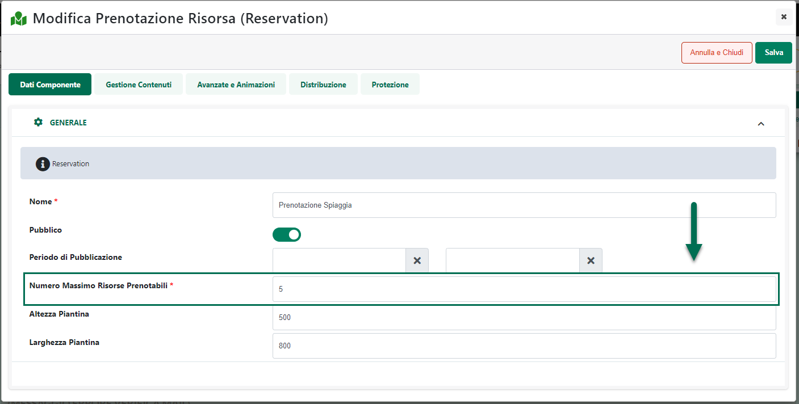
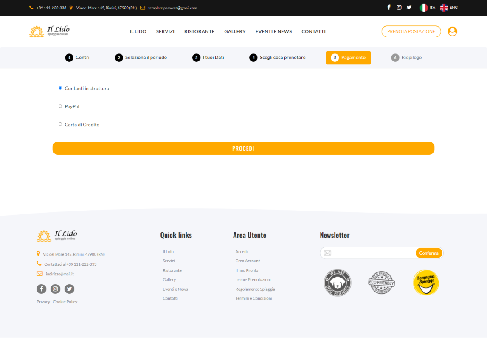
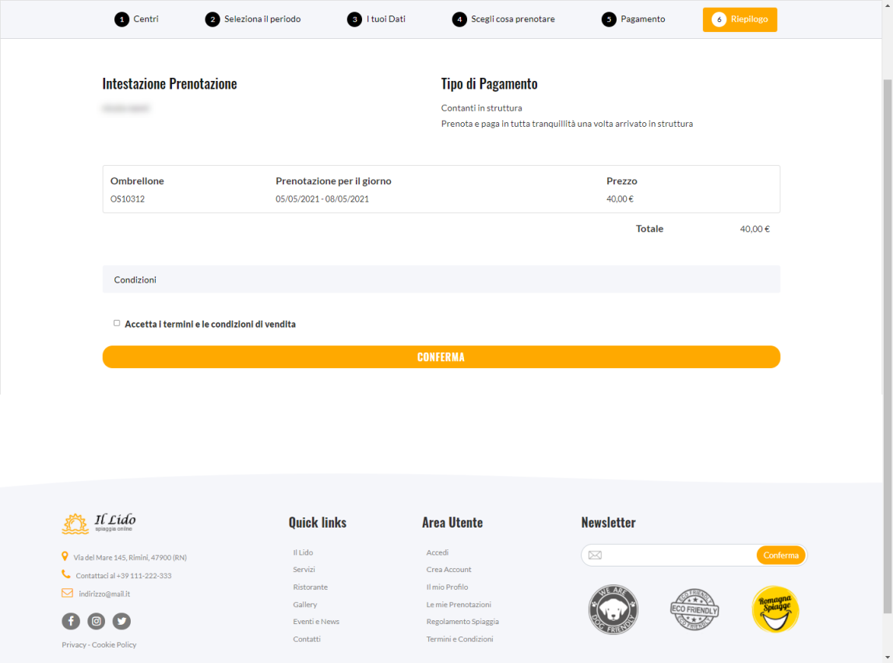
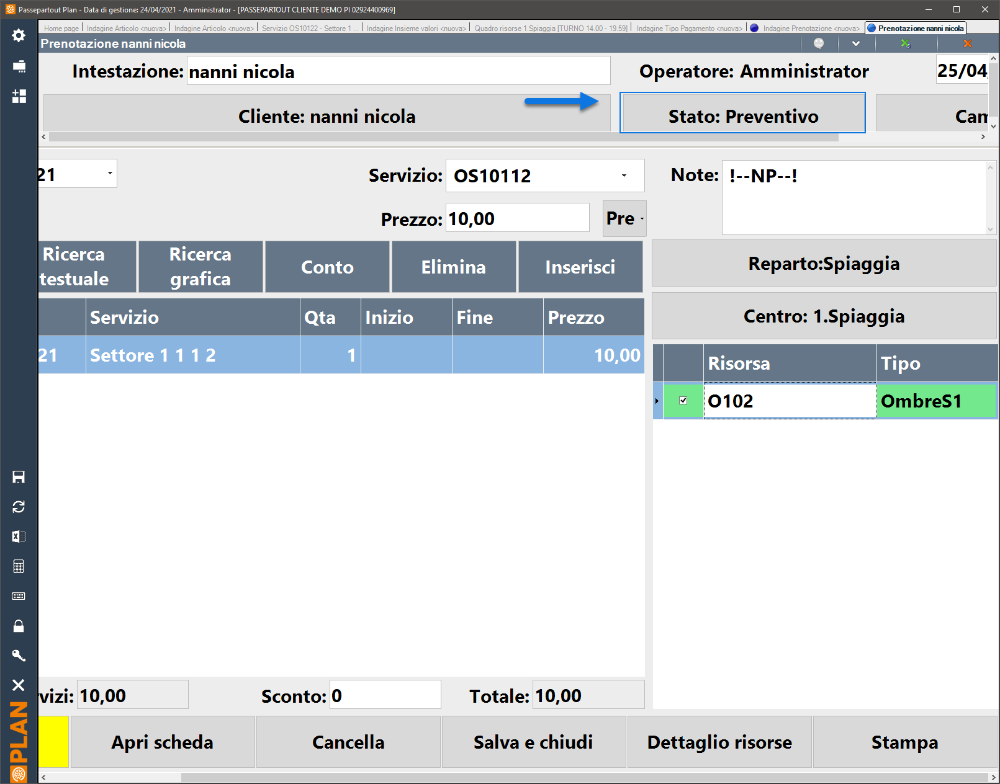
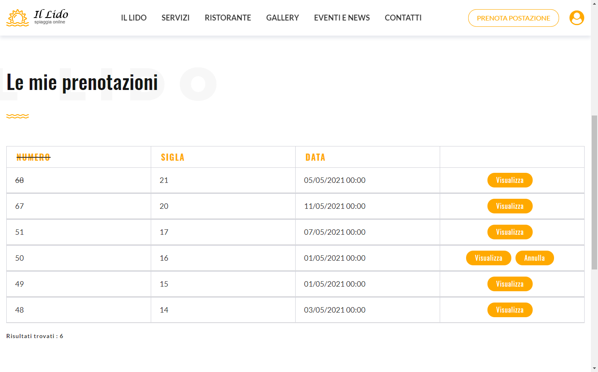

# PROMPT PREDEFINITI

Tenendo conto di quanto detto nei precedenti capitoli di questo manuale
dovrebbe ormai essere abbastanza chiaro che i due parametri più
importanti, in fase di definizione del Template di un Prompt da dare poi
in pasto all'AI, sono sicuramente il "Prompt System" e il "Prompt".

Il primo (Prompt System) consente di fornire al modello di AI le
istruzioni su come rispondere alle domande che le verranno poste, il
secondo (Prompt) consente invece di definire esattamente la specifica
domanda da porre al modello.

In questo senso, ovviamente, le domande da porre al modello di AI
possono essere le più diverse cambiando di volta in volta a seconda di
quelle che sono le specifiche esigenze dell'utente.

In ogni caso Passweb mette comunque a disposizione, anche per i Prompt
(e quindi per le domande da porre all'AI), una serie di modelli
predefiniti facilmente importabili, in modo tale da non dover partire
ogni volta da zero. I prompt predefiniti potranno comunque essere sempre
personalizzati secondo le specifiche esigenze del caso.

Per accedere a questi modelli predefiniti è sufficiente cliccare sul
pulsante "**Prompt Predefiniti**" presente nella barra degli strumenti
della maschera "Prompt Template"

In questo modo verrà infatti visualizzata la maschera "**Prompt Template
Passepartout**"

contente l'elenco di tutti i Prompt messi a disposizione da Passepartout
per ciascuna delle categorie gestite (Prodotto, CMS, SEO)

I pulsanti presenti nella barra degli strumenti consento rispettivamente
di:

**Visualizza Template** (
 ): consente di tornare alla maschera
Prompt Template contenente l'elenco di tutti i Template di Prompt
attualmente codificati e utilizzabili all'interno del sito

**Visualizza dettaglio** (
 ): consente di visualizzare il dettaglio
del Prompt attualmente selezionato in elenco e, volendo, di importarlo
tra i Template di prompt che potranno poi essere utilizzati all'interno
del sito.

Cliccando su questo pulsante verrà infatti visualizzato il dettaglio
della domanda che verrebbe posta al modello di AI nel momento in cui
dovessimo decidere di utilizzare il prompt in esame

Il pulsante "**Importa**" consente di inserire il Prompt Predefinito tra
quelli presenti all'interno della maschera "Prompt Template"
precedentemente analizzata e, quindi, tra quelli che saranno poi
effettivamente utilizzabili all'interno del sito

**Occorre però sottolineare che, una volta importato, il prompt
predefinito non sarà immediatamente utilizzabile.**

Prima di poterlo utilizzare dovremo infatti completarne la
configurazione assegnandolo eventualmente a determinati campi,
stabilendo se dovrà essere o meno un Template di Default e, soprattutto,
andando a sostituire i testi presenti tra {{ }} e tra \[\[ \]\]
all'interno dei campi "**Prompt System**" e "**Prompt**" con quello che
dovremo effettivamente chiedere al modello di AI quando poi decideremo
di utilizzare il Prompt in questione

**ATTENZIONE! I prompt predefiniti sono forniti solo in lingua
italiana.**

Nel caso di utilizzo di tali prompt in siti multilingua sarà quindi
necessario tradurli nella lingua di interesse o comunque modificarli per
ogni singola lingua gestita indicando poi al modello di rispondere nella
lingua desiderata

