# GENERAZIONE DI CONTENUTI MEDIANTE AI

Dopo aver attivato il modulo "Passweb AI", impostato la chiave di
configurazione e definito i vari Template di Prompt, avremo a
disposizione tutto quello che ci serve per poter effettivamente iniziare
ad interagire con i vari modelli di intelligenza artificiale e per poter
quindi generare contenuti per il nostro sito.

**ATTENZIONE!** come capiremo meglio tra poco i prompt definiti
all'interno della sezione "Template" possono velocizzare notevolmente
l'interazione con l'AI e la conseguente generazione dei contenuti
(soprattutto quelli relativi ai prodotti in vendita sul sito) ma non
sono, in realtà, strettamente necessari per ottenere questo tipo di
risultato

In questo senso dunque la prima cosa da considerare è che, una volta
attivato e configurato il modulo Passweb AI avremo automaticamente a
disposizione, in diversi punti dell'applicativo, un nuovo pulsante
"**Genera con AI**" che ci consentirà di interagire con il modello di
intelligenza artificiale per porgli delle domande, ottenere delle
risposte e, nel caso in cui queste dovessero essere ritenute
soddisfacenti, potremo decidere di utilizzarle per valorizzare
determinati campi.

Di seguito viene fornito un elenco di tutti i campi e di tutti i punti
dell'applicativo in cui sarà possibile utilizzare il pulsante "**Genera
con AI**"

- Campi **Descrizione**, **Descrizione** **Dettagliata**,
  **Descrizione** **HTML / 2 / 3** nella scheda "Descrizione"
  dell'Anagrafica Passweb di ogni singolo articolo

- Campo **Descrizione** nella scheda "Informazioni Generali"
  dell'Anagrafica Passweb di ogni singola Categoria Merceologica

- **Attributi Articolo di tipo Testo o Testo HTML** -- scheda
  "Attributi" dell'Anagrafica Passweb di ogni singola Categoria
  Merceologica

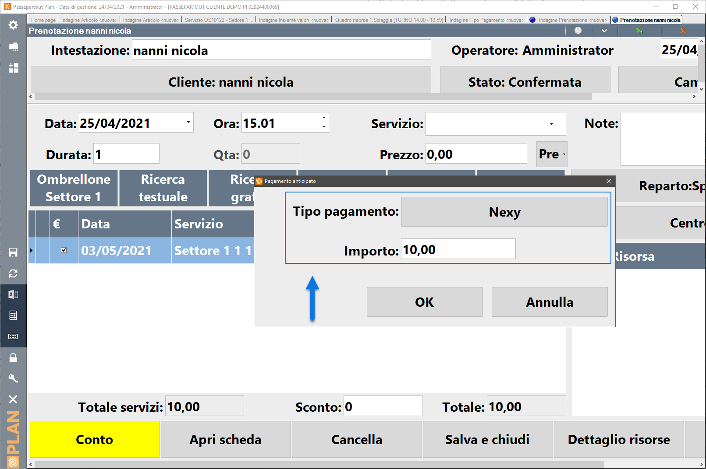

- Campi **Title**, **Keywords Meta**, **Description Meta** nella scheda
  "Seo -- Site Map" dell'Anagrafica Passweb di ogni singola articolo

- Campi **Title**, **Keywords Meta**, **Description Meta** nella scheda
  "Seo -- Site Map" dell'Anagrafica Passweb di ogni singola categoria
  merceologica

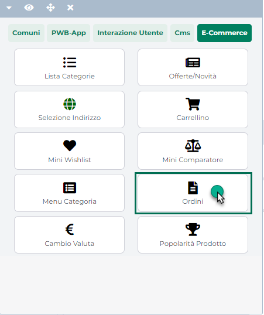

- Campi **Titolo**, **Sommario**, **Dettaglio** nella scheda "Contenuto"
  della maschera di dettaglio di un contenuto CMS

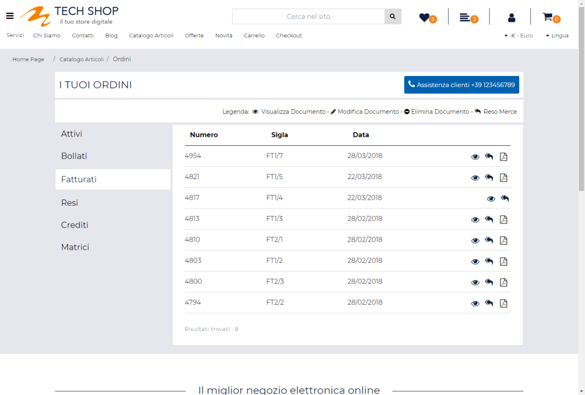

- Campi **Descrizione 1 / 2 / 3** nella scheda "Ulteriori Contenuti"
  della maschera di dettaglio di un contenuto CMS

- Camp **Tag Associati** nella scheda "Associazioni" della maschera di
  dettaglio di un contenuto CMS

- Campi **Title**, **Keywords Meta**, **Description Meta** nella scheda
  "Seo -- Site Map" della maschera di dettaglio di un contenuto CMS

- Campo **Descrizione** nella maschera di dettaglio di ogni singola
  Categoria CMS

- Campi **Titolo di Pagina**, **Keywords**, **Description** nella
  maschera di configurazione delle pagine generiche in uso al sito

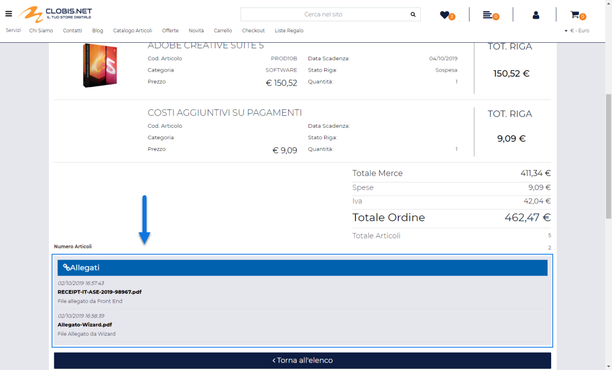

- Campo **Contenuto** nella maschera di configurazione del componente
  "Paragrafo"

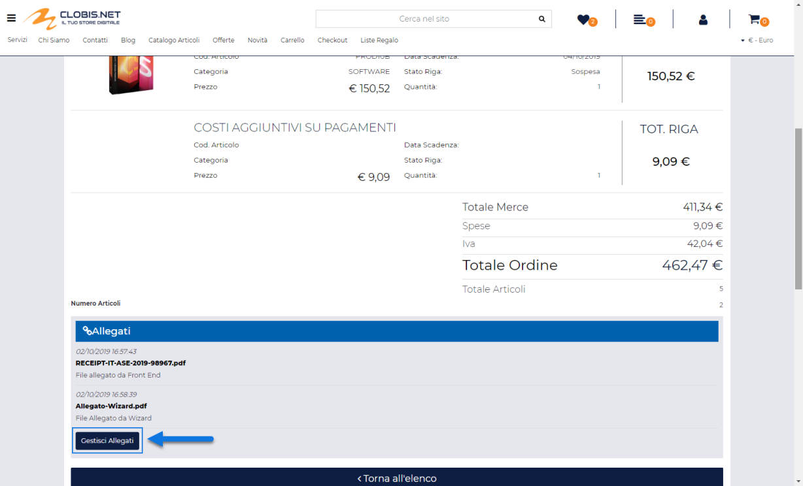

- Campo **HTML** nella maschera di configurazione del componente "HTML"

- Sezione **CSS** nella maschera di gestione dei Layout in uso al sito

- Sezione **Javascript** nella maschera di gestione dei Layout in uso al
  sito

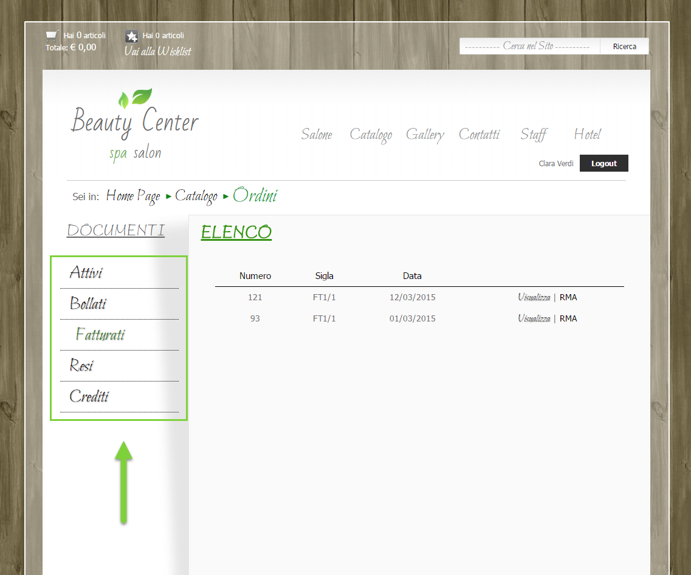

Il comportamento del pulsante "**Genera con AI**" sarà poi diverso a
seconda del fatto che allo specifico campo siano stati associati o meno
dei Template di Prompt tra quelli precedentemente creati.

In particolare nel caso in cui al campo in esame siano stati associati
dei Template di prompt, cliccando su questo pulsante verrà visualizzata
la maschera "**Genera contenuto per \<nome campo\>**" (dove \<nome
campo\> varierà, ovviamente, in relazione allo specifico campo da cui si
è partiti)

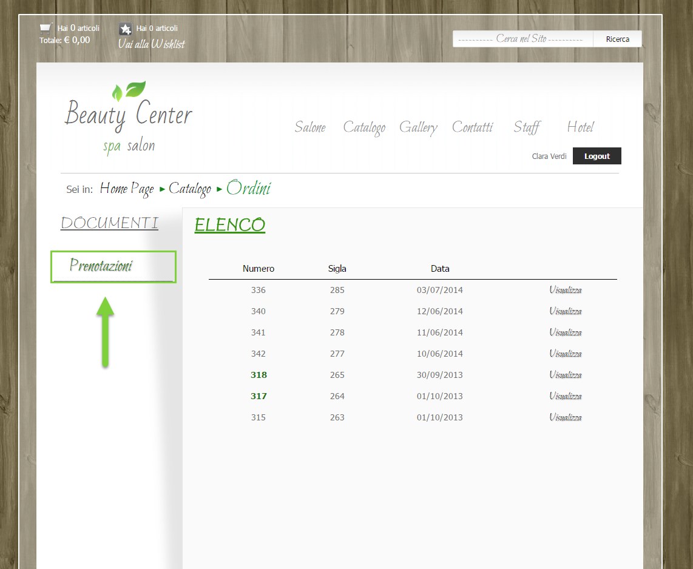

In queste condizioni il parametro "**Seleziona un prompt"** consentirà
di indicare, selezionandolo tra quelli precedentemente associati al
campo in esame, il prompt da utilizzare per porre la domanda al modello
di AI.

Una volta selezionato uno dei Template presenti in elenco, nel
successivo campo "**Prompt**" verrà visualizzato automaticamente quanto
inserito, in fase di configurazione di quello specifico Template,
all'interno dello stesso campo Prompt.

In questo modo l'utente non dovrà scrivere ogni volta la domanda da
inoltrare al modello di AI e il processo di generazione dei contenuti
sarà ovviamente più rapido.

Come indicato all'interno del precedente capitolo di questo manuale però
un prompt non è composto dalla sola domanda da porre al modello di AI ma
anche da altri parametri come lo specifico modello di AI che dovrà
essere utilizzato o il prompt di sistema contenente le istruzioni che il
modello stesso dovrà seguire per generare le risposta.

In questo senso, ovviamente, la selezione di un determinato Template
comporterà l'utilizzo del modello di AI e del prompt di sistema definiti
per quello stesso Template e **tali valori non potranno essere
modificati all'interno di questa maschera**.

**ATTENZIONE!** Nel momento in cui l'esigenza dovesse essere, dunque,
quella di variare il modello di AI a cui porre la domanda o di cambiare
le istruzioni impostate all'interno del prompt di sistema, sarà
necessario cambiare Template o modificare, dall'apposita sezione del
Wizard, i parametri di configurazione di quello attualmente utilizzato

Quello che può essere eventualmente modificato direttamente dalla
maschera "Genera contenuto ..." è invece il valore del campo Prompt
ossia l'effettiva domanda che verrà poi inoltrata all'AI.

Nel caso in cui il contenuto da generare sia relativo ad uno dei campi
articolo gestiti, sarà anche possibile inserire all'interno del prompt
(come del resto era possibile anche in fase di definizione del Template)
uno dei segnaposto gestiti (campo "Seleziona un Segnaposto"). Questi
segnaposto verranno poi sostituiti, prima di inviare la domanda all'AI,
con l'effettivo valore del campo indicato.

Una volta verificato che sia effettivamente tutto corretto cliccando sul
pulsante "**Genera**" posto nella parte bassa della maschera verrà
inviata la domanda al modello di AI associato al Template

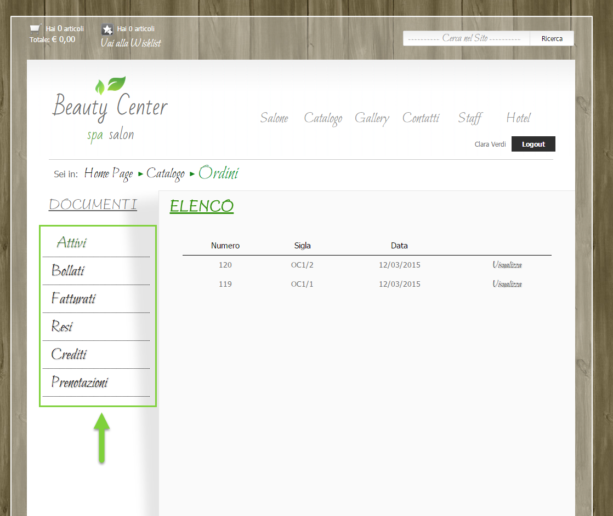

e, dopo un breve intervallo di tempo (che non dipende da Passweb),
all'interno della maschera "Genera contenuto per ..." verrà visualizzata
un ulteriore sezione contente la risposta generata dall'AI

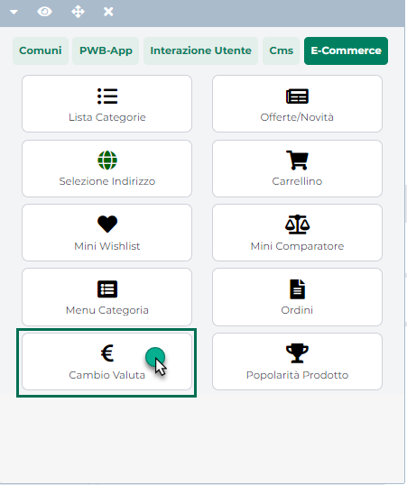

La risposta fornita verrà inserita all'interno di un editor dello stesso
tipo di quello disponibile ad esempio per il componente "Paragrafo" e
potrà quindi essere eventualmente personalizzata sia a livello grafico
che a livello di contenuti veri e propri prima di essere effettivamente
inserita all'interno del campo di partenza.

**ATTENZIONE!** l'indicazione "**Token utilizzati**", presente
immediatamente al di sotto dell'editor contenente la risposta fornita
dall'AI, mostra il numero esatto di token consumati nella specifica
interazione dando quindi all'utente anche un'indicazione di quanto
quella specifica interazione gli è venuta a costare (ovviamente il tutto
in termini di token).

A questo punto se la risposta non dovesse essere ritenuta soddisfacente
sarà possibile modificare il prompt secondo le specifiche esigenze del
caso e cliccare nuovamente sul pulsante "**Genera**" per ottenerne una
nuova.

Se invece la risposta ottenuta dovesse essere soddisfacente il pulsante
"**Applica**" permetterà di inserirla nel campo di partenza

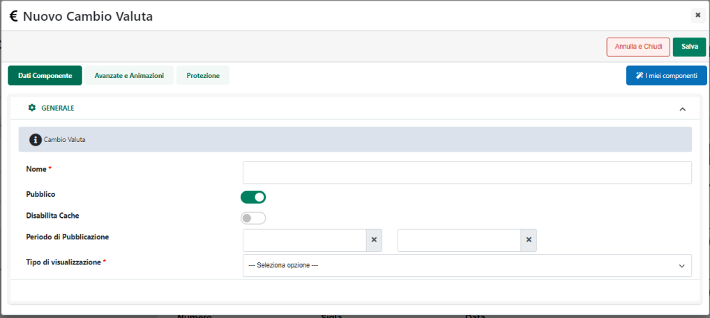

**ATTENZIONE!** **per ovvie ragioni la generazione di contenuti relativi
ai layout (codice CSS e js) non prevede la presenza del pulsante
"Applica"**. In questo caso sarà quindi necessario copiare la risposta
fornita dall'AI e inserirla manualmente all'interno del relativo editor
di codice

Ovviamente per poter rendere effettive le modifiche, una volta compilato
il campo, sarà sempre necessario salvare l'anagrafica o la maschera
all'interno della quale si sta operando

**ATTENZIONE!** volendo sarebbe anche possibile saltare questi ultimi
passaggi inserendo automaticamente il contenuto della risposta fornita
dall'AI all'interno del relativo campo Passweb senza nessun tipo di
passaggio intermedio (per maggiori informazioni in merito si veda quanto
indicato all'interno del successivo capitolo di questo manuale)

Come precedentemente evidenziato non è però obbligatorio assegnare dei
Template di prompt ad ogni singolo campo su cui può essere utilizzata
l'AI anzi, in determinati casi, potrebbe proprio non essere possibile
farlo.

In ogni caso tutto ciò non inficia in alcun modo l'utilizzo dell'AI.
Avremo infatti comunque a disposizione il pulsante "**Genera con AI**" e
cliccando su di esso verrà sempre aperta la maschera "**Genera contenuto
per ...**"

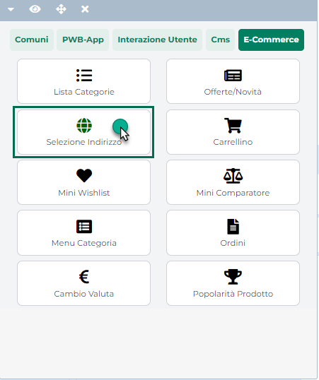

In queste condizioni non sarà però presente il campo "Seleziona un
prompt" e dovremo quindi digitare da zero la domanda da porre all'AI

**ATTENZIONE! in fase di generazione dei contenuti di un campo cui non è
stato associato uno specifico prompt verrà sempre utilizzato:**

- **Come modello di AI gpt-4o**

- **Come prompt di sistema il testo di seguito indicato:**

> **"*Rispondi sempre solo con la risposta, senza frasi introduttive o
> conclusive. In caso di risposte HTML, rispondi sempre solo con il
> codice HTML senza delimitatori di codice come \`\`\`html*"**

Per il resto la procedura di generazione dei contenuti sarà identica a
quella precedentemente analizzata. Una volta inserita la domanda
all'interno del campo Prompt sarà quindi necessario anche questa volta
cliccare sul pulsante "**Genera**"

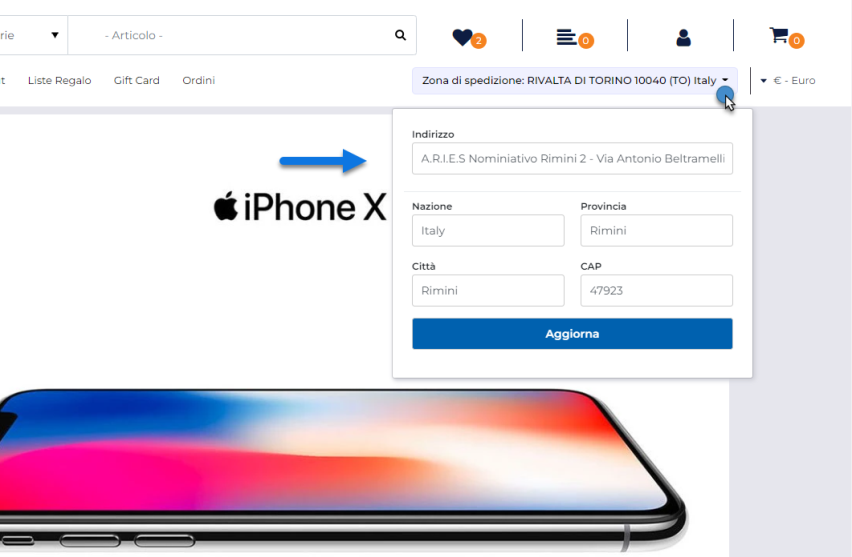

Una volta ottenuta la risposta il pulsante "**Applica**" consentirà come
sempre di inserirla nel relativo campo Passweb

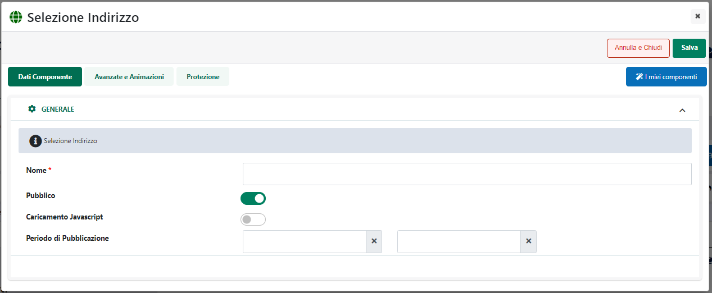

