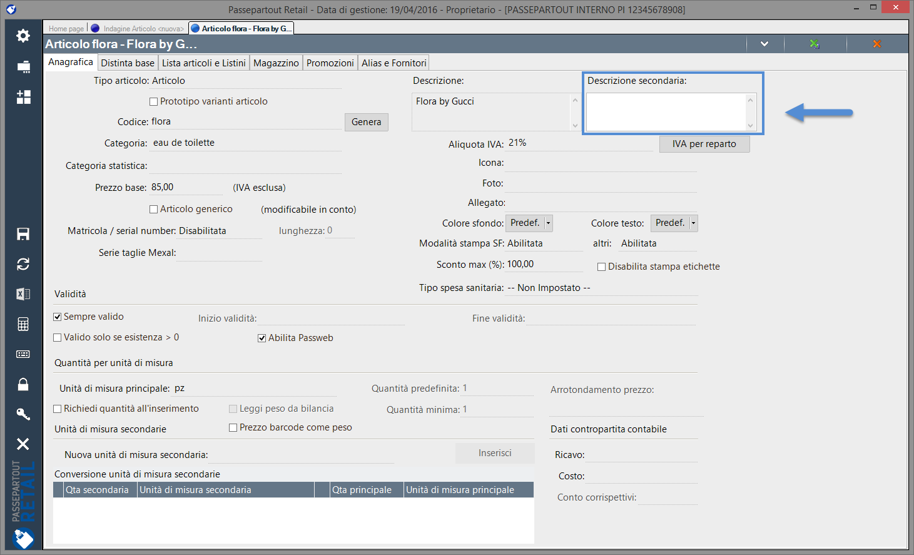
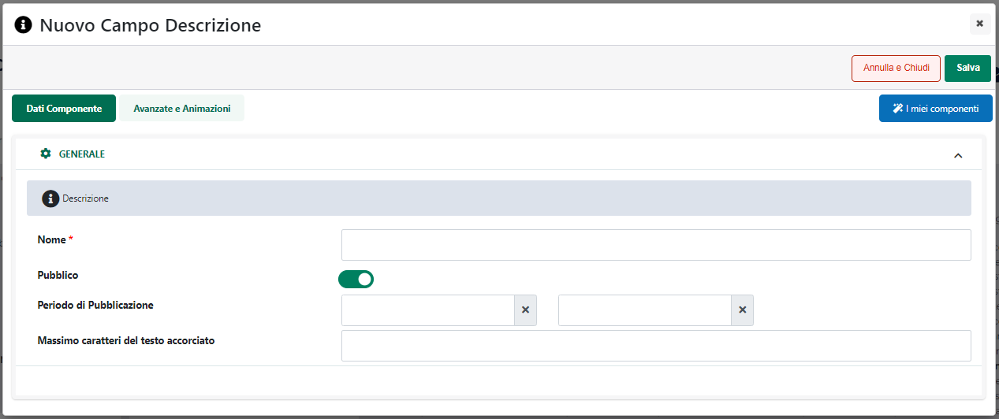

# ESPORTAZIONE / IMPORTAZIONE DEI TESTI VIA CSV

Come indicato nel precedente capitolo di questo manuale, nel momento in
cui l'esigenza dovesse essere quella di modificare in maniera massiva i
Testi che normalmente vengono gestiti all'interno della sezione "Testi /
Messaggi" del Wizard e/o i testi che solitamente si impostano
direttamente sulle maschere di configurazione dei singoli componenti,
una delle possibilità offerte da Passweb è quella di andare a lavorare
con esportazione e importazione di file csv.

In questo senso dunque, per esportare all'interno di appositi file csv
quelli che saranno poi i testi da modificare sarà necessario accedere
alla pagina "*Sito -- Gestione Lingue del Sito -- Valori in lingua*" del
Wizard, selezionare la tipologia di testi su cui si desidera operare
(parametro "**Elemento**"), le lingue interessate (parametro
"**Lingue**") e il carattere da utilizzare come separatore dei campi in
fase di creazione del file csv (parametro "**Separatore**")

A questo punto, cliccando sul pulsante "**Salva**" presente nella parte
bassa della maschera verrà avviata la procedura di creazione ed
esportazione dei relativi file.

In questo senso è bene evidenziare anche che nel caso in cui il
parametro "**Elemento**" dovesse essere stato impostato sull'opzione:

- **Testi**: verrà esportato un unico file (per lingua) contenente tutti
  i testi presenti all'interno della sezione "**Testi / Messaggi del
  Sito**" del Wizard

- **Grafica**: verrà esportato uno zip con all'interno un file per ogni
  tabella contenente i testi dei componenti che normalmente possono
  essere modificati dalla loro maschera di configurazione

Nel momento in cui l'esigenza dovesse essere invece quella di importare
un file dei testi contente già i valori che dovranno effettivamente
essere utilizzati all'interno del sito sarà necessario:

- impostare il parametro "Elemento" in relazione a quella che sarà poi
  effettivamente la tipologia di file che andremo ad importare (e quelli
  che saranno quindi i testi che dovremo effettivamente modificare)

- impostare il parametro "Azione" sull'opzione "Importa"

- selezionare la lingua di importazione del file (considerando che verrà
  importato un singolo file alla volta, in corrispondenza del parametro
  "Lingue", in questo caso, dovrà ovviamente essere indicata una sola
  lingua)

- selezionare il file da importare utilizzando i controlli presenti in
  corrispondenza del parametro File

Cliccando quindi sul pulsante "**Salva**" presente nella parte bassa
della pagina verrà avviata la procedura di importazione

Ovviamente così come i file di esportazione avranno una loro struttura
ben definita (e personalizzabile solo in relazione al carattere
separatore dei vari campi) allo stesso modo anche i file di importazione
dovranno, per non riscontrare errori, la stessa struttura.

In questo senso quindi il consiglio è quello di operare come di seguito
indicato:

- effettuare per prima cosa un'esportazione dei dati attualmente
  presenti all'interno del proprio sito Passweb

- modificare il file ottenuto come risultato dell'esportazione,
  **inserendo per ogni lingua gestita solamente il valore desiderato nel
  campo relativo al codice iso della lingua stessa** e lasciando
  inalterati gli altri campi

- importare il file modificato al punto precedente per impostare i
  relativi testi, indicando, ovviamente, in fase di configurazione del
  form di importazione, le stesse lingue e lo stesso separatore
  utilizzati anche in fase di esportazione dei dati

