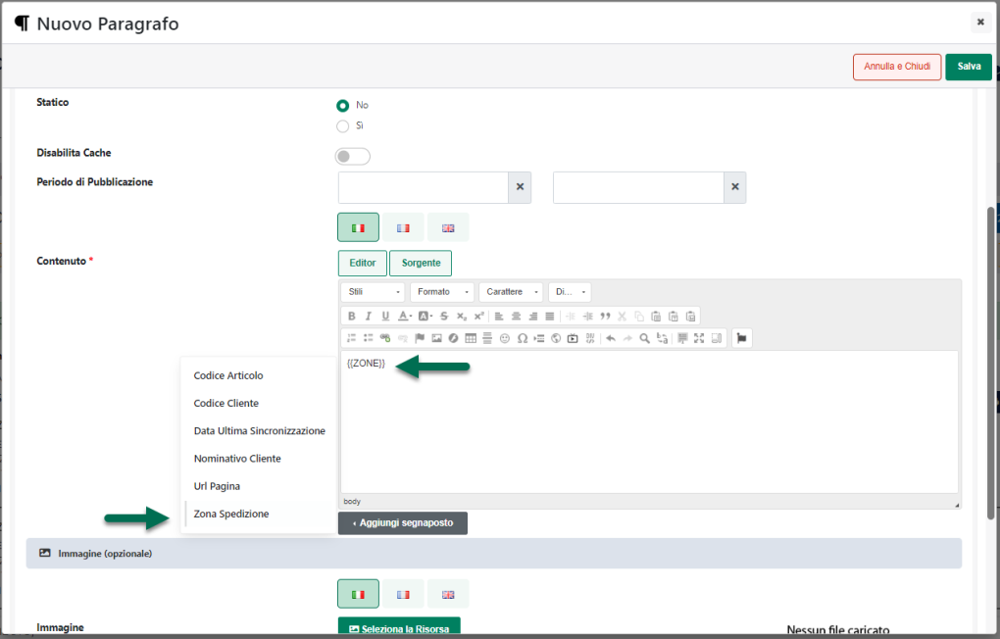

# TESTI GENERICI

All'interno di questa sezione è possibile modificare e personalizzare
tutti i testi non legati a specifici componenti ed utilizzati quindi
genericamente all'interno dell'intero sito, Area Riservata compresa.

Per personalizzare uno dei testi presenti in elenco, è sufficiente
selezionarlo e cliccare poi sul pulsante "**Modifica Testi"** presente
nella barra degli strumenti.

{width="5.811805555555556in"
height="3.558333333333333in"}

**ATTENZIONE!** Ogni singolo testo presente in elenco può essere
personalizzato in ciascuna delle lingue attualmente gestite all'interno
del sito.

Il campo di ricerca attivabile cliccando sulla lente di ingrandimento,
presente in testata di ogni singola colonna, consente di filtrare i dati
in griglia sulla base dei valori presenti all'interno della colonna
stessa.

Una volta impostato un filtro di ricerca, per poterlo poi eliminare sarà
sufficiente cliccare sull'icona raffigurante una piccola lente di
ingrandimento con un -- all'interno (
{width="7.777777777777778e-2in"
height="9.722222222222222e-2in"} ) che comparirà in testata alla colonna
in corrispondenza della quale è stato impostato il filtro stesso.

