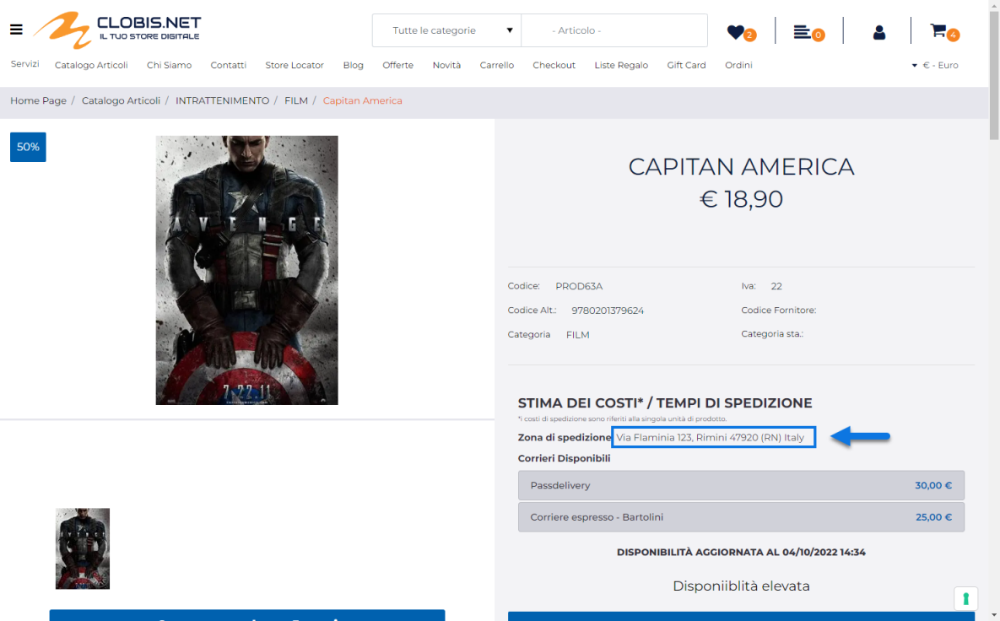
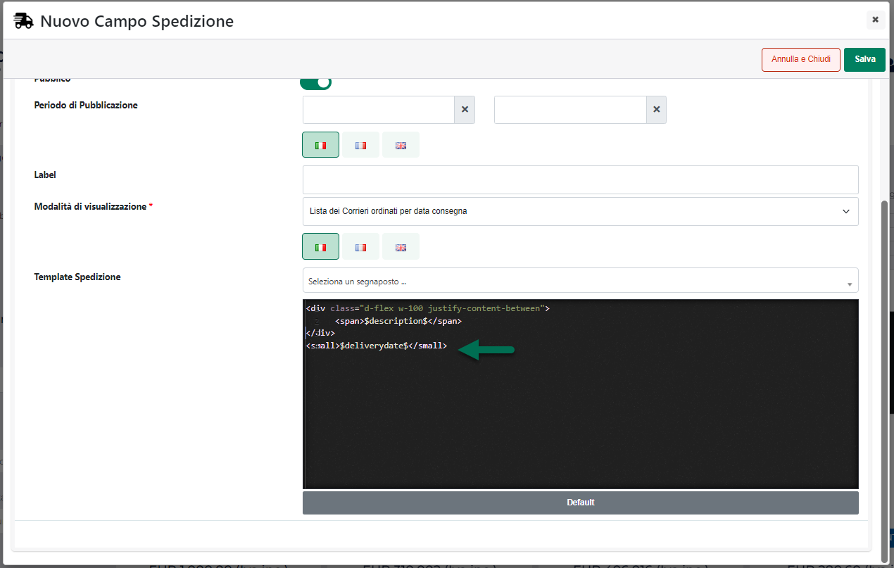
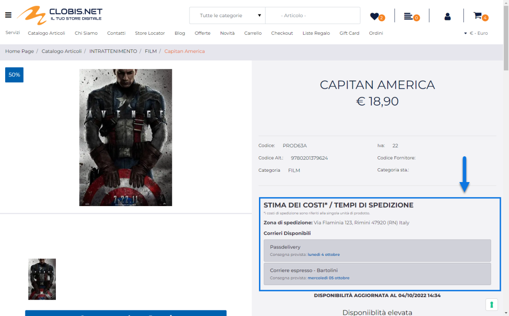
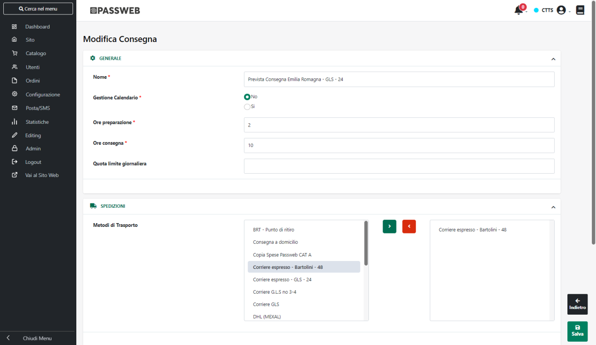

# TESTI DEI COMPONENTI

All'interno di questa sezione è possibile modificare e personalizzare i
testi legati ai vari Componenti utilizzabili all'interno del sito.

Il campo di ricerca attivabile cliccando sulla lente di ingrandimento,
presente in testata di ogni singola colonna, consente di filtrare i dati
in griglia sulla base dei valori presenti all'interno della colonna
stessa.

Una volta impostato un filtro di ricerca, per poterlo poi eliminare sarà
sufficiente cliccare sull'icona raffigurante una piccola lente di
ingrandimento con un -- all'interno (
 ) che comparirà in testata alla colonna
in corrispondenza della quale è stato impostato il filtro stesso.

Per personalizzare i testi e/o le etichette di uno specifico componente,
è sufficiente, anche in questo caso, selezionarlo tra quelli presenti in
elenco e cliccare poi sul pulsante "**Modifica Testi"** presente nella
barra degli strumenti. In questo modo verrà aperta una maschera
contenente tutti i testi e le etichette che potranno essere
personalizzati per il componente in esame, in tutte le lingue gestite
all'interno del sito.

Dipendentemente dallo specifico componente selezionato, alcuni dei testi
personalizzabili potrebbero utilizzare apposite stringhe racchiuse tra
due caratteri \$.

**Tali stringhe sono segnaposto che verranno poi sostituiti
dinamicamente da Passweb in fase di creazione della specifica pagina in
cui verrà inserito il componente in esame.**

**ATTENZIONE! nel momento in cui un segnaposto dovesse essere inserito
manualmente in un formato non corretto non verrà poi sostituito con il
relativo valore ma, al contrario, verrà visualizzato esattamente come
indicato all'interno del relativo testo**

In questo senso il pulsante **"Aggiungi segnaposto",** presente
immediatamente al di sotto di quei testi che utilizzano questo tipo di
elementi, consente di selezionare, da un apposito menu a tendina, lo
specifico segnaposto da utilizzare per il testo che si desidera
personalizzare.

