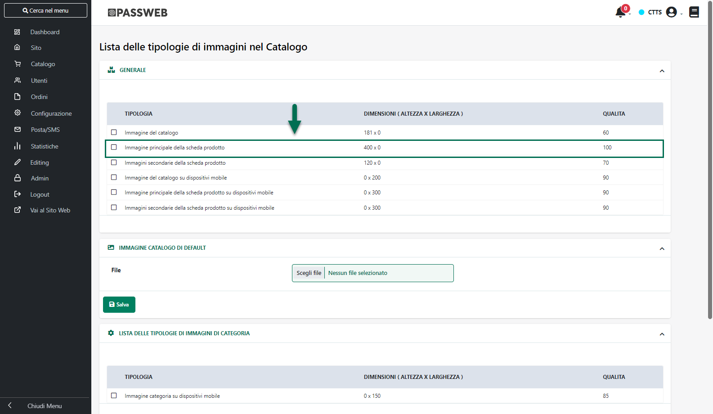

# IMPORTAZIONE DI UN MODELLO

Per applicare al proprio sito un nuovo modello grafico è sufficiente
selezionare il modello desiderato tra quelli messi a disposizione da
Passepartout e cliccare poi sul pulsante **"Applica Modello".**

**NOTA BENE**: il modello selezionato verrà ovviamente applicato alla
Variante Sito attualmente caricata all'interno del Wizard. Per maggiori
informazioni relativamente a come caricare all'interno del Wizard una
specifica Variante Sito si veda anche la sezione "Live Editing --
Varianti" di questo manuale.

Nel caso in cui all'interno del proprio ambiente di sviluppo siano
gestite più Varianti, prima di applicare il modello selezionato verrà
richiesto di indicare il nome di una specifica cartella, che verrà poi
creata in "Gestione Risorse del sito" e all'interno della quale verranno
inserite tutte le risorse del modello selezionato.

**ATTENZIONE!!! Nel caso in cui l'utente decidesse di non indicare una
specifica cartella le risorse del modello selezionato potrebbero andare
a sovrascrivere eventuali file con lo stesso nome attualmente utilizzati
in altre Varianti (tra cui anche quella Online)**

Nel caso in cui invece all'interno del proprio ambiente di sviluppo sia
presente una sola Variante, applicando al sito un nuovo modello tutte le
risorse attualmente utilizzate per quella Variante verranno eliminate e
sostituite con quelle del nuovo modello.

Per quel che riguarda invece le immagini articolo queste resteranno
comunque invariate, indipendentemente dal particolare modello o variante
considerata, mentre per quel che riguarda le loro dimensioni occorre
considerare che:

- nel caso in cui all'interno del proprio ambiente di sviluppo sia
  presente una sola Variante, a seguito dell'applicazione di un nuovo
  Modello le immagini articolo verranno ridimensionate e adattate alla
  caratteristiche del nuovo Modello

- nel caso in cui, invece, all'interno del proprio ambiente di sviluppo
  siano presenti più Varianti, a seguito dell'applicazione di un nuovo
  modello sulla Variante attualmente caricata all'interno del Wizard, la
  dimensione delle immagini articolo resterà invariata e non verranno
  quindi considerate eventuali indicazioni in tal senso presenti
  all'interno del modello importato. In questo modo si eviterà di
  alterare la grafica delle altre Varianti (compresa quella Online)
  presenti sul sito.

**NOTA BENE**: a seguito dell'applicazione di un nuovo modello grafico
le pagine di tipo Catalogo (corrispondenti alle categorie merceologiche
definite sul gestionale) assumeranno la stessa struttura grafica, e
conterranno quindi gli stessi componenti presenti all'interno della
pagina Negozio del nuovo Modello. Allo stesso modo le pagine Prodotto
assumeranno la stessa struttura grafica, e conterranno quindi gli stessi
componenti presenti all'interno della pagina Prodotto.

Infine nel caso in cui all'interno del proprio sito vengano utilizzati
dei componenti per organizzare i contenuti di una pagina in un certo
modo (ad esempio attraverso il componente "Tab o "Accordion") e tali
componenti non siano presenti nel nuovo modello grafico che si intende
applicare, potrebbe poi essere necessario, ovviamente, riorganizzare
tali contenuti in maniera corretta.

