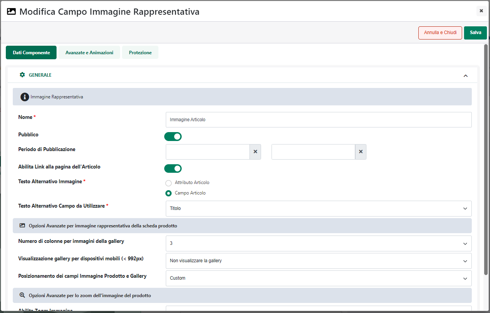

# BACKUP DEL SITO

In Passweb è possibile effettuare una copia di backup del proprio sito
**relativa alla sola parte grafica**.

Per poter effettuare questo tipo di operazione è necessario agire
all'interno della sezione **"Siti Salvati"**

e, nello specifico, cliccare sul pulsante "**Effettua Copia**"

In questo modo verrà infatti visualizzata la maschera "**Copia Grafica
Variante in uso**"

all'interno della quale poter impostare un valore per i seguenti campi:

- **Etichetta:** consente di specificare un'etichetta identificativa
  della copia grafica che andremo a realizzare

- **Non considerare le risorse grafiche:** consente di decidere se, in
  fase di copia, dovranno essere considerate o meno anche le risorse
  grafiche in uso al sito (vale a dire i file presenti all'interno della
  sezione "Gestione Risorse del Sito").

> **Nel caso in cui all'interno della sezione "Gestione Risorse del
> Sito" dovessero essere presenti risorse di elevate dimensioni
> (dell'ordine di svariati Giga) il consiglio è quello di selezionare
> sempre il parametro in esame** (diversamente infatti si potrebbe anche
> correre il rischio di saturare lo spazio disco disponibile sul server
> che ospita il sito con conseguente fallimento dell'operazione di
> backup e, soprattutto, con conseguente blocco del sito stesso)
>
> **ATTENZIONE!** nel momento in cui il backup dovesse essere effettuato
> senza considerare le risorse grafiche, in fase di ripristino, se anche
> venisse indicata una specifica cartella in cui andare a posizionare le
> eventuali risorse grafiche presenti nel backup, questa non verrà mai
> presa in considerazione (per il semplice fatto ovviamente che nel
> backup stesso non sono presenti risorse grafiche di alcun tipo). In
> queste condizioni quindi è di fondamentale importanza che le risorse
> grafiche in uso al sito nel momento del backup siano ancora presenti
> anche al momento del ripristino.

- **Non considerare le pagine di categoria (se hanno la stessa
  grafica):** consente di decidere se, in fase di copia, dovrà essere
  considerata o meno ogni singola pagina di Categoria e ogni singola
  pagina Prodotto con la relativa grafica e i relativi componenti

> In particolare nel caso in cui il parametro in oggetto dovesse essere:

- **Deselezionato**: in fase di copia verrà considerata ogni singola
  pagina Prodotto e ogni singola pagina di Categoria presente nella
  Variante di origine con la relativa grafica e i relativi componenti.
  **Questa configurazione dovrebbe quindi essere presa in considerazione
  solo nel caso in cui dovessero essere effettivamente gestiti
  componenti o grafiche diverse per le diverse pagine di Categoria o per
  le diverse pagine Prodotto**

> **ATTENZIONE!** In queste condizioni l'operazione di copia impiegherà
> più tempo e, nel momento in cui la Variante attualmente caricata sul
> Wizard dovesse avere un numero di pagine particolarmente elevato
> (dell'ordine delle migliaia) l'operazione di copia potrebbe anche dare
> dei problemi

- **Selezionato**: in fase di copia verranno considerate, per quel che
  riguarda le pagine di categoria soltanto la pagina "Negozio" e per
  quel che riguarda le pagine Prodotto solo la pagina Prodotto
  "generica". In conseguenza di ciò nella copia di backup tutte le
  pagine di Categoria si ritroveranno ad avere la stessa grafica e gli
  stessi componenti della pagina Negozio e, allo stesso modo, tutte le
  pagine Prodotto si ritroveranno ad avere la stessa grafica e gli
  stessi componenti della pagina Prodotto "generica".

> Va da se che tale opzione dovrebbe quindi essere presa in
> considerazione nel caso in cui nella Variante attualmente caricata sul
> Wizard si sia deciso di utilizzare per tutte le pagine di categoria la
> stessa grafica e gli stessi componenti della pagina Negozio e per
> tutte le pagine Prodotto la stessa grafica e gli stessi componenti
> presenti anche nella pagina Prodotto "generica"
>
> **ATTENZIONE!** In queste condizioni l'operazione di copia sarà molto
> più veloce.

Una volta impostato un valore per i due parametri sopra indicati,
cliccando sul pulsante "**Copia**" verrà avviata la copia della grafica
attualmente in uso all'intero del proprio sito

**ATTEZNIONE! l'operazione di Backup prenderà in considerazione soltanto
la Variante Sito attualmente caricata all'interno del Wizard e,
soprattutto, il Backup sarà relativo solo ed esclusivamente al layout
grafico di tale Variante**

**NOTA BENE:** i backup di questo tipo riguardano solo ed esclusivamente
il layout grafico della Variante attualmente caricata all'interno del
Wizard. Non sono compresi quindi all'interno di tali copie di backup
articoli, clienti, documenti o altre impostazioni di configurazione
presenti sul sito al momento della copia**.**

Dopo aver effettuato un Backup grafico del sito questo verrà
visualizzato nell'elenco dei Backup salvati con il nome che gli è stato
assegnato in fase di creazione e con la sua data di creazione

**ATTENZIONE!!! ogni Backup salvato andrà ad incidere sullo "Spazio su
Disco" disponibile da contratto. Nel caso in cui, dunque, effettuando un
nuovo backup si dovesse superare lo spazio su disco disponibile da
contratto, il backup stesso non potrà essere effettuato.**

