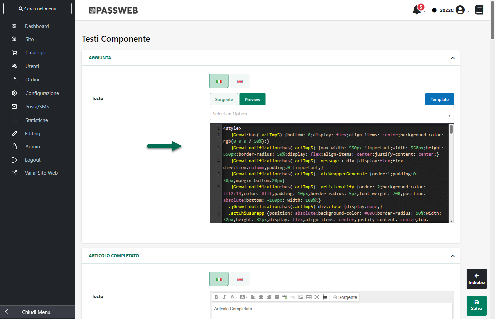

# ALIAS ARTICOLI

All'interno di questa sezione è possibile definire e gestire gli Alias
delle Pagine Prodotto relative ai singoli articoli venduti all'interno
del sito.

Nel caso in cui l'esigenza dovesse essere dunque quella di definire un
Alias per una generica pagina del sito (pagine bianche e/o pagine blu)
sarà necessario agire dalla sezione "Alias Pagine" impostando l'Alias
stesso in corrispondenza della pagina desiderata.

Per maggior informazioni in merito si veda anche il precedente capitolo
di questo manuale.

**ATTENZIONE! non è possibile definire da questa sezione del Wizard (né
manualmente né tanto meno mediante import di file csv) Alias Articoli
che contengano parametri di query string.**

Nel momento in cui l'esigenza dovesse essere quindi quella di
reindirizzare url con parametri di query string su specifiche pagine del
proprio sito sarà necessario agire all'interno della sezione "*Gestione
Alias / Redirects*" creando apposite regole di reindirizzamento (per
maggiori informazioni in merito si veda anche il successivo capitolo
"Redirects" di questo manuale)

Accedendo a questa sezione del Wizard verrà quindi visualizzata la
maschera "**Gestione Alias Articoli**" suddivisa in due distinte
sezioni:

- nella parte sinistra è visualizzato l'elenco di tutti gli articoli, ad
  eccezione di quelli spesa (tipo S) e modificatori (tipo M),
  attualmente gestiti e venduti all'interno del sito.

> Il pannello di ricerca presente nella parte alta di questa sezione
> consente di ricercare uno specifico articolo indicando il Codice o la
> Descrizione per esso impostata all'interno del gestionale

- nella parte destra vengono invece visualizzati gli Alias associati
  all'articolo attualmente selezionato in elenco

> Il pannello di ricerca, presente nella parte alta di questa sezione,
> consente di ricercare gli Alias attualmente codificati sulla base del
> loro url e/o della loro tipologia

I due pulsanti presenti nella barra degli strumenti contestuale
all'elenco articoli consentono rispettivamente di:

- **Importa da file** (
   ): consente di importare in maniera massiva gli
  Alias di Prodotto partendo da un file .csv o .txt. Cliccando su questo
  pulsante verrà infatti aperta la maschera di importazione "**File
  Alias Articoli**"

> all'interno della quale poter indicare:

- **File (csv-txt)**: consente di indicare il file txt o csv contenente
  l'elenco dei vari Alias Articolo che dovranno essere importati

- **Lingua:** consente di indicare la lingua del sito a cui dovranno
  fare riferimento gli Alias indicati all'interno del file di
  importazione

- **Separatore:** consente di indicare, selezionandolo, dall'apposito
  menu a tendina, il carattere che è stato utilizzato all'interno del
  file di importazione come separatore per i vari campi

> Il parametro "**Elimina Alias non presenti nel file**" consente, se
> selezionato, di eliminare, a seguito della procedura di importazione,
> eventuali Alias già codificati ma non indicati e quindi non presenti
> nel file di importazione.
>
> Affinchè la procedura di import possa funzionare in maniera corretta,
> consentendo a Passweb di codificare automaticamente gli Alias Articolo
> sulla base dei dati presenti all'interno del file, è necessario che il
> file di importazione sia stato creato rispettando determinate regole.
> Nello specifico:

- Il file da importare deve avere estensione .csv o .txt

- Il file da importare non deve avere particolari intestazioni

- Il carattere separatore dei vari campi deve essere esattamente quello
  indicato all'interno del campo "**Separatore**" presente nel form di
  importazione.

- E' necessario creare file distinti per le diverse lingue gestite
  all'interno del sito. In fase di importazione sarà poi possibile, come
  visto, indicare la specifica lingua cui il file fa riferimento.

- **Il file di importazione deve soddisfare le specifiche del formato
  RFC4180**.

> **ATTENZIONE!** In questo senso è quindi necessario che il valore dei
> campi contenenti interruzioni di riga, doppi apici e/o lo stesso
> carattere utilizzato anche come separatore **sia necessariamente
> racchiuso da virgolette**

- Supponendo di aver indicato il ; come carattere separatore, il formato
  del file di importazione dovrà essere di questo tipo:

> **\<codice articolo\>;\<alias\>;\<redirect\>;\<default\>**
>
> dove
>
> **\<codice articolo\> 🡪** indica il codice assegnato all'interno del
> gestionale all'articolo per cui si vuol creare un Alias
>
> **ATTENZIONE!** il codice articolo, viene utilizzato come chiave nella
> procedura di associazione automatica degli Alias, per cui deve
> corrispondere necessariamente al codice di uno degli articoli
> effettivamente presenti sul sito. In caso contrario non verrà
> ovviamente creato nessun Alias. Nel messaggio visualizzato al termine
> della procedura di importazione saranno indicati eventuali codici
> articolo presenti nel file ma non corrispondenti a prodotti
> effettivamente gestiti sul sito.
>
> **\<alias\> 🡪** indica l'alias che si intende associare al articolo
> indicato nel campo precedente
>
> **\<redirect\> 🡪** necessario per indicare se l'alias in esame dovrà
> essere impostato o meno come Redirect. **Sono ammessi i soli valori S
> o N**
>
> **\<default\> 🡪** necessario per indicare se l'alias in esame dovrà
> essere impostato o meno come indirizzo di default per la relativa
> pagina. **Sono ammessi i soli valori S o N**
>
> **Esempio**:
>
> Supponendo di gestire all'interno del sito un articolo con codice
> "PROD01A" e descrizione "magic mouse" l' url della sua pagina prodotto
> potrebbe essere
>
> *www.miosito.it/magic-mouse*
>
> oppure, dipendentemente dal formato adottato per i permalink degli
> articoli
>
> *www.miosito.it/informatica/accessori/magic-mouse*
>
> Nel caso in cui si volesse associare a questo articolo un Alias "mouse
> apple" in modo tale che la pagina prodotto di questo articolo risponda
> anche all'indirizzo
>
> *www.miosito.it/mouse-apple*
>
> o, in alternativa all'indirizzo
>
> *www.miosito.it/informatica/accessori/magic-mouse*
>
> nel file di importazione dovrà essere indicato un record di questo
> tipo
>
> **PROD01A;mouse-apple;S;N**
>
> In questo modo inoltre il nuovo Alias verrà impostato come Redirect e
> non come Indirizzo di default
>
> **ATTENZIONE!** Nel tracciato del file csv di importazione potrebbe
> anche essere aggiunto un ulteriore ultimo campo (**\<automatico\>**)
> utilizzato per definire se l'Alias in questione è stato creato
> automaticamente (valore S) o in maniera manuale (valore N).
>
> Tale campo, presente nel caso in cui si operi, ad esempio, partendo da
> un file csv esportato direttamente da Passweb, **non verrà comunque
> considerato in fase di importazione** **dati**.
>
> **Per tutti gli Alias presenti all'interno del file di importazione il
> campo "Automatico" verrà infatti impostato sempre a "N"**

- **Esporta** (
   ): consente di esportare l'elenco degli Alias
  Articolo attualmente codificati, all'interno di un file .csv.
  Cliccando su questo pulsante verrà infatti visualizzata la maschera di
  esportazione

> all'interno della quale poter indicare:

- **Lingua:** consente di indicare la lingua in relazione alla quale
  esportare gli Alias Articolo

- **Separatore:** consente di indicare, selezionandolo, dall'apposito
  menu a tendina, il carattere che dovrà essere utilizzato all'interno
  del file come separatore per i vari campi

> Il parametro "**Includi articoli senza Alias**" consente di decidere
> se dovranno o meno essere inseriti, all'interno del file esportato,
> anche i record relativi ad articoli cui non è attualmente associato
> nessun Alias.
>
> **ATTENZIONE!** Nel momento in cui il sito dovesse avere diversi alias
> articolo già codificati e si dovessero apportare svariate modifiche a
> questi stessi Alias, il modo più veloce di procedere potrebbe essere
> quello di esportare gli Alias articolo attualmente codificati,
> apportare le modifiche necessarie al file scaricato ed effettuare un
> nuovo import di questo stesso file selezionando, magari, anche
> l'opzione relativa all'eliminazione degli alias non indicati
> all'interno del file di importazione

Per creare manualmente un nuovo Alias Articolo sarà invece sufficiente
selezionare lo specifico prodotto cui si vuole associare questo stesso
Alias e, successivamente, cliccare sul pulsante "**Nuovo Alias**"
presente nella barra degli strumenti della parte destra della maschera.

All'interno della maschera "**Nuovo Alias**" sarà quindi necessario
assegnare un valore ai seguenti parametri:

- **Alias:** consente di definire l'Alias da associare al prodotto
  attualmente selezionato in elenco.

> **ATTENZIONE! Come per gli Alias di Pagina anche per gli Alias
> Articolo vanno indicati solo ed esclusivamente percorsi relativi**.
>
> Nel caso in cui l'intenzione fosse dunque quella di associare alla
> pagina Prodotto Passweb
>
> *www.miosito.passweb.it/informatica/magic-mouse*
>
> l'Alias
>
> *www.miosito.passweb.it/accessori-informatica/mouse/mosue-apple.html*
>
> (perché magari questo è un vecchio url già indicizzato della pagina
> prodotto derivata da un sito non Passweb) all'interno di questo campo
> andrebbe specificata semplicemente la stringa
> ***accessori-informatica/mouse/mosue-apple.html***
>
> **Come per gli Alias di Pagina anche per gli Alias Articolo, è
> possibile utilizzare come Wildcard, con il significato dunque di
> "qualsiasi carattere", il carattere speciale "%" e questo sia nella
> definizione manuale di un singolo Alias che all'interno del file
> csv/txt utilizzato per l'import massivo degli Alias Articolo.**
>
> Per maggiori informazioni in merito all'utilizzo di questo particolare
> carattere si veda anche il precedente capitolo di questo manuale

- **Lingua:** consente di selezionare, tra quelle attualmente gestite,
  la specifica lingua per cui considerare valido l'Alias Articolo che si
  sta realizzando.

- **Redirect:** se selezionato consente di utilizzare l'Alias Articolo
  che si sta realizzando come Redirect sulla corrispondente pagina
  prodotto del proprio sito. Utile per gestire eventuali errori 301 che
  potrebbero generarsi nel momento in cui dovesse essere cambiato nome
  ad un prodotto e/o si dovesse mantenere l'indicizzazione di vecchi url
  derivati da un sito non Passweb, informando al contempo il motore di
  ricerca su quello che risulta essere ora l' url corretto.

> Per maggiori informazioni relativamente alla gestione di eventuali
> errori 301 si veda anche quanto detto in proposito sugli Alias di
> Pagina.

**NOTA BENE**: selezionando per un Alias Articolo il parametro
**Redirect** nella barra degli indirizzi del browser verrà sempre
visualizzato l'indirizzo assegnato in Passweb alla relativa Pagina
Prodotto.

- **Indirizzo di default:** se selezionato consente di utilizzare
  l'Alias Articolo che si sta realizzando come Indirizzo di Default per
  la corrispondente pagina Prodotto.

> In queste condizioni nel momento in cui l'utente dovesse digitare,
> nella barra degli indirizzi del browser, l'indirizzo assegnato a
> default da Passweb all'articolo in esame o un qualsiasi altro Alias di
> questa stessa pagina, verrà automaticamente ridiretto, **con codice
> 301**, sull'indirizzo impostato come default

**NOTA BENE**: si consiglia di utilizzare sempre per ogni singolo Alias
Articolo o il parametro "Redirect" o il parametro "Indirizzo di Default"
**ma non tutti e due contemporaneamente**.

**ATTENZIONE!** Nel caso in cui l'Alias Articolo indicato sia già stato
utilizzato o assegnato da Passweb stesso ad un'altra pagina del sito, il
pulsante "Aggiungi" sarà disabilitato e non sarà quindi possibile
terminare la codifica del nuovo Alias.

Anche in questo caso, come già per gli Alias di Pagina il pannello di
ricerca, presente nella parte alta della sezione destra della maschera,
consente di ricercare gli Alias attualmente codificati sulla base del
loro url (campo **Url**), della loro tipologia (campo **Tipo**) o del
fatto che siano stati generati in maniera automatica o manuale (campo
**Automatico**)

Per ciascuno degli Alias presenti in griglia è indicato:

- Nella prima colonna il valore **R** nel caso in cui l'Alias
  corrispondente sia un redirect

- Nella seconda colonna il valore **D** nel caso in cui l'Alias
  corrisponde sia un indirizzo di default

- Nella terza colonna il valore **A** nel caso in cui l'Alias
  corrispondente sia stato generato in maniera automatica
  dall'applicazione

> Gli Alias generati automaticamente si distinguono dagli altri oltre
> che dal flag **A** anche dal fatto che sono evidenziati in blu.
>
> Gli Alias automatici possono poi essere gestiti, ricercati e
> modificati al pari di quelli creati in maniera manuale. Ovviamente nel
> caso in cui si dovessero apportare delle modifiche ad Alias
> automatici, al salvataggio, questi diverranno a tutti gli effetti
> Alias manuali per cui scomparirà il flag A di automatico e la riga
> corrispondente non sarà più evidenziata in blu.

- Nella quarta colonna la lingua di riferimento dell'Alias

- Nella quinta colonna lo slug dell'Alias (ossia la parte relativa del
  vecchio url di pagina)

I due pulsanti visualizzati nella barra degli strumenti della parte
destra della maschera nel momento in cui si dovesse selezionare uno
degli alias attualmente associati alla pagina selezionata, consentiranno
infine di:

- **Modifica**(
   ): consente di modificare l'Alias Articolo
  attualmente selezionato

- **Elimina**(
   ): consente di eliminare l'Alias Articolo
  attualmente selezionato

