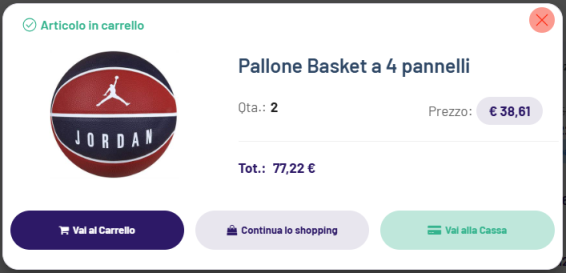
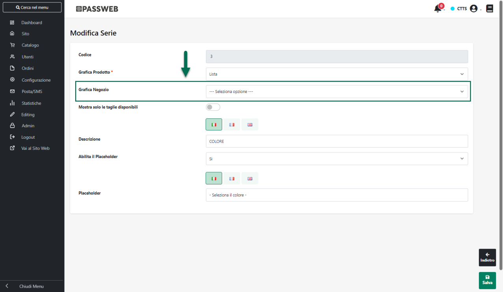
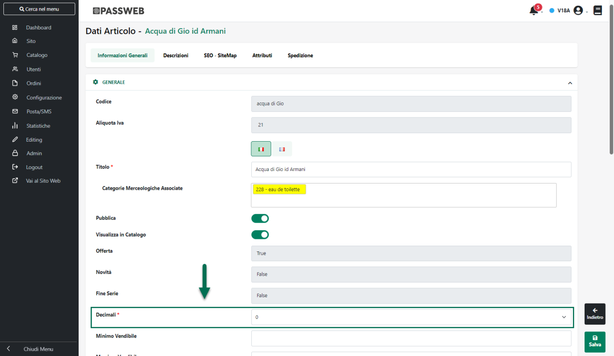
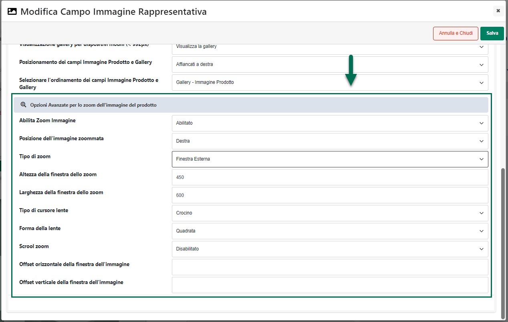
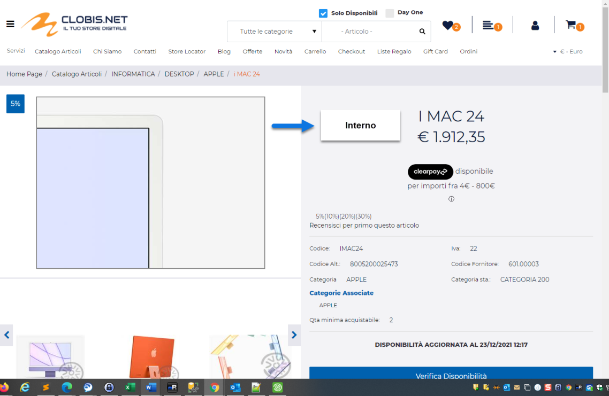

# REDIRECTS

All'interno di questa sezione è possibile creare apposite regole di
reindirizzamento mediante le quali mappare url generici, **compresi
anche di eventuali parametri di query string**, su indirizzi di
specifiche pagine del proprio sito Passweb.

**ATTENZIONE!** E' possibile gestire, ovviamente, solo ed esclusivamente
reindirizzamenti sullo stesso dominio

Una volta effettuato l'accesso a questa sezione del Wizard verrà quindi
visualizzata la maschera Redirects

{width="5.759722222222222in"
height="3.3895833333333334in"}

all'interno della quale poter visualizzare e gestire tutte le regole di
redirect attualmente codificate e in uso per il proprio sito.

I pulsanti presenti nella contestuale barra degli strumenti consentono
rispettivamente di:

**Modifica Redirect** (
{width="0.6361111111111111in"
height="0.175in"} ): consente di modificare la regola di
reindirizzamento attualmente selezionata in elenco

**Elimina Redirect** (
{width="0.5972222222222222in"
height="0.18194444444444444in"} ): consente di eliminare la regola di
reindirizzamento attualmente selezionata in elenco

**Aggiungi Redirect** (
{width="0.5972222222222222in"
height="0.175in"} ): consente di creare una nuova regola di
reindirizzamento.

Cliccando su questo pulsante verrà infatti visualizzata la maschera
"**Redirect**"

{width="5.759722222222222in"
height="3.3895833333333334in"}

all'interno della quale poter indicare l'origine e la destinazione della
regola di reindirizzamento che si intende creare.

In particolare il campo:

- **Origine**: consente di indicare il path (**relativo**) dell' url che
  dovrà essere reindirizzato su di una specifica pagina del sito Passweb

- **Destinazione**: consente di indicare il path (**relativo**) della
  specifica pagina del sito Passweb su cui reindirizzare l' url indicato
  all'interno del precedente parametro

Supponendo dunque di voler reindirizzare un url del tipo

**www.sitoweb.it/blog.php?id=apertura-punto-vendita**

sulla pagina "Punti Vendita" del sito Passweb corrispondente all' url

**www.sitoweb.it/store/punti-vendita**

sarà necessario indicare, come mostrato in figura:

- all'interno del campo Origine la stringa
  "**/blog.php?id=apertura-punto-vendita**"

- all'interno del campo Destinazione la stringa
  "**/store/punti-vendita**"

{width="5.759722222222222in"
height="3.3895833333333334in"}

In definitiva dunque, in fase di creazione di una nuova regola di
reindirizzamento occorre ricordare sempre che:

- I reindirizzamenti possono avvenire **sempre e soltanto sullo stesso
  dominio**

- I percorsi inseriti all'interno dei campi "Origine" e "Destinazione"
  devono sempre essere **percorsi relativi** e devono sempre **iniziare
  con il carattere /**

- Il percorso indicato all'interno dei campi "Origine" e "Destinazione"
  **può contenere anche eventuali parametri di query string.**

- Verrà sempre effettuato **un redirect di tipo 301** dall' url indicato
  all'interno del campo "Origine" sull' url indicato all'interno del
  campo "Destinazione"

Inoltre nel momento in cui si dovesse tentare di creare una regola di
reindirizzamento utilizzando un' "Origine" definita per una regola già
in uso sul sito, verrà visualizzato un apposito messaggio di errore e
l'utente non avrà ovviamente la possibilità di salvare quella specifica
regola.

Una volta definite tutte le regole di reindirizzamento da utilizzare,
affinché queste possano poi essere effettivamente applicate sarà
necessario cliccare sul pulsante "**Applica le regole di
reindirizzamento**" posto in fondo alla lista

{width="5.759722222222222in"
height="3.3895833333333334in"}

**ATTENZIONE! L'applicazione delle regole di reindirizzamento comporta
il riciclo del pool del sito.**

Cliccando quindi sul pulsante "**Applica le regole di
reindirizzamento**" tanto sul backend del sito (Wizard) quanto sul front
end eventuali utenti loggati verranno disconnessi e dovranno quindi
effettuare nuovamente l'autenticazione.

Volendo si potrebbe anche pensare di non cliccare sul pulsante in
questione per forzare il riciclo del pool ed ottenere l'applicazione
immediata delle regole di reindirizzamento. In questo caso però
l'effettiva applicazione di queste stesse regole potrà avvenire
solamente al riciclo automatico del pool dopo un periodo di inattività
sufficientemente lungo

Infine, oltre alla creazione manuale delle singole regole di
reindirizzamento, volendo è possibile anche effettuare operazioni
massive di import / export di appositi file csv.

In questo senso i due ulteriori pulsanti presenti nella barra degli
strumenti della maschera "Redirects" consentono rispettivamente di:

**Importa da file** (
{width="0.5583333333333333in"
height="0.175in"} ): consente di definire in maniera massiva le regole
di reindirizzamento da utilizzare per il proprio sito importandole da un
apposito file .csv o .txt.

Cliccando su questo pulsante verrà infatti aperta la maschera di
importazione

{width="5.759722222222222in"
height="3.3895833333333334in"}

all'interno della quale poter indicare:

- **File (csv-txt)**: consente di indicare il file txt o csv contenente
  l'elenco delle regole di reindirizzamento che dovranno essere
  importate

- **Separatore:** consente di indicare, selezionandolo, dall'apposito
  menu a tendina, il carattere che è stato utilizzato all'interno del
  file di importazione come separatore per i vari campi

Il parametro "**Elimina redirects non presenti nel file**" consente, se
selezionato di eliminare, a seguito della procedura di importazione,
eventuali regole di reindirizzamento già codificate ma non indicate e
quindi non presenti nel file di importazione.

Affinchè la procedura di import possa funzionare in maniera corretta,
consentendo a Passweb di codificare automaticamente le regole di
reindirizzamento sulla base dei dati presenti all'interno del file, è
necessario che il file di importazione sia stato creato rispettando
determinati vincoli.

Nello specifico:

- Il file da importare deve avere estensione .csv o .txt

- L'intestazione del file deve contenere i campi "origine" e
  "destinazione"

- Per ogni record presente nel file andrà indicato:

  - in corrispondenza del campo "origine" il percorso relativo del url
    che dovrà essere reindirizzato su di una specifica pagina del sito
    Passweb

  - in corrispondenza del campo "destinazione" il percorso relativo
    della specifica pagina del sito Passweb su cui reindirizzare l'url
    indicato come origine

- Il carattere separatore dei vari campi deve essere esattamente quello
  indicato all'interno del campo "**Separatore**" presente nel form di
  importazione.

- Il file di importazione deve soddisfare le specifiche del formato
  RFC4180.

**Esempio**:

Supponendo dunque di aver indicato il ; come carattere separatore, il
formato del file di importazione dovrà essere di questo tipo:

origine;destinazione

/index.php?id=software-gestione-paghe;/it/privacy-e-cookie-policy

/blog.php?id=apertura-punto-vendita; /store/punti-vendita

...

**ATTENZIONE!** nel momento in cui all'interno del file di importazione
dovesse essere indicata l'origine di una regola di reindirizzamento già
codificata e in uso sul sito, a seguito dell'importazione questa regola
verrà modificata come indicato nel file stesso

Come per la creazione manuale delle singole regole di reindirizzamento,
allo stesso modo anche quelle create mediante import di file csv
verranno effettivamente applicate solo cliccando sul pulsante "**Applica
le regole di reindirizzamento**" che, come precedentemente evidenziato
causa il riciclo immediato del pool del sito, oppure attendendo il
riciclo automatico.

**Esporta** (
{width="0.31805555555555554in"
height="0.1625in"} ): consente di esportare l'elenco delle regole di
reindirizzamento attualmente in uso sul sito, all'interno di un file
.csv. Cliccando su questo pulsante verrà infatti visualizzata la
maschera di esportazione

{width="5.759722222222222in"
height="3.3895833333333334in"}

all'interno della quale poter indicare selezionandolo, dall'apposito
menu a tendina, il carattere che dovrà essere utilizzato all'interno del
file come separatore per i vari campi

**ATTENZIONE! le regole di reindirizzamento create all'interno di questa
sezione non possono superare i 250KB complessivi. In caso di superamento
del limite indicato verrà mostrato un apposito messaggio di errore e non
sarà possibile crearne altre senza prima aver eliminato alcune di quelle
attualmente in uso.**

In considerazione di ciò, si consiglia sempre di utilizzare, laddove
possibile, gli Alias di Pagina e/o gli Alias Articolo come indicato nei
precedenti capitoli di questo manuale.

