# NUOVO CONTENUTO CMS

Per creare un nuovo Contenuto CMS è necessario cliccare sul relativo
pulsante
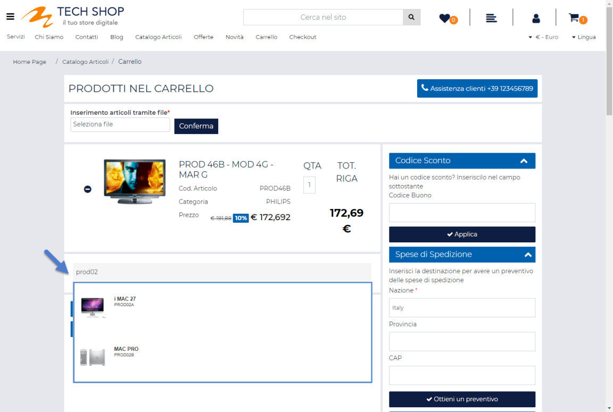 presente nella barra degli strumenti
della maschera **"Gestione CMS -- Contenuti"**

Cliccando su questo pulsante verrà infatti visualizzata la maschera
"**Nuovo Contenuto CMS**"

mediante la quale poter definire i contenuti e le proprietà del nuovo
post CMS.

Nello specifico, all'interno della scheda:

- **Contenuto:** sarà possibile definire i contenuti principali della
  nuova notizia

- **Ulteriori Contenuti**: sarà possibile definire fino ad un massimo di
  3 contenuti aggiuntivi da associare alla nuova notizia

- **SEO-Sitemap**: sarà possibile gestire i parametri SEO relativi alla
  nuova notizia oltre che decidere se tale notizia dovrà o meno
  comparire nella sitemap del sito

- **Associazioni**: sarà possibile associare la nuova notizia ad una o
  più Categorie CMS selezionandole tra quelle attualmente gestite
  all'interno del sito.

- **Pubblicazione**: sarà possibile definire le modalità e le
  tempistiche di pubblicazione della nuova notizia

- **Privilegi**: sarà possibile definire, selezionandoli tra quelli
  attualmente gestiti all'interno del sito, gli specifici gruppi utente
  abilitati alla visualizzazione della nuova notizia.

- **Social Network**: sarà possibile condividere la notizia che si sta
  codificando su uno dei social network abilitati (Facebook, Twitter,
  Linkedin)

- **Passweb App**: disponibile solo nel caso in cui sia stato attivato
  il modulo di gestione dell'App mobile. All'interno di questa scheda
  sarà possibile gestire l'invio delle notifiche push collegate alla
  notizia in esame.

Per maggiori informazioni relativamente a ciascuna di queste operazioni
si vedano anche i successivi capitoli di questo manuale.

##### CONTENUTO

All'interno della scheda **Contenuto** è possibile definire i contenuti
principali (Titolo, Sommario ecc...) della relativa notizia CMS.

Nello specifico il campo:

- **Codice (non obbligatorio):** consente di impostare un codice di
  integrazione (alfanumerico) che verrà poi utilizzato come campo chiave
  in fase di importazione dati nelle procedure di creazione / modifica
  massiva di contenuti CMS via file csv

> **ATTENZIONE!** Il campo "**Codice**" non è di per se obbligatorio ma
> lo diventa nel momento in cui il contenuto CMS in esame debba poi
> essere preso in considerazione nelle procedure di esportazione /
> importazione massiva dei post CMS
>
> Per maggiori informazioni in merito alle procedure di export / import
> di contenuti CMS si veda anche quanto indicato all'interno del
> successivo capitolo "*Importazione / Esportazione massiva di contenuti
> CMS*" di questo manuale

- **Visualizzazioni:** consente di visualizzare e gestire il numero di
  visualizzazioni ricevute dallo specifico post CMS

- **Titolo (obbligatorio):** consente di specificare, in ciascuna delle
  lingue gestite all'interno del sito, il titolo del post che si sta
  editando.

- **Sommario (obbligatorio):** all'interno di questo campo sarà
  possibile inserire, utilizzando il corrispondente editor HTML, un
  sommario ossia un riassunto sintetico di quello che sarà poi il vero e
  proprio dettaglio della notizia.

- **Contenuto (obbligatorio):** all'interno di questo campo sarà
  possibile inserire il dettaglio ossia il contenuto vero e proprio,
  della notizia che si intende pubblicare all'interno del sito.

> **NOTA BENE**: l'editor messo a disposizione per l'inserimento del
> Sommario e del Contenuto di ogni singola News è in tutto e per tutto
> simile all'editor comunemente utilizzato in Passweb per la gestione
> dei componenti "Paragrafo". Entrambi questi contenuti possono quindi
> essere corredati da Immagini, Link, Tabelle e Video Youtube. Per
> maggiori informazioni relativamente alla gestione di questo editor e
> all'inserimento dei relativi elementi si veda quindi la sezione "Live
> Editing -- Contenuti -- Editor dei contenuti" di questo manuale.

- **Immagine (Articolo):** consente di associare all'elemento
  "Contenuto" del post che si sta editando, una specifica immagine.

- **Testo Alternativo Immagine (Articolo):** consente di definire il
  testo alternativo, indispensabile ai fini di una maggiore
  accessibilità e indicizzazione del contenuto, da associare
  all'immagine indicata nel campo precedente.

- **Immagine (Sommario):** consente di associare all'elemento "Sommario"
  del post che si sta editando, una specifica immagine.

- **Testo Alternativo Immagine (Sommario):** consente di definire il
  testo alternativo, indispensabile ai fini di una maggiore
  accessibilità e indicizzazione del contenuto, da associare
  all'immagine indicata nel campo precedente.

- **Eventuale immagine per il tag OG:** consente di impostare una
  specifica immagine che verrà poi associata al corrispondente tag OG
  (Open Graph) in fase di condivisione social del post CMS in esame.

##### ULTERIORI CONTENUTI

La scheda "**Ulteriori Contenuti**" consente di definire fino ad un
massimo di 3 contenuti aggiuntivi da associare al post CMS che si sta
realizzando.

Ogni contenuto aggiuntivo dovrà essere definito mediante il
corrispondente Editor HTML (**Descrizione1, Descrizione2,
Descrizione3**) e potrà quindi contenere un qualsiasi elemento (testo,
immagine, video, link ecc...) gestibile mediante questo stesso editor.

Un possibile caso d'uso potrebbe essere, ad esempio, quello che prevede
di allegare al post CMS che si sta realizzando determinati file che
l'utente potrà poi downlodare consultando, all'interno del sito, il
dettaglio della notizia in esame.

##### SEO-SITEMAP

La scheda **"SEO - SiteMap"** consente di gestire i parametri necessari
per una corretta indicizzazione della notizia CMS e quelli attraverso
cui poter decidere se la notizia stessa dovrà o meno comparire
all'interno della SiteMap del sito, ed eventualmente, con che priorità e
con che frequenza di aggiornamento.

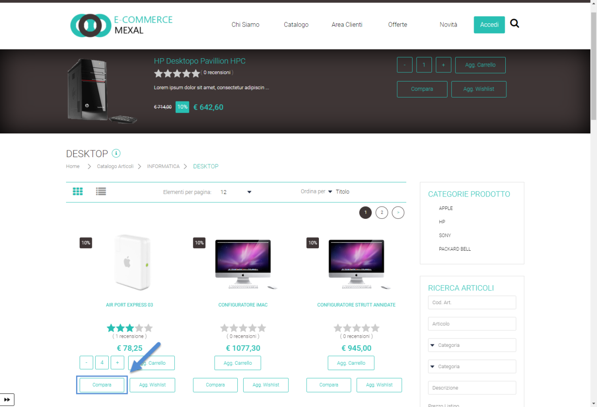

In particolare, per quel che riguarda la sezione SEO, il campo:

- **Title:** consente di specificare, per ciascuna delle lingue gestite
  all'interno del sito, quello che dovrà essere il **Title** della
  pagina utilizzata per visualizzare il dettaglio della Notizia, nel
  momento in cui all'interno di questa stessa pagina verrà visualizzata
  la news in esame.

> **ATTENZIONE! Affinchè il Title della pagina utilizzata per
> visualizzare il dettaglio della News coincida effettivamente con
> quanto inserito all'interno di questo campo è necessario aver
> precedentemente inserito nel campo "Formato Title per Pagina CMS"
> (menu "*Sito --Preferenze*" del Wizard) il segnaposto {articleName}**

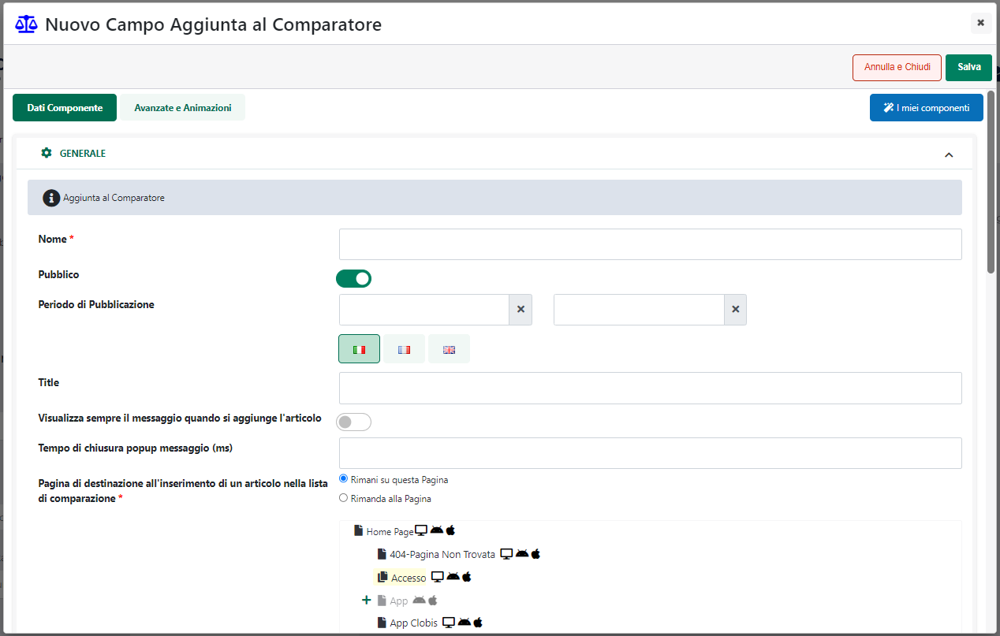

> Nel caso in cui sia stato correttamente inserito, all'interno
> dell'apposito campo il segnaposto {articleName}, lasciando vuoto il
> campo Title della sezione "*SEO -- SiteMap*" il Title della pagina
> utilizzata per visualizzare il dettaglio della News coinciderà
> esattamente con il Titolo della specifica notizia.

- **Keywords (per i motori di ricerca):** consente di specificare, per
  ciascuna delle lingue gestite all'interno del sito le parole chiave
  (corrispondenti al contenuto del Meta tag HTML KEYWORDS) relative al
  post che si sta editando.

> Tali informazioni saranno di fondamentale importanza per una migliore
> indicizzazione del sito e verranno, ovviamente, associate alla pagina
> di visualizzazione del dettaglio della notizia nel momento in cui
> all'interno di questa stessa pagina verrà visualizzata esattamente la
> notizia in esame.

- **Description (per i motori di ricerca):** consente di specificare,
  per ciascuna delle lingue gestite all'interno del sito la descrizione
  (corrispondente al contenuto del Meta tag HTML DESCRIPTION) relativa
  al post che si sta editando.

> Tali informazioni saranno di fondamentale importanza per una migliore
> indicizzazione del sito e verranno, ovviamente, associate alla pagina
> di visualizzazione del dettaglio della notizia nel momento in cui
> all'interno di questa stessa pagina verrà visualizzata esattamente la
> notizia in esame.

- **Meta Tags:** consente di inserire nella sezione \<head\> della
  pagina utilizzata per visualizzare il dettaglio della notizia, e nel
  momento in cui all'interno di questa stessa pagina verrà visualizzato
  esattamente le notizia in esame, dei Meta Tags aggiuntivi, non
  presenti nativamente in Passweb, e relativi quindi a specifiche
  esigenze dell'utente.

> **ATTENZIONE!** A differenza dei precedenti campi "Keywords" e
> "Description" in cui è necessario inserire solamente il contenuto del
> relativo meta tag (ossia le specifiche keywords e/o la specifica
> description) **all'interno di questo campo occorre inserire invece
> l'intero markup relativo al meta tag che si desidera utilizzare**..
>
> Il pulsante **"Aggiungi segnaposto"** consente di inserire, nella
> definizione del meta tag, dei segnaposto che verranno poi valorizzati
> automaticamente da Passweb.
>
> Per inserire un nuovo segnaposto è sufficiente posizionare il cursore
> nella posizione in cui questo dovrà essere effettivamente inserito,
> cliccare sul pulsante "Aggiungi segnaposto" e selezionare dal relativo
> menu contestuale la tipologia di segnaposto da inserire.
>
> **NOTA BENE:** oltre che a livello di specifico articolo CMS i Meta
> Tag possono essere aggiunti e gestiti anche a livello di Pagina web e
> di Layout Sito. Per maggiori informazioni in merito si vedano anche le
> sezioni "Live Editing -- Pagine" e "Live Editing -- Layout" di questo
> manuale

I parametri presenti all'interno della sezione SiteMap consentono invece
di:

- **SiteMap:** consente di decidere se l' url di visualizzazione della
  notizia in esame dovrà o meno essere incluso nella SiteMap del sito.

- **ChangeFrequency:** consente di impostare, nel caso in cui l' url di
  visualizzazione della notizia in esame dovesse essere incluso nella
  SiteMap, il valore del campo utilizzato per informare il motore di
  ricerca relativamente alla frequenza di aggiornamento dei contenuti
  della relativa pagina.

- **Priority:** consente di impostare, nel caso in cui l' url di
  visualizzazione della notizia in esame dovesse essere incluso nella
  SiteMap, il valore del campo utilizzato per informare il motore di
  ricerca relativamente alla priorità assegnata ai contenuti della
  relativa pagina.

> **ATTENZIONE!** Nel caso in cui per i tre parametri sopra indicati non
> sia stato specificato alcun valore, verrà considerato il valore
> assegnato, allo stesso parametro, nella sezione "**SiteMap CMS**" del
> menu "**Sito -- Preferenze**" del Wizard

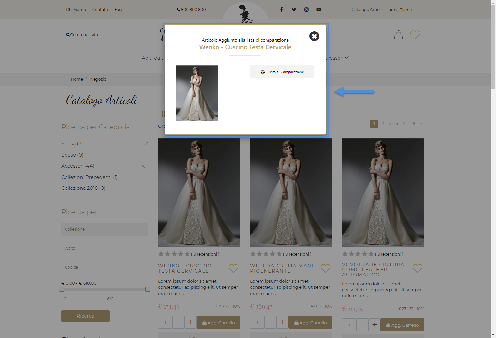

> **Nel caso in cui i parametri in esame non siano stati opportunamente
> valorizzati neppure all'interno del menu "Sito -- Preferenze" del
> Wizard, l' url di visualizzazione della notizia in oggetto sarà sempre
> inserito nella SiteMap con le seguenti impostazioni: "ChangeFrequency
> = Settimanale" e "Priority = 0.8"**
>
> **NOTA BENE:** per maggiori informazioni relativamente alla gestione
> della SiteMap del sito si veda anche la sezione "Sito -- Preferenze --
> SiteMap Pagine" di questo manuale.

##### ASSOCIAZIONI

La scheda "**Associazioni**" permette di definire le associazioni tra il
post in oggetto e:

- le categorie di News

- i Tag

- eventuali prodotti (siti Ecommerce) che dovranno poi essere
  visualizzati nel dettaglio del post

- eventuali immagini da visualizzare nel dettaglio del post all'interno
  di un' apposita galleria

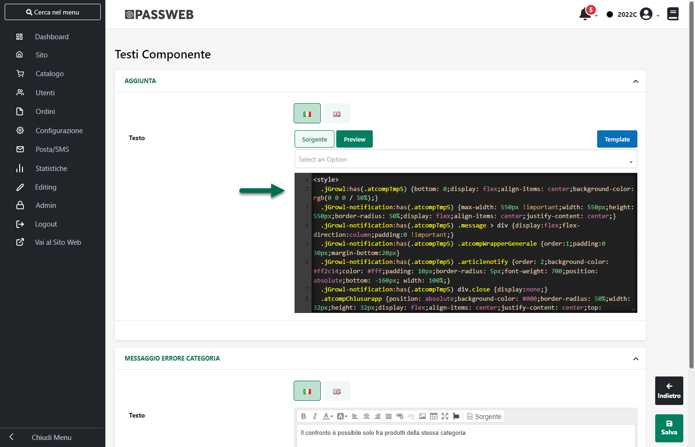

In particolare dunque il campo:

- **Categorie Associate:** consente di specificare, selezionandole
  all'interno del corrispondente albero, la categoria o le categorie cui
  associare il post che si sta editando. All'interno dell'albero
  "**Categorie Associate**" compariranno solo ed esclusivamente le
  categorie di News precedentemente codificate all'interno della
  corrispondente sezione "Categorie" (per maggiori informazioni
  relativamente a come creare e gestire le varie Categorie di News si
  veda anche il successivo capitolo di questo manuale)

- **Tag Associati:** consente di definire i vari Tag associati al post
  che si sta editando e che potranno poi essere utilizzati per
  categorizzare questo stesso post e per facilitarne la ricerca
  all'interno del sito.

> In questo senso è possibile utilizzare uno qualsiasi dei Tags facenti
> parte della libreria definita all'interno della corrispondente sezione
> del Wizard (Tags) oppure aggiungerne di nuovi andando quindi ad
> integrare direttamente questa stessa libreria.
>
> Per associare un nuovo Tag al post che si sta realizzando sarà
> sufficiente cliccare sul pulsante "**Aggiungi un tag**" ed inserirlo
> quindi all'interno del corrispondente riquadro.
>
> Digitando il nome del tag che si intende associare al post, verrà
> aperto un elenco, contestuale al testo digitato, contenente tutte le
> possibili opzioni definite sulla base dei Tags attualmente presenti in
> libreria. Nel caso in cui dunque il tag da inserire sia già tra quelli
> presenti in elenco sarà sufficiente selezionarlo ed utilizzare il
> tasto "TAB" per inserirlo.

> Nel caso invece in cui il tag desiderato non sia tra quelli presenti
> in elenco, dopo averne digitato il nome completo, verrà comunque
> inserito in elenco e contemporaneamente aggiunto anche alla libreria
> dei Tag disponibili.
>
> Per eliminare uno dei Tag associati al post in esame sarà sufficiente
> cliccare sulla piccola x posta a fianco del tag stesso.
>
> **ATTENZIONE!** Per visualizzare i tag associati sul front end del
> sito sarà necessario inserire, nel Dettaglio del post in esame il
> componente "**Tag Associati**"
>
> Per maggiori informazioni in merito alla gestione e alla
> configurazione di questo componente si veda anche quanto indicato nel
> corrispondente capitolo di questo manuale ("*Varianti Sito Responsive
> -- Lista Componenti CMS -- Componenti interni ai Componenti CMS -- Tag
> Associati*")

- **Articoli:** consente di definire un filtro articoli per individuare,
  tra i prodotti attualmente gestiti all'interno del sito, quelli che
  dovranno essere associati al post che si sta editando e che potranno
  quindi essere visualizzati, sul front end del sito, nel dettaglio del
  post stesso mediante l'apposito componente "**Prodotti Correlati**"

> Per maggiori informazioni relativamente alla creazione di un filtro
> articoli si veda il corrispondente capitolo di questo manuale
> (*"Utenti -- Siti Ecommerce -- Gruppi Utenti Sito -- Filtri Utente e
> Filtri Articolo -- Filtri Articolo"*)
>
> **ATTENZIONE!** Per visualizzare i prodotti che soddisfano il filtro
> impostato sul front end del sito sarà necessario inserire nel
> Dettaglio del post stesso il componente "**Prodotti Correlati**"
>
> Per maggiori informazioni in merito alla gestione e alla
> configurazione di questo componente si veda anche quanto indicato nel
> corrispondente capitolo di questo manuale ("*Varianti Sito Responsive
> -- Lista Componenti CMS -- Componenti interni ai Componenti CMS --
> Prodotti Correlati*")

La sezione "**Immagini**" consente di associare al post in esame una
serie di immagini che potranno poi essere visualizzate sul front end del
sito, nel dettaglio del post stesso, mediante l'apposito componente
"**Galleria Immagini**"

In questo senso è possibile operare aggiungendo una singola immagine
alla volta, oppure aggiungendo in blocco tutta una serie di immagini
presenti all'interno di una specifica cartella di "Gestione Risorse".

- Nel primo caso (**Aggiunta di una singola immagine**) sarà sufficiente
  cliccare sul relativo pulsante di aggiunta nuova immagine ( ) e
  utilizzare poi il pulsante "**Seleziona la Risorsa**" posto nella
  parte destra della maschera per scegliere, tra quelle presenti in
  "Gestione Risorse", la specifica immagine da associare al post

> La piccola x posta a fianco del pulsante "Seleziona la Risorsa"
> consente di azzerare il campo ed eliminare quindi l'associazione con
> la risorsa precedentemente selezionata.
>
> Il campo **'Testo Alternativo'** consente di indicare una descrizione
> aggiuntiva per l'immagine, descrizione questa utile per la
> reperibilità sui motori di ricerca (es. Google Immagini) oltre che a
> livello di accessibilità (es. browser per non vedenti). Quanto
> inserito all'interno del campo "Testo Alternativo" verrà inoltre
> utilizzato per generare la **didascalia associata all'ingrandimento
> dell'immagine**.

- Nel secondo caso (**Aggiunta in blocco di tutte le immagini presenti
  all'interno di una specifica cartella**) sarà invece necessario agire
  dal pulsante raffigurante una piccola cartella ( ), anch'esso presente
  nel riquadro sulla parte sinistra della maschera.

> Cliccando su questo pulsante verrà aperta immediatamente la maschera
> di "Gestione Risorse".
>
> A differenza del caso precedente però, questa volta sarà possibile
> selezionare una delle cartelle presenti all'interno di questa sezione
> per poi cliccare sul pulsante "Seleziona" (senza dover quindi indicare
> specificatamente una singola risorsa della cartella). In questo modo
> verranno associate al post tutte le immagini attualmente presenti
> nella cartella selezionata (**non verrà considerato in questa
> operazione il contenuto di eventuali sotto cartelle**).
>
> Il "Testo Alternativo" verrà impostato a default uguale al nome del
> relativo file, e potrà poi essere modificato in base alle specifiche
> esigenze dell'utente.
>
> **ATTENZIONE!** in fase di inserimento nuove immagini non verranno
> effettuate operazioni di sovrascrittura.
>
> Nel caso in cui si tenti dunque di associare al post un'immagine già
> inserita il risultato sarà quello di avere due immagini uguali.

Gli altri pulsanti presenti nella parte sinistra della sezione
"Immagini" consentono rispettivamente di:

- **Elimina Immagine** (
   ): consente di eliminare l'immagine
  attualmente selezionata in elenco

- **Sposta su / giù**
  (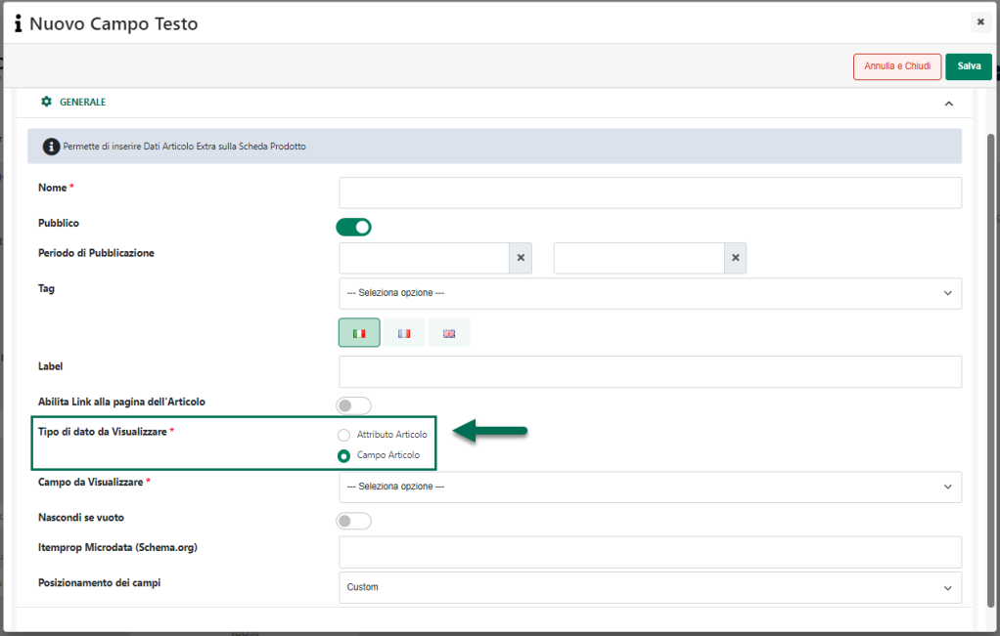 ): consente di riordinare tra loro le
  varie immagini presenti in elenco spostando verso l'alto o il basso
  l'immagine attualmente selezionata.

Il campo **Dimensione Thumbnail** consente di indicare la dimensione (in
pixel) che dovranno assumere le miniature delle immagini che verranno
visualizzate, nel dettaglio del post, all'interno della relativa
Galleria.

**ATTENZIONE! Per procedere alla generazione delle Thumbnail è
obbligatorio impostare una specifica dimensione. Nel momento in cui il
campo "Dimensione Thumbnail" dovesse essere lasciato vuoto non verrà
generata nessuna miniatura.**

Infine, per visualizzare le immagini associate al post sul front end del
sito, sarà necessario inserire nella pagina di visualizzazione del post,
all'interno del "Dettaglio News" il componete CMS "**Galleria
Immagini**"

Per maggiori informazioni in merito alla gestione e alla configurazione
di questo componente si veda anche quanto indicato nel corrispondente
capitolo di questo manuale ("*Varianti Sito Responsive -- Lista
Componenti CMS -- Componenti interni ai Componenti CMS --Galleria
Immagini*")

##### PUBBLICAZIONE

La scheda "**Pubblicazione**" consente di definire le modalità e le
tempistiche di pubblicazione e di visualizzazione all'interno del sito
del "Contenuto" che si sta considerando.

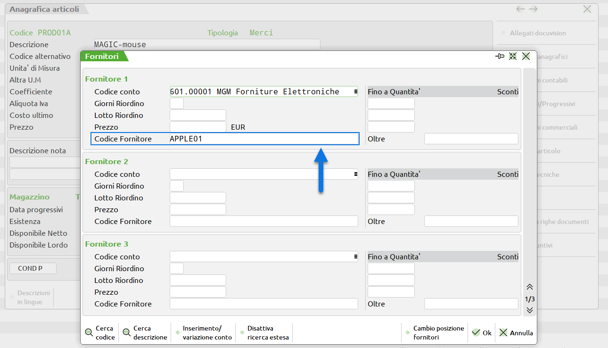

In particolare il parametro:

**Data:** consente di impostare la data della News che si sta
realizzando. A default il valore di questo campo coincide con la data di
pubblicazione della News in esame ma può essere modificato a proprio
piacimento.

**ATTENZIONE!** Il valore di questo campo verrà poi pubblicato sul sito
mediante il componente CMS "Data"

**Stato:** consente di abilitare o meno la pubblicazione e la
visualizzazione all'interno del sito del "Contenuto" che si sta
considerando. Sarà possibile selezionare uno dei seguenti valori:

- **Bozza:** in queste condizioni il Contenuto in oggetto sarà
  considerato come una semplice Bozza. Non verrà quindi pubblicato sul
  sito e potrà essere consultato e visualizzato solo all'interno del
  Wizard

- **Pubblicabile:** in queste condizioni il Contenuto in oggetto potrà
  essere visualizzato e pubblicato all'interno del sito sulla base dei
  valori impostati per i successivi parametri.

> Selezionando questa opzione verranno infatti abilitati tutta una serie
> di altri campi attraverso i quali poter specificare le impostazioni di
> pubblicazione del Contenuto. Nello specifico il parametro:

**Pubblicato:** consente, se selezionato, di pubblicare le notizia che
si sta codificando all'interno del sito

**Periodo di Pubblicazione:** consente di associare al "Contenuto" che
si sta realizzando uno specifico periodo di pubblicazione all'interno
del sito, definendone l'effettiva data di pubblicazione e la
corrispondente data di oscuramento. **Nel primo dei due campi**
disponibili occorrerà quindi indicare, utilizzando l'apposito calendario
**la data di inizio pubblicazione**. **Nel secondo campo** andrà invece
specificata **la data di fine pubblicazione**.

Nel caso in cui non venga definito uno specifico periodo di
pubblicazione, il Contenuto in oggetto verrà considerato come "sempre
pubblicato"

**Nascondi Contenuto nei componenti CMS:** consente, se selezionato, di
non far apparire il post in esame all'interno dei vari componenti CMS di
primo livello (es. Archivio News, Lista News ...).

**Sticky (metti in evidenza):** i contenuti visualizzati all'interno dei
vari componenti CMS potranno essere ordinati in base alla loro data di
pubblicazione e/o in base a quanto indicato all'interno del successivo
campo "**Posizione**". Il parametro "**Sticky**" consente di
sovrascrivere questo ordinamento e di posizionare quindi la
corrispondente notizia nelle prime posizioni indipendentemente dalla
modalità di ordinamento considerata.

**Posizione (solo per elementi radice di contenuti strutturati):**
consente di associare al "Contenuto" che si sta realizzando uno
specifico numero d'ordine che potrà poi essere utilizzato per definire
l'ordinamento tra questo elemento ed altri elementi, di pari livello,
all'interno di componenti CMS quali "Lista News" e/o "Archivio News"

**Inviabile per Newsletter con Campagna CMS:** consente di abilitare il
Contenuto che si sta realizzando ai fini di un suo utilizzo in Campagne
di Newsletter gestite con MailChimp e inviate lavorando direttamente
all'interno del Wizard di Passweb (Campagna CMS).

**Per maggiori informazioni relativamente all'integrazione tra Passweb e
MailChimp e alla possibilità di inviare tramite MailChimp stesso, ma
operando direttamente all'interno del Wizard di Passweb, Campagne di
Newsletter con contenuti prelevati in automatico dai post CMS gestiti
all'interno del proprio sito si veda la corrispondente sezione di questo
manuale (Passweb -- Gestione Newsletter)**

I post marcati come inviabili con Campagne CMS, saranno evidenziati
nella griglia di gestione dei contenuti CMS attraverso un'apposita icona

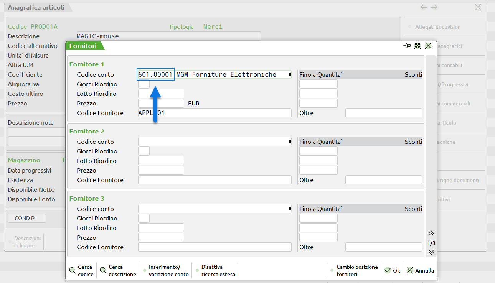

##### PRIVILEGI

La scheda "**Privilegi**" consente di definire, selezionandoli tra
quelli attualmente gestiti all'interno del sito, gli specifici gruppi di
utenti che dovranno essere abilitati alla visualizzazione del contenuto
in oggetto.

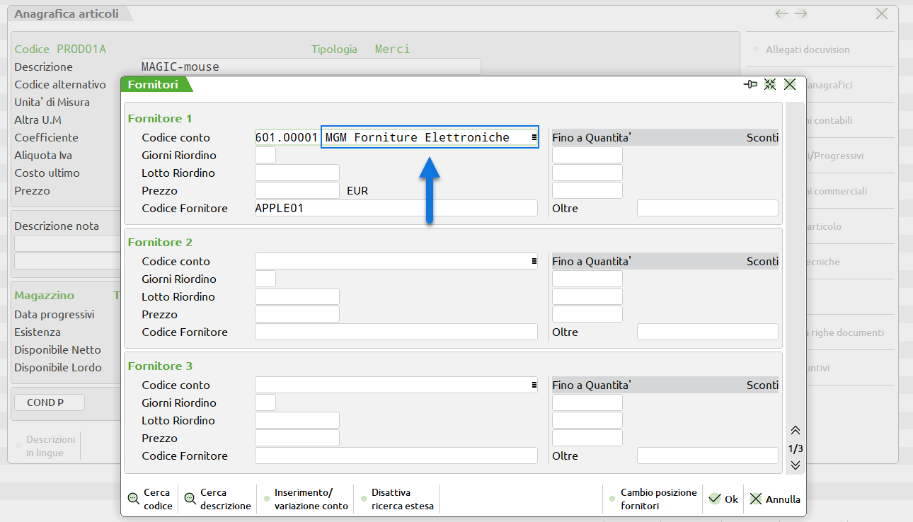

Nel momento in cui dovesse essere associato al Contenuto in oggetto uno
specifico gruppo di utenti, tale contenuto potrà poi essere visualizzato
all'interno del sito solo ed esclusivamente dagli utenti appartenenti al
gruppo stesso (e sempre in relazione ovviamente a quelle che sono le sue
impostazioni di pubblicazione)

Il pulsante "**Salva**" presente nella parte bassa della maschera
consente di salvare il post appena editato.

##### SOCIAL NETWORK

La scheda "**Social Network**" consente di condividere direttamente da
questa sezione del Wizard, e senza dunque dover passare per forza di
cose dal front end del sito, la notizia in esame.

**ATTENZIONE!** Considerando la finalità di questa scheda i campi in
essa presenti saranno effettivamente disponibili ed utilizzabili
soltanto dopo aver salvato la notizia in esame.

Entrando in questa sezione in fase di codifica di una nuova notizia la
maschera risulterà vuota e non sarà quindi possibile condividere nessun
tipo di contenuto.

Nel momento in cui si dovesse invece entrare in modifica di una notizia
già codificata, all'interno delle sezioni Facebook, Twitter e Linkedin
compariranno i relativi pulsanti di condivisone

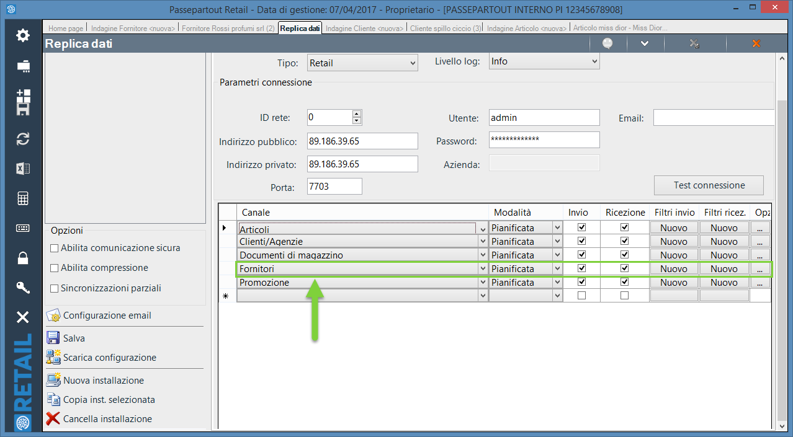

Nello specifico sarà dunque necessario impostare, per prima cosa, una
specifica pagina di destinazione (**Pagina di Destinazione per il
Dettaglio News**) cui verrà ricondotto l'utente che cliccherà sul
contenuto condiviso all'interno del social network.

**ATTENZIONE!** Tale pagina dovrà ovviamente contenere un Componente
"Dettaglio News" per consentire all'utente di poter effettivamente
leggere il dettaglio della notizia

Una volta impostata la pagina di lettura i pulsanti presenti all'interno
delle sezioni Facebook, Twitter e Linkedin consentiranno di condividere
la notizia all'interno del relativo social network.

**ATTENZIONE!** Per la condivisione verranno utilizzati i **Social Meta
Tag** e il **protocollo** **Opengraph.**

Per maggiori informazioni relativamente ai contenuti che verranno
effettivamente condivisi sul social network si veda quindi la sezione
"*Sito -- Preferenze -- SEO Keywords Description e Permalink Articoli*"
di questo manuale.

##### PASSWEB APP

All'interno di questa scheda, **disponibile solo nel caso in cui sia
stato attivato il modulo di gestione dell'App mobile,** è possibile
gestire l'invio delle notifiche push ai dispositivi opportunamente
abilitati, dove per dispositivi opportunamente abilitati si intendono:

- **I browser degli utenti che hanno esplicitamente acconsentito alla
  ricezione delle notifiche push (e che supportano ovviamente questo
  tipo di servizio)**

- **I dispositivi mobile, iOS e Android, su cui è installa l'App
  collegata al sito Passweb, e per i quali è stata abilitata la
  ricezione delle notifiche push da parte dell'App stessa**

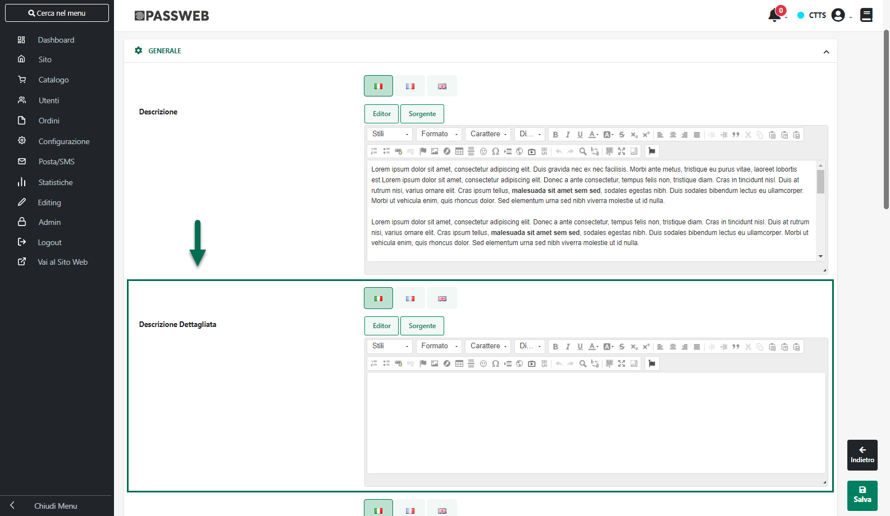

**ATTENZIONE! L'invio delle notifiche push è gestito mediante
l'integrazione del proprio sito Passweb con i servizi offerti dalla
piattaforma Google Firebase.**

Per maggiori informazioni relativamente a come configurare il proprio
sito Passweb per l'integrazione con Firebase, e dunque, per l'invio
delle notifiche push si veda anche il relativo capitolo di questo
manuale ("*App Mobile e Progressive Web App*")

I campi presenti all'interno di questa maschera consentono
rispettivamente di:

**Data Pubblicazione Notifica** (campo in sola lettura):consente di
visualizzare la data di ultimo invio della notifica push collegata alla
notizia in esame.

**Landing page:** consente di impostare la pagina di atterraggio cui
dovrà essere ricondotto l'utente nel momento in cui dovesse decidere di
cliccare sulla notifica push appena ricevuta.

E' possibile selezionare uno dei seguenti valori:

- **Pagina Generica:** in queste condizioni nel momento in cui l'utente
  dovesse decidere di cliccare e quindi di aprire la notifica push
  appena ricevuta, verrà automaticamente indirizzato sulla pagina
  selezionata all'interno dell'albero presente in corrispondenza del
  successivo campo **"Pagina Generica per il Dettaglio News"**

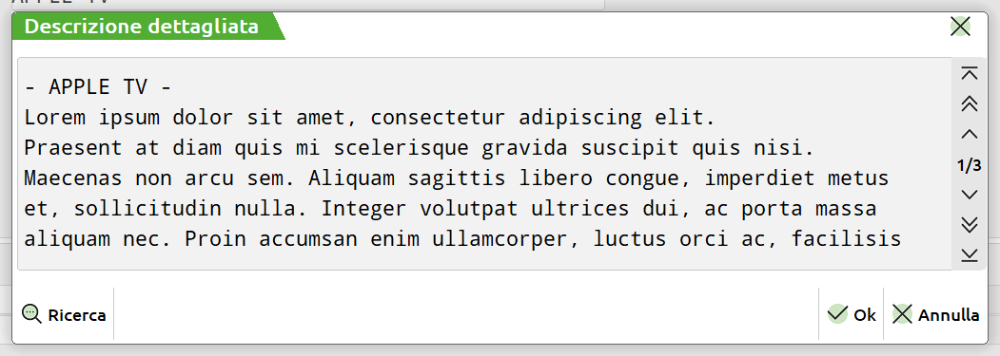

> Tale soluzione potrebbe quindi rivelarsi utile nel momento in cui la
> notifica push dovesse riguardare una generica news pubblicata
> all'interno del sito oppure un' offerta relativa, ad esempio, ad una
> determinata categoria di prodotti.
>
> Nel primo caso, notifica push relativa ad una generica news pubblicata
> all'interno del sito, sarà necessario assicurasi, ovviamente, del
> fatto di aver inserito, all'interno della pagina indicata, il
> componente "Dettaglio News", in maniera tale da dare all'utente la
> possibilità di leggere il dettaglio della news in relazione alla quale
> ha ricevuto la notifica.
>
> Nel secondo caso, notifica relativa ad un'offerta su di una
> determinata categoria di prodotti, potrebbe invece essere selezionata
> come pagina di approdo la relativa pagina Catalogo.

- **Pagina Prodotto**: in queste condizioni nel momento in cui l'utente
  dovesse decidere di cliccare e quindi di aprire la notifica push
  appena ricevuta, verrà automaticamente indirizzato sulla scheda del
  prodotto indicato all'interno del successivo campo "**Pagina
  Prodotto**"

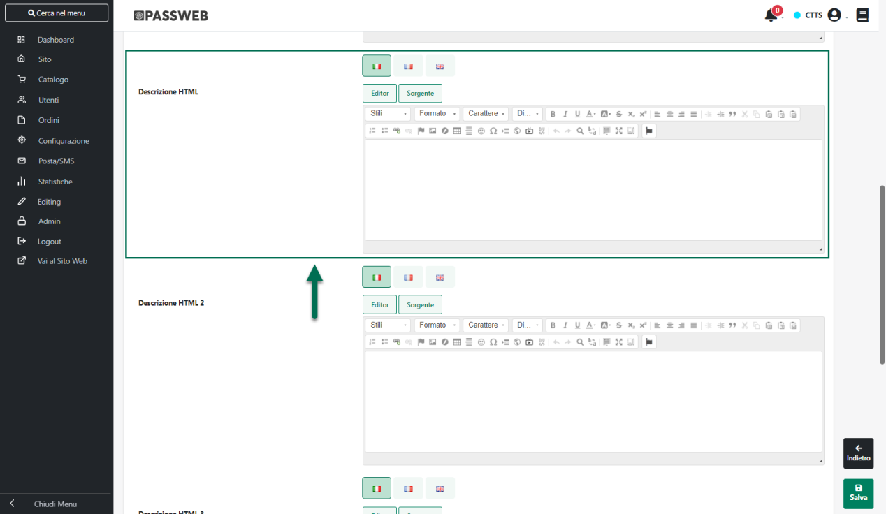

> Il pannello di ricerca consente di ricercare (per Titolo) lo specifico
> prodotto tra tutti quelli attualmente gestiti all'interno del sito.

**Anteprima Notifica:** consente di visualizzare, nella lingua
selezionata, un'anteprima della notifica push che verrà poi inviata ai
dispositivi opportunamente abilitati, notifica questa costituita dal
**Titolo** e dal **Sommario** della corrispondente news CMS

Una volta impostata correttamente la landing page, per inviare la
notifica push è sufficiente cliccare sul pulsante "**Invia nuova
notifica**" presente nella parte bassa della maschera.

**ATTENZIONE!** Le notifiche push verranno inviate sia ai dispositivi
mobile (iOS e Android) con installa l'App collegata al sito Passweb, sia
ai browser dei clienti che hanno acconsentito alla ricezione delle
notifiche push da parte del sito.

**In virtù di ciò occorre prestare particolare attenzione al fatto che
la pagina impostata come Landing Page per la notifica in esame sia a
tutti gli effetti una pagina mista, visibile quindi sia all'interno del
sito web che all'interno dell'App mobile**

In caso contrario nel momento in cui l'utente dovesse decidere di
cliccare sulla notifica ricevuta potrebbe non essere ricondotto alla
pagina desiderata.

