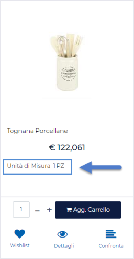

# NUOVA SUDDIVISIONE CONTENUTO

Come precedentemente evidenziato una "**Suddivisione** **Contenuto**"
altro non è se non una sorta di raggruppamento logico privo di veri e
propri contenuti.

I contenuti, per questo tipo di elementi, sono rappresentati dai singoli
post, eventualmente raggruppabili in ulteriori suddivisioni logiche, e
collocati ad un livello gerarchico più basso dell'elemento stesso.

**ATTENZIONE! Per loro stessa natura gli elementi di tipo "Suddivisione
Contenuto" dovranno essere utilizzati per creare e gestire delle
notizie, dei post, strutturati e costituiti quindi da tanti singoli
elementi collocati all'interno di un albero sviluppato su N distinti
livelli.**

Per creare una nuova "Suddivisione Contenuto" è necessario cliccare sul
relativo pulsante
{width="1.00625in"
height="0.1951388888888889in"} presente nella barra degli strumenti
della maschera **"Gestione CMS -- Contenuti"**

Cliccando su questo pulsante verrà infatti visualizzata la maschera
"**Nuova Suddivisione Contenuto CMS**"

{width="5.746527777777778in"
height="3.49375in"}

mediante la quale poter definire le caratteristiche della suddivisione
logica che si intende realizzare.

In particolare, all'interno della scheda "**Contenuto**" sarà possibile
indicare un valore per i seguenti campi:

- **Titolo:** consente di specificare il titolo della suddivisione che
  si sta realizzando.

- **Immagine (Sommario):** consente di associare una specifica immagine
  alla suddivisone che si sta realizzando.

- **Testo Alternativo Immagine (Sommario):** consente di definire il
  testo alternativo, indispensabile ai fini di una maggiore
  accessibilità e indicizzazione del contenuto, da associare
  all'immagine indicata nel campo precedente.

All'interno della scheda "**Associazioni**" sarà invece possibile
definire le associazioni tra la suddivisione logica che si sta
realizzando e le varie categorie di News gestite all'interno del sito

{width="5.746527777777778in"
height="3.5256944444444445in"}

- **Categorie Associate:** consente di specificare, selezionandole
  all'interno del corrispondente albero, la categoria o le categorie cui
  associare la suddivisione che si sta realizzando. All'interno
  dell'albero "**Categorie Associate**" compariranno solo ed
  esclusivamente le categorie di News precedentemente codificate
  all'interno della corrispondente sezione del Wizard

> **NOTA BENE**: per maggiori informazioni relativamente a come creare e
> gestire le varie Categorie di News si veda anche il successivo
> capitolo di questo manuale.

La scheda "**Pubblicazione**" consente di definire le modalità e le
tempistiche di pubblicazione e di visualizzazione all'interno del sito
della "Suddivisione Contenuto" che si sta considerando.

{width="5.746527777777778in"
height="3.49375in"}

In particolare il parametro:

- **Pubblicato:** consente di abilitare o meno la pubblicazione e la
  visualizzazione all'interno del sito della "Suddivisione Contenuto"
  che si sta considerando

<!-- -->

- **Periodo di Pubblicazione:** consente di associare alla "Suddivisione
  Contenuto" che si sta realizzando uno specifico periodo di
  pubblicazione all'interno del sito, definendone l'effettiva data di
  pubblicazione e la corrispondente data di oscuramento. **Nel primo dei
  due campi** disponibili occorrerà quindi indicare, utilizzando
  l'apposito calendario **la data di inizio pubblicazione**. **Nel
  secondo campo** andrà invece specificata **la data di fine
  pubblicazione**.

{width="5.746527777777778in"
height="3.558333333333333in"}

> Nel caso in cui non venga definito uno specifico periodo di
> pubblicazione, la visualizzazione all'interno del sito della relativa
> "Suddivisone Contenuto" dipenderà unicamente da quanto impostato per
> il precedente parametro "Pubblicato"
>
> **NOTA BENE**: il flag "Pubblicato" ha una priorità maggiore rispetto
> al "Periodo di Pubblicazione". Ciò significa dunque che nel caso in
> cui il parametro "Pubblicato" non sia stato selezionato, la relativa
> "Suddivisione Contenuto" non verrà comunque visualizzata all'interno
> del sito, indipendentemente da quello che può essere o meno il suo
> "Periodo di Pubblicazione"

- **Posizione (solo per elementi radice di contenuti strutturati):**
  consente di associare alla "Suddivisione Contenuto" che si sta
  realizzando uno specifico numero d'ordine che potrà poi essere
  utilizzato per definire l'ordinamento tra questo elemento ed altri
  elementi di pari livello all'interno di componenti CMS quali "Lista
  News" e/o "Archivio News"

La scheda "**Privilegi**" consente, infine di definire, selezionandoli
tra quelli attualmente gestiti all'interno del sito, gli specifici
gruppi di utenti che dovranno essere abilitati alla visualizzazione
della suddivisione in oggetto.

Nel momento in cui dovesse essere associato alla Suddivisone in oggetto
uno specifico gruppo di utenti, tale suddivisione potrà poi essere
visualizzata all'interno del sito solo ed esclusivamente dagli utenti
appartenenti al gruppo stesso (e sempre in relazione ovviamente a quelle
che sono le sue impostazioni di pubblicazione)

Il pulsante "**Salva**" presente nella parte bassa della maschera
consente di salvare il post appena editato.

