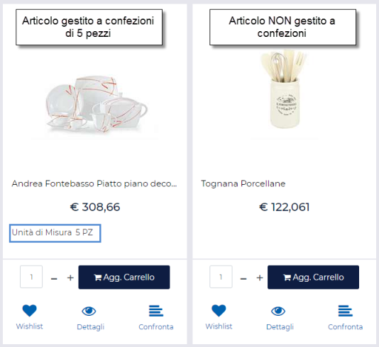
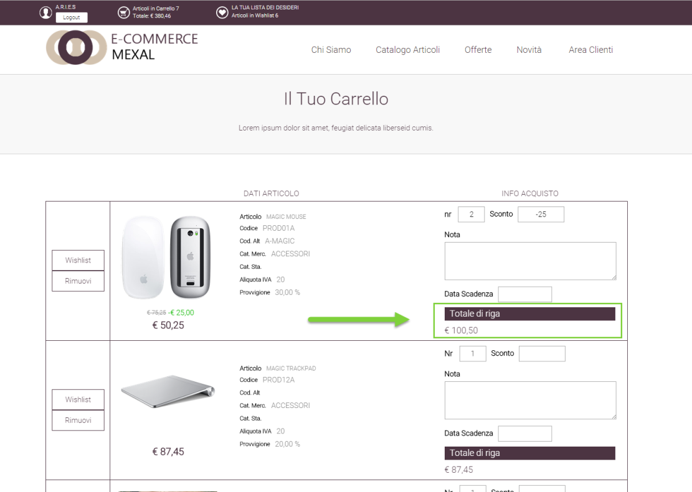

# CONTENUTI STRUTTURATI

Come precedentemente evidenziato, all'interno della maschera "Gestione
CMS -- Contenuti" verranno visualizzate solo ed esclusivamente le radici
di eventuali contenuti strutturati.

**Il dettaglio di queste notizie, la loro struttura e gli elementi
componenti la struttura stessa verranno visualizzati soltanto dopo aver
selezionato la specifica radice e dopo aver cliccato sul pulsante**
"**Modifica Contenuto"** (
 ) **presente nella contestuale barra
degli strumenti.**

Per poter creare un nuovo contenuto strutturato sarà quindi necessario
per prima cosa definirne la radice, sia essa un elemento di tipo
"Suddivisione Contenuto", sia essa un elemento di tipo "Contenuto".

Una volta definita tale radice, sarà poi necessario selezionarla e
cliccare sul pulsante "Modifica Contenuto". In questo modo si verrà
ricondotti alla maschera "**Modifica Contenuto**"

all'interno della quale poter eventualmente variare i contenuti della
radice considerata e, soprattutto, attraverso la quale poter organizzare
su di una struttura ad albero a N livelli i vari elementi che dovranno
andare a comporre la notizia strutturata che si intende realizzare

Cliccando quindi sul pulsante presente nella parte destra della maschera
sarà possibile visualizzare ed editare la struttura del post e il
relativo albero dei contenuti

I pulsanti presenti nella barra degli strumenti contestuale alla
struttura della News, consentono rispettivamente di:

**Suddivisone** ( ): consente di creare, immediatamente al di sotto
dello specifico contenuto attualmente selezionato all'interno
dell'albero, un nuovo elemento di tipo "**Suddivisone Contenuto**". La
maschera di creazione "**Nuova Suddivisone Contenuto**", coincide in
tutto e per tutto con la stessa maschera precedentemente analizzata.

**NOTA BENE**: per maggiori informazioni relativamente a come creare un
elemento di tipo "Suddivisione Contenuto" si veda anche il precedente
capitolo di questo manuale.

**Nuovo Contenuto** (
 ): consente di creare", immediatamente al di sotto
dello specifico contenuto attualmente selezionato all'interno
dell'albero, un nuovo elemento di tipo "**Contenuto**". La maschera di
creazione "**Nuovo Contenuto**", coincide in tutto e per tutto con la
stessa maschera precedentemente analizzata.

**NOTA BENE**: per maggiori informazioni relativamente a come creare un
elemento di tipo "Contenuto" si veda anche il precedente capitolo di
questo manuale.

**Sposta Contenuto**: è possibile spostare e riordinare tra loro i vari
elementi costituenti una News strutturata. In questo senso i pulsanti
raffiguranti due piccole frecce verdi, consentono di spostare il post
attualmente selezionato all'interno dell'albero, rispettivamente verso
l'alto e verso il basso**, mantenendolo comunque sempre allo stesso
livello**. In questo senso, dunque, non è necessario gestire, per
contenuti interni ad una gerarchia, il campo "Posizione" presente invece
per elementi di tipo Radice.

L'ordine degli elementi interni ad una gerarchia rifletterà infatti
sempre l'ordine con cui questi stessi contenuti sono visualizzati, nel
Wizard, all'interno della gerarchia stessa e potrà quindi essere
stabilito utilizzando ad esempio i pulsanti in questione.

Per spostare invece un post collocato all'interno di una certa
suddivisione logica in un'altra suddivisione (modificando quindi il suo
livello di profondità all'interno della struttura) è necessario per
prima cosa selezionare all'interno dell'albero il post che si intende
spostare e successivamente cliccare sul pulsante raffigurante 4 piccole
frecce .

Fatto questo sarà poi possibile selezionare, all'interno dell'albero, la
nuova destinazione in cui trasferire l'elemento inizialmente
selezionato.

Verrà quindi richiesta un'ulteriore conferma relativamente allo
spostamento che si intende effettuare.

Cliccando sul pulsante "Conferma" lo spostamento sarà definitivo.

**Elimina Contenuto** ( ):consente di eliminare il post attualmente
selezionato all'interno dell'albero assieme a tutti quelli eventualmente
presenti al di sotto di esso.

