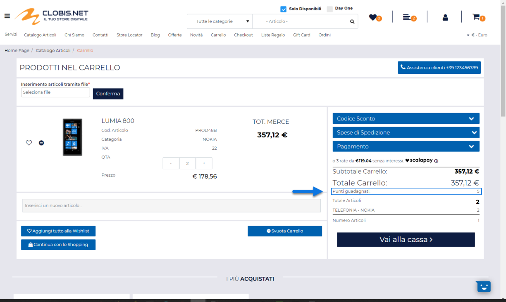
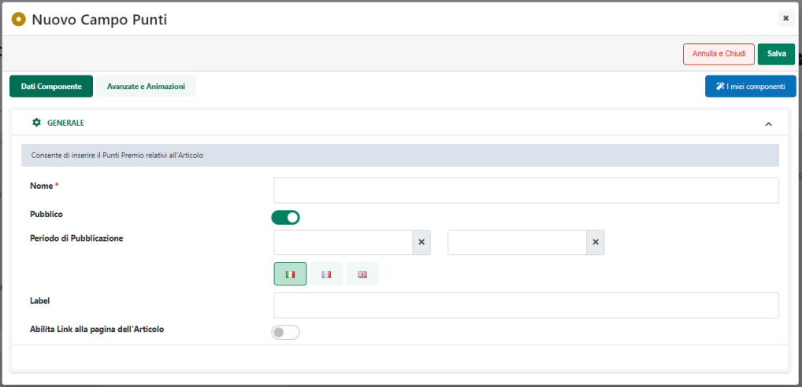
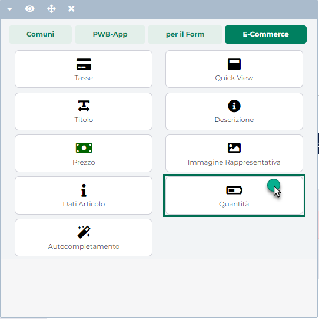
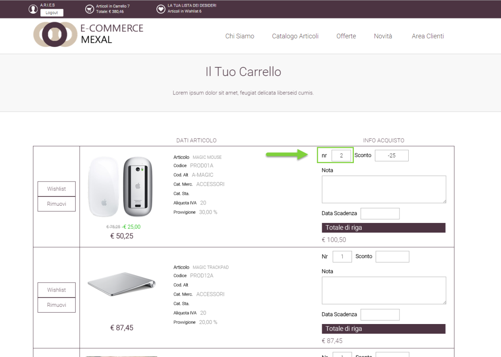
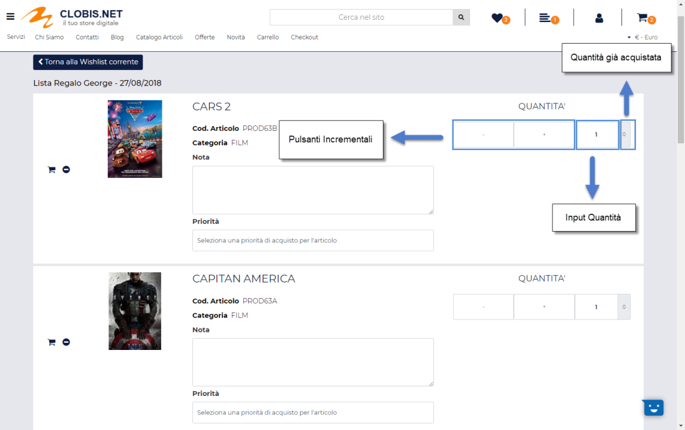

# IMPORTAZIONE / ESPORTAZIONE MASSIVA DI CONTENUTI CMS

Come già evidenziato nei precedenti capitoli di questo manuale Passweb
consente di creare nuovi contenuti CMS e/o di modificare quelli già
esistenti, non solo in maniera manuale ma anche in maniera massiva
mediante l'importazione di file csv appositamente strutturati.

**ATTENZIONE!** **Condizione fondamentale affinché le procedure di
esportazione / importazione di contenuti CMS possano andare a buon fine
è quella di aver correttamente assegnato tanto ai singoli Post quanto
alle singole Categorie CMS coinvolte nelle procedure un codice di
integrazione univoco, agendo in questo senso dal relativo campo "Codice"
presente nelle anagrafiche del singolo post e della singola Categoria
CMS.**

Fatta questa osservazione di fondamentale importanza, per poter avviare
la procedura di importazione massiva di nuovi contenuti CMS sarà
necessario accedere alla sezione "**Sito -- Gestione CMS -- Contenuti**"
del Wizard e cliccare sul pulsante "**Importa**" presente nella barra
degli strumenti della maschera "**Gestione CMS -- Contenuti**"

Cliccando su questo pulsante verrà infatti visualizzata la maschera
**"Importazione Contenuti CMS"** mediante la quale poter effettuare
l'upload del file contenente i nuovi post.

Nello specifico il campo:

- **File (csv-txt):** consente di selezionare il file txt o csv da
  uplodare e che dovrà quindi contenere tutti i dati dei nuovi post CMS
  che dovranno poi essere creati.

- **Lingua**: consente di indicare la lingua del sito a cui dovranno
  fare riferimento i dati presenti all'interno del file di importazione

> **ATTENZIONE!** Nel caso di siti, e quini di post CMS, multilingua
> dovranno essere effettuate importazioni distinte per ogni singola
> lingua gestita.

- **Separatore**: consente di indicare, selezionandolo, dall'apposito
  menu a tendina, il carattere che è stato utilizzato all'interno del
  file di importazione come separatore per i vari campi

Affinchè la procedura di import possa funzionare in maniera corretta e i
dati contenuti nel file possano essere associati correttamente ai
relativi post CMS, dovranno essere rispettate delle regole ben precise.
Nello specifico:

- Il file da importare deve avere estensione .csv o .txt

- E' necessario creare file distinti per le diverse lingue gestite
  all'interno del sito. In fase di importazione sarà poi possibile, come
  visto, indicare la specifica lingua cui il file fa riferimento.

- Il carattere separatore dei vari campi deve essere esattamente quello
  indicato all'interno del campo "**Separatore**" presente nel form di
  importazione.

- L'intestazione, ossia la prima riga del file, deve contenere
  necessariamente l'elenco dei nomi dei campi del post CMS che dovranno
  poi essere valorizzati con i dati presenti all'interno del file
  stesso. In questo senso i campi gestibili all'interno del file sono
  esattamente quelli di seguito indicati:

  - **codiceIntegrazione -- campo obbligatorio**.

> Come già evidenziato, questo campo verrà utilizzato come campo chiave
> per identificare univocamente il singolo post CMS e verrà quindi
> utilizzato in tal senso anche nel momento in cui l'operazione di
> import dovesse essere effettuata per modificare in maniera massiva
> eventuali contenuti già presenti all'interno del sito.
>
> Il valore inserito, per ogni singola entry del file di importazione,
> in corrispondenza di questa colonna coincide quindi con il campo
> "**Codice**" presente nell'anagrafica del singolo post CMS

- **pubblicato**: consente di indicare se il contenuto in esame dovrà o
  meno essere pubblicato sul sito. Corrisponde al parametro "Pubblicato"
  presente nell'anagrafica del singolo post CMS (tab "Pubblicazione").

> I valori ammessi sono **SI** o **NO**

- **posizione**: consente di indicare la posizione che il contenuto in
  esame dovrà avere, in caso di ordinamento personalizzato, all'interno
  di componenti quali "Lista News" e/o "Archivio News". Corrisponde al
  parametro "Posizione" presente nell'anagrafica del singolo post CMS
  (tab "Pubblicazione")

> I valori ammessi sono **numeri interi**

- **sticky**: consente di indicare se il post in questione dovrà essere
  tratto o meno come un contenuto sticky, e quindi se dovrà o meno
  essere messo in evidenza rispetto agli altri. Corrisponde al parametro
  "Sticky" presente nell'anagrafica del singolo post CMS (tab
  "Pubblicazione").

> I valori ammessi sono **SI** o **NO**

- **hide**: consente di indicare se il post in questione dovrà essere
  visualizzato o meno all'interno dei componenti CMS di primo livello
  (es. Archivio News, Lista News ...). Corrisponde al parametro
  "Nascondi Contenuto nei Componenti CMS" presente nell'anagrafica del
  singolo post CMS (tab "Pubblicazione").

> I valori ammessi sono **SI** o **NO**

- **dataInizioPubblicazione**: consente di indicare la data di inizio
  pubblicazione del contenuto in esame. Corrisponde alla data inserita
  nel primo campo del parametro "Periodo di Pubblicazione" presente
  nell'anagrafica del singolo post CMS (tab "Pubblicazione").

> I valori ammessi sono delle date espresse nel formato **dd/MM/yyyy**

- **dataFinePubblicazione**: consente di indicare la data di fine
  pubblicazione del contenuto in esame.

> Corrisponde alla data inserita nel secondo campo del parametro
> "Periodo di Pubblicazione" presente nell'anagrafica del singolo post
> CMS (tab "Pubblicazione").
>
> I valori ammessi sono date espresse nel formato **dd/MM/yyyy**

- **siteMap**: consente di indicare se il contenuto in esame dovrà o
  meno essere inserito nella sitemap del sito. Corrisponde al parametro
  "SiteMap" presente nell'anagrafica del singolo post CMS (tab "SEO -
  SiteMap").

> I valori ammessi sono **SI** o **NO**

- **sitemapChangefreq**: consente di indicare la frequenza di
  aggiornamento della sitemap (da considerarsi ovviamente solo nel
  momento in cui il campo siteMap sia stato impostato su S). Corrisponde
  al parametro "ChangeFrequency" presente nell'anagrafica del singolo
  post CMS (tab "SEO - SiteMap")

> I valori consentiti sono **always** - **hourly** - **daily** -
> **weekly** - **monthly** - **yearly** - **never**

- **sitemapPriority**: consente di indicare la priorità del contenuto in
  esame nella sitemap del sito (da considerarsi ovviamente solo nel
  momento in cui il campo siteMap sia stato impostato su S). Corrisponde
  al parametro "Priority" presente nell'anagrafica del singolo post CMS
  (tab "SEO - SiteMap")

> I valori consentiti sono: **0,0** - **0,1** - **0,2** - **0,3** -
> **0,4** - **0,5** - **0,6** - **0,7** - **0,8** - **0,9** - **1,0**

- **titolo -- campo obbligatorio**: consente di indicare il titolo del
  contenuto in esame. Corrisponde al campo "Titolo" presente
  nell'anagrafica del singolo post CMS (tab "Contenuto")

- **sommario**: consente di indicare il sommario del contenuto in esame.
  Corrisponde al campo "Sommario" presente nell'anagrafica del singolo
  post CMS (tab "Contenuto")

- **testo**: consente di indicare il contenuto dettagliato del post di
  esame. Corrisponde al campo "Contenuto" presente nell'anagrafica del
  singolo post CMS (tab "Contenuto")

- **descrizione1**: consente di indicare il primo contenuto aggiuntivo
  da associare al post in esame. Corrisponde al campo "Descrizione 1"
  presente nell'anagrafica del singolo post CMS (tab "Ulteriori
  Contenuti")

- **descrizione2**: consente di indicare il secondo contenuto aggiuntivo
  da associare al post in esame. Corrisponde al campo "Descrizione 2"
  presente nell'anagrafica del singolo post CMS (tab "Ulteriori
  Contenuti")

- **descrizione3**: consente di indicare il terzo contenuto aggiuntivo
  da associare al post in esame. Corrisponde al campo "Descrizione 3"
  presente nell'anagrafica del singolo post CMS (tab "Ulteriori
  Contenuti")

- **keywords**: consente di indicare le meta keywords da associare al
  post in esame. Corrisponde al campo "Keywords" presente
  nell'anagrafica del singolo post CMS (tab "SEO -- SiteMap")

- **description**: consente di indicare la meta description da associare
  al post in esame. Corrisponde al campo "Description" presente
  nell'anagrafica del singolo post CMS (tab "SEO -- SiteMap")

- **metatag**: consente di indicare i metatag da associare al post in
  esame. Corrisponde al campo "Meta Tags" presente nell'anagrafica del
  singolo post CMS (tab "SEO -- SiteMap")

- **filtroArticoli**: consente di specificare il filtro articoli
  necessario per individuare l'insieme dei prodotti gestiti all'interno
  del proprio sito Ecommerce che dovranno essere associati al post in
  esame e che saranno visualizzabili sul front-end del sito grazie
  all'utilizzo del componente "Prodotti Correlati"

> Corrisponde al filtro impostabile in corrispondenza del campo
> "Articoli" presente nell'anagrafica del singolo post CMS (tab
> "Pubblicazione")
>
> **ATTENZIONE! Per determinare in maniera corretta il filtro articoli e
> quindi il valore esatto da inserire, per ogni singolo post, in
> corrispondenza di questa colonna è necessario utilizzare il Wizard di
> Passweb.**
>
> Occorre quindi portarsi all'interno della sezione "**Associazioni**"
> nella maschera di configurazione di un qualsiasi contenuto CMS e
> costruire, per prima cosa, il filtro desiderato mediante l'editor
> visuale presente in corrispondenza del campo "**Articoli**"

> Per maggiori informazioni su come poter costruire un filtro articoli
> si veda anche quanto indicato all'interno del corrispondente capitolo
> di questo manuale (*"Utenti -- Siti Ecommerce -- Gruppi Utenti Sito --
> Filtri Utente e Filtri Articolo -- Filtri Articolo"*)
>
> Una volta creato il filtro desiderato sarà poi sufficiente cliccare
> sul pulsante "**Copia Filtro**"

> per ottenere esattamente la stringa corrispondente al filtro
> impostato, stringa questa che dovrà poi essere incollata all'interno
> del file di importazione in corrispondenza della colonna
> "filtroArticoli"

- **categoriaCMS**: consente di indicare l'elenco dei codici delle
  Categorie CMS, separate dal punto e virgola, che dovranno poi essere
  associate al post in esame.

> I valori da indicare all'interno di questo campo sono quelli
> corrispondenti ai codici di integrazione inseriti nelle anagrafiche
> delle singole categorie CMS in corrispondenza del campo "Codice"

> **ATTENZIONE!** è bene ricordare che l'associazione di un post ad una
> categoria per cui è stata correttamente definita una specifica pagina
> di lettura può anche essere, dipendentemente dalle impostazioni
> settate per il parametro "**Formato Permalink Contenuti CMS**" (pagina
> "**Sito -- Preferenze**" del Wizard, tab "**SEO**" sezione
> "**Permalink**"), una condizione obbligatoria per la corretta
> visualizzazione del post sul front end del sito.
>
> In questo senso diventa dunque di fondamentale importanza valorizzare
> correttamente all'interno del file di importazione il campo in
> questione.

- **Il file di importazione deve soddisfare le specifiche del formato
  RFC4180.**

> **ATTENZIONE!** In questo senso è quindi necessario che il valore dei
> campi contenenti interruzioni di riga, e/o lo stesso carattere
> utilizzato anche come separatore sia necessariamente racchiuso da
> virgolette.
>
> **Inoltre nel caso in cui il valore di un campo abbia al suo interno
> elementi racchiusi da doppi apici (come potrebbe ad esempio avvenire
> nel caso di codice HTML) sarà necessario racchiudere tra virgolette
> oltre all'intero campo anche questi stessi elementi**.
>
> Supponendo, ad esempio, di aver scelto come carattere separatore il ;
> e di fare riferimento al campo "testo" che, come detto è utilizzato
> per indicare il contenuto dettagliato del post CMS potrebbero
> verificarsi le seguenti casistiche:

- Il campo "testo" non contiene il carattere ; 🡪 il valore di questo
  campo **NON dovrà essere racchiuso da virgolette**

> Es. **Contenuto del campo testo**

- Il campo "testo" contiene il carattere ; 🡪 il valore di questo campo
  **dovrà essere racchiuso da virgolette**

> Es. **"Contenuto del campo testo con un ; che deve essere gestito"**

- Il campo "testo" contiene dei doppi apici 🡪 sarà necessario
  racchiudere tra virgolette **sia l'intero campo che l'elemento
  presente al suo interno e racchiuso da doppi apici**

> Es. **"Il campo testo contiene ""doppi apici"" che devono essere
> gestiti"**

- Il campo "testo" contiene un new line (ritorno a capo) 🡪 il valore di
  questo campo **dovrà essere racchiuso da virgolette**

> Es. **"il campo descrizione contiene un**
>
> **new line che deve essere gestito"**

**ATTENZIONE!** la procedura di import massivo può essere utilizzata non
solo per creare nuovi post CMS ma, volendo, anche per modificare in
maniera massiva i contenuti di post già presenti sul sito. In questo
senso è di fondamentale importanza, ovviamente, aver assegnato
preventivamente a ciascuno di essi uno specifico codice di integrazione
in maniera tale da poterli poi agganciare in fase di importazione dati.

**ATTENZIONE! Nel momento in cui si dovesse decidere di effettuare una
modifica massiva dei post cms mediante import di file csv è sempre
consigliabile effettuare prima un backup dei contenuti attualmente
gestiti mediante l'apposita funzione di export in maniera tale da
poterlo poi ripristinare nel caso in cui dovessero verificarsi problemi
di qualsiasi tipo**

Per verificare la corretta struttura di un file di importazione è anche
possibile effettuare una prima esportazione dei contenuti CMS già
presenti all'interno del sito. I campi presenti all'interno del file di
esportazione sono infatti esattamente gli stessi precedentemente
indicati e che dovranno quindi essere presenti anche in un eventuale
file di importazione.

Per effettuare l'esportazione dei contenuti CMS attualmente presenti sul
sito in un apposito file CSV è sufficiente accedere ancora una volta
alla sezione "**Sito -- Gestione CMS -- Contenuti**" del Wizard e
cliccare questa volta sul pulsante "**Esporta**" presente nella barra
degli strumenti della maschera "**Gestione CMS -- Contenuti**"

Cliccando su questo pulsante verrà infatti visualizzata la maschera
"**Esportazione Contenuti CMS**"

all'interno della quale poter indicare il carattere da utilizzare come
separatore dei campi nel file csv che verrà poi prodotto e la lingua a
cui dovranno fare riferimento i contenuti del file.

**ATTENZIONE!** **In fase di esportazione verranno presi in
considerazione solo ed esclusivamente post CMS ai quali è stato
associato uno specifico codice di integrazione**

