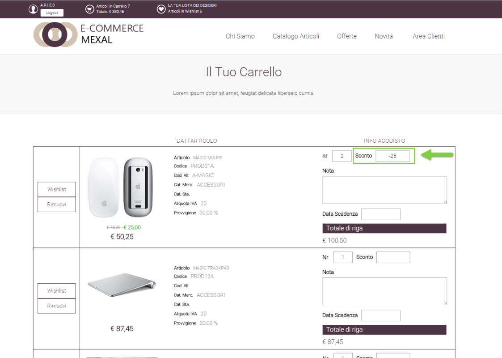
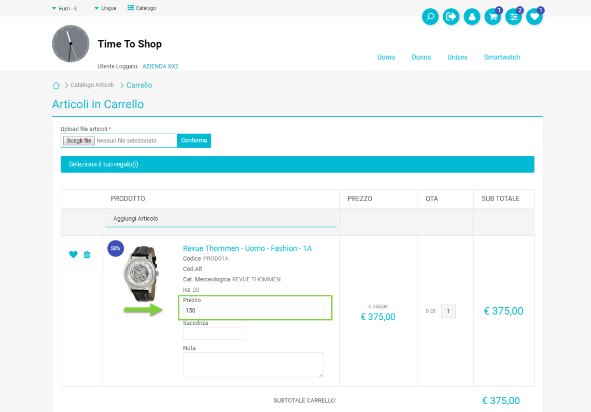
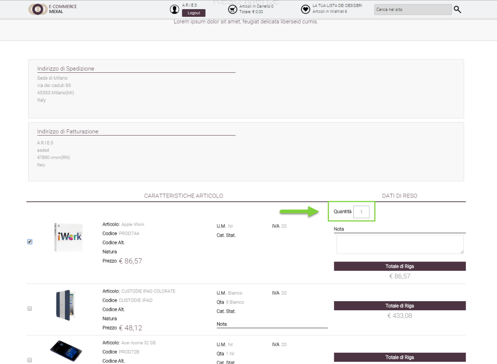
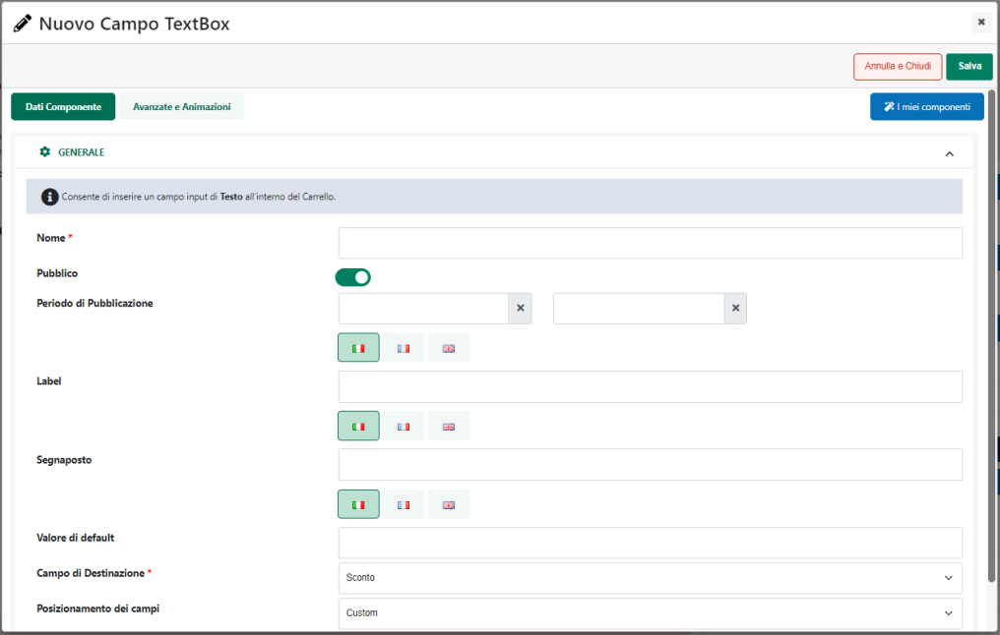
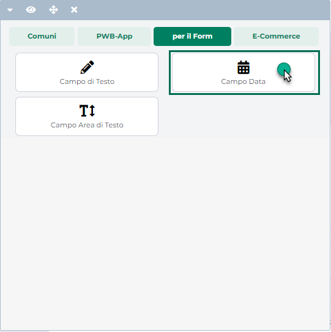
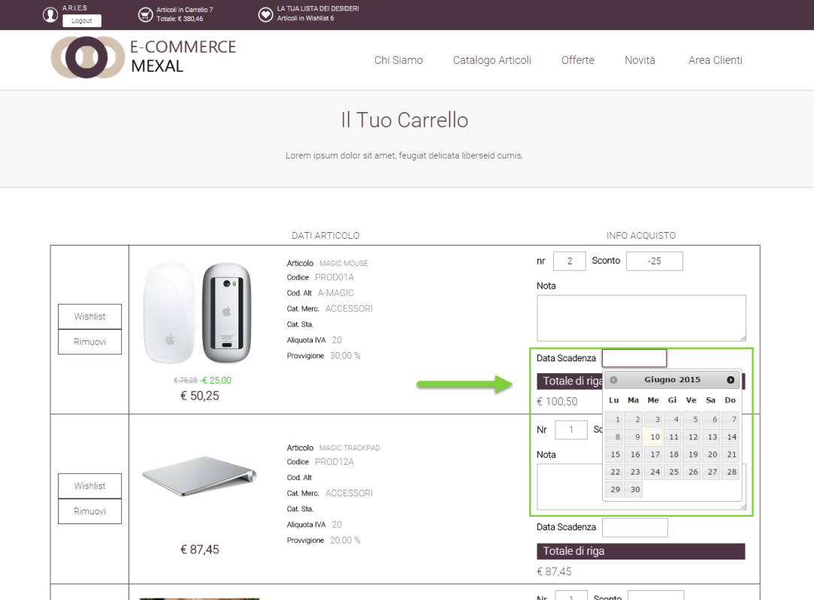
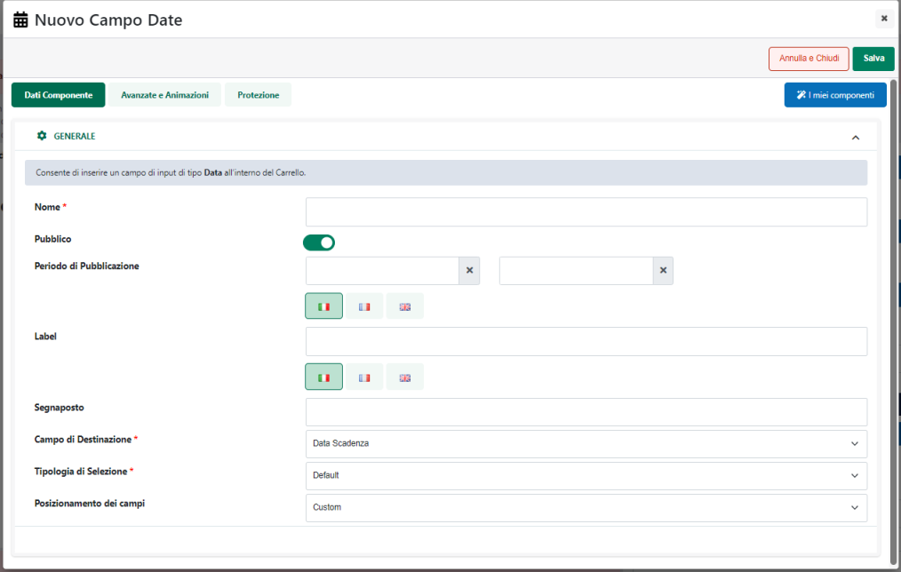
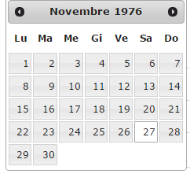
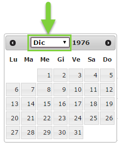

# GESTIONE CORRELAZIONI

La pagina **"Correlati"** accessibile dalla voce di menu ***"Sito --
Gestione CMS"*** consente di definire liste di correlazione grazie alle
quali poter legare tra loro diversi post (che magari fanno riferimento
ad argomenti simili).

Una lista di correlazione dunque altro non è se non un insieme di post,
un elenco di notizie, magari appartenenti a differenti categorie di
News, ma in qualche modo collegate tra loro (perché trattano comunque
argomenti simili).

Un esempio in questo senso potrebbe essere quello rappresentato da una
notizia relativa ad un certo film, e quindi appartenente alla categoria
"Movie" alla quale potrebbero essere collegate notizie relative agli
attori del film ed appartenenti ad esempio alla categoria "Gossip".

Grazie a queste liste di correlazione è quindi possibile fare in modo
che, nel momento in cui un utente dovesse trovarsi a leggere il
dettaglio di una certa notizia pubblicata all'interno del sito, potrebbe
avere subito a disposizione anche tutti i contenuti presenti all'interno
della lista di correlazione cui appartiene la notizia che sta leggendo,
e quindi tutte le ulteriori notizie che in qualche modo potrebbero
interessargli.

In questo senso Passweb consente di creare diverse liste di correlazione
categorizzate per argomenti. Il componente CMS "Contenuti Correlati"
consentirà poi di inserire in diverse posizioni all'interno di diverse
pagine del sito liste di correlazione relative a diversi argomenti.

**NOTA BENE**: per maggiori informazioni relativamente a come gestire e
configurare il componente CMS "Contenuti Correlati" si veda anche il
corrispondente capitolo di questo manuale

Il contenuto di queste liste di correlazione, ovviamente, varierà in
maniera dinamica sulla base del dettaglio della specifica notizia che si
sta consultando.

All'interno della sezione correlati verrà visualizzata la maschera
"**Gestione CMS -- Correlazioni**"

{width="5.746527777777778in"
height="3.49375in"}

contenente l'elenco di tutti gli argomenti attualmente codificati
all'interno del sito e in relazione ai quali sarà quindi possibile
definire delle liste di correlazione.

Prima di poter definire una vera e propria lista di correlazione è
quindi indispensabile definire l'argomento entro cui dovrà essere
collocata la lista che si intende realizzare.

In questo senso per creare un nuovo argomento di correlazione è
sufficiente cliccare sul pulsante **"Nuovo Argomento"** presente nella
barra degli strumenti. Verrà quindi visualizzata la maschera "**Nuovo
Argomento CMS**"

{width="5.746527777777778in"
height="3.49375in"}

all'interno della quale poter definire (campo Argomento) il nome
dell'argomento di correlazione che si intende codificare.

Una volta definito l'elenco degli argomenti di correlazione desiderati
sarà poi possibile definire per ciascuno di essi una o più liste di
correlazione.

Cliccando su uno degli argomenti presenti in lista, compariranno
infatti, nella contestuale barra degli strumenti anche i pulsanti
**Elimina Argomento, Modifica Argomento** e **Gestione Liste**

{width="5.746527777777778in"
height="3.49375in"}

attraverso cui poter, rispettivamente:

- **Modifica Argomento**: consente di modificare l'argomento attualmente
  selezionato in elenco

- **Elimina Argomento**: consente di eliminare l'argomento attualmente
  selezionato in elenco

- **Gestione Liste:** consente di gestire le liste di correlazione
  associate all'argomento attualmente selezionato in elenco.

Cliccando quindi sul pulsante "Gestione Liste" verrà visualizzata la
maschera "**Gestione CMS -- Liste per Argomento (Nome Argomento)**"

{width="5.746527777777778in"
height="3.49375in"}

contenente l'elenco di tutte le liste di correlazione associate
all'argomento attualmente selezionato

Il pulsante "**Nuova Lista di Correlazione**" presente nella barra degli
strumenti consente di definire una nuova lista di correlazione.
Cliccando su questo pulsante verrà quindi visualizzata la maschera
"**Nuova Lista per Argomento CMS**"

{width="5.746527777777778in"
height="3.49375in"}

all'interno della quale poter definire (campo Lista) il nome della lista
di correlazione che si intende codificare.

Una volta definita la lista di correlazione sarà poi necessario,
ovviamente, indicare quali post o notizie dovranno entrare a far parte
di questa lista.

Selezionando una delle liste presenti in elenco compariranno nella barra
degli strumenti due ulteriori pulsanti: **Gestione Contenuti Correlati**
e **Elimina Lista di Correlazione**

{width="5.746527777777778in"
height="3.49375in"}

attraverso cui poter, rispettivamente:

- **Elimina Lista di Correlazione**: consente di eliminare la lista di
  correlazione attualmente selezionata in elenco. La cancellazione di
  una lista di correlazione non causerà in alcun modo l'eliminazione
  delle notizie in essa presenti.

- **Gestione Contenuti Correlati:** consente di gestire il contenuto
  della lista di correlazione attualmente selezionata in elenco
  definendo, dunque, l'insieme di notizie che ne faranno parte.

Cliccando quindi sul pulsante "Gestione Contenuti Correlati" verrà
visualizzata la maschera "**Gestione CMS -- Contenuti Correlati per
Lista (nome Lista) per Argomento (Nome Argomento)**"

{width="5.746527777777778in"
height="3.49375in"}

contenente l'elenco di tutti i post attualmente associati alla lista di
correlazione in esame.

I pulsanti presenti nella barra degli strumenti consentono
rispettivamente di:

- **Elimina Associazione:** consente di eliminare dalla lista di
  correlazione in esame la notizie attualmente selezionate in elenco.

- **Aggiungi Associazioni:** consente di specificare le notizie da
  associare alla lista di correlazione in esame.

> Cliccando su questo pulsante verrà infatti visualizzato l'elenco
> paginato dei post precedentemente codificati all'interno della
> corrispondente sezione "Contenuti"

{width="5.746527777777778in"
height="3.49375in"}

> Per aggiungere una o più notizie alla lista in esame sarà quindi
> necessario selezionarle all'interno dell'elenco sopra evidenziato (la
> griglia è a selezione multipla) e cliccare poi sul pulsante "Aggiungi"
> presente nella barra degli strumenti.

- **Marca/Smarca come Origine:** consente di marcare/smarcare la notizia
  attualmente selezionata in elenco come "Origine" per la lista di
  correlazione considerata.

> Eventuali "Origini" presenti all'interno di una certa lista verranno
> evidenziate rispetto agli altri post in elenco.

{width="5.746527777777778in"
height="3.49375in"}

Per comprendere meglio il concetto di "Origine" ed il significato del
parametro "**Marca/Smarca come Origine**" appena analizzato, occorre
fare una considerazione di fondamentale importanza.

In Passweb è possibile creare due diverse tipologie di liste di
correlazione:

**Liste di correlazione a doppio senso:** sono quelle liste di
correlazione per cui non è stata specificata una ben precisa notizia di
"Origine". In queste condizioni visualizzando il dettaglio di uno
qualsiasi dei post presenti in lista, all'interno del sito, nella
corrispondente lista di correlazione, potranno essere visualizzate tutte
le altre notizie associate alla lista in oggetto.

**Liste di correlazione a senso unico**: sono quelle liste di
correlazione in cui una specifica notizia è stata marcata come notizia
di "Origine". In queste condizioni visualizzando il dettaglio del post
marcato come origine , all'interno del sito, nella corrispondente lista
di correlazione, verranno correttamente visualizzate anche tutte le
altre notizie associate alla lista in oggetto. Nel momento in cui,
invece, dovesse essere consultato il dettaglio di un post diverso da
quello marcato come origine, all'interno del sito ,nella corrispondente
lista di correlazione, non si vedrebbe nulla (o quanto meno nulla della
lista di correlazione considerata).

