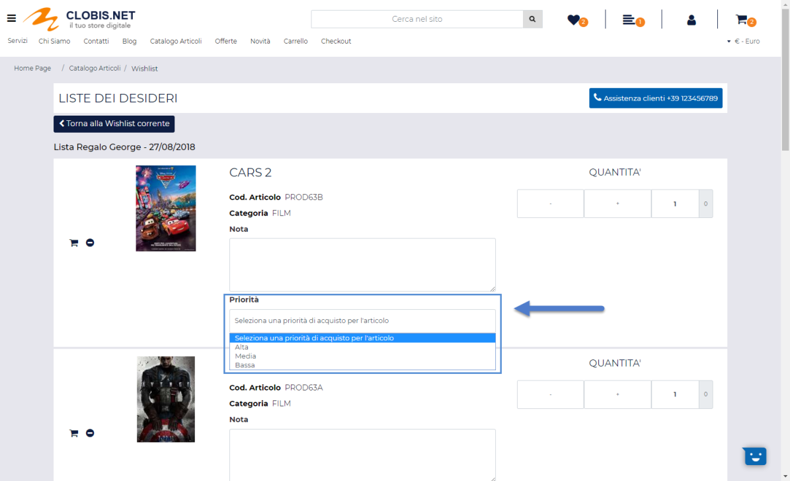
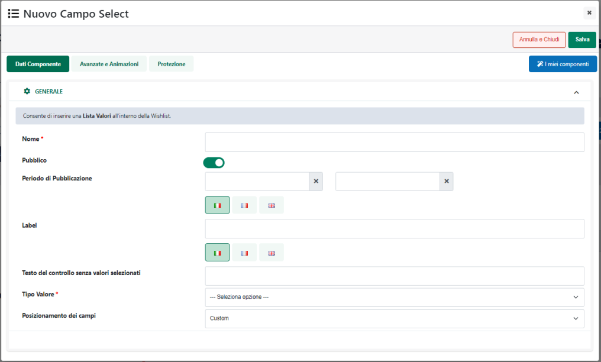

# PARAMETRI IMMAGINI

All'interno di questa sezione del Wizard, accessibile dalla voce di menu
"*Sito -- Gestione CMS -- Parametri Immagini*", è possibile dimensionare
in maniera specifica, **per i dispositivi mobile**, le immagini
"**Sommario**" e "**Articolo**" utilizzate nei post CMS.

**ATTENZIONE!** **Indicando delle dimensioni diverse da 0 verranno
create automaticamente nuove immagini con le dimensioni indicate e
queste stesse immagini verranno poi utilizzate solo ed esclusivamente in
corrispondenza di risoluzioni inferiori ai 576px in maniera tale da
alleggerire il peso della pagina web.**

Le immagini originali, utilizzate nella versione desktop del sito non
verranno in alcun modo alterate.

Una volta selezionata, tra quelle presenti all'interno della maschera
"**Lista delle tipologie immagini**", la tipologia di immagine su cui
intervenire

sarà sufficiente cliccare sul pulsante "**Modifica**" (
 ) presente nella contestuale barra degli
strumenti per accedere alla maschera "**Configurazione immagine
smartphone**"

all'interno della quale poter specificare:

- **Altezza:** altezza in pixel dell'immagine da utilizzare per
  risoluzioni inferiori a 576px

- **Larghezza:** larghezza in pixel dell'immagine da utilizzare per
  risoluzioni inferiori a 576px

- **Qualità:** valore numerico da 0 a 100. Consente di impostare la
  qualità con cui dovrà essere ricampionata la relativa immagine durante
  il processo di creazione della sua versione mobile. Maggiore sarà la
  qualità impostata più alto sarà, ovviamente, il peso dell'immagine
  mobile.

Il pulsante "**Salva**" posto nella parte bassa della maschera consente
di avviare il processo di creazione delle nuove immagini.

