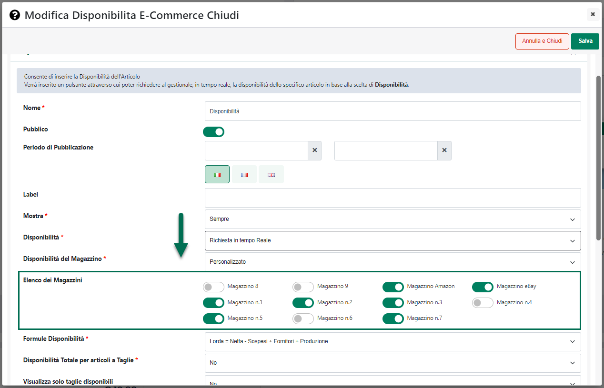

# NOTIFICHE

La sezione "**Notifiche**" consente di visualizzare un archivio completo
di tutte le notifiche push ricevute da Passweb Monitor in relazione
all'utente che ha effettuato l'autenticazione al Wizard.

**ATTENZIONE!** **per poter visualizzare lo stesso archivio di notifiche
all'interno di Passweb Monitor e all'interno del Wizard è necessario,
ovviamente effettuare l'autenticazione con lo stesso utente sia sul
Wizard che su Passweb Monitor**

Effettuando l'accesso a questa sezione del Wizard (disponibile anche
all'interno di Passweb Monitor stesso) verrà quindi visualizzata la
maschera "**Passweb Monitor -- Notifiche**"

{width="5.434722222222222in"
height="3.3506944444444446in"}

contenente l'elenco di tutte le notifiche ricevute, su Passweb Monitor,
dall'utente attualmente loggato sul Wizard.

I pulsanti presenti nella contestuale barra degli strumenti consentono
rispettivamente di:

**Invia notifica di test** (
{width="0.6951388888888889in"
height="0.175in"} ): consente di inviare una notifica di test per
verificare il corretto funzionamento dell'applicativo

**ATTENZIONE!** la notifica di test verrà inviata a tutti gli utenti del
Wizard

**Elimina** (
{width="0.3506944444444444in"
height="0.18819444444444444in"} ): consente di eliminare la notifica
attualmente selezionata in elenco

**Visualizza** (
{width="0.40902777777777777in"
height="0.18819444444444444in"} ): consente di visualizzare il dettaglio
della notifica attualmente selezionata in elenco

Cliccando su questo pulsante verrà quindi visualizzata la maschera
"**Visualizza Notifica**"

{width="5.434722222222222in"
height="3.3506944444444446in"}

contenente il dettaglio (Titolo e Testo) della notifica selezionata.
