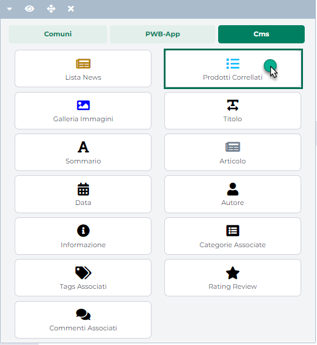
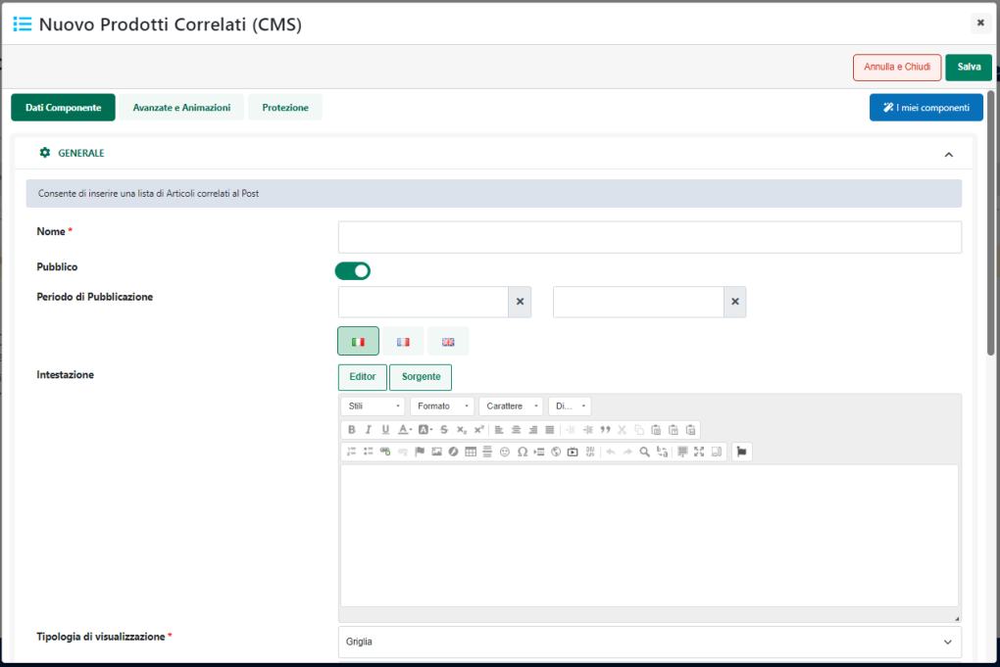
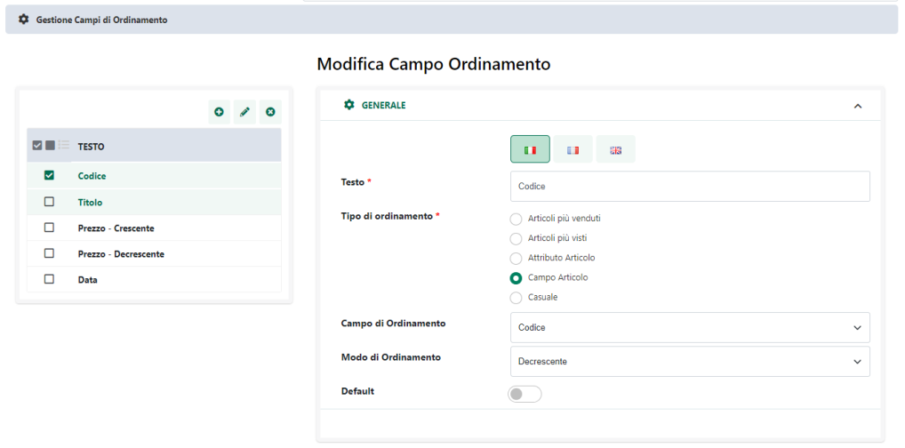
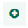
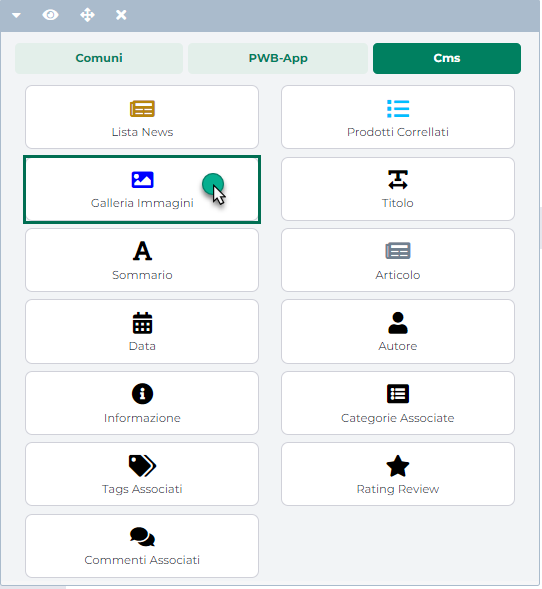

# MENU EDITING

Il Menu "**Editing**" attivabile cliccando sulla corrispondente icona
presente nella "Barra degli Strumenti del Live Editing"

o, in alternativa, sulla relativa voce del menu principale
( ) consente di accedere a tutte le
funzionalità di editing delle pagine del proprio sito web.

Nello specifico il pulsante.

**Gestione Pagine**: consente di accedere al menu di gestione delle
pagine del sito

All'interno del pulsante è visualizzato anche il nome e l'icona
rappresentativa della pagina attualmente visualizzata all'interno del
live Editing

**Gestione Protezione**: attivabile anche cliccando sulla corrispondente
icona presente nella "Barra degli Strumenti del Live Editing"

consente di accedere alla maschera di gestione delle Protezioni dei vari
componenti presenti all'interno del sito (protezioni sial lato Wizard
che lato Sito)

Per maggiori informazioni in merito alla gestione delle protezioni dei
componenti del proprio sito Passweb si rimanda alla corrispondente
sezione di questo manuale ("*Varianti Sito Responsive -- Gestione
Protezione*")

**Gestione Varianti** : consente di accedere al menu di gestione delle
Varianti Sito

All'interno del pulsante è visualizzato anche il codice e l'icona
rappresentativa della Variante Sito nella quale si sta effettivamente
operando.

**Temi**: attivabile anche cliccando sulla corrispondente icona presente
nella "Barra degli Strumenti del Live Editing"

consente di visualizzare e/o modificare il Tema attualmente applicato al
sito oltre che di accedere alla relativa sezione di gestione dei Temi.

Cliccando su uno dei pulsanti indicati verrà infatti visualizzato un
ulteriore box all'interno del quale il campo:

- **Tema Selezionato**: consente di visualizzare e/o modificare
  selezionandolo dall'apposito menu a tendina il Tema attualmente
  applicato al sito

- **Gestisci Temi**: consente, se cliccato, di accedere alla sezione di
  creazione e gestione dei Temi.

Per maggiori informazioni in merito alla gestione dei Temi del proprio
sito Passweb si rimanda alla corrispondente sezione di questo manuale
("*Live Editing per Varianti Responsive -- Temi*")

**Gestione Layout**: consente di accedere al menu di gestione dei Layout
applicabili alle varie pagine del sito

All'interno del pulsante è visualizzato anche il codice e l'icona
rappresentativa della Layout associato alla pagina in cui si sta
effettivamente operando.

**Cambia lingua** : consente di cambiare la lingua di visualizzazione
del sito utilizzata all'interno del live Editing.

Cliccando su questo pulsante verrà infatti visualizzato, immediatamente
a fianco del menu di Editing, un ulteriore box contenente una select box
con l'elenco delle lingue attivate per il proprio sito.

Grazie a questo pulsante sarà quindi possibile, ad esempio, caricare
all'interno del Wizard la versione del sito in lingua inglese

**Classi Responsive**: attivabile anche cliccando sulla corrispondente
icona presente nella "Barra degli Strumenti del Live Editing"

consente di visualizzare all'interno del Wizard, **indipendentemente da
quella che è l'attuale dimensione della finestra del browser**, quei
componenti che, in base alle loro impostazioni, dovrebbero essere invece
visibili solo in corrispondenza di certe risoluzioni.

Cliccando su questo pulsante verrà infatti visualizzato, immediatamente
a fianco del menu di Editing, un ulteriore box mediante il quale poter
decidere di visualizzare, flaggando l'apposito check, i componenti che
normalmente dovrebbero essere visibili solo per

- Risoluzioni minori o uguali a 576px

- Risoluzioni minori di 768 px

- Risoluzioni minori di 992 px

- ...

**Contenitori** : consente di attivare la modalità di gestione dei
Contenitori strutturali del sito.

Per maggiori informazioni in merito alla gestione dei Contenitori del
sito si vedano i successivi capitoli di questo manuale

**Componenti**: consente di attivare la modalità di gestione dei
Componenti presenti all'interno della pagina web. Una volta attivata
tale modalità di gestione sarà sufficiente selezionare, direttamente
all'interno della pagina web piuttosto che dall'albero dei componenti,
l'elemento che si intende editare e cliccare sull'icona del R.O.C
(Riquadro Opzioni Componente) corrispondente all'azione che si vuol
eseguire (Configurazione del componente, Editing Grafico ...)

Per maggiori informazioni relativamente alla gestione dei componenti
Passweb si veda anche il corrispondente capitolo di questo manuale
("*Live Editing per Varianti Responsive -- Componenti -- Modifica
Componenti*").

Per maggiori informazioni sui parametri di configurazione di uno
specifico componente si rimanda invece alla sezione del manuale relativa
al componente stesso.

**Nuovo Componente**: consente di abilitare la modalità di aggiunta di
nuovi componenti attivando la libreria di componenti all'interno della
quale poter selezionare lo specifico elemento da inserire nella pagina
web

Per maggiori informazioni relativamente alla modalità di inserimento
nuovi componenti all'interno della pagina web si rimanda al relativo
capitolo di questo manuale ("*Live Editing per Varianti Responsive --
Componenti -- Inserimento e gestione di un componente*")

**Genera HTML**: consente di eseguire manualmente la procedura mediante
cui poter rigenerare il codice HTML di tutti i componenti statici
presenti all'interno del sito.

**ATTENZIONE!** la procedura di rigenerazione del codice HTML per tutti
i componenti statici del sito viene eseguita anche automaticamente al
termine di ogni sincronizzazione sito -- gestionale (sia per variati che
totale)

Per maggiori informazioni relativamente alla possibilità di staticizzare
dei componenti si veda anche quanto indicato all'interno del capitolo
"*Varianti Sito Responsive -- Configurazione Componenti Caratteristiche
generali -- Staticizzazione e caricamento asincrono dei componenti*" di
questo manuale

**Passweb App**: consente di accedere al menu di configurazione dell'app
mobile collegata al proprio sito Passweb

**ATTENZIONE! Per poter accedere al menu di configurazione dell'app
mobile è necessario aver attivato prima il relativo modulo**

**Mostra Componenti solo web**: disponibile solo nel caso in cui sia
stato attivato il modulo di gestione dell'App mobile e la pagina in
esame sia stata impostata come visibile tanto per il Sito quanto per
l'App

Consente di visualizzare, tra quelli presenti all'interno della pagina
in esame, i componenti destinati al sito web.

Cliccando su questo pulsante verranno quindi visualizzati, all'interno
della pagina, tutti i componenti per i quali il parametro "**Visibilità
App**", presente nella sezione "**Avanzate e Animazioni**" della loro
maschera di configurazione, è stato impostato su uno dei seguenti
valori:

- **Solo sito**

- **Sia Sito che App**

**Mostra Componenti solo app**: disponibile solo nel caso in cui sia
stato attivato il modulo di gestione dell'App mobile e la pagina in
esame sia stata impostata come visibile tanto per il Sito quanto per
l'App

Consente di visualizzare, tra quelli presenti all'interno della pagina
in esame, i componenti destinati all'App mobile.

Cliccando su questo pulsante verranno quindi visualizzati, all'interno
della pagina, tutti i componenti per i quali il parametro "**Visibilità
App**", presente nella sezione "**Avanzate e Animazioni**" della loro
maschera di configurazione, è stato impostato su uno dei seguenti
valori:

- **Solo App**

- **Sia Sito che App**

**ATTENZIONE**! Le impostazioni di visualizzazione settate mediante i
pulsanti "**Mostra i componenti solo web**" e "**Mostra i componenti
solo App**" hanno effetto unicamente all'interno del Wizard e risultano
particolarmente utili nel momento in cui l'esigenza dovesse essere
quella di editare i contenuti di una pagina "mista" (visibile cioè sia
per il Sito che per l'App) in relazione però al solo sito web o alla
sola app mobile.

Nel momento in cui l'esigenza dovesse essere, ad esempio, quella di
editare in una pagina "mista" i soli contenuti destinati all'App,
sarebbe infatti sufficiente deselezionare il pulsante "Mostra i
componenti solo web" e selezionare il pulsante "Mostra i componenti solo
App" in maniera tale da visualizzare all'interno della pagina i soli
componenti destinati effettivamente all'App mobile.

**ATTENZIONE!** Per maggiori informazioni relativamente alla gestione
dell'App mobile collegata al proprio sito Passweb si veda anche il
relativo capitolo di questo manuale ("*App Mobile e Progressive Web
App*")

I piccoli pulsanti presenti invece nella parte alta del menu di Editing
consentono rispettivamente di:

**Chiudi**
( ): consente di chiudere il menu di
Editing

**Opacità**
( ): consente di abbassare l'opacità del
menu di editing lasciando quindi intravedere gli elementi della pagina
web posizionati al di sotto di esso

**Manuale**
( ): consente di accedere alla
manualistica on line disponibile all'interno dell'apposita sezione del
portale di formazione Passepartout
([www.edupass.it](http://www.edupass.it))

**Profilo**
( ): consente di accedere ai parametri di
configurazione relativi al proprio account utente

**Logout**
( ): consente di effettuare il logout
dall'ambiente di sviluppo del sito

**Visualizzazione Desktop**
( ): consente di attivare la
visualizzazione del sito in modalità Desktop dando quindi l'idea di come
verrà effettivamente visualizzata la pagina web sul browser di un
normale pc.

**ATTENZIONE! La visualizzazione Desktop è quella attiva di default ed è
l'unica in cui è possibile effettuare realmente l'editing del sito**. In
tutte le altre modalità di visualizzazione (Tablet, Smartphone o
Personalizzata) l'editing del sito è bloccato e non è quindi possibile
effettuare operazioni di aggiunta componenti e/o editing di componenti
presenti nella pagina.

**Visualizzazione Tablet**
( ): consente di attivare la
visualizzazione del sito in modalità Tablet dando quindi l'idea di come
verrà effettivamente visualizzata la pagina web all'interno di questo
tipo di dispositivi.

**ATTENZIONE!** In questo tipo di visualizzazione non è possibile
effettuare operazioni di editing della pagina web.

**Visualizzazione Smartphone**
( ): ): consente di attivare la
visualizzazione del sito in modalità Smartphone dando quindi l'idea di
come verrà effettivamente visualizzata la pagina web all'interno di
questo tipo di dispositivi

**ATTENZIONE!** In questo tipo di visualizzazione non è possibile
effettuare operazioni di editing della pagina web.

**Visualizzazione Personalizzata**
( ):consente impostare una specifica
dimensione dello schermo in maniera tale da potersi rendere conto di
come verrà effettivamente visualizzata la pagina web all'interno di un
dispositivo caratterizzato esattamente dalle dimensioni indicate.

**ATTENZIONE!** In questo tipo di visualizzazione non è possibile
effettuare operazioni di editing della pagina web.

**Cambia Orientamento**
( ): attivo solo per visualizzazione
Tablet, Smartphone o Personalizzate. Consente di cambiare l'orientamento
del dispositivo per verificare come verrà visualizzata la pagina web
passando da un orientamento all'altro.

