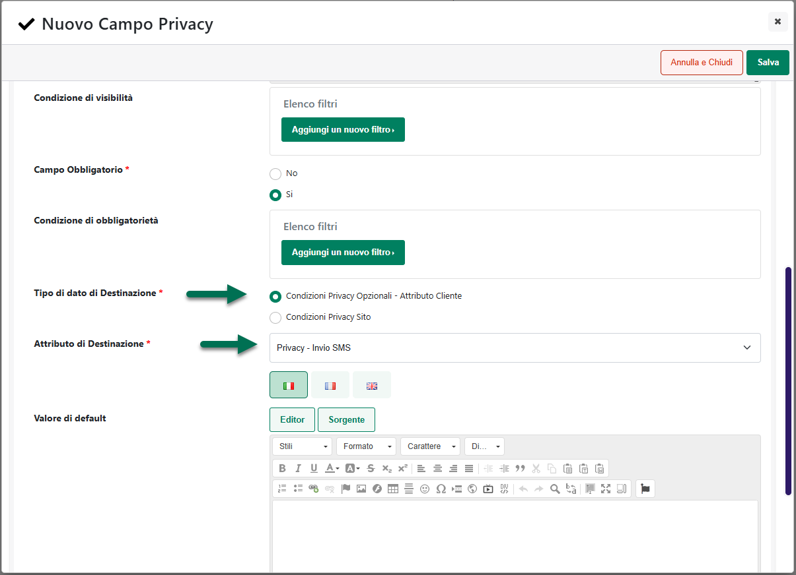

# GESTIONE RISORSE DEL SITO

Passweb offre la possibilità di gestire ed utilizzare all'interno del
proprio sito risorse grafiche di diverso tipo:

- **Immagini:** è possibile importare all'interno del database, e
  conseguentemente utilizzare all'interno del proprio sito web, immagini
  in formato jpg, .jpeg, .png, .bmp, .wmf, gif;

- **Audio:** audio in formato .mid, .midi, .wav, .mp3;

- **Video:** filmati in formato .avi ,.wmv;

- **Documenti:** documenti in formato .doc, .txt ,.pdf, .xls, .ppt,
  ecc...;

- **File Compressi:** file compressi in formato .zip, .rar.

In questo senso la sezione "**Gestione Risorse del Sito**" (accessibile
dalla relativa voce del menu "Sito") consente di visualizzare tutte le
risorse grafiche attualmente utilizzate all'interno del sito, sostituire
tali risorse e/o aggiungerne di nuove.

La pagina è suddivisa in due distinte sezioni: nella sezione di sinistra
vengono visualizzate le cartelle, organizzate su una struttura ad
albero, e create per poter raggruppare logicamente le proprie risorse.

I pulsanti presenti nella contestuale barra degli strumenti consentono
rispettivamente di:

**Crea Cartella** ( ): consente di creare una nuova cartella

Per creare una nuova cartella, all'interno della quale poter poi
caricare le proprie risorse, occorre selezionare, per prima cosa, la
cartella "Resources" e cliccare poi sul pulsante "**Crea Cartella**". In
questo modo verrà visualizzata, come evidenziato in figura, un'ulteriore
sezione "Nuova Cartella"

Sarà quindi sufficiente dare un nome alla cartella che si sta creando e
cliccare poi sul pulsante **"Conferma"**.

**Elimina Cartella** ( ): consente di eliminare la cartella attualmente
selezionata.

**NOTA BENE**: eliminando una cartella verranno eliminate
automaticamente anche tutte le eventuali risorse in essa contenute.

**Scarica** ( ): consente di effettuare il download della cartella
selezionata e di tutte le risorse grafiche in essa contenute

Una volta selezionata una cartella, nella parte destra della pagina
verrà poi visualizzato l'elenco delle risorse presenti all'interno della
cartella stessa.

I pulsanti presenti nella contestuale barra degli strumenti consentono
rispettivamente di:

**Pubblica un File**( ): consente di caricare una nuova risorsa da poter
poi utilizzare all'interno delle pagine del proprio sito. Per maggiori
informazioni relativamente a come effettuare questo tipo di operazioni
si veda anche il successivo capitolo di questo manuale

**Elimina** ( ): consente di eliminare dal sito la risorsa attualmente
selezionata in elenco

**Scarica** ( ): consente di effettuare il download della risorsa
attualmente selezionato in elenco

**Preview** ( ) / **Tabellare**( ): consente di impostare la modalità di
visualizzazione delle varie risorse presenti all'interno di una
cartella.

In modalità "Tabellare", verrà visualizzato un semplice elenco delle
risorse presenti all'interno della cartella attualmente selezionata.

In queste condizioni per i file di tipo immagine, passando col cursore
sopra il nome della risorsa, verrà visualizzata un' anteprima
ridimensionata della relativa risorsa

**NOTA BENE**: l'icona visualizzata a fianco di ogni singola risorsa,
consente di accedere alle proprietà del relativo file, permettendo
dunque all'utente di visualizzare, relativamente ai file di tipo
immagine, le reali dimensioni della risorsa selezionata.

In modalità "**Preview**" o "**Grafica**", comunque la si voglia
chiamare, per le risorse di tipo immagine verranno visualizzate
immediatamente le relative anteprime. Per ogni singola risorsa verranno
inoltre indicate le dimensioni ed il peso della risorsa stessa.

**NOTA BENE**: è possibile impostare il tipo di visualizzazione (Preview
o Tabellare) da utilizzare a default all'interno di questa sezione del
sito agendo per questo sul corrispondente campo ("Visualizzazione
Gestione Risorse") presente all'interno della sezione "Profilo Utente"
del Wizard.

Il pannello Ricerca presente nella parte alta della maschera consente di
ricercare una specifica risorsa tra quelle attualmente presenti
all'interno del sito.

Dopo aver indicato il nome della risorsa (o parte di esso) da cercare,
cliccando sul pulsante "Cerca" verrà aperta una piccola finestra
contenente i risultati della ricerca effettuata.

Cliccando sul nome di una delle risorse che soddisfano il filtro
impostato, verrà chiusa la finestrella dei risultati e verrà
automaticamente selezionata la relativa risorsa.

