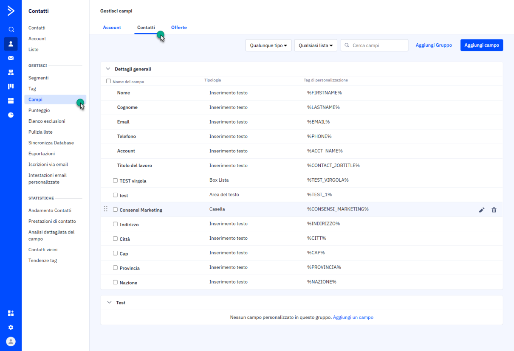

# INCLUSIONI NELLA PAGINA

All'interno di questa sezione è possibile decidere di includere nel
layout in esame:

- specifici fogli di stile (file .CSS)

- specifiche librerie javascript (file .js)

- determinati Google Font

tutti elementi questi che potranno determinare in maniera più o meno
evidente l'aspetto grafico ed il funzionamento delle pagine che andranno
ad adottare questo specifico layout.

Per includere all'interno del layout in esame una specifica risorsa è
necessario cliccare sul pulsante "**Nuova Inclusione**"
 presente nella contestuale barra degli
strumenti.

In questo modo verrà infatti aperta la maschera "**Nuova Inclusione**"

attraverso cui poter indicare, per prima cosa, il tipo di risorsa che si
desidera includere nel layout (campo **"Tipo Inclusione"**). E'
possibile selezionare uno dei seguenti valori:

- **Foglio di stile**: consente di includere nel layout in esame uno
  specifico foglio di stile (file .css) selezionandolo direttamente
  dalla sezione "Gestione Risorse" del sito (pulsante **Seleziona la
  Risorsa**)

- **Javascript**: consente di includere nel layout in esame una
  specifica libreria javascript (file .js) selezionandola direttamente,
  anche in questo caso dalla sezione "Gestione Risorse" del sito
  (pulsante **Seleziona la Risorsa**)

> **NOTA BENE:** l'inclusione di un file .CSS o di un file .js
> determina, a livello di codice, la creazione di due diverse
> istruzioni. Al fine di poter garantire il corretto funzionamento di
> queste inclusioni è quindi indispensabile far corrispondere
> esattamente la risorsa che si desidera includere con il "Tipo di
> inclusione" selezionato.

- **Google Font**: consente di includere nel layout in esame uno
  specifico Font messo a disposizione direttamente da Google e
  selezionabile dal relativo menu a tendina (campo "**Google Font**")

> Per maggiori informazioni relativamente all'utilizzo dei Google Font
> si veda anche il relativo capitolo di questo manuale (*"Live Editing
> -- Layout -- Google Font"*)

Una volta selezionata la risorsa desiderata, sarà necessario cliccare
sul pulsante "**Salva**" presente nella parte bassa della maschera per
confermare l'inclusione del file all'interno del layout e tornare così
alla precedente maschera di definizione delle caratteristiche
strutturali del layout stesso.

Gli altri pulsanti presenti nella barra degli strumenti consentono
rispettivamente di:

- **Modifica** **Inclusione:** consente di modificare le caratteristiche
  dell'inclusione attualmente selezionata in elenco

- **Elimina** **Inclusione:** consentono di eliminare l'inclusione della
  risorsa attualmente selezionata in elenco.

- **Sposta Inclusione Giù \\ Su:** consente di spostare verso l'alto \\
  basso la risorsa attualmente selezionata in elenco

> **NOTA BENE:** il fatto di spostare verso l'alto o verso il basso un
> determinato file incluso nel layout, determinata il caricamento di
> questo stesso file prima o dopo eventuali altri file inclusi layout
> stesso. **L'ordine di inclusione può incidere in maniera significativa
> sulle specifiche di funzionamento della particolare libreria
> javascript e/o del particolare foglio di stile considerato**.

In merito all'ordine di inclusione dei file .js o dei file .css è poi
necessario ricordare che, alle due diverse tipologie di risorse, sono
riservate due sezioni specifiche all'interno del codice HTML della
pagina generato da Passweb, per cui sarà sempre possibile riordinare tra
loro i file di tipo css e tra loro quelli di tipo js.

Non sarà invece mai possibile spostare un file .js nella sezione
riservata ai file .css e viceversa.

**ATTENZIONE! Nel caso in cui sia stato indicato un layout sia a livello
di Variante che a livello di singola Pagina le inclusioni definite sul
layout di Pagina andranno a sommarsi a quelle eventualmente definiti a
livello di Variante.**

In particolare, nel codice HTML della pagina web verranno inserite prima
le inclusioni definite sul layout associato alla Variante Sito, e poi
quelle definite sul layout associato alla specifica pagina web

**UTENTI ESPERTI:**

Nel caso in cui si decida di utilizzare determinate librerie javascript,
al fine di evitare conflitti nell'utilizzo delle funzioni delle librerie
stesse, occorre prestare particolare attenzione all'ordine di
inclusione, determinato dall'ordine di inserimento nel layout di queste
stesse librerie (oltre al fatto, ovviamente, che queste librerie non
vadano in conflitto tra di loro per loro stessa natura).

Va ricordato inoltre che nelle Varianti Responsive sono incluse a
default le seguenti librerie javascript che possono quindi essere
utilizzate senza dover essere incluse in maniera esplicita:

- jquery

- jquery - ui

- jquery.coockie.js

- jquery.jscroller-0.4.js

- jquery -- jgrowl

- popper.js

- bootstrap.js

- resCarousel.js

- smootScroll.js

- slick.js

**Nel caso in cui si desideri utilizzare le funzioni già incluse
all'interno di queste librerie (ampiamente documentate in rete sui siti
dei relativi produttori) non sarà necessario effettuare una nuova
inclusione di queste stesse librerie, che, anzi, andrebbero a
sovrascrivere quelle attualmente utilizzate da Passweb, rischiando così
di compromettere il corretto funzionamento di alcuni componenti del
sito**.

Tali funzioni potranno quindi essere richiamate direttamente (senza il
bisogno di ulteriori inclusioni), utilizzando ovviamente la corretta
sintassi, ad esempio all'interno della sezione "Inserimento Javascript
(su tag \<script\>)" del layout applicato alla pagina oppure all'interno
di appositi componenti HTML.

