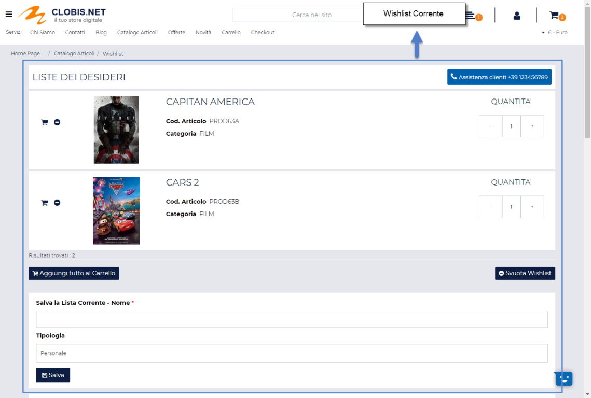
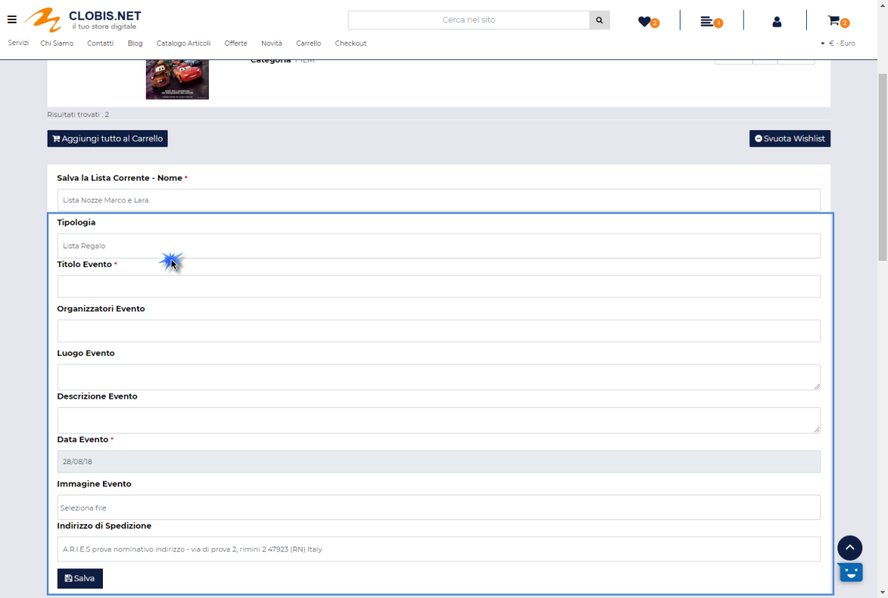

# GRAFICA

L'icona "**Grafica**" (
 ) presente nel R.O.C. del componente e/o
nella barra degli strumenti dell' Albero dei Componenti consente di
accedere all'Editing Grafico del componente.

Cliccando su questo pulsante verrà infatti visualizzato lo **Style
Editor** mediante il quale poter variare le caratteristiche grafiche del
componente selezionato

Per maggiori in merito alla personalizzazione grafica dei vari
componenti e al relativo utilizzo dello Style Editor si rimanda allo
specifico capitolo di questo manuale ("*Live Editing per Varianti
Responsive -- Style Editor (Editing Grafico)*").

