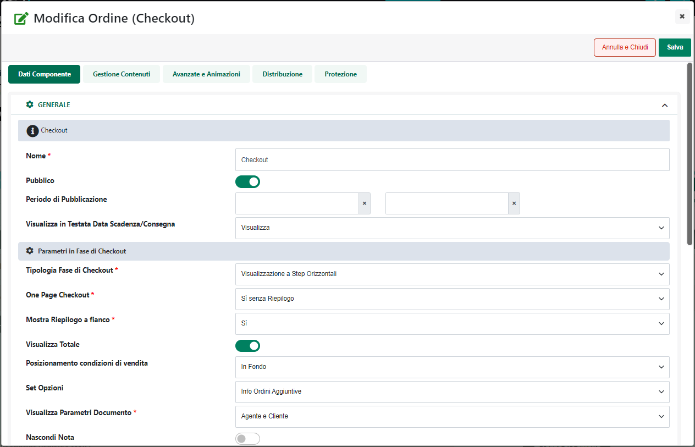
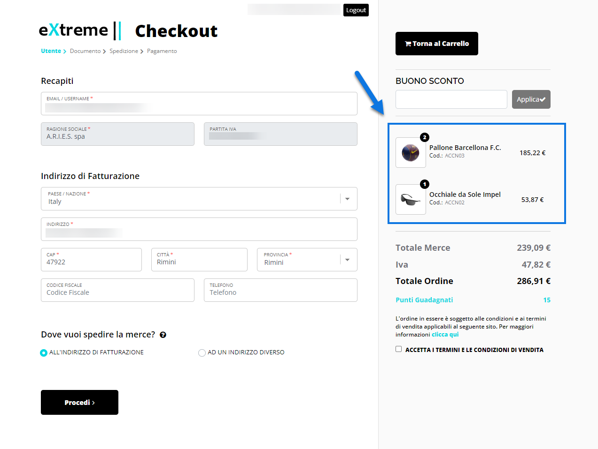
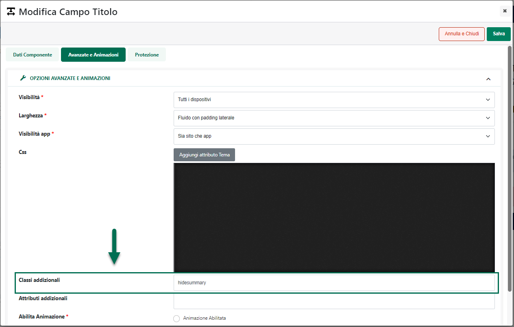
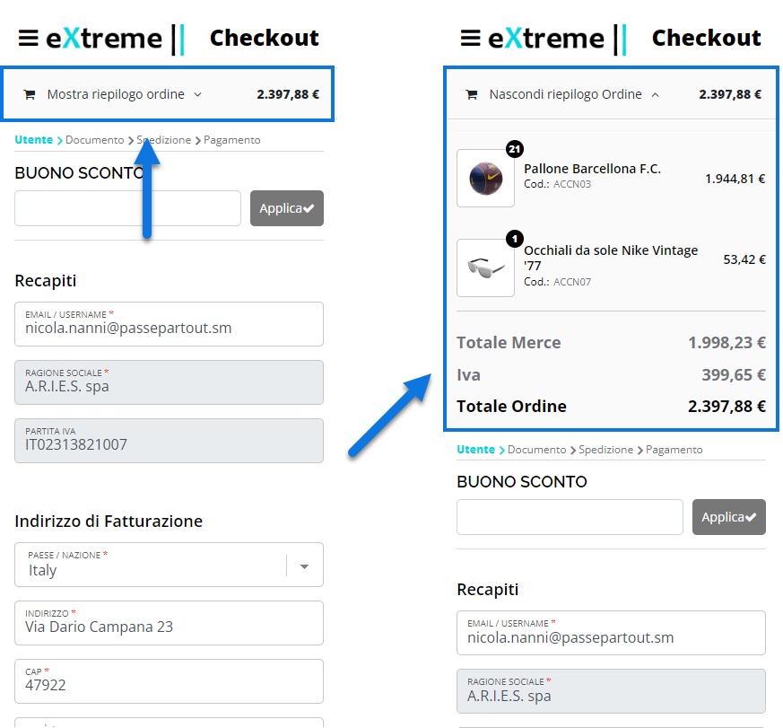

# INSERIMENTO DI CODICE HTML

Le due linguette presenti nella parte alta dell'editor di testi
denominate rispettivamente "**Editor**" e "**Sorgente**"

{width="2.828472222222222in"
height="2.092361111111111in"}

consentono di passare da una modalità guidata di inserimento testi,
utilizzando in questo senso un ambiente visuale in tutto e per tutto
simile ad un comune editor di testi (pulsante **Editor**) ad una
modalità di inserimento dei contenuti a livello di codice HTML (pulsante
**Sorgente**)

{width="2.779166666666667in"
height="1.675in"}

Ovviamente abilitando la modalità di inserimento dei contenuti a livello
di codice HTML si hanno a disposizione tutte le possibilità offerte da
un comune editor di codice arrivando quindi a poter gestire anche
elementi o tag HTML non direttamente gestiti in modalità visuale.

**ATTENZIONE!!: per poter utilizzare l'editor a livello di codice HTML
sono richieste specifiche competenze. Se ne consiglia quindi l'utilizzo
a soli utenti esperti.**

Passando alla modalità "Sorgente" saranno poi disponibili i seguenti
tasti funzione:

- **Ctrl + F / Cmd + F** Consente di abilitare la funzione di ricerca
  all'interno dell'editor di codice HTML, attivando il relativo campo di
  testo

{width="5.177777777777778in"
height="2.8222222222222224in"}

- **Ctrl + G / Cmd + G**: Consente, una volta effettuata una specifica
  ricerca all'interno dell'editor di codice HTML, di attivare la
  funzione "**Passa al successivo**"

- **Shift + Ctrl + G / Shift + Cmd + G** : Consente, una volta
  effettuata una specifica ricerca all'interno dell'editor di codice
  HTML, di attivare la funzione "**Passa al precedente**"

- **Shift + Ctrl + F / Cmd + Option + F**: Consente di attivare la
  funzione di "**Cerca e sostituisci**".

> Utilizzando questa combinazione di tasti verrà quindi visualizzato un
> primo campo di input in cui inserire il testo da ricercare (campo
> "Replace")

{width="5.177777777777778in"
height="2.8222222222222224in"}

> Una volta inserito il testo desiderato sarà necessario premere il
> tasto "Invio" in maniera tale da visualizzare un nuovo campo di input
> (campo "With") in cui inserire il nuovo testo che dovrà essere
> sostituito a quello precedentemente ricercato.

{width="5.177777777777778in"
height="2.8222222222222224in"}

> Infine premendo nuovamente il taso invio verranno visualizzate tutte
> le possibili opzioni di sostituzione

{width="5.177777777777778in"
height="2.8222222222222224in"}

- **Shift + Ctrl + R / Shift + Cmd + Option + F** : Consente di attivare
  la funzione di "**Cerca e sostituisci tutto**".

- **Alt + F**: Consente di attivare la funzione di ricerca
  "persistente".

> In queste condizioni nel caso in cui il testo ricercato dovesse
> presentare più occorrenze sarà possibile passare all'elemento
> successivo / precedente utilizzando rispettivamente i tasti
> "**Invio**" e "**Shift + Invio**"

- **Alt + G**: Consente di attivare la funzione "**Vai alla linea**".

> Utilizzando questa combinazione di tasti verrà quindi visualizzato un
> campo di input in cui inserire il numero di riga (ed eventualmente
> anche quello di colonna) in corrispondenza del quale spostare il
> cursore

