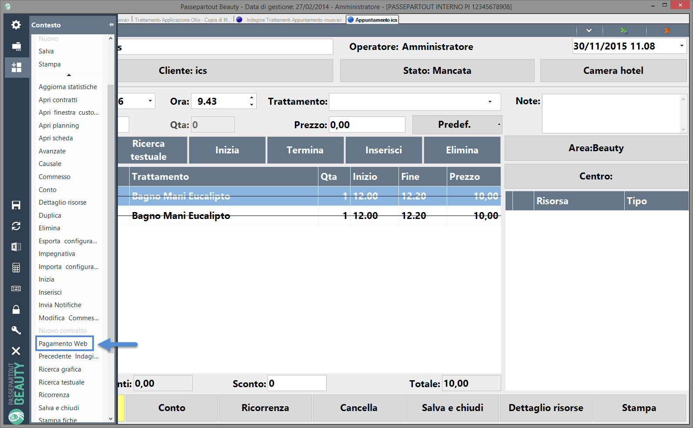

# CREAZIONE DI UN NUOVO TEMA

Una volta definiti tutti gli Attributi di Default e utilizzato questi
stessi Attributi all'interno del sito, come descritto nei precedenti
capitoli di questo manuale, il passo successivo è quello che prevede di
creare dei nuovi Temi nei quali assegnare ai relativi Attributi un
valore diverso da quello di default.

Per fare questo è necessario accedere alla maschera di "Gestione Temi"
precedentemente analizzata e cliccare sul pulsante "**Temi**" in maniera
tale da poter visualizzare e gestire tutti i Temi creati per il sito in
oggetto

dove sarà possibile visualizzare e gestire tutti i Temi creati per il
sito in oggetto.

I pulsanti presenti nella contestuale barra degli strumenti
consentiranno rispettivamente di:

**Nuovo Tema** (
 ): consente di creare un nuovo Tema.

Cliccando su questo pulsante verrà infatti visualizzata la maschera
"**Nuovo Tema**"

all'interno della quale poter assegnare un Nome al Tema (campo "**Nome
Tema**").

Andando poi in modifica del tema appena creato sarà possibile associare
a ciascuno degli Attributi precedentemente definiti uno valore
(teoricamente diverso da quello di default) specifico per il Tema che si
sta realizzando e che verrà effettivamente applicato solo ed
esclusivamente nel momento in cui si dovesse decidere di impostare
questo stesso Tema come Tema corrente del sito

**ATTENZIONE! Ogni nuovo Tema contiene ovviamente tutti gli Attributi
inizialmente definiti con il loro valore di Default.**

Una volta impostato un valore per tutti gli Attributi in elenco il
pulsante "Inserisci" presente nella parte bassa della maschera consente
di Salvare il Tema rendendolo quindi effettivamente utilizzabile
all'interno del sito.

**Elimina Tema** (
 ): consente di eliminare il Tema
attualmente selezionato in elenco.

**Modifica Tema** (
 ): consente di modificare il Tema
attualmente selezionato in elenco. E' possibile variare tanto il Nome
del Tema quanto i valori associati a d ogni singolo Attributo.

**Duplica Tema** (
 ): consente di duplicare il Tema
attualmente selezionato in elenco

**Applica Tema** (
 ): consente di applicare al sito il Tema
attualmente selezionato in elenco

