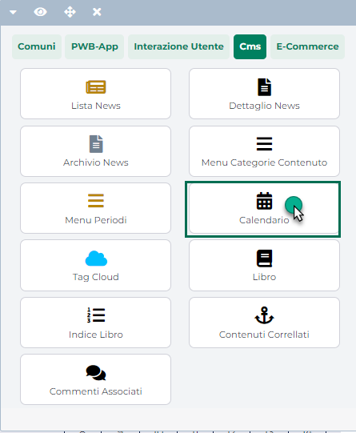

# GENERAZIONE PAGINE DI CATEGORIA

La sezione "**Generazione Pagine di Categoria**" consente, come
precedentemente evidenziato, di indicare sulla base di quale pagina
dovranno essere create eventuali nuove Pagine Catalogo e/o Prodotto
generate a seguito della creazione, all'interno del gestionale, di
**nuove** categorie merceologiche

{width="5.111805555555556in"
height="3.127083333333333in"}

