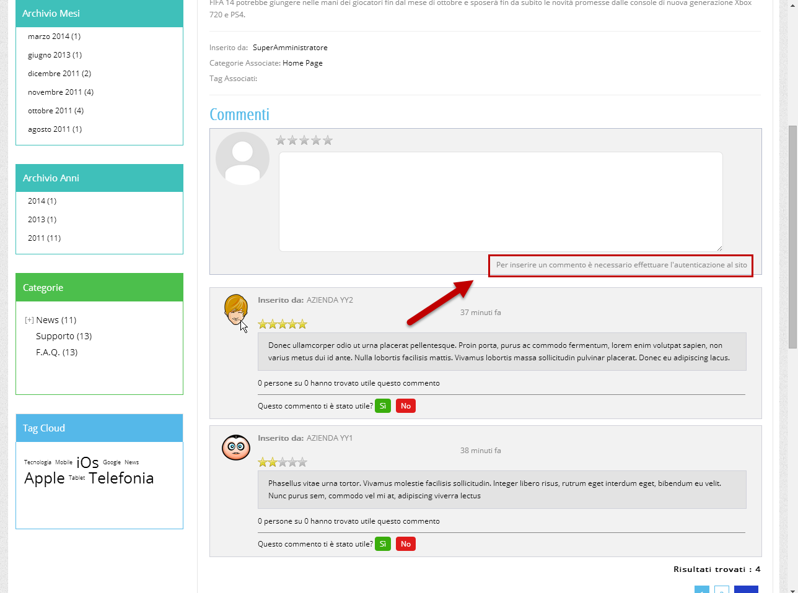
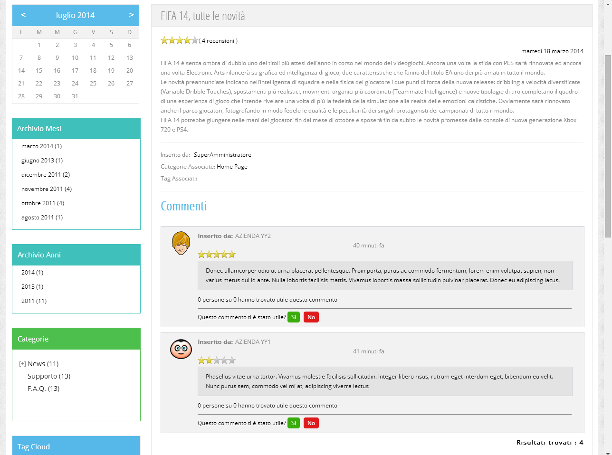
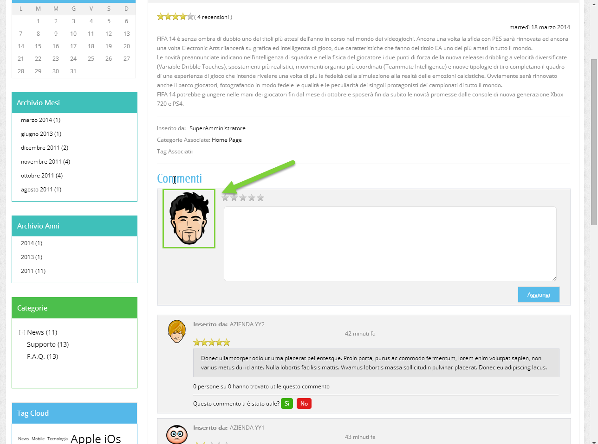
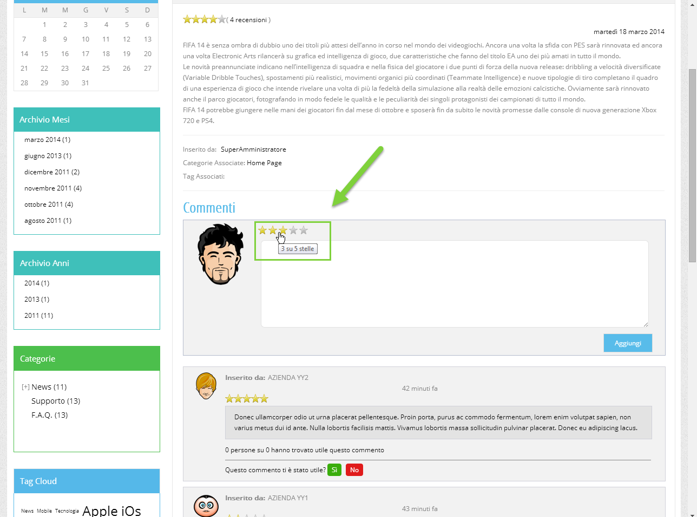

# UTILIZZO DEL WIDGET ACCESSIBILITA'

Una volta attivato e configurato il Widget di Accessibilità secondo
quanto descritto nel precedente capitolo di questo manuale, su tutte le
pagine del sito comparirà, nella posizione indicata in fase di
configurazione (parametro "**Visualizzazione Pulsante Widget**"), un
pulsante del tipo di quello evidenziato in figura

mediante il quale poterlo richiamare

All'interno del Widget saranno poi disponibili le seguenti funzionalità:

- **Lingua:** consente di modificare la lingua del sito.

> Le lingue disponibili saranno, ovviamente, le stesse lingue
> attualmente attive sul front end del sito.
>
> Cambiando la lingua verrà ricaricato il sito e, in conseguenza di ciò,
> anche i testi del Widget verranno poi visualizzati nella lingua
> selezionata.
>
> **ATTENZIONE!** i testi del Widget possono essere personalizzati, in
> tutte le lingue gestite, operando all'interno della sezione
> "**Testi/Messaggi del Sito -- Testi Generici**" del Wizard
> selezionando, nello specifico, l'elemento "**Widget Accessibilità**"

- **Selezione Profilo:** consente di attivare automaticamente un'
  insieme di funzionalità specifiche per la tipologia di disabilità
  selezionata

> Nello specifico il profilo:
>
> **Cieco**: consente di abilitare la funzionalità:

- Sintesi Vocale

> **Disabilità Motorie**: consente di abilitare le funzionalità:

- Stop Animazioni

- Lente di Ingrandimento

> **Dislessia**: consente di abilitare le funzionalità:

- Carattere Dislessia

- Stop Animazioni

> **Ipovedente**: consente di abilitare le funzionalità:

- Stop Animazioni

- Font Leggibile

- Cursore Grande Bianco

- Alta Saturazione

- Dimensione del Font aumentata

> **Disabilità Cognitive**: consente di abilitare le funzionalità:

- Stop Animazioni

- Evidenzia Link

> **Epilettici/Convulsioni**: consente di abilitare le funzionalità:

- Stop Animazioni

- Bassa Saturazione

> **ADHD**: consente di abilitare le funzionalità:

- Stop Animazioni

- Bassa Saturazione

- Maschera di Lettura

I pulsanti presenti all'interno della sezione "**Regolazione dei
contenuti**" consentiranno invece di:

- **Dimensione del Font**: consente di aumentare o diminuire la
  dimensione del font (font-size) con uno step di 1px. Il pulsante
  centrale permette di resettare l\'impostazione per tornare ai valori
  di default.

- **Altezza della linea**: consente di aumentare o diminuire l'altezza
  della linea (line-height) con uno step di 1px. Il pulsante centrale
  permette di resettare l\'impostazione per tornare ai valori di
  default.

- **Spaziatura** carattere: consente di aumentare o diminuire la
  spaziatura tra i caratteri (letter-spacing) con uno step di 1px. Il
  pulsante centrale permette di resettare l\'impostazione per tornare ai
  valori di default.

- **Allinea a Sinistra / Centro / Destra:** consente di allineare il
  testo a sinistra/centro/destra (posto che il contenitore del relativo
  testo abbia spazio a sufficienza)

- **Evidenzia Link**: consente di evidenziare i link presenti nella
  pagina

- **Font Leggibile**: imposta il font-family a "Arial, Helvetica,
  sans-serif"

- **Carattere Dislessia**: imposta il font-family su "dyslexic,
  sans-serif".

La sezione "**Regolazione del colore**" consente di impostare:

- **Contrasto Elevato**: imposta un contrasto al 135%.

- **Contrasto Chiaro**: imposta un background bianco con un colore del
  testo nero su tutti i tag che contengono del testo.

- **Contrasto Scuro**: imposta un background quasi nero con un colore
  del testo bianco su tutti i tag che contengono del testo.

- **Colore Sfondo**: consente di modificare il colore di sfondo
  (background-color) di tutti i tag che contengono del testo.

- **Colore Testo**: consente di modificare il colore del testo (color)
  di tutti i tag che contengono del testo.

- **Alta Saturazione**: imposta una saturazione del 200%.

- **Bassa Saturazione**: imposta una saturazione del 50%.

- **Monocromo**: imposta la scala di grigi.

- **Inverti Colori**: inverte i colori in pagina.

I pulsanti presenti all'interno della sezione "**Strumenti**" consentono
infine di:

- **Nascondi Immagini**: nasconde tutti i tag "img" impostando per essi
  la proprietà "visibility:hidden".

- **Stop Animazioni**: consente di

  - Stoppare le animazioni CSS impostando le proprietà "transition:
    none" e "animation-play-state: paused"

  - Mettere in pausa i video gestiti con HTML5

  - Mettere in pausa le animazioni SMIL inline dei tag "svg" settando
    per esse l'attributo "dur=0s*"*.

  - Sostituire le immagini GIF e APNG animate con il frame iniziale
    dell\'immagine convertito in base64.

  - Impostare, negli "iframe" relativi a video per l'attributo "src" le
    proprietà "enablejsapi=0", "autoplay=0", "loop=0" e rimuovere la
    proprietà "autoplay" dall\'attributo "allow"

- **Lettura Vocale**: consente di attivare/disattivare il lettore vocale
  (**è necessario che il browser supporti la sintesi vocale**).

> La lingua utilizzata dal sintetizzatore sarà ovviamente quella
> attualmente gestita dal sito.
>
> Una volta attivata la funzionalità sarà sufficiente cliccare su di un
> qualsiasi elemento testuale per avviarne la lettura (l'elemento su
> cliccato sarà poi evidenziato di giallo)
>
> Oltre al testo presente sul nodo, verranno anche considerati e letti
> anche i seguenti attributi: "alt", "title", "aria-label",
> "placeholder", "value".

- **Maschera di Lettura**: consente di mostrare una maschera sulla
  pagina per isolare una sezione in modo da migliorare la
  concentrazione.

- **Guida Lettura**: consente di mostrare una linea orizzontale
  (righello) che si sposta con il mouse per migliorare la lettura.

- **Lente di Ingrandimento**: consente di ingrandire il testo
  selezionato.

> Come per la lettura vocale anche in questo caso, dopo aver attivato la
> funzionalità, basterà portarsi con il mouse sui vari elementi testuali
> per mostrare una finestra con il testo ingrandito. Anche in questo
> caso, oltre al testo presente sul nodo, verranno considerati, oltre al
> testo, i seguenti attributi: "alt", "title", "aria-label",
> "placeholder" e "value"

- **Cursore Grande Bianco**: imposta il cursore come una grande freccia
  bianca.

- **Cursore Grande Nero**: imposta il cursore come una grande freccia
  nera.

- **Struttura della pagina**: visualizza una finestra modale con tre
  distinte tab:

  - **Intestazioni**: visualizza i tag h1, h2, h3, h4, h5, h6 presenti
    in pagina

  - **Sezioni**: visualizza i tag article, aside, details, figcaption,
    figure, footer, header, main, mark, nav, section, summary, time
    eventualmente presenti in pagina

  - **Collegamenti**: visualizza i tag a presenti in pagina

> Cliccando su uno degli elementi presenti all'interno di questi tab
> verrà effettuato lo scroll automatico della pagina fino al relativo
> elemento che verrà poi evidenziato per 3 secondi.
>
> Per i collegamenti è presente anche un pulsante che consente di aprire
> il relativo link in una nuova finestra

**ATTENZIONE!** le modifiche apportate alla pagina da parte del Widget
verranno salvate nella Local Storage del browser in maniera tale da
conservarle al cambio di pagina e anche da una sessione all'altra sullo
stesso browser. **In ogni caso non saranno, ovviamente, modifiche
salvate permanentemente sul database del sito** per cui svuotando la
Local Storage e/o cliccando sul pulsante "**Ripristina Impostazioni**"
presente nella parte bassa del Widget tutto tornerà ai valori di default

