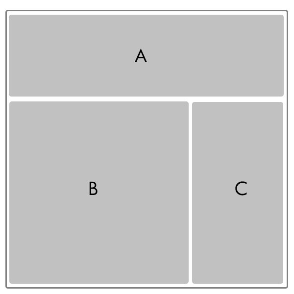
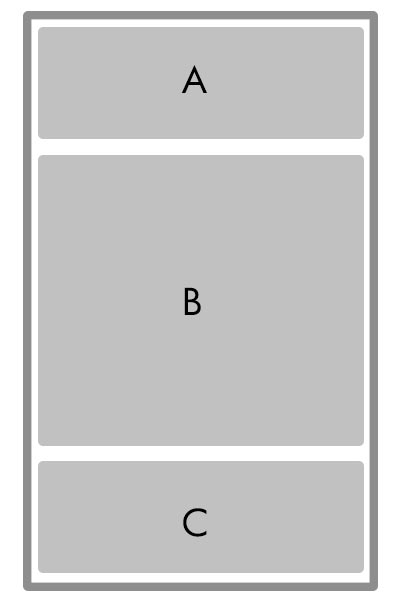
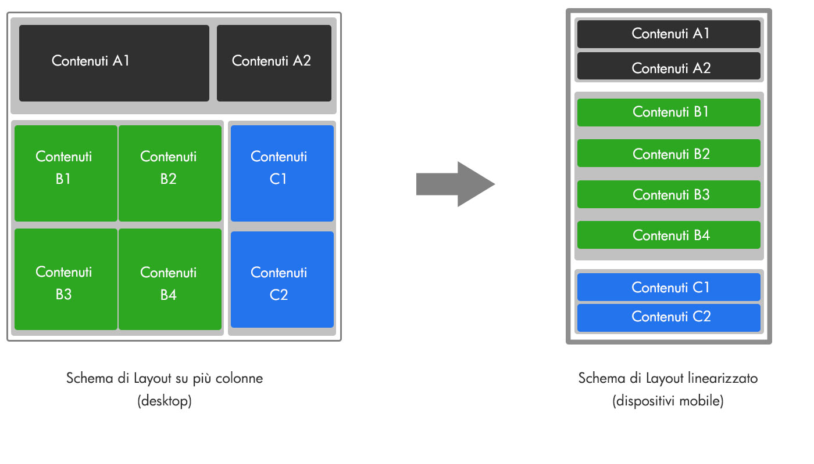

# LAYOUT FLUIDI E MISURE RELATIVE

Da quanto visto nei precedenti capitoli dovrebbe ormai essere abbastanza
chiaro che quando si parla di design per dispositivi mobili, il concetto
di pixel così come lo abbiamo sempre utilizzato assume sfaccettature
diverse e non rappresenta più quel caposaldo che abbiamo sempre
utilizzato nel mondo desktop.

Tra diverse dimensioni del viewport, pixel density, specifiche di ogni
dispositivo, mille risoluzioni e orientamenti diversi, pensare, al
giorno d'oggi, di realizzare un sito responsivo utilizzando, per i vari
elementi della pagina, dimensioni fisse in pixel diventa assolutamente
improponibile.

Per fortuna la soluzione a questo problema esiste, ed è anche abbastanza
semplice: **non usare le dimensioni in pixel ma ragionare in termini
percentuali.** Questo ci consente di adattare il layout a qualunque
risoluzione, facendo in modo che gli elementi della pagina si adattino
di conseguenza.

**ATTENZIONE!** **L'utilizzo delle sole dimensioni percentuali non
permette in alcun modo di realizzare un sito responsivo**.

Il valore di queste dimensioni potrebbe comunque dover essere variato a
seconda del fatto che la pagina web venga visualizzata su schermi di
grandi, medie o piccole dimensioni.

Indipendentemente dal fatto di utilizzare l'approccio "mobile first" o
quello tradizionale, utilizzando quindi le media query per riadattare il
layout del sito rispettivamente su schermi di grandi o di piccole
dimensioni, la cosa di fondamentale importanza da avere sempre ben
chiara in mente è come dovranno essere disposti i contenuti sugli
schermi di piccole dimensioni e quale dovrà essere quindi il layout da
utilizzare per ottenere questa disposizione.

In questo senso la parola d'ordine è **semplificare,** ottimizzando al
meglio il poco spazio a disposizione. Tradotto in codice per il layout
ciò significa che sui dispositivi mobili, la modalità ottimale è quella
della **linearizzazione degli elementi** che compongono la pagina. Nella
stragrande maggioranza dei casi dunque su schermi di piccole dimensioni,
il layout del sito dovrà avere un'unica colonna all'interno della quale
i vari blocchi di contenuto dovranno disporsi uno sotto l'altro.

Avendo ben chiaro questo concetto, potremmo anche implementare il nostro
sito utilizzando l'approccio tradizionale e creando quindi, per prima
cosa, la versione desktop che potrebbe avere un layout del tipo di
quello rappresentato in figura.

Nel fare questo però dovremo sempre avere ben presente l'obbiettivo
finale; i tre elementi A, B e C dovranno quindi avere dimensioni in
percentuale (es: A:100%, B:70%, C:30%), in maniera tale da potersi
adattare automaticamente alle diverse risoluzioni degli schermi desktop
e conseguentemente alle diverse possibili larghezze della pagina web.

Quando poi le dimensioni dello schermo del dispositivo di
visualizzazione diventeranno troppo piccole interverranno le apposite
media query (native di Passweb o scritte appositamente per la specifica
situazione) per variare la larghezza di questi elementi impostandola al
100% in modo tale da consentire ad ognuno di essi di occupare in
larghezza l'intera pagina disponendosi uno sotto l'altro come mostrato
nella figura di seguito riportata.

Lo stesso tipo di ragionamento dovrà essere utilizzato anche per gli
eventuali contenuti presenti all'interno dei contenitori A, B e C.

**ATTENZIONE!** Per poter creare un layout del tipo di quello
evidenziato in figura in una Variante Responsiva di Passweb sarà
sufficiente utilizzare, come avremo modo di vedere meglio nei successivi
capitoli di questo manuale, il componente "**Griglia**" senza doverci
dunque preoccupare di scrivere nessuna particolare media query.

**ATTENZIONE!** lo Stile Editor di Passweb consente di gestire
liberamente per ogni singolo componente e per ogni singolo contenuto del
componente stesso tanto dimensioni in pixel quanto in percentuale

