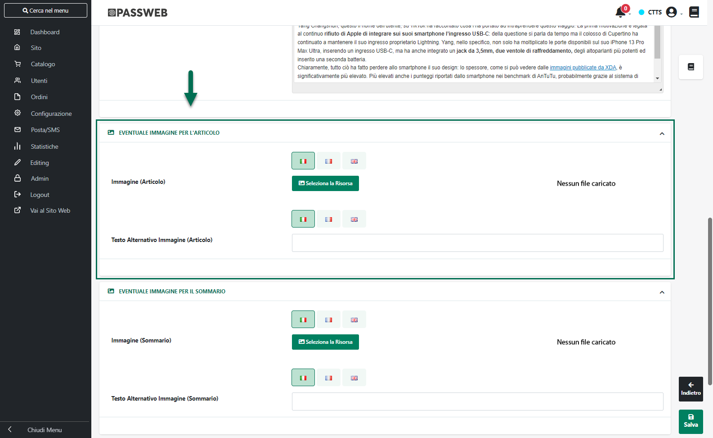
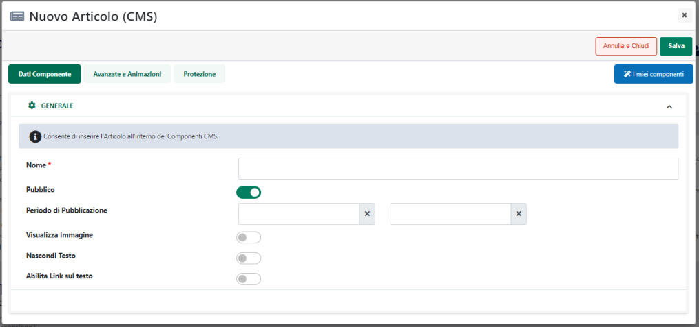
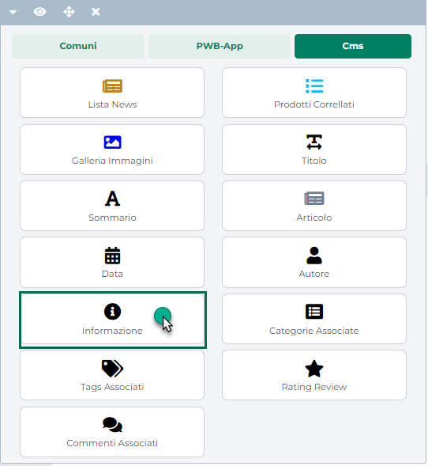
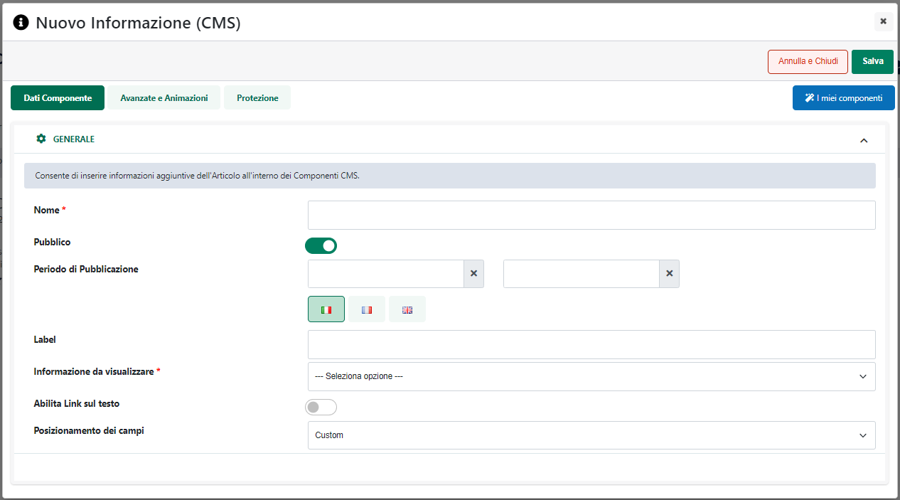

# IMMAGINI RESPONSIVE

Come più volte accennato nei precedenti capitoli di questa guida la
chiave per ottenere un layout realmente flessibile e adattabile consiste
nell'utilizzo di unità di misura relative in maniera tale che i vari
elementi che compongono la pagina possano adattarsi in modo naturale ad
una vasta gamma di device e risoluzioni di schermo.

Mentre però per i "contenitori di contenuti" (semplici tag div) possiamo
facilmente giocare con le unità di misura per ottenere la fluidità di
cui abbiamo bisogno, all'interno della pagina possiamo anche trovare
oggetti, come le immagini, che per loro stessa natura hanno dimensioni
fisse e questo, ovviamente, in un contesto responsive non va bene.

Una prima soluzione a questo problema esiste ed è anche piuttosto
semplice.

Per avere immagini fluide e adattive rispetto al contesto in cui sono
inserite è infatti necessario:

- **gestire in percentuale la dimensione, in larghezza, del box che le
  contiene**

- **impostare la larghezza (width) e l'altezza (height) dell'immagine
  sul valore auto**

- **impostare la larghezza massima dell'immagine sul valore 100%**

Operando in questo modo avremo quindi la certezza che
restringendo/allargando la pagina si restringerà/allargherà
proporzionalmente anche il contenitore dell'immagine e con esso,
ovviamente, l'immagine stessa.

**ATTENZIONE!** Il componente "**Immagine con Link**" presente nelle
Varianti Responsive di Passweb soddisfa già questo tipo di requisiti per
cui l'unica cosa di cui preoccuparsi in questo senso, potrebbe essere
quella di assegnare (in relazione allo specifico risultato grafico che
si desidera ottenere) mediante lo Style Editor del componente, una
larghezza in percentuale al contenitore dell' immagine.

**Ovviamente un'altra accortezza da avere è quella di usare sempre
immagini sufficientemente grandi e adeguate a tutte le dimensioni che il
layout può raggiungere.**

Se l'immagine utilizzata dovesse infatti essere troppo piccola rispetto
alle dimensioni che potrà assumere all'interno del layout ad un certo
punto risulterà sicuramente sgranata.

La tecnica appena analizzata ha dalla sua il fatto che è piuttosto
semplice da implementare, oltre alla piena compatibilità cross browser
ma, volendo essere precisi, risolve solo una parte dei problemi posti
dalle immagini in un contesto responsive.

Rimane infatti aperta una seconda questione, anche piuttosto importante:
se responsive design significa adattamento automatico all'ambiente d'uso
del sito, allora sarebbe necessario operare in maniera tale da servire
immagini ad hoc a seconda dei dispositivi e delle loro caratteristiche
evitando quindi di far scaricare a chi usa uno smartphone un'immagine ad
altissima risoluzione e dall'elevato peso (un'immagine di 500kb e
1300x700px è inutile se lo schermo del dispositivo non supera i 480px)

Usando la tecnica del max-width: 100% potremo adeguare l'immagine al
layout, ma rimane aperto il problema dello 'spreco' di banda e quindi
del 'peso' dell'immagine.

Le tecniche elaborate per risolvere questo problema sono diverse, ognuna
delle quali ha i suoi pro ed i suoi contro.

- l'istruzione object-fit del CSS3

- il tag picture dell'HTML5

- il tag HTML5 appoggiato da jQuery

- specifici plugin javascript

- ...

In questo senso **la soluzione adottata** **dalle Varianti Responsive di
Passweb** è quella che, allo stato attuale delle cose, garantisce il
miglior compromesso tra vantaggi e svantaggi e consiste nel ricorrere
**all'utilizzo del tag \< picture \> assieme al tag \<source\> e
all'attributo "srcset"**

In altri termini l'utilizzo di questi tag HTML, **presenti nel markup
del componente "Immagine con link" delle Varianti Responsive**, permette
a chi realizza il sito di indicare immagini diverse da fornire in
corrispondenza di diverse larghezze del dispositivo di visualizzazione
del sito.

All'atto pratico tutto ciò si traduce nella possibilità, in fase di
configurazione dello stesso componente "**Immagine con Link**", di
indicare:

- Un' immagine principale -- parametro "**Immagine**" -- che verrà
  visualizzata sui dispositivi desktop (dimensione dello schermo
  maggiore o uguale a 992px) e sui browser più datati che non offrono
  supporto all'attributo srcset.

> Tecnicamente è l'immagine indicata all'interno del classico attributo
> src

- Un'immagine specifica per i dispositivi Tablet -- parametro
  "**Immagine per dispositivi Tablet**" -- che verrà visualizzata su
  dispositivi di larghezza compresa tra i 576 px e i 991 px

> Tecnicamente è l'immagine indicata all'interno dell'attributo srcset
> corrispondente al tag
>
> \< source media=\"(max-width: 991px)\" .. \>

- Un'immagine specifica per i dispositivi Smartphone -- parametro
  "**Immagine per dispositivi Smartphone**" -- che verrà visualizzata su
  dispositivi di larghezza inferiore ai 576 px

> Tecnicamente è l'immagine indicata all'interno dell'attributo srcset
> corrispondente al tag
>
> \< source media=\"(max-width: 576px)\" .. \>

**ATTENZIONE!** Per i browser più datati che non offrono supporto
all'attributo "srcset" mediante il quale poter fornire immagini diverse
in corrispondenza delle diverse dimensioni del dispositivo di
visualizzazione, verrà visualizzata sempre l'immagine principale
corrispondente, a livello di markup HTML, a quella presente all'interno
del classico attributo **"src"**

Per maggiori informazioni relativamente alla gestione e alla
configurazione del componente "Immagine con link" delle Varianti
Responsive si veda anche il corrispondente capitolo di questo manuale
("*Varianti Responsive -- Lista Componenti Comuni -- Componenti Immagini
con link*")

