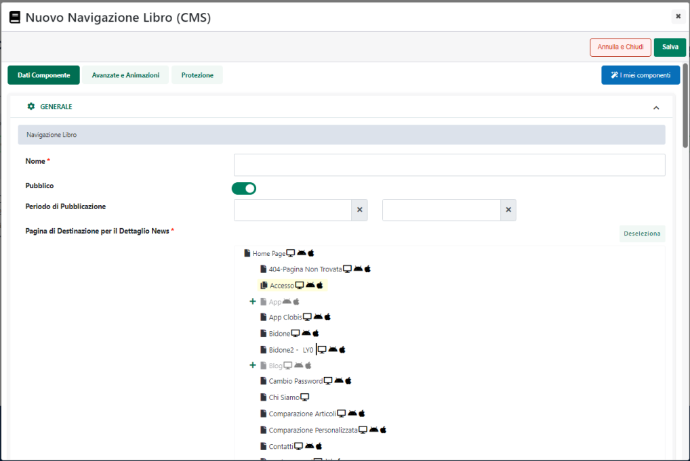

# DISTRIBUZIONE

La sezione "**Distribuzione**" presente nella maschera di configurazione
di ogni singolo Componente Passweb consente di definire su quali pagine
il componente in esame dovrà essere distribuito.

Nello specifico dunque il parametro:

- **Distribuisci il Componente a tutte le pagine future:** se
  selezionato consente di associare il Componente in esame a tutte le
  nuove pagine del sito che verranno create nel corso del tempo

- **Distribuzione:** consente di selezionare, tra le pagine attualmente
  presenti all'interno del sito, quelle cui associare il Componente in
  esame. Per selezionare una o più pagine è sufficiente selezionarle
  dall'elenco. I pulsanti presenti nella barra degli strumenti
  consentono rispettivamente di:

  - **Tutte le pagine:** consente di selezionare, e quindi di associare
    il Componente in esame, a tutte le pagine del sito.

  - **Pag. Prodotto +:** consente di selezionare e quindi di associare
    il Componente in esame a tutte le pagine di tipo "Prodotto"

  - **Pag. Catalogo +:** consente di selezionare, e quindi di associare
    il Componente in esame, a tutte le pagine di tipo "Catalogo"

  - **Pag. Prodotto -:** consente di deselezionare, e quindi di
    disassociare il Componente in esame, da tutte le pagine di tipo
    "Prodotto"

  - **Pag. Catalogo -:** consente di deselezionare, e quindi di
    disassociare il Componente in esame, da tutte le pagine di tipo
    "Catalogo"

  - **Deseleziona:** consente di deselezionare tutte le pagine presenti
    in elenco e di non associare quindi il Componente in esame a nessuna
    di esse

> Distribuendo un Componente su più pagine diverse **NON vengono fatte
> delle copie del Componente.** Un Componente distribuito è sempre e
> comunque lo stesso Componente, soltanto inserito in pagine diverse.
>
> **Effettuando quindi delle modifiche ad un Componente distribuito su
> più pagine dunque, queste si ripercuoteranno su tutti i componenti
> della serie.**
>
> Se necessario è comunque possibile scollegare un Componente
> distribuito da una specifica pagina in maniera tale da poterlo
> personalizzare solo ed esclusivamente per quella pagina

Il pulsante "**Verifica Distribuzione**" presente immediatamente al di
sotto dell'albero delle pagine del sito

consente di verificare se il componente in oggetto (e tutti i suoi
figli) è correttamente distribuito sulle pagine indicate all'interno del
precedente parametro "Distribuzione" e, nel caso non lo fosse, consente
di effettuarne nuovamente la distribuzione.

**ATTENZIONE!** La verifica viene effettuata sui dati già salvati e
dunque sulle pagine in cui il componente in esame avrebbe già dovuto
essere distribuito

In conseguenza di ciò se prima di premere il pulsante "Verifica
distribuzione" dovessero essere state aggiunte delle pagine sarà
necessario, per prima cosa, salvare i dati e solo successivamente
rientrare nella maschera di configurazione e avviare la procedura di
verifica

Allo stesso modo occorre prestare particolare attenzione alla pagina da
cui si lancia questa procedura di verifica. La procedura esamina infatti
la struttura del componente su cui si sta operando e verifica che questa
stessa struttura sia presente in tutte le pagine di destinazione in cui
il componente dovrebbe essere distribuito.

Pertanto se si opera a partire da un componente che, per svariate
ragioni non è quello corretto e presenta degli errori (mancano ad
esempio alcuni componenti interni rispetto a quella che dovrebbe essere
la versione corretta del componente), la struttura di quel componente
verrà replicata su tutte le pagine di destinazione distribuendo, di
fatto, l'errore inizialmente presente su di una sola pagine anche su
tutte le altre in cui si trova il componente in esame.

**In sostanza occorre quindi prestare particolare attenzione al fatto
che il componente dal quale si effettua la procedura di "Verifica
distribuzione" sia effettivamente quello corretto e contenga, quindi,
tutti gli eventuali componenti figli che deve realmente avere**

**ATTENZIONE!** Nel momento in cui si dovesse andare a distribuire un
qualsiasi componente (mediante la procedura di distribuzione o di
verifica distribuzione) in pagine diverse, la posizione da esso assunta
nella pagina di partenza potrebbe non coincidere con quella assunta dal
componente stesso all'interno della pagina di destinazione, cosa questa
facilmente comprensibile se si pensa che i componenti presenti nella
pagina di partenza e quelli presenti nella pagina di destinazione
possono essere completamente diversi

In questo senso è bene sottolineare che in fase di distribuzione, per
posizionare correttamente il componente sulle diverse pagine di
destinazione verranno presi come riferimento i componenti ad esso
immediatamente precedente e immediatamente successivo presenti nella
pagina di avvio del processo di distribuzione, secondo la seguente
logica:

- Se il componente che precede, nella pagina di avvio del processo di
  distribuzione, l'elemento che si intende effettivamente distribuire
  dovesse essere presente anche nella pagina di destinazione, allora
  questo verrà preso come riferimento per individuare la posizione in
  cui inserire il componente distribuito che, quindi, andrà a
  collocarsi, nella pagina di destinazione, immediatamente dopo il
  componente di riferimento

- Se il componente che segue, nella pagina di avvio del processo di
  distribuzione, l'elemento che si intende effettivamente distribuire
  dovesse essere presente anche nella pagina di destinazione allora
  questo verrà preso come riferimento per individuare la posizione in
  cui inserire il componente distribuito che, quindi, andrà a
  collocarsi, nella pagina di destinazione, immediatamente prima del
  componente di riferimento

- Nel caso in cui entrambi i componenti che precedono e seguono, nella
  pagina di avvio del processo di distribuzione, l'elemento che si
  intende effettivamente distribuire dovessero essere presenti anche
  nella pagina di destinazione, allora come riferimento per individuare
  la posizione in cui inserire il componente distribuito verrà
  utilizzato, come nel caso precedente, l'elemento ad esso successivo.

> Anche in queste condizioni dunque, nella pagina di destinazione il
> componente distribuito verrà collocato immediatamente prima del
> componente di riferimento.

- Nel caso in cui nessuno dei due componenti che precedono e seguono,
  nella pagina di avvio del processo di distribuzione, l'elemento che si
  intende effettivamente distribuire dovesse essere presente anche nella
  pagina di destinazione, allora il componente distribuito verrà
  posizionato unicamente sulla base della posizione da esso assunta
  nella pagina di partenza

