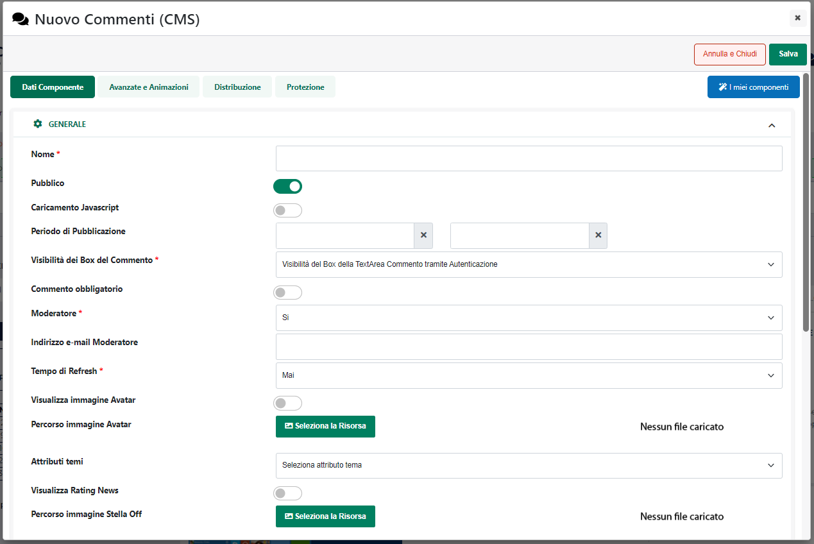

# MENÙ OFFCANVAS

I menu Off Canvas sono caratterizzati dal fatto di essere posizionati,
inizialmente, al di fuori della pagina web dove invece comparirà
soltanto un pulsante.

Cliccando su questo pulsante il menu verrà richiamato e visualizzato
nella pagina secondo quelle che sono le impostazioni settate
dall'amministratore in fase di configurazione del componete

Una volta aperto il menu, verranno visualizzate le voci di primo
livello.

La presenza di una piccola freccia posta a fianco di alcune voci di menu
indica la presenza di ulteriori voci di livello successivo.

Cliccando quindi su questa freccia le voci di primo livello verranno
sostituite dalle relative voci di secondo livello.

Nella parte alta del menu è visualizzata la voce di primo livello
attualmente selezionata (la piccola freccia posta al suo fianco consente
di risalire al livello precedente). Al di sotto della voce di primo
livello attualmente selezionata compaiono invece le relative voci di
secondo livello.

Per realizzare questo tipo di menu è necessario:

- impostare il parametro **Tipo di stili applicati al Menu** sul valore
  "Off Canvas".

Come detto i menu di questo tipo sono posizionati, inizialmente al di
fuori della pagina web, e questo non solo sul front end del sito ma
anche all'interno del back end.

Per poter editare le caratteristiche grafiche di questo menu
visualizzando immediatamente i risultati ottenuti (e senza dunque dover
verificare tali risultati sul front end del sito) è necessario per prima
cosa richiamarli all'interno della pagina, cliccando per questo sul
relativo pulsante di apertura esattamente come farebbe un normale
visitatore del sito.

In alternativa è anche possibile cliccare sulla corrispondente icona di
apertura presente nel R.O.C. di questa particolare tipologia di
componente

Una volta richiamato il menu all'interno dell'ambiente di sviluppo, sarà
poi sufficiente aprire lo style editor del componete ed apportare le
modifiche grafiche desiderate selezionando il corretto elemento (es.
"Menu Off Canvas")

A livello di accessibilità è gestita la seguente navigazione da
tastiera:

- **Enter**: sul pulsante di apertura del menu apre l'offcanvas e sposta
  il focus sull'eventuale pulsante di apertura del primo sottomenu

- **TAB**: sposta il focus sul prossimo elemento focusabile

- **SHIFT + TAB**: sposta il focus sull'elemento focusabile precedente

- **Freccia giù / Freccia Destra**: sposta il focus sul prossimo
  elemento focusabile

- **Freccia su / Freccia sinistra**: sposta il focus sull'elemento
  focusabile precedente

- **Enter**: effettua il click sul relativo collegamento

- **ESC**: esce dal menu offcanvas

