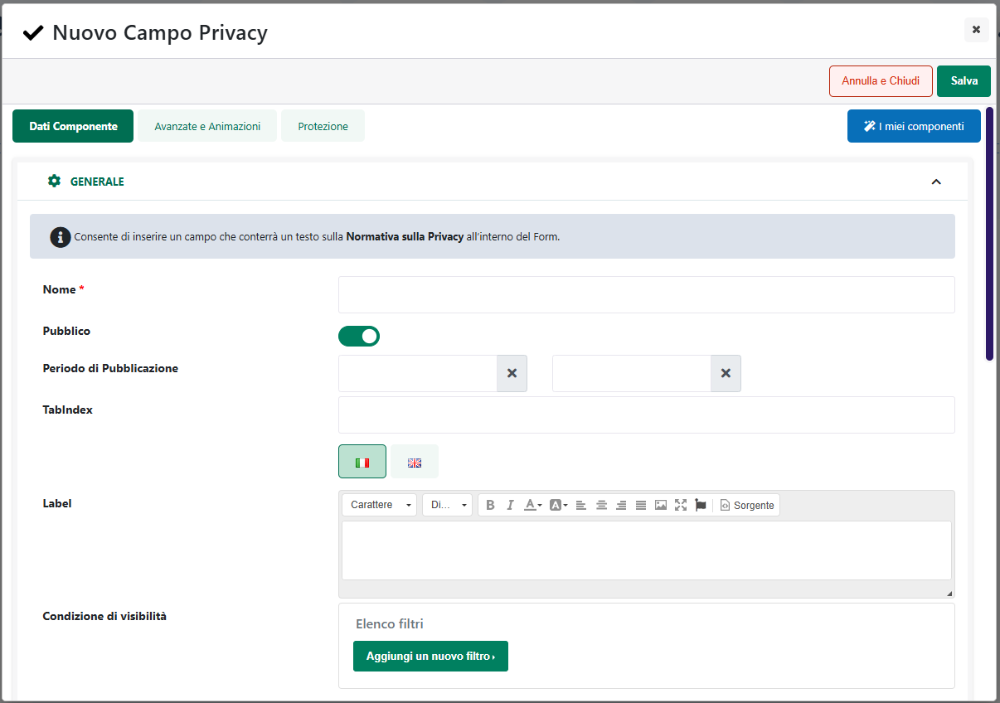

# COMPONENTI PER IL FORM - CAMPO LISTA VALORI

Il Componente **"Lista Valori**" consente di inserire all'interno del
Form un'etichetta (label) seguita da un menù a tendina (drop down list)
contenente una serie di valori tra cui selezionare quello più idoneo.

E' possibile inserire valori personalizzati o precablati (inerenti a
Provincie e Nazioni). Al rilascio del Componente si aprirà **la sua
maschera di gestione e configurazione**:

suddivisa in varie sezioni.

All'interno della sezione "**Dati Componente**" sarà possibile inserire
il contenuto e settare i principali parametri di configurazione del
componente.

- **Nome:** permette di inserire un nome per il campo che si sta
  editando;

- **Pubblico (selezionato a default):** consente di impostare la
  visibilità del componente lato sito web. Se selezionato il
  corrispondente componente verrà correttamente pubblicato e
  visualizzato all'interno del sito. Nel caso in cui invece tale
  parametro non sia selezionato, il corrispondente componente passerà in
  modalità "Offline", sarà quindi visibile all'interno del Wizard, dove
  potrà essere normalmente gestito, ma non verrà pubblicato e
  visualizzato all'interno del sito.

- **Periodo di Pubblicazione:** consente di associare al Componente in
  oggetto uno specifico periodo di pubblicazione, definendone
  l'effettiva data di pubblicazione e la corrispondente data di
  oscuramento.

> Nel primo dei due campi disponibili occorrerà quindi indicare,
> utilizzando l'apposito calendario, la data di inizio pubblicazione.
> Nel secondo campo andrà invece specificata la data di fine
> pubblicazione.
>
> **ATTENZIONE!** Le date indicate all'interno di questi campi verranno
> considerate solo ed esclusivamente nel caso in cui il precedente
> parametro "Pubblico" sia stato selezionato

- **Id/Name:** consente di personalizzare i selector HTML "id" e "name"
  per il componente in oggetto in modo tale da poterlo intercettare e
  personalizzare, a livello di CSS o di codice javascript, in maniera
  più semplice ed immediata.

> **Il valore inserito all'interno di questo campo verrà utilizzato per
> entrambi i selector indicati**

- **Tab Index:** consente di personalizzare l'ordine di tabulazione del
  form assegnando uno specifico numero d'ordine al campo in oggetto. Una
  volta assegnato un numero d'ordine ad ogni campo del form sarà poi
  possibile spostarsi da un elemento all'altro, utilizzando il tasto
  "TAB" e secondo l'ordine di tabulazione impostato.

> Nel caso in cui si decida di personalizzare l'ordine di tabulazione
> degli elementi del form sarà necessario assegnare uno specifico numero
> d'ordine ad ogni singolo campo. In caso contrario il passaggio da un
> campo all'altro attraverso il tasto TAB si interromperà in
> corrispondenza del campo con l'ultimo numero d'ordine impostato.
>
> Lato accessibilità il consiglio è quello di non definire una
> navigazione personalizzata impostando specifici valori per il
> parametro in oggetto e lasciare quindi che sia il browser stesso, in
> base alla struttura della pagina a definire gli spostamenti tra un
> campo e l'altro attraverso il tasto TAB.

- **Label (etichetta):** è ciò che sarà visualizzato sul sito come
  etichetta propria del Campo Lista Valori.

- **Testo del controllo senza valori selezionati:** consente di
  impostare un testo che verrà inizialmente visualizzato all'interno del
  corrispondente controllo (es. ------ selezionare un valore ------ ).
  Nel caso in cui il campo in oggetto non venga valorizzato, e non venga
  neppure impostato uno dei possibili valori da selezionare come valore
  di default per il controllo, il menu a tendina sarà impostato,
  inizialmente, su di un valore nullo.

- **Tipo Valore:** Consente di definire il tipo di valore con il quale
  popolare il menù a tendina (drop down list).

  - **Testo:** permette di popolare il menu a tendina (drop down list)
    con valori personalizzati. Scegliendo questa opzione la sezione
    "Gestione Valori" della finestra "Modifica Campo Select" si
    abiliterà, permettendo di poter inserire, modificare e cancellare i
    valori stessi**.**

  - **Provincia:** Selezionando questo tipo di valore il menu a tendina
    si popolerà automaticamente andando ad elencare tutte le Provincie
    d'Italia tra le quali l'utente potrà poi scegliere quella di
    appartenenza. La sezione Gestione Valori della finestra "Modifica
    Campo Select" non si abiliterà, sarà quindi sufficiente premere il
    tasto salva per completare la configurazione del campo in esame
    (Lista Valori).

  - **Nazione:** Selezionando questo tipo di valore il menu a tendina si
    popolerà automaticamente andando ad elencare tutte le Nazioni del
    Mondo tra le quali l'utente potrà poi scegliere quella di
    appartenenza. La sezione Gestione Valori della finestra "Modifica
    Campo Select" non si abiliterà, sarà quindi sufficiente premere il
    tasto salva per completare la configurazione del campo in esame
    (Lista Valori).

<!-- -->

- **Condizione di Visibilità:** consente di impostare una condizione in
  base alla quale poter definire quando il componente in oggetto dovrà o
  meno essere visibile all'interno del relativo form.

> Tale condizione potrà essere definita sulla base del valore assunto:

- dal campo "Nazione" eventualmente presente all'interno del form in
  esame

- da uno qualsiasi dei campi presenti all'interno del form per cui sia
  stato correttamente valorizzato, in fase di configurazione, il
  parametro "**Id/name**"

> Per maggiori informazioni in merito a come poter impostare una
> condizione di visibilità per un campo del form, si veda anche il
> successivo capitolo "*Condizioni di visibilità e obbligatorietà per i
> campi del form*" di questo manuale.

- **Campo Puffin CRM:** visualizzato solo nel caso in cui il form in
  esame sia stato correttamente abilitato per il salvataggio dei dati
  all'interno di Puffin (parametro "**Crea Contatto in Puffin CRM**"
  abilitato).

> Consente di indicare, selezionandolo dal relativo menu a tendina, lo
> specifico campo dell'anagrafica Lead di Puffin in cui dovrà essere
> salvato il dato inserito dall'utente in fase di compilazione del form
> (per maggiori informazioni relativamente a come poter creare un Lead
> su Puffin partendo da un Form Passweb si veda quanto indicato nel
> successivo capitolo "*Creazione Lead su Puffin CRM*")

- **Campo Obbligatorio:** consente di stabilire se il campo che si sta
  editando debba o meno essere obbligatoriamente compilato per poter
  procedere poi alla conferma del form.

- **Condizioni di Obbligatorietà:** visualizzato solo nel caso in cui il
  precedente parametro "Campo Obbligatorio" sia stato impostato sul
  valore SI.

> Consente di impostare una condizione in base alla quale poter definire
> quando il campo in esame dovrà o meno essere considerato come
> obbligatorio per la corretta compilazione del form.
>
> Tale condizione potrà essere definita sulla base del valore assunto:

- dal campo "Nazione" eventualmente presente all'interno del form in
  esame

- da uno qualsiasi dei campi presenti all'interno del form per cui sia
  stato correttamente valorizzato, in fase di configurazione, il
  parametro "**Id/name**"

> Per maggiori informazioni in merito a come poter impostare una
> condizione di obbligatorietà, per un campo del form si veda anche il
> successivo capitolo "*Condizioni di visibilità e obbligatorietà per i
> campi del form*" di questo manuale.

- **Posizionamento dei Campi:** consente di posizionare gli elementi
  principali del componente secondo uno schema prestabilito.

> Nello specifico, gli elementi soggetti al tipo di posizionamento
> impostato mediante questo parametro saranno:

- La Label

- Il Controllo (ossia la combo box contenente i valori selezionabili)

- Il Messaggio di errore

> E' possibile selezionare uno dei seguenti valori:

- Affiancati a destra

- Affiancati a sinistra

- Affiancati e giustificati

- Affiancati e opposti

- Centrati e affiancati

- Centrati e Incolonnati

- Incolonnati a destra

- Incolonnati a sinistra

- Custom

> **ATTENZIONE!** Nel caso in cui si decidesse di utilizzare uno dei
> preset presenti in elenco poi il posizionamento degli elementi sarà
> esattamente quello indicato e non potrà essere modificato in alcun
> modo.
>
> **L'opzione Custom consente invece di non applicare nessun preset
> particolare.** **In queste condizioni dunque il posizionamento dei
> vari elementi potrà essere variato liberamente agendo sulle corrette
> proprietà CSS mediante lo style editor di Passweb e/o mediante i
> relativi strumenti di editing avanzato.**

- **Ordinamento di visualizzazione dei campi:** visualizzato solo nel
  caso in cui il precedente parametro non sia stato impostato sul valore
  Custom.

> Consente di definire l'ordine di visualizzazione degli elementi
> principali del componente in esame, permettendo dunque, già in fase di
> configurazione del componente stesso di decidere quale elemento dovrà
> essere visualizzato prima e quale dopo.
>
> **ATTENZIONE!** Anche in questo caso l'opzione Custom, non attiva
> nessun tipo di preset per cui l'ordine di visualizzazione dei
> rispettivi elementi potrà essere variato liberamente agendo sulle
> corrette proprietà CSS mediante lo style editor di Passweb e/o
> mediante i relativi strumenti di editing avanzato.

La sezione "**Gestione valori", (abilitata solo se si è scelto il valore
"testo"),** consente di definire e gestire le diverse possibili opzioni
di scelta che verranno visualizzate all'interno del controllo.

Per aggiungere una nuova opzione di scelta al controllo è sufficiente
cliccare sul relativo pulsante di aggiunta nuovo elemento (
 ) e inserire poi i dati di
configurazione dell'elemento stesso nella parte destra della maschera.

Per ciascuna delle possibili opzioni di scelta sarà necessario indicare:

- **Valore:** consente di specificare il valore che dovrà essere salvato
  o inviato per mail (a seconda della particolare modalità di
  funzionamento impostata per il form) nel momento in cui l'utente
  dovesse selezionare questa opzione.

- **Testo:** consente di indicare la label che dovrà essere
  visualizzata, all'interno del controllo, in corrispondenza
  dell'opzione di scelta che si sta configurando.

> **ATTENZIONE!** Nel caso in cui il campo "Testo" venga lasciato vuoto,
> label e valore dell'opzione di scelta coincideranno entrambi con
> quanto inserito all'interno del campo Valore.
>
> **NOTA BENE:** in ogni caso, alla conferma del form verrà sempre
> salvato o inviato via mail (a seconda della particolare modalità di
> funzionamento impostata per il form in oggetto) solo **il Valore (e
> NON il Testo)** delle varie opzioni di scelta selezionate dall'utente

- **Selezionato:** flaggando questa casella l'opzione di scelta che si
  sta configurando apparirà sul sito già selezionato a default**.**

Una volta inserito un valore, per aggiungerlo all'elenco di valori
selezionabili, è necessario premere **"Aggiungi Elemento"** presente
nella parte alta della maschera.

Per **modificare** uno dei valori presenti in elenco è sufficiente
selezionarlo ed agire poi sulle relative proprietà.

Gli altri pulsanti presenti nella parte sinistra della maschera
consentono rispettivamente di:

- **Elimina elemento** (
   ): consente di eliminare l'elemento
  attualmente selezionata in elenco

- **Sposta su / giù**
  ( ): consente di riordinare tra loro le
  varie opzioni di scelta spostando verso l'alto o il basso l'elemento
  attualmente selezionato in elenco.

Il pulsante "**Salva**" nella parte alta della maschera consentirà di
salvare le modifiche apportate al Componente in oggetto.

**NOTA BENE:** per maggiori informazioni relativamente alle sezioni
"**Avanzate e Animazioni**", "**Distribuzione**" e "**Protezione**",
presenti nella maschera di gestione e configurazione di tutti i
componenti Passweb, si veda anche il capitolo " Varianti Responsive --
Configurazione Componenti -- Caratteristiche Generali " di questo
manuale.

