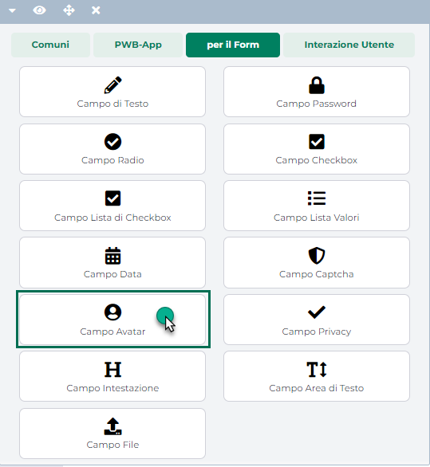

# COMPONENTI PER IL FORM - CAMPO PULSANTE

Il Componente **"Campo Pulsante"** permette di inserire all'interno del
form un pulsante liberamente configurabile sia a livello grafico che a
livello funzionale.

Rilasciando il componente all'interno del form si aprirà **la sua
maschera di gestione e configurazione**

{width="5.104166666666667in"
height="3.058333333333333in"}

suddivisa in varie sezioni.

All'interno della sezione "**Dati Componente**" sarà possibile inserire
il contenuto e settare i principali parametri di configurazione del
componente.

- **Nome:** permette di inserire un nome per il campo che si sta
  editando;

- **Pubblico (selezionato a default):** consente di impostare la
  visibilità del componente lato sito web. Se selezionato il
  corrispondente componente verrà correttamente pubblicato e
  visualizzato all'interno del sito. Nel caso in cui invece tale
  parametro non sia selezionato, il corrispondente componente passerà in
  modalità "Offline", sarà quindi visibile all'interno del Wizard, dove
  potrà essere normalmente gestito, ma non verrà pubblicato e
  visualizzato all'interno del sito.

- **Periodo di Pubblicazione:** consente di associare al Componente in
  oggetto uno specifico periodo di pubblicazione, definendone
  l'effettiva data di pubblicazione e la corrispondente data di
  oscuramento.

> Nel primo dei due campi disponibili occorrerà quindi indicare,
> utilizzando l'apposito calendario, la data di inizio pubblicazione.
> Nel secondo campo andrà invece specificata la data di fine
> pubblicazione.
>
> **ATTENZIONE!** Le date indicate all'interno di questi campi verranno
> considerate solo ed esclusivamente nel caso in cui il precedente
> parametro "Pubblico" sia stato selezionato

- **Id/Name:** consente di personalizzare i selector HTML "id" e "name"
  per il componente in oggetto in modo tale da poterlo intercettare e
  personalizzare, a livello di CSS o di codice javascript, in maniera
  più semplice ed immediata.

> **Il valore inserito all'interno di questo campo verrà utilizzato per
> entrambi i selector indicati**

- **Tab Index:** consente di personalizzare l'ordine di tabulazione del
  form assegnando uno specifico numero d'ordine al campo in oggetto. Una
  volta assegnato un numero d'ordine ad ogni campo del form sarà poi
  possibile spostarsi da un elemento all'altro, utilizzando il tasto
  "TAB" e secondo l'ordine di tabulazione impostato.

> Nel caso in cui si decida di personalizzare l'ordine di tabulazione
> degli elementi del form sarà necessario assegnare uno specifico numero
> d'ordine ad ogni singolo campo. In caso contrario il passaggio da un
> campo all'altro attraverso il tasto TAB si interromperà in
> corrispondenza del campo con l'ultimo numero d'ordine impostato.
>
> Lato accessibilità il consiglio è quello di non definire una
> navigazione personalizzata impostando specifici valori per il
> parametro in oggetto e lasciare quindi che sia il browser stesso, in
> base alla struttura della pagina a definire gli spostamenti tra un
> campo e l'altro attraverso il tasto TAB.

- **Label (etichetta):** il testo inserito in questo campo sarà
  visualizzato come etichetta del pulsante in oggetto.

- **Condizione di Visibilità:** consente di impostare una condizione in
  base alla quale poter definire quando il componente in oggetto dovrà o
  meno essere visibile all'interno del relativo form.

> Tale condizione potrà essere definita sulla base del valore assunto:

- dal campo "Nazione" eventualmente presente all'interno del form in
  esame

- da uno qualsiasi dei campi presenti all'interno del form per cui sia
  stato correttamente valorizzato, in fase di configurazione, il
  parametro "**Id/name**"

> Per maggiori informazioni in merito a come poter impostare una
> condizione di visibilità per un campo del form, si veda anche il
> successivo capitolo "*Condizioni di visibilità e obbligatorietà per i
> campi del form*" di questo manuale.

**ATTENZIONE!!! A livello funzionale sarà necessario intercettare
l'evento di click sul pulsante in oggetto e definire poi l'azione che
dovrà essere eseguita utilizzando, in questo senso, ad esempio, la
libreria jQuery e le relative funzioni disponibili su ogni sito
Passweb.**

