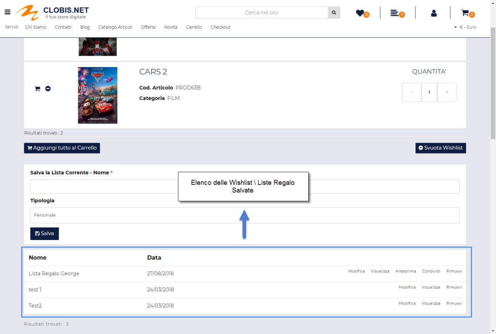

# COMPONENTE RISULTATI RICERCA SUL SITO

Il Componente **"Risultati Ricerca sul Sito"** consente di visualizzare
i risultati di una ricerca di tipo testuale effettuata mediante un
componente "Ricerca sul Sito" opportunamente configurato.

{width="2.8180555555555555in"
height="3.4743055555555555in"}

**Questo componente potrà essere inserito solo ed esclusivamente
all'interno delle pagine generiche (pagine bianche) ma dovrà, in ogni
caso, essere sempre utilizzato in combinazione con un componente
"Ricerca sul Sito" configurato in maniera tale ad avere il parametro
"Tipo" impostato sul valore "Ricerca Testuale".**

> **NOTA BENE:** nel caso in cui non venga inserito, all'interno del
> pagina scelta come destinazione per la visualizzazione dei risultati
> della ricerca, il componente "Risultati Ricerca sul Sito" non sarà
> possibile in alcun modo visualizzare i risultati prodotti dalla
> ricerca in esame.

Per maggiori informazioni relativamente alla gestione del componente
"Ricerca sul Sito" e a come configurare questo tipo di componente in
maniera tale da poter effettuare ricerche di tipo testuale si veda anche
il precedente capitolo di questo manuale.

