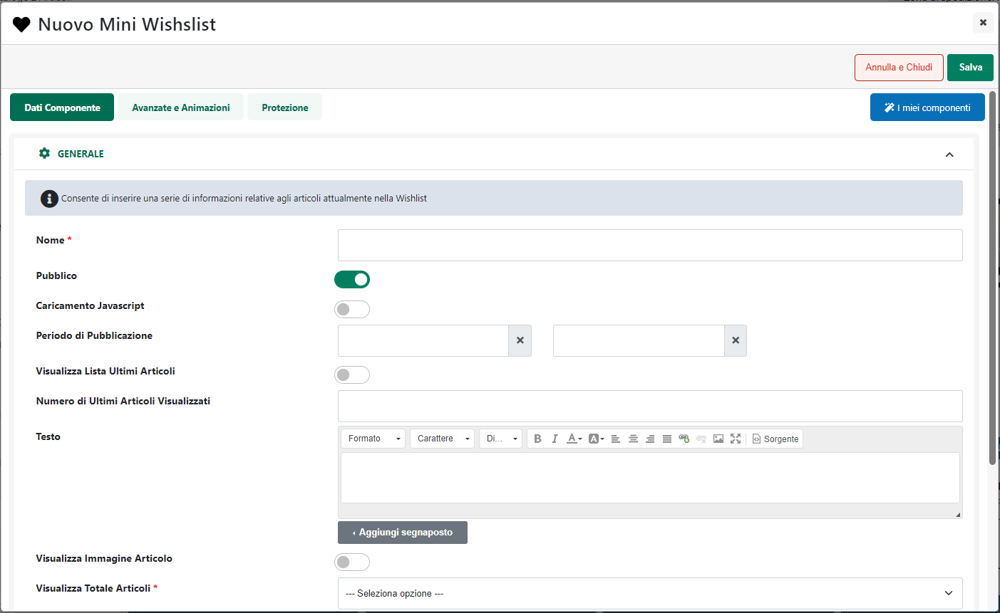
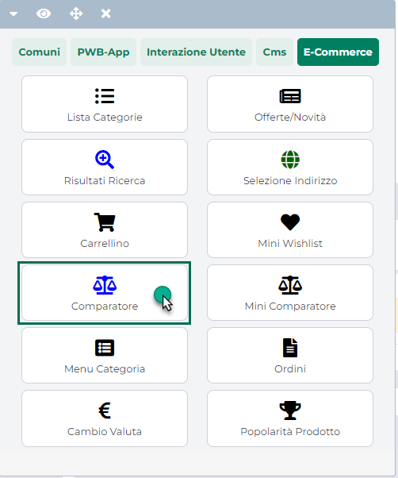

# ORDINAMENTO RISULTATI RICERCA

Come evidenziato nel precedente capitolo il parametro "**Visualizza
Ordinamento**" presente nella maschera di configurazione del componente
"Risultati Ricerca", consente se selezionato, di visualizzare, lato
sito, una combo box contenente l'elenco degli elementi sulla base dei
quali poter effettuare l'ordinamento dei risultati di ricerca ottenuti.

La combo box di selezione sarà preceduta inoltre da un testo indicativo,
"Ordina per:", modificabile nella sezione **"Gestione Testi/Messaggi
Sito**.

**ATTENZIONE!** il valore selezionato inizialmente all'interno della
combo box sarà quello dell'elemento sulla base del quale è stato
impostato l'ordinamento di default.

Al cambio della selezione verrà ricaricato il componente (non l'intera
pagina) e il suo contenuto verrà ordinato in base al nuovo campo di
ordinamento.

Dipendentemente poi da come è stato settato, in fase di configurazione
del componente, il parametro **Identificatore per ordinamento,**
l'ordinamento applicato ad un componente "Risultati Ricerca" potrebbe
essere applicato automaticamente anche ad altri componenti dello stesso
tipo presenti all'interno della stessa pagina

**NOTA BENE:** nel caso in cui il componente sia paginato un'eventuale
variazione del campo di ordinamento riporterà il componente stesso sulla
prima pagina.

L'ordinamento inoltre, non verrà mantenuto in fase di navigazione del
sito. Questo significa dunque che, se dopo aver modificato l'ordinamento
del componente si dovesse continuare la navigazione del sito cambiando
pagina, al ritorno nella pagina che ospita il componente in oggetto, il
suo ordinamento sarà nuovamente quello di default.

Per impostare gli elementi sulla base dei quali poter effettuare
l'ordinamento dei risultati di ricerca, è necessario agire dalla sezione
**"Gestione Campi di Ordinamento"**, presente anch'essa all'interno
della maschera di configurazione del componente

All'interno di questa sezione, sulla sinistra sono elencati gli elementi
di ordinamento attualmente codificati, sulla destra sono invece
riportate le proprietà dell'elemento attualmente selezionato in elenco.
Per modificare uno di questi elementi sarà quindi sufficiente
selezionarlo e agire poi sui parametri presenti all'interno della
sezione "**Modifica Campo Ordinamento**".

Allo stesso modo per codificare un nuovo elemento sarà necessario
cliccare sull'icona raffigurante un piccolo + (
 ) e definire poi le proprietà
dell'elemento stesso.

In particolare per ogni singolo elemento di ordinamento occorrerà
specificare un valore per i seguenti campi:

- **Testo:** etichetta identificativa dell'elemento di ordinamento che
  si sta codificando. Tale etichetta comparirà poi, come possibile
  opzione di selezione, all'interno della combo box visualizzata lato
  sito nel momento in cui dovesse essere stato selezionato il parametro
  "Visualizza Ordinamento".

- **Campo di ordinamento:** consente di specificare il campo sulla base
  del quale dovranno essere ordinati i risultati di ricerca presenti
  all'interno del componente nel momento in cui, lato sito, dovesse
  essere selezionato l'elemento di ordinamento che si sta codificando.
  E' possibile indicare una delle seguenti opzioni:

  - **Frequenza della keyword:** selezionando questo valore
    l'ordinamento verrà determinato sulla base della frequenza,
    all'interno dei risultati ottenuti, delle keyword di ricerca
    utilizzate.

  - **Rilevanza:** selezionando questo valore l'ordinamento verrà
    determinato sulla base della Rilevanza dei risultati ottenuti, dove
    per rilevanza si intende il numero di visite ricevute dalla pagina
    corrispondente al relativo risultato di ricerca.

  - **Data:** selezionando questo valore l'ordinamento verrà determinato
    sulla base della data di creazione della pagina relativa al
    corrispondente risultato di ricerca. Nel caso ad esempio di
    risultato relativo ad una pagina generica verrà fatto riferimento
    alla data di creazione della pagina, nel caso di risultato relativo
    ad un articolo in catalogo verrà fatto riferimento alla data in cui
    tale articolo è stato esportata e gestito pre la prima volta
    all'interno del sito, nel caso invece di risultato relativo ad un
    post CMS verrà fatto riferimento alla data di pubblicazione del post
    stesso.

<!-- -->

- **Modo di Ordinamento:** consente di specificare se, in relazione
  all'elemento che si sta codificando, dovrà essere applicato un
  ordinamento di tipo Crescente o Decrescente.

- **Default:** se selezionato, il corrispondente elemento verrà
  considerato come elemento sulla base del quale ordinare a default i
  risultati di ricerca ottenuti.

**NOTA BENE:** è obbligatorio indicare un ordinamento di default. Nel
caso in cui questo non dovesse essere indicato al salvataggio del
componente verrà visualizzato un apposito messaggio di errore.

Il pulsante "**Aggiungi** **Elemento**" presente nella parte alta della
maschera consentirà di aggiungere in elenco l'elemento appena
codificato.

