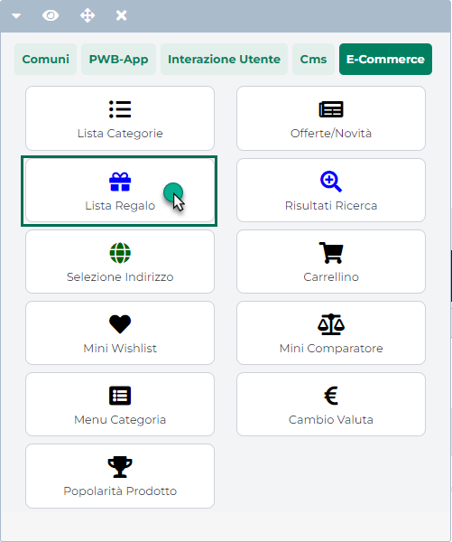
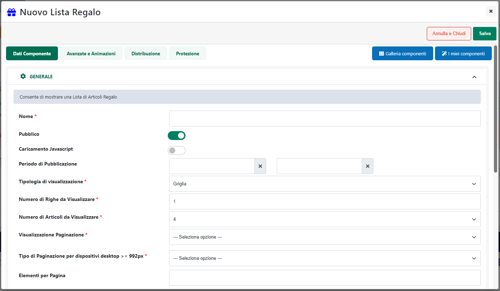

# CONFIGURAZIONE

Una volta inserito il Componente all'interno della pagina web, verrà
aperta in automatico **la sua maschera di gestione e configurazione**

suddivisa in varie sezioni.

All'interno della sezione "**Dati Componente**" sarà possibile inserire
il contenuto e settare i principali parametri di configurazione del
componente.

In particolare, per la tipologia di Componente in questione, sarà
possibile impostare un valore per i seguenti parametri:

- **Nome** (obbligatorio), consente di inserire un nome per il
  Componente Paragrafo che si sta realizzando

- **Pubblico (selezionato a default):** consente di impostare la
  visibilità del componente lato sito web.

- **Periodo di Pubblicazione:** consente di associare al Componente in
  oggetto uno specifico periodo di pubblicazione, definendone
  l'effettiva data di pubblicazione e la corrispondente data di
  oscuramento.

> **ATTENZIONE!** Per maggiori informazioni relativamente ai parametri
> **Nome, Pubblico, Periodo di Pubblicazione** si veda anche quanto
> indicato all'interno del capitolo "*Configurazione Componenti --
> Caratteristiche generali* -- *Dati Componente* " di questo manuale

- **Caricamento Javascript**: se selezionato, consente di caricare il
  relativo componente in maniera asincrona al termine del caricamento
  della pagina web.

- **Statico**: consente di decidere se il componente in esame deve o
  meno essere reso statico

> **ATTENZIONE!** Per maggiori informazioni relativamente ai parametri
> **Caricamento Javascript** e **Statico** si veda anche quanto indicato
> all'interno del capitolo "*Configurazione Componenti --
> Caratteristiche generali* -- *Staticizzazione e caricamento
> asincrono*" di questo manuale

- **Disabilita Cache:** consente di disabilitare la possibilità di
  inserire in cache il componente in esame.

> Per maggiori informazioni relativamente alla gestione della cache in
> Passweb si veda anche il relativo capitolo di questo manuale
> ("*Configurazione -- Cache*")

- **Posizionamento**: consente di definire la posizione di apertura del
  Popup. E' possibile selezionare uno dei seguenti valori:

  - Default

  - Al Centro

  - In alto a destra / a sinistra / al centro

  - In basso a destra / a sinistra / al centro

- **Tipologia di apertura:** consente di impostare la modalità di
  apertura del Popup. E' possibile selezionare uno dei seguenti valori:

  - **Bottone:** selezionando questa opzione il Popup si aprirà al click
    su di un determinato pulsante il cui testo potrà essere definito
    mediante i successivi parametri di configurazione

  - **Automatico:** selezionando questa opzione il Popup si aprirà
    automaticamente al caricamento della pagina web

- **Testo del Bottone --** visibile solo "Tipologia apertura = Bottone".

> Consente di definire il testo e/o l'immagine da utilizzare per il
> pulsante di apertura del Popup

- **Evento di apertura --** visibile solo "Tipologia apertura =
  Automatico".

> Consente di definire l'evento che dovrà scatenare l'apertura
> automatica del relativo Popup. E' possibile selezionare una delle
> seguenti opzioni.

- **Al top della pagina:** selezionando questa opzione il Popup si
  aprirà automaticamente all'apertura della relativa pagina web

- **Al centro della pagina:** selezionando questa opzione il Popup si
  aprirà automaticamente nel momento in cui l'utente scorrendo la pagina
  verso il basso arriverà alla metà della pagina stessa

- **Alla fine della pagina:** selezionando questa opzione il Popup si
  aprirà automaticamente nel momento in cui l'utente scorrendo la pagina
  verso il basso arriverà alla fine della pagina stessa

- **Al raggiungimento di un elemento:** selezionando questa opzione sarà
  poi possibile indicare, all'interno del successivo campo "**Selettore
  per apertura Popup**" lo specifico componente che, nel momento in cui
  dovesse entrare nell'area di visualizzazione della pagina, scatenerà
  l'apertura del Popup.

<!-- -->

- **Selettore per apertura Popup --** visibile solo "Tipologia apertura
  = Automatico" con "Evento di apertura = Al raggiungimento di un
  elemento"

> Consente di impostare la classe CSS (.classeElemento) o
> l'identificativo (#idElemento) dello specifico Componente che, una
> volta entrato nell'area di visualizzazione della pagina dovrà
> scatenare l'apertura del Popup
>
> Per maggiori informazioni relativamente a come poter individuare la
> classe o l'id di un componente Passweb si veda anche la sezione "*Live
> Editing -- Componenti -- Azioni Componente -- Informazioni
> Componente*" di questo manuale.

- **Ritardo apertura popup (ms): --** visibile solo "Tipologia apertura
  = Automatico".

> Consente di impostare l'intervallo di tempo (in millisecondi) che
> dovrà trascorrere prima dell'apertura del popup

- **Modalità di Visualizzazione --** visibile solo "Tipologia apertura =
  Automatico"

> Consente di impostare la modalità di visualizzazione del Popup. E'
> possibile selezionare uno dei seguenti valori:

- **Sempre:** selezionando questa opzione il popup in esame verrà aperto
  ogni volta che un utente accede alla pagina in cui il popup è stato
  inserito

- **Una sola volta:** selezionando questa opzione il popup in esame
  verrà aperto solamente la prima volta che un utente accede alla pagina
  in cui il popup è stato inserito.

> Una volta chiuso il popup il sistema si preoccuperà infatti di salvare
> un cookie tecnico nel browser dell'utente, in maniera tale da
> assicurarsi che questo non venga più aperto per tutta la durata del
> cookie.

- **Nome Cookie:** visibile solo nel caso in cui il parametro "Modalità
  di visualizzazione" sia stato impostato sul valore "Una sola volta".

> Consente di impostare il nome del cookie utilizzato per controllare
> l'apertura del popup
>
> **ATTENZIONE! Nel caso in cui si dovessero utilizzare due o più popup
> all'interno del sito, tutti con apertura automatica, occorre
> impostare, ovviamente, per ciascuno di essi un "Nome Cookie"
> differente.**

- **Durata Cookie (giorni):** visibile solo nel caso in cui il
  precedente parametro "Modalità di visualizzazione" sia stato impostato
  sul valore "Una sola volta".

> Consente di definire la durata (in giorni) del cookie utilizzato per
> l'apertura del popup

- **Area di Backdrop:** consente di impostare la modalità di gestione
  dell'area posta immediatamente dietro al popup, definendo anche la
  modalità di chiusura del popup stesso. E' possibile selezionare una
  delle seguenti opzioni:

  - **Si con chiusura del popup:** consente di visualizzare un Area di
    Backdrop utile per scurire la porzione di pagina posta
    immediatamente dietro al popup.

> In queste condizioni inoltre il click in una qualsiasi posizione di
> quest'area provocherà la chiusura del popup.

- **Si senza chiusura del popup:** consente di visualizzare come per il
  caso precedente l'Area di Backdrop. In queste condizioni però, il
  click in una qualsiasi posizione di quest'area non provocherà la
  chiusura del popup.

> **Selezionando questa opzione dunque, l'unico modo per chiudere il
> popup sarà quello di cliccare sull'apposita icona di chiusura.**

- **No:** selezionando questa opzione non verrà visualizzata nessuna
  area di Backdrop per cui, anche in questo caso, l'unico modo per
  chiudere il popup sarà quello di cliccare sull'apposita icona di
  chiusura.

Anche il Componente "Popup", al pari di altri componenti precedentemente
esaminati **può essere considerato a tutti gli effetti come un
"Componente di tipo Contenitore".**

Sarà quindi possibile inserire al suo interno tutta una serie di altri
componenti necessari per poterne definire i contenuti..

Una volta inserito quindi il Componente "Popup" all'interno della pagina
web, per poterlo poi personalizzare sarà necessario, attivare la
modalità di gestione dei componenti, portarsi sul Componente in esame e,
alla comparsa del R.O.C. cliccare sull'icona "**Accedi ai componenti
interni"**

**Per maggiori informazioni relativamente alla gestione dei Componenti
di tipo Contenitore si veda anche il corrispondente capitolo di questo
manuale ("Live Editing per Varianti Responsive -- Componenti --
Componenti di tipo Contenitore")**

In particolare all'interno di un componente di tipo "Popup" sarà
possibile inserire solamente tre diversi componenti mediante i quali
poter suddividere la finestra modale in tre distinte sezioni:

- **Popup Header:** consente di inserire all'interno del popup view un
  contenitore per gestire le informazioni in testata.

> **ATTENZIONE!** **Il pulsante di chiusura del popup si trova
> all'interno di questa sezione** per cui nel momento in cui si dovesse
> decidere di non inserirla, gestendo magari i contenuti del popup
> unicamente all'interno del componente "Popup Body", sarà poi
> necessario impostare il parametro "**Area di Backdrop**" sul valore
> "**Si con chiusura del popup**". In caso contrario non sarà infatti
> possibile chiudere il popup in alcun modo

- **Popup Body:** consente di inserire all'interno del popup un
  contenitore per gestire le informazioni di corpo

- **Popup Footer:** consente di inserire all'interno del popup un
  contenitore per gestire le informazioni da collocare all'interno del
  piede

L'inserimento di questi componenti all'interno del Componente "Popup"
avviene utilizzando le solite tecniche di interazione con l'editor (Drag
and Drop o Point and Click) già esaminate all'interno di questo manuale
(per maggiori informazioni si rimanda allo specifico capitolo di questo
manuale).

**ATTENZIONE!** Per poter creare correttamente un Popup è necessario
inserire al suo interno almeno uno tra i tre componenti sopra indicati

**E' infatti all'interno dei componenti "Popup Header" , "Popup Body",
"Popup Footer" che andranno poi inseriti i reali contenuti del popup.**

In particolare come già per i Contenitori Collassabili, anche in questo
caso, inizialmente, i contenuti del componente Popup non saranno
visibili all'interno della pagina web (e questo non solo sul front end
del sito ma anche all'interno del back end).

**Per poterli gestire sia dal punto di vista grafico che, soprattutto,
dal punto di vista dei loro contenuti, e quindi degli ulteriori elementi
da inserire all'interno della finestra di popup, la prima cosa da fare
sarà ovviamente quella di richiamare questa stessa finestra cliccando
sul relativo pulsante di apertura**

**ATTENZIONE!** la visualizzazione popup all'interno dell'ambiente di
sviluppo potrebbe essere leggermente diversa rispetto a quella che sarà
poi la visualizzazione di questo stesso elemento sul front end del sito.

In effetti mentre sul front end del sito il popup verrà aperto
all'interno di un'apposita finestra modale, **all'interno dell'ambiente
di sviluppo, verrà visualizzato sempre e soltanto al di sotto del
pulsante di apertura** in maniera tale da poter poi inserire in esso
ulteriori componenti utilizzando le solite modalità di interazione
proprie di Passweb.

In queste condizioni, per avere un'idea chiara soprattutto del
dimensionamento dei vari elementi, si consiglia sempre di controllare il
risultato finale sul front end del sito.
