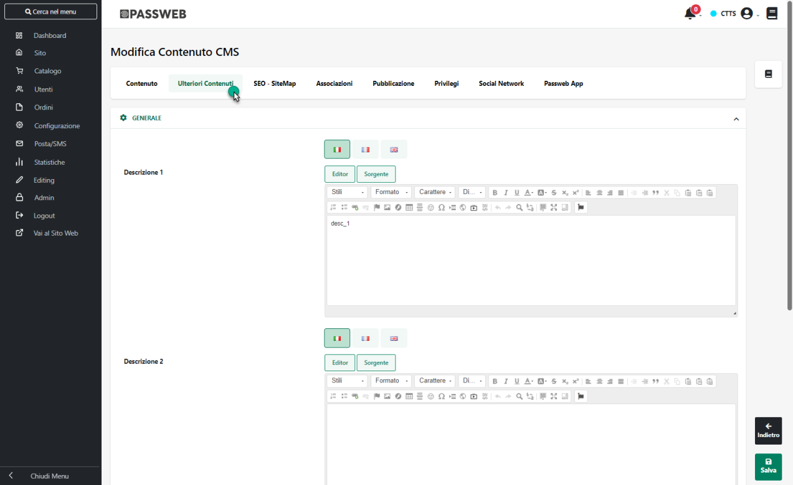
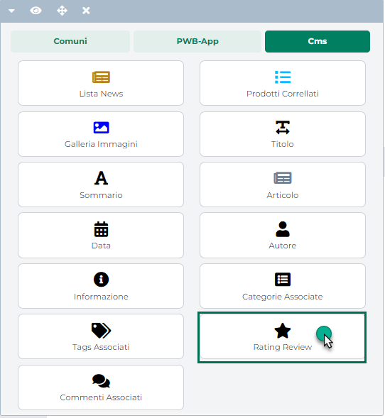

# COMPONENTE SCHEDA PRODOTTO

Il Componente **"Scheda Prodotto"** consente di realizzare una scheda
articolo attraverso la quale poter fornire una descrizione dettagliata,
comprensiva di immagini, testo e attributi articolo (siano essi
attributi Mexal o attributi Passweb) per i vari articoli gestiti
all'interno del sito.

**Per sua stessa natura dunque, il Componente "Scheda Prodotto" potrà
essere inserito:**

- **all'interno della pagina "Prodotti" generica;**

- **all'interno della pagina "Prodotto" corrispondente ad una specifica
  Categoria Merceologica (pagine rosse);**

- **all'interno della pagina Prodotto di uno specifico articolo**

**ATTENZIONE!** in Passweb è possibile realizzare Schede Prodotto
differenti per ogni singola categoria merceologica.

In particolare, **inserendo il Componente all'interno della pagina
"Prodotti" generica**, accessibile dalla corrispondente voce del menu
"Gestione Pagine", e andando poi a costruire la scheda ci si accorgerà
che i vari campi in essa inseriti non potranno, ovviamente, essere
valorizzati con delle informazioni reali, relative cioè ad uno specifico
articolo e prelevate ad esempio da Mexal. Al posto di queste
informazioni verranno quindi inseriti all'interno della scheda dei
segnaposto identificativi dello specifico campo e conseguentemente della
specifica informazione che si vorrà visualizzare in quella specifica
posizione della scheda prodotto.

La pagina "Prodotti" generica quindi, è una sorta di pagina template
attraverso la quale poter definire la struttura della scheda prodotto
per tutti gli articoli non associati ad una specifica categoria
merceologica, decidendo quali campi utilizzare e conseguentemente che
tipo di informazioni fornire, informazioni queste che verranno poi
valorizzate per ogni singolo articolo nella specifica scheda prodotto

> **NOTA BENE:** inserendo il Componente "Scheda Prodotto" all'interno
> della pagina "Prodotti" generica, questo verrà automaticamente
> inserito anche all'interno di tutte le pagine "Prodotto" relative ad
> articoli non associati a nessuna categoria merceologica.

Un comportamento del tutto analogo lo si avrà nel momento in cui il
componente "Scheda Prodotto" dovesse essere inserito nella Pagina
Prodotto corrispondente ad una specifica categoria merceologica.

**Così come la pagina "Prodotti" generica può essere considerata come
una sorta di template per le pagine prodotto degli articoli non
associati ad una specifica categoria merceologica, allo stesso modo ogni
"Pagina Prodotto" associata ad una specifica categoria merceologica può
essere considerata come un template per le pagine prodotto degli
articoli associati a quella stessa categoria merceologica**.

Anche in questo caso dunque andando a costruire la scheda ci si
accorgerà che i vari campi in essa inseriti non potranno, ovviamente,
essere valorizzati con delle informazioni reali e verranno quindi
inseriti dei segnaposto identificativi dello specifico campo e
conseguentemente della specifica informazione che si vorrà visualizzare
in quella specifica posizione di quella specifica scheda prodotto

Volendo **è comunque possibile decidere di inserire il Componente
"Scheda Prodotto" anche all'interno della pagina "Prodotto" relativa ad
uno specifico articolo**, pagina questa che non è però direttamente
accessibile dal menu "Gestione Pagine" di Passweb.

Per poter accedere ad una pagina di questo tipo sarà quindi necessario,
ad esempio:

- aver effettuato una prima importazione dal gestionale degli articoli
  che si è deciso di vendere all'interno del sito web

- aver inserito all'interno del sito almeno un Componente "Catalogo
  E-Commerce" con al suo interno il campo "Titolo" (corrispondente al
  campo "Descrizione" dell'Anagrafica Articoli di Mexal) e/o il campo
  relativo all'Immagine articolo.

Selezionando quindi l'articolo desiderato tra quelli presenti in
catalogo, e cliccando sul suo Titolo o sulla sua Immagine si verrà
automaticamente ricondotti alla pagina "Prodotto" di quello specifico
articolo da dove sarà quindi possibile inserire e gestire il Componente
"Scheda Prodotto".

**Dipendentemente poi dal fatto di aver selezionato o meno un articolo
appartenente a una specifica categoria merceologica, l'inserimento di
componenti all'interno di questa pagina porterà alla definizione ed alla
creazione della Pagina Prodotto associata alla categoria merceologica di
appartenenza dello specifico articolo oppure alla definizione ed alla
creazione della Pagina Prodotto generica.**

> **NOTA BENE:** per maggiori informazioni relativamente alle tipologie
> di pagina gestite all'interno di Passweb, e nello specifico,
> relativamente alle Pagine Prodotto, si veda anche la sezione "Live
> Editing per Varianti Responsive -- Pagine" di questo manuale..

In queste condizioni comunque, lavorando nella pagina "Prodotto" di uno
specifico articolo i vari campi inseriti all'interno del Componente non
verranno più sostituiti da appositi segnaposto, verranno invece
valorizzati con informazioni reali relative a quello specifico articolo.

In questo modo è quindi possibile avere una visione più chiara ed
immediata di quelli che sono gli elementi inseriti all'interno del
Componente e dei relativi ingombri.

