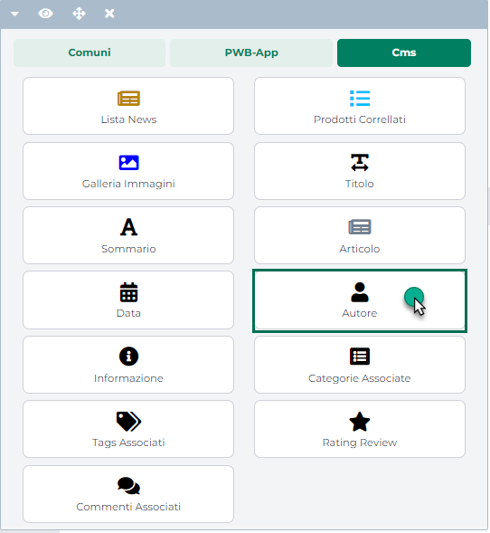
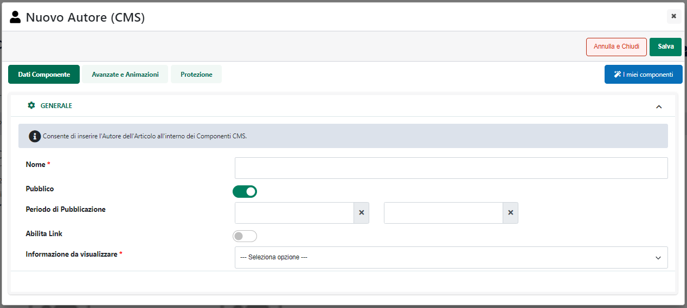
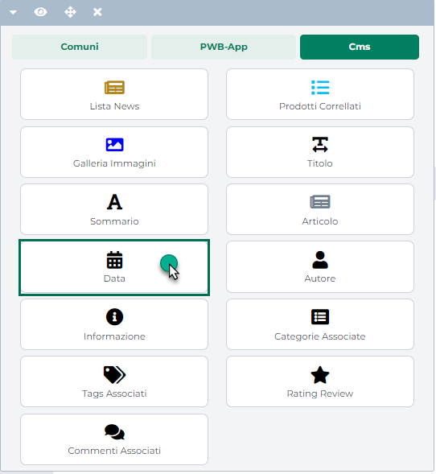

# ECOMMERCE MEXAL -- ARTICOLI CAMPIONARIO SEMPLICI

In Passweb è possibile gestire, oltre ai normali articoli di Magazzino,
identificati in Mexal come articoli di tipo A, anche articoli
Campionario identificati all'interno del gestionale come articoli di
tipo C **a patto che essi siano articoli non strutturati**.

> **NOTA BENE:** non sono gestiti articoli campionario con codice
> strutturato

Nel caso in cui l'articolo Campionario sia stato impostato come **NON
CONFIGURABILE,** e si sia quindi deciso di **non selezionare** il
parametro "**Abilita Configurazione**" presente nella maschera "**Dati
Articolo**", accessibile sul Wizard alla voce di menu "*Catalogo --
Gestione Articoli*",

{width="5.809722222222222in"
height="3.5215277777777776in"}

il Componente **"Campionario E-commerce"** permetterà di inserire e di
visualizzare all'interno della Scheda Prodotto l'insieme di tutti gli
articoli componenti, in Mexal, il campionario attualmente selezionato.

Tale componente è dunque indispensabile per poter gestire correttamente
all'interno del sito un Campionario portando l'utente a conoscenza di
tutti gli articoli in esso contenuti.

{width="4.129166666666666in"
height="3.6319444444444446in"}

> **NOTA BENE:** nel caso in cui il componente "Campionario E-Commerce"
> non venga inserito all'interno della scheda prodotto l'utente potrà
> comunque acquistare il campionario ma sarà in grado di verificare gli
> articoli in esso contenuti solo in fase di conferma ordine.

In queste condizioni **l'utente non avrà alcuna possibilità di
variazione**, non potrà decidere cioè quali articoli del campionario
acquistare ed eventualmente in che quantità. La composizione del
Campionario sarà quindi decisa unicamente dall'amministratore del sito
in fase di codifica del corrispondente articolo all'interno del
gestionale.

Se l'esigenza dovesse invece essere quella di gestire un box
configurabile lasciando all'utente la possibilità di scegliere quali
articoli tra quelli del campionario acquistare ed in che quantità, sarà
necessario ricorrere ad un Campionario Configurabile (per maggiori
informazioni in merito si veda il successivo capitolo di questo manuale)

Lato gestionale dunque l\'unica cosa da fare per poter gestire
all\'interno del proprio sito e-commerce questa tipologia di articoli, è
quella di impostare il campo **"Trasferisci sul sito",** presente
all'interno della maschera "Dati Passweb", sul valore **S** esattamente
allo stesso modo di quanto avviene per i normali articoli di tipo A (per
maggiori informazioni in merito si veda anche la sezione *"Catalogo -
Configurazione Parametri Catalogo-- Funzionalità Mexal - Esportazione /
Eliminazione di articoli all'interno del sito e-commerce "* di questo
manuale).

> **NOTA BENE:** ovviamente ai fini di una corretta gestione di questa
> tipologia di articoli, è necessario gestire ed esportare sul sito per
> ogni articolo Campionario, anche tutti i singoli articoli componenti
> il campionario stesso.
>
> **NOTA BENE:** nel caso in cui alcuni articoli componenti il
> campionario non vengano esportati, ci sarà, ovviamente, una differenza
> tra quanto riportato in Mexal e quanto riportato all'interno del sito
> E-commerce, relativamente all'elenco degli articoli componenti il
> campionario e di conseguenza anche relativamente al prezzo del
> campionario stesso.

In generale ciascuno degli articoli presenti nella lista dei componenti
del campionario è un link che porta direttamente alla scheda del
relativo prodotto rendendone quindi possibile l'acquisto anche
separatamente dal Campionario stesso.

Nel caso in cui, al contrario, la necessità dovesse essere quella di
rendere acquistabili all'interno del sito i vari componenti solo ed
esclusivamente mediante l'acquisto di tutto il Campionario (e non come
articoli singoli) sarà necessario ricorrere alla funzionalità Mexal
**"Visualizzazione Articoli in Negozio".** Impostando infatti tale campo
sul valore N il relativo articolo non solo non verrà più visualizzato
all'interno di componenti quali "Catalogo E-Commerce", "Offerte/Novità",
"Articoli Abbinati" ecc... ma, anche se presente all'interno della lista
dei componenti di un Campionario, verrà comunque disabilitato il link
che riconduce alla sua scheda prodotto rendendone di fatto impossibile
l'acquisto separatamente dal Campionario di appartenenza.

Per maggiori informazioni in merito a questa funzionalità Mexal si veda
anche la sezione *\"Configurazione Gestionale -- Mexal Parametri
Configurazione Gestionale -- Mexal Attivazione Passweb -- Funzionalità
Mexal Articoli -- Visualizzazione Articoli in Negozio\"* di questo
manuale.

> **NOTA BENE:** nel caso in cui non si utilizzi la funzionalità Mexal
> \" Visualizzazione Articoli in Negozio\" i singoli articoli componenti
> il campionario saranno sempre selezionabili all\'interno del negozio
> web oppure dalla lista del Campionario di appartenenza e potranno
> quindi sempre essere acquistati anche come articoli indipendenti dal
> campionario stesso.

Lato Mexal sarà possibile inserire all\'interno del campionario articoli
di tipo A strutturati e non strutturati oltre che articoli di tipo C.
All\'interno del sito sarà infatti possibili gestire, esattamente allo
stesso modo di quanto avviene in Mexal, campionari annidati fino al
quinto livello.

Ovviamente lato Mexal sarà possibile inserire all\'interno del
campionario anche altre tipologie di articoli (articoli di tipo S ecc
...). **Tali tipologie non verrebbero però poi gestite all\'interno del
sito.**

> **NOTA BENE:** se si desidera gestire all\'interno del sito articoli
> Campionario, è necessario utilizzare come componenti di tali
> campionari unicamente articoli di tipo A, di tipo C o di tipo Testo
> (T,D,V).

In particolare poi relativamente agli articoli di tipo Testo, questi
potrebbero essere inseriti in Campionario, ad esempio, per separare nel
corpo del documento gestionale, con apposite intestazioni, gli elenchi
dei prodotti generati dall'inserimento in ordine di più campionari
distinti che possono magari contenere anche gli stessi articoli.

In ogni caso per i Campionari semplici gli articoli di tipo Testo non
saranno visualizzati sul front end del sito tra l'elenco dei componenti
e saranno quindi visibili solo ed esclusivamente nel corpo del relativo
documento gestionale.

Nel caso invece dei Campionari Configurabili eventuali articoli di tipo
Testo saranno visibili sul front end del sito anche nell'elenco dei
componenti. In queste condizioni infatti verranno poi inseriti in
carrello, e conseguentemente in ordine, solamente gli articoli con
quantità maggiore o uguale a 1.

Nel momento in cui l'esigenza dovesse essere quindi quella di avere nel
corpo del documento gestionale anche gli articoli di tipo testo, questi
non solo dovranno essere visibili tra l'elenco dei componenti ma
dovranno anche essere configurati in maniera tale da avere quantità 1 e
da non poter essere modificati da parte dell'utente in fase di selezione
degli articoli del campionario sul front end del sito (per maggiori
informazioni relativamente alla gestione dei campionari configurabili si
veda anche quanto indicato nel successivo capitolo di questo manuale)

Per quel che riguarda invece le formule gestibili, lato Mexal, per
determinare in maniera dinamica le quantità dei singoli articoli
componenti il campionario, in Passweb vengono correttamente gestiti, per
i Campionari semplici, i simboli **\"Q\"**, **\"@\"**, **\"Int()\"**,
**\"Abs()\"**

> **NOTA BENE:** non sono gestite all\'interno del sito eventuali
> condizioni inserite sugli articoli componenti il campionario

**Nel caso di campionari semplici il prezzo complessivo dell'articolo è
ottenuto sommando il prezzo dei singoli componenti (moltiplicato
ovviamente per le relative quantità con cui questi stessi componenti
sono presenti in campionario)**

**ATTENZIONE!** In questo senso è necessario precisare inoltre che,
relativamente ai Campionari, in Passweb non sono gestite eventuali
particolarità Prezzo / Sconto in base alla quantità eventualmente
impostate sui singoli componenti.

Nello specifico il prezzo dei componenti del campionario terrà conto di
eventuali particolarità Prezzo/Sconto in base alla quantità solo in
relazione alla quantità unitaria del campionario e quindi al numero di
pezzi con cui il singolo componente è presente inizialmente in
campionario.

**ATTENZIONE!** **Variando la quantità dell'articolo campionario da
inserire in carrello non varierà in nessun modo il prezzo dei singoli
componenti.**

Per quel che riguarda infine le possibili richieste di disponibilità
(aggiornate all'ultima sincronizzazione o in tempo reale) per questo
particolare tipo di articoli, è bene sottolineare come ad ogni richiesta
**verrà restituita e visualizzata all'interno del sito la disponibilità
dell'intero Campionario in relazione a quelle che sono le disponibilità
dei singoli componenti del campionario stesso (determinate anche sulla
base di eventuali formule impostate per il campionario)**

Per maggiori informazioni in merito si veda anche la sezione "*Live
Editing per Varianti Responsive -- Lista Componenti Ecommerce --
Componenti Interni ai componenti Ecommerce -- Componenti Ecommerce
Disponibilità*"

Infine è bene sottolineare anche come:

- **All'interno del Carrello e della Wishlist** verranno visualizzati,
  in relazione ai Campionari Semplici, sia l'articolo Campionario che
  l'elenco dei suoi componenti.

{width="4.772916666666666in"
height="3.607638888888889in"}

> Per l'articolo Campionario sarà possibile modificare la quantità
> presente in carrello, eliminarlo dal carrello, inserire note di riga,
> date di scadenza ecc...
>
> **L'elenco dei componenti, al contrario è in sola visualizzazione**.
>
> Per ogni componente verranno visualizzate tutte le informazioni
> impostate in fase di configurazione del Carrello/Wishlist ad eccezione
> del prezzo e del totale di riga (informazioni queste visualizzate a
> livello globale solo ed esclusivamente per l'intero Campionario)

- Il passaggio di un Campionario semplice tra i componenti Carrello,
  Wishlist, o Comparatore comporterà il passaggio anche di tutti suoi
  componenti. Nello specifico, **all'interno del Comparatore, verrà però
  visualizzato il solo Campionario** senza il dettaglio dell' elenco
  componenti.

- All'interno dei Componenti Ordine / Reso verrà visualizzato (a
  differenza di quanto avviene in Carrello o in Wishlist) solo l'elenco
  dei componenti e per ciascuno di essi verrà visualizzato sia il prezzo
  unitario che il totale di riga.

