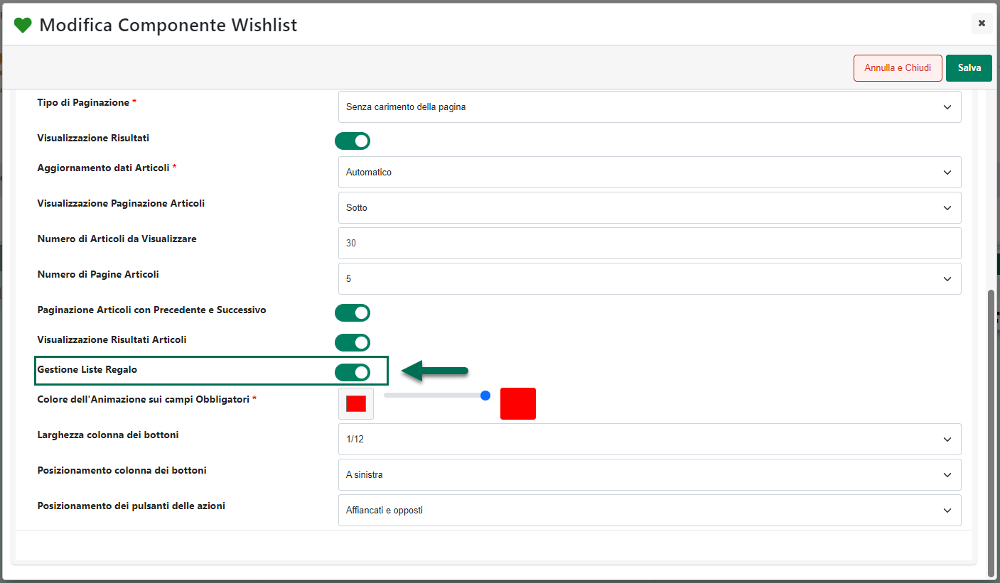
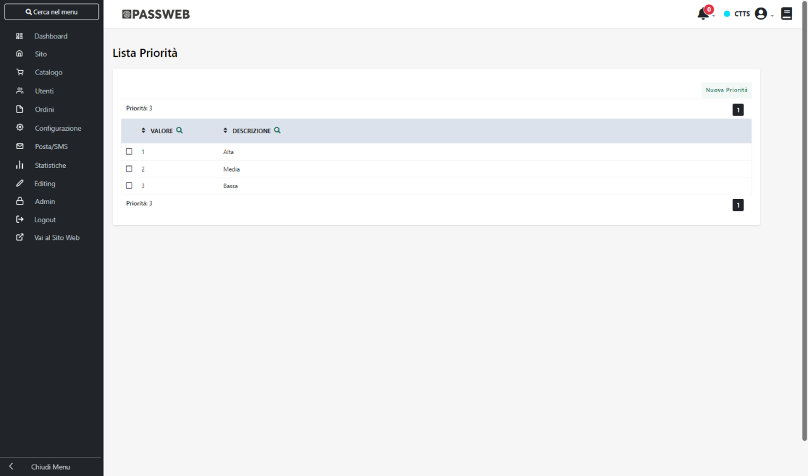
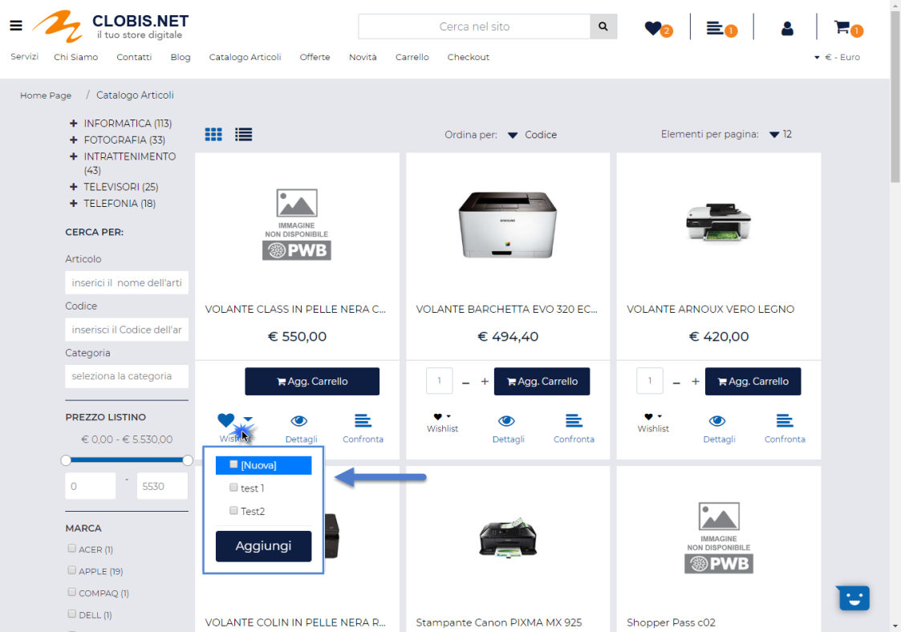

# CREAZIONE DI UNA LISTA REGALO

Il primo passo per poter attivare e gestire correttamente una "**Lista
Regalo**" all'interno del proprio sito Passweb è ovviamente quello che
prevede di mettere gli utenti del sito nelle condizioni di potersi
creare la propria Lista.

**ATTENZIONE!** **La creazione di una Lista Regalo è un'operazione che
dovrà essere effettuata direttamente sul front end del sito dall'utente
destinatario della lista stessa.**

Per poter far questo è necessario accertarsi di aver effettuato tutti i
passaggi di seguito indicati:

1.  Configurare il componente "**Wishlist Custom**" selezionando il
    parametro "**Gestione Liste Regalo**"

{width="5.815972222222222in"
height="3.392361111111111in"}

> Per maggiori informazioni in merito si veda anche la sezione
> "*Varianti Sito Responsive -- Lista Componenti Ecommerce -- Componente
> Wishlist Custom -- Configurazione*" di questo manuale

2.  Codificare correttamente le priorità che dovranno poi essere
    selezionabili dall'utente in fase di creazione della Lista Regalo
    operando, in questo senso, dalla sezione "Utenti -- Wishlist --
    Priorità" del Wizard

{width="5.809722222222222in"
height="3.423611111111111in"}

> Per maggiori informazioni in merito si veda anche la sezione "*Utenti
> -- Wishlist -- Priorità*" di questo manuale

3.  Inserire all'interno del componente "**Wishlist Custom**" i
    Componenti per il Form "**Campo Lista Valori**" e "**Campo Area di
    Testo**" mappati rispettivamente sul valore "Priorità" e "Nota".

> **ATTENZIONE!** Nel caso in cui non dovessero essere inseriti
> all'interno della Wishlist Custom i suddetti componenti, l'utente non
> avrebbe poi la possibilità, in fase di creazione della lista, di
> associare, a nessuno degli articoli selezionati, una specifica
> priorità di acquisto e/o una specifica nota
>
> Per maggiori informazioni in merito si vedano anche le sezioni
> "*Varianti Sito Responsive -- Lista Componenti Ecommerce -- Componenti
> Interni ai componenti Ecommerce -- Componenti per il Form Campo Area
> di Testo*" e "*Varianti Sito Responsive -- Lista Componenti Ecommerce
> -- Componenti Interni ai componenti Ecommerce -- Componenti per il
> Form Campo Lista Valori*" di questo manuale

Una volta effettuate tutte le operazioni sopra indicate, per creare la
propria Lista Regalo sarà necessario:

1.  Effettuare l'autenticazione al sito

> **ATTENZIONE! Utenti non autenticati non avranno, ovviamente, la
> possibilità di salvare delle Wishlist ne tanto meno quella di creare e
> salvare Liste Regalo**

2.  Selezionare dal Catalogo gli articoli che dovranno far parte della
    propria Lista Regalo ed aggiungerli uno ad uno alla Wishlist
    Corrente

{width="5.097916666666666in"
height="3.582638888888889in"}

3.  Accedere alla pagina di gestione delle Wishlist (sempre sul front
    end del sito), impostare il campo "**Tipologia**" nel form di
    salvataggio della Wishlist sul valore "**Lista Regalo**", compilare
    tutti i campi presenti nel form (Titolo Evento, Organizzatori, Data
    Evento ecc...) e salvare la Wishlist

{width="5.086111111111111in"
height="3.423611111111111in"}

> **ATTENZIONE!** Il campo "Tipologia" nel form di salvataggio della
> Wishlist verrà visualizzato solo ed esclusivamente nel caso in cui in
> fase di configurazione del componente stesso sia stato selezionato il
> parametro "**Gestione Liste Regalo**"

4.  Una volta salvata la Wishlist come Lista Regalo individuarla
    all'interno della sottostante tabella delle Wishlist salvate e
    cliccare sul pulsante "Visualizza"

{width="5.208333333333333in"
height="3.4972222222222222in"}

> In questo modo verrà caricata la Wishlist precedentemente salvata e in
> corrispondenza di ogni singolo articolo verranno ora visualizzati
> anche i campi "**Nota**" e "**Priorità**" (posto ovviamente di aver
> inserito e configurato correttamente i relativi componenti)

{width="5.208333333333333in"
height="3.171527777777778in"}

> **ATTENZIONE!** Per poter visualizzare i campi "**Nota**" e
> "**Priorità**" è necessario per prima cosa salvare una Wishlist come
> "Lista Regalo" e visualizzarne poi il dettaglio

5.  Utilizzare quindi i campi "**Nota**" e "**Priorità**" per associare
    ad ogni articolo presente in lista una specifica nota ed una
    specifica priorità

> ATTENZIONE! I valori disponibili all'interno del campo "Priorità" sono
> quelli codificati all'interno della corrispondente sezione del Wizard
> ("*Utenti -- Wishlist -- Priorità*")

6.  Una volta assegnata anche la priorità ed un eventuale nota agli
    articoli presenti in Lista, la Lista è completa e potrà quindi
    essere condivisa dal suo creatore in modo tale da fornire agli
    "inviati" il link alla specifica sezione del sito cui accedere per
    effettuare l'acquisto degli articoli in essa presenti

