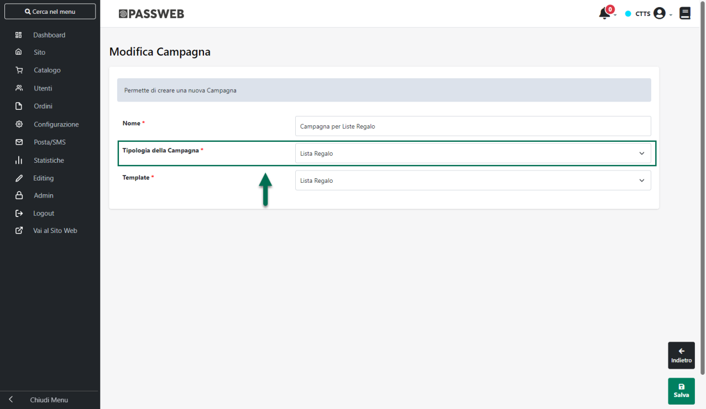
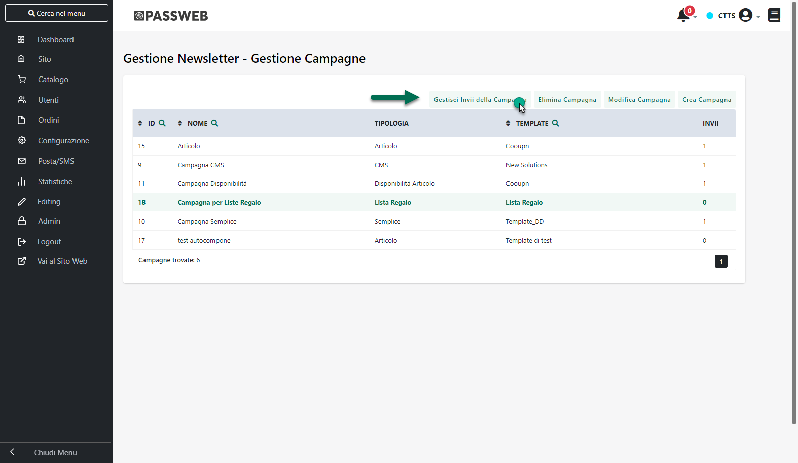
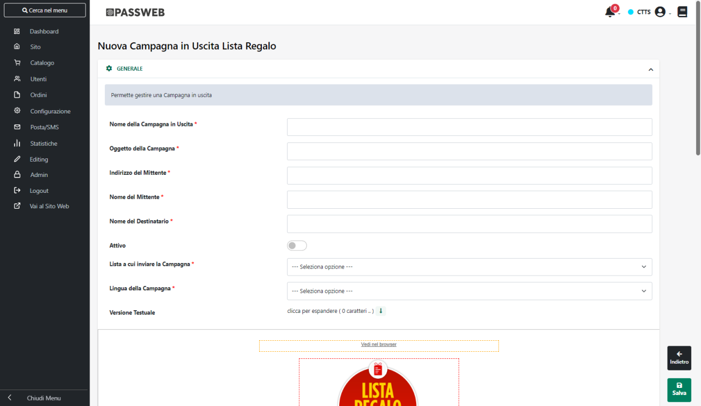
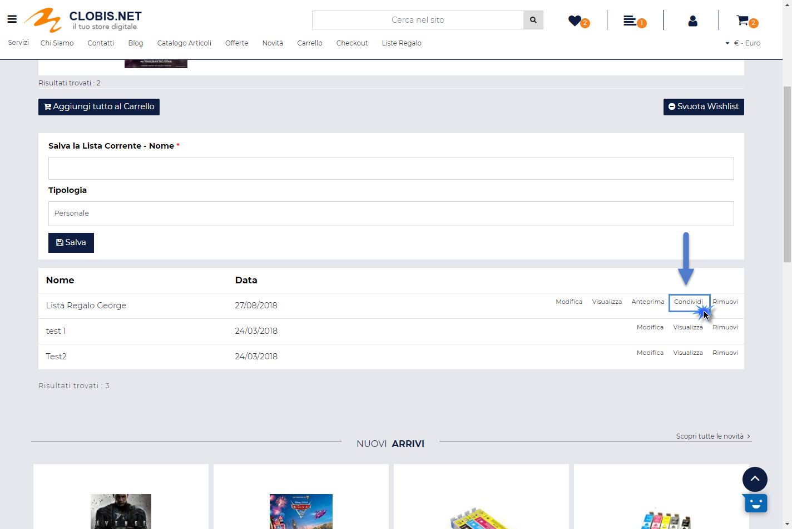
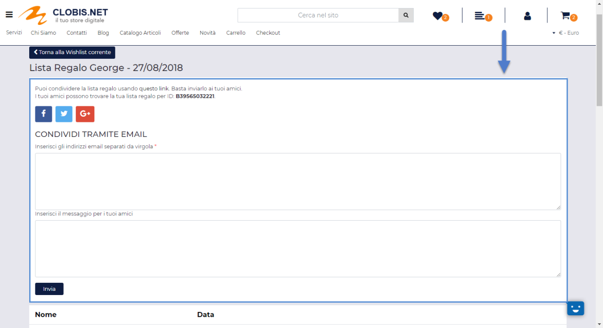

# CONDIVISIONE DI UNA LISTA REGALO

Di base la condivisione di una Lista Regalo con i suoi "inviati" può
avvenire in due modi diversi:

- **Via Social Network** -- opzione sempre disponibile

- **Via Email** -- opzione disponibile solo se attivata sulla
  corrispondente tipologia di Wishlist. Richiede la corretta
  integrazione del proprio sito Passweb con MailChimp e la creazione di
  apposite Campagne.

In particolare per poter attivare la condivisione delle Liste Regalo via
mail è necessario accertarsi di aver completato correttamente tutti i
passi di seguito indicati:

1.  Accedere alla sezione "*Utenti -- Wishlist -- Tipologie*" del
    Wizard, selezionare la Tipologia "**Lista Regalo**" e cliccare sul
    pulsante "**Modifica Tipologia**" presente nella contestuale barra
    degli strumenti in maniera tale da accedere alla maschera di
    configurazione della Tipologia in esame

> **Assicurarsi quindi di selezionare il parametro "Email"**
>
> **ATTENZIONE!** Nel caso in cui il parametro indicato non dovesse
> essere selezionato le Liste Regalo potranno essere condivise solo ed
> esclusivamente via Social Network
>
> Per maggiori informazioni in merito si veda anche la sezione "*Utenti
> -- Wishlist -- Tipologie*" di questo manuale.

2.  Attivare e configurare correttamente l'integrazione tra il proprio
    sito Passweb e MailChimp (il servizio di terze parti utilizzato da
    Passweb per gestire invii massivi di mail)

> Per maggiori informazioni in merito si consulti anche la sezione
> "*MailChimp*" di questo manuale

3.  Creare su MailChimp una **Lista Utenti vuota ad uso esclusivo delle
    Liste Regalo**

> Per maggiori informazioni relativamente alla creazione di una Lista
> Utenti in MailChimp si rimanda alla specifica documentazione di
> prodotto oppure a quanto indicato alla sezione "*MailChimp --
> Creazione e Gestione Liste*" di questo manuale

4.  Creare su MailChimp un Template da poter utilizzare nell'invio delle
    mail di invito alla Lista Regalo

> Per maggiori informazioni relativamente alla creazione di una Template
> in MailChimp si rimanda alla specifica documentazione di prodotto
> oppure a quanto indicato alla sezione "*MailChimp -- Gestione e
> Utilizzo dei Template*" di questo manuale

5.  Sincronizzare il sito Passweb con il proprio account MailChimp in
    maniera tale da accertarsi di aver importato correttamente la Lista
    Utenti ed il Template di cui ai punti precedenti

6.  Configurare, lato Passweb, il Template di cui al punto 4 **in
    maniera tale da poterlo utilizzare in una Campagna di tipo "Lista
    Regalo"** e quindi nelle mail di invito alla Lista stessa

> Per maggiori informazioni in merito alla configurazione lato Passweb
> di un Template MailChimp in maniera tale da poterlo utilizzare
> all'interno di una determinata Campagna si veda anche la sezione
> "*MailChimp -- Newsletter Passweb e MailChimp -- Passweb Gestione
> Newsletter -- Templates -- Modifica e Configurazione di un Template*"
> di questo manuale

7.  Creare in Passweb una Campagna di tipo **"Lista Regalo"**
    selezionando per essa il Template appena configurato

> Per maggiori informazioni relativamente alla creazione di Campagne in
> Passweb si veda anche la sezione "*MailChimp -- Newsletter Passweb e
> MailChimp -- Gestione Newsletter -- Campagne*" di questo manuale

8.  Gestire per la Campagna creata al punto precedente **un invio per
    ciascuna delle lingue presenti all'interno del sito**

> Per poter effettuare quest'ultima operazione sarà necessario portarsi
> per prima cosa all'interno della sezione "*Sito -- Gestione Newsletter
> -- Campagne*" del Wizard, selezionare la Campagna creata al punto
> precedente e cliccare sul pulsante "**Gestisci invii per la
> Campagna**" presente nella barra degli strumenti

> Nella successiva maschera verranno visualizzati gli invii già
> codificati per la Campagna in esame.
>
> Per gestire un nuovo invio sarà quindi necessario cliccare sul
> pulsante "**Nuovo Invio Campagna Lista Regalo**" presente nella barra
> degli strumenti e inserire tutti i parametri necessari per la
> configurazione dell'invio.

> Nello specifico sarà necessario indicare:

- **Nome della Campagna in Uscita:** nome identificativo per l'invio che
  si sta codificando

- **Oggetto della Campagna:** oggetto che dovrà essere utilizzato nelle
  mail inviate dalla campagna in esame

- **Indirizzo del mittente:** indirizzo mail che dovrà essere utilizzato
  come indirizzo del mittente nelle mail inviate dalla campagna in esame

- **Nome del Mittente:** nome del mittente che verrà associato
  all'indirizzo indicato nel campo precedente e che conseguentemente
  verrà visualizzato nei vari client di posta all'interno del campo "Da"

- **Nome del destinatario:** nome identificativo per i destinatari delle
  mail inviate dalla campagna in esame (es. "Richiesta disponibilità
  Articoli"). Tale nome verrà poi visualizzato nei vari client di posta
  all'interno del campo "A"

- **Attivo:** consente di marcare come Attivo l'invio che si sta
  codificando.

> Nel momento in cui dovranno essere effettivamente inviate le mail di
> invito alla Lista Regalo **verranno considerati solo ed esclusivamente
> gli Invii codificati per Campagne di tipo "Lista Regalo Articolo"
> marcati come Attivi**

- **Lista a cui inviare la Campagna:** consente di selezionare la
  specifica lista di iscritti cui dovrà essere inviata la mail di
  notifica. Andrà ovviamente selezionata, tra quelle proposte, la lista
  creata al punto 3.

> Gli utenti della Lista verranno aggiunti automaticamente
> dall'applicazione sulla base degli indirizzi mail inseriti dal
> creatore della Lista stessa in fase di condivisione

- **Lingua della Campagna:** consente di associare lo specifico Invio ad
  una delle lingue gestite all'interno del sito. Necessaria per poter
  inviare agli utenti del sito la mail di invito nella lingua corretta.

> Nel caso in cui il sito sia Multilingua sarà quindi necessario
> codificare un Invio per ciascuna delle lingue gestite
>
> **ATTENZIONE!** Nel caso in cui si dovesse configurare un solo invio
> per la lingua italiana, pur gestendo ad esempio anche la lingua
> inglese, eventuali utenti che dovessero condividere una Lista Regalo a
> partire dal sito in inglese potrebbero inviare mail di invito in una
> lingua diversa da quella desiderata
>
> **NOTA BENE**: è possibile attivare un solo invio per lingua. Nel caso
> in cui si dovesse selezionare il parametro Attivo per un invio
> associato ad un determinata lingua verranno quindi automaticamente
> disattivati eventuali altri invii codificati per la stessa lingua.

- **Versione Testuale (campo non obbligatorio):** consente di impostare
  una versione testuale per la mail di invito alla Lista Regalo. La
  versione testuale verrà visualizzata solo ed esclusivamente da quei
  client di posta che non risultino avere abilitata la visualizzazione
  delle mail ricevute in formato HTML

- **Template Newsletter:** all'interno di questa sezione sarà possibile
  impostare, in maniera definitiva, i contenuti della mail di invito.

> In questo senso dunque, verrà visualizzato il Template selezionato al
> punto 7 e, per esso, sarà possibile impostare in maniera definitiva i
> soli contenuti delle sezioni che, in fase di configurazione del
> template, sono state impostate per accettare dei contenuti
> personalizzati (e non mappate dunque con eventuali campi della Lista
> Regalo)
>
> **ATTENZIONE!** **A differenza degli Invii associati a Campagne
> Semplici o CMS, in questo caso non sarà possibile schedulare l'invio
> delle mail ne tanto meno scegliere di inviarle immediatamente.**
>
> L'effettiva creazione della Campagna in MailChimp, l'inserimento degli
> Utenti in Lista e il conseguente invio delle Mail di invito avverrà
> infatti in maniera completamente automatica nel momento in cui un
> utente dovesse decidere di condividere via mail la propria Lista
> Regalo inserendo nell'apposito campo tutti gli indirizzi degli
> invitati alla Lista stessa

Una volta effettuate tutte le operazioni sopra indicate, per condividere
la propria Lista Regalo un utente dovrà:

1.  Effettuare l'autenticazione al sito

> **ATTENZIONE! Utenti non autenticati non avranno, ovviamente, la
> possibilità di gestire Liste Regalo**

2.  Accedere alla pagina di gestione delle Wishlist, individuare
    all'interno della tabella delle Wishlist salvate quella relativa
    alla propria Lista Regalo e cliccare sul pulsante "**Condividi"**

> Cliccando su questo pulsante verrà infatti visualizzata un ulteriore
> sezione all'interno della quale l'utente avrà la possibilità di
> condividere la Lista Regalo in oggetto via social (Facebook, Twitter
> e/o Google +) oppure via mail

3.  Per effettuare la condivisione via Social sarà sufficiente cliccare
    sull'icona del corrispondente Social Network

> **ATTENZIONE!** Verranno condivisi il Titolo della Lista Regalo,
> l'Immagine ad essa associata e ovviamente il link di accesso al sito
> per poter visionare la Lista ed acquistarne i prodotti

4.  Per effettuare la condivisione via mail è invece sufficiente
    inserire all'interno dei campi evidenziati in figura gli indirizzi
    Email di tutti gli invitati (separati da ;) e uno specifico
    messaggio di invito.

> Cliccando sul pulsante "**Invia**" (e posto di aver effettuato
> correttamente tutto quanto indicato ai punti precedenti) verranno
> immediatamente inoltrate le rispettive mail di invito alla Lista
> Regalo

