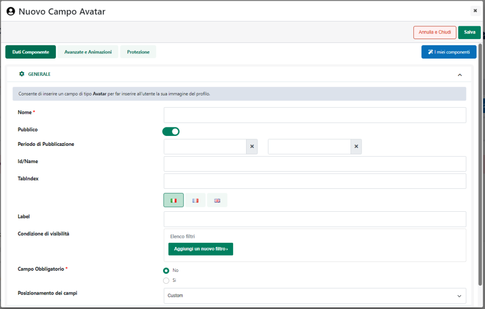

# COME EFFETTUARE ACQUISTI UTILIZZANDO PUNTI PREMIO

Come più volte evidenziato, in Passweb, è possibile attivare e gestire
sistemi di Raccolta Punti che consentiranno agli utenti del sito, a
seguito di determinate azioni (es. registrazione, chiusura di un ordine
...), di accumulare punti che potranno poi essere utilizzati per
effettuare nuovi acquisti all'interno del sito stesso.

Di seguito sono indicati gli step principali attraverso cui passare per
poter creare e gestire in maniera corretta un sistema di questo tipo:

- Codificare una nuova Raccolta Punti agendo in questo senso all'interno
  della sezione "*Utenti -- Punti -- Gestione Punti*" del Wizard

- Definire le regole secondo cui gli utenti potranno accumulare i vari
  punti

- Attivare la Raccolta Punti in esame. Raccolte punti codificate
  all'interno del Wizard ma non attivate non produrranno nessun tipo di
  accumulo punti.

> **ATTENZIONE!** Non è possibile attivare contemporaneamente due o più
> sistemi di raccolta punti. Nel momento in cui si dovesse decidere
> dunque di attivare una determinata Raccolta Punti tutte le altre
> verranno automaticamente disattivate

- Inserire all'interno di elementi quali il catalogo ecommerce, la
  scheda prodotto, le offerte / novità ... il Componente "**Punti**" in
  maniera tale da consentire agli utenti del sito di avere una visione
  chiara di quelli che saranno i punti accumulati nel momento in cui
  dovessero decidere di acquistare un determinato articolo

- Attivare in Carrello il parametro "**Visualizza Scarico Punti**" in
  maniera tale da consentire agli utenti di verificare, già dal carrello
  quello che sarà il totale che andrebbero a pagare nel momento in cui
  dovessero decidere di utilizzare il proprio saldo punti

- Inserire e configurare all'interno della pagina "**Punti Premio**"
  l'omonimo componente in maniera tale da mettere ogni utente del sito
  nelle condizioni di poter verificare in ogni momento il dettaglio del
  proprio saldo punti e delle transazioni che lo hanno generato

In queste condizioni, nel momento in cui un utente del sito dovesse
accedere al Catalogo potrà avere una visione immediata dei punti che
ogni singolo prodotto gli permetterebbe effettivamente di guadagnare

All'interno della pagina Carrello comparirà invece la sezione "**Punti
Premio**" con all'interno il check "**Usa il saldo punti**",
l'indicazione del numero massimo di punti gestibili per l'ordine in
esame e il corrispondente importo espresso nella valuta corrente

**ATTENZIONE!** affinché la sezione "Punti Premio" possa essere
effettivamente visualizzata è anche necessario che l'utente abbia già
effettuato la login al sito e che abbia un saldo punti diverso da zero

Sempre in carrello ma questa volta nel riepilogo dei totali verranno
visualizzate, tra le altre, anche le voci "**Punti Guadagnati**" e
"**Punti Spesi**"

con l'indicazione rispettivamente dei punti che l'utente andrebbe
effettivamente a guadagnare nel momento in cui dovesse chiudere quel
carrello e dei punti che verrebbero invece sottratti dal suo saldo nel
momento in cui dovesse decidere di utilizzare quelli fin' ora
accumulati.

**ATTENZIONE! I punti accumulati potranno essere utilizzati solo ed
esclusivamente per ordini successivi a quelli che hanno prodotto il
relativo accumulo**

**ATTENZIONE!** **I punti accumulati a seguito di ordini in stato di
"Pagamento non confermato / Da Verificare"** verranno comunque assegnati
all'utente ma inseriti tra i "**Punti Provvisori**" e, ovviamente, **non
potranno essere spesi fintanto che l'ordine resterà in questo stato**

Ovviamente l'effettivo utilizzo dei punti accumulati sull'ordine in
essere avverrà solo all'interno della pagina di Checkout.

In questo senso è bene sottolineare infatti che mentre nel componente
Carrello la visibilità del check "Usa il saldo punti" è subordinata alla
configurazione del parametro "Visualizza Scarico Punti", **in Checkout
lo stesso check verrà automaticamente visualizzato, all'interno della
sezione pagamenti, nel momento in cui l'utente dovesse avere un saldo
punti diverso da zero e quindi effettivamente spendibile per l'ordine in
questione**

**ATTENZIONE!** tanto in carrello quanto in checkout l'importo
visualizzato in corrispondenza del check "Usa il saldo" dipende
ovviamente da come è stato configurato il relativo sistema di raccolta
punti e, nello specifico, da quello che è il valore assegnato al singolo
punto.

Nello specifico poi relativamente al computo dei punti utilizzabili
verranno sempre presi in considerazione per primi quelli che stanno per
scadere.

Se poi si è in modifica di un ordine sospeso verranno considerati
spendibili anche i punti gestiti sull'ordine iniziale.

Infine, nel momento in cui il saldo punti attuale dovesse coprire
interamente l'ordine, azzerando i totali del documento:

- in carrello verrà automaticamente nascosto il modulo che consente
  all'utente di richiedere un preventivo sulle eventuali spese di
  pagamento

- in checkout verranno automaticamente nascoste le diverse opzioni di
  pagamento

In queste condizioni, inoltre, l'ordine verrà inserito all'interno del
gestionale con il campo relativo al pagamento non valorizzato.

**ATTENZIONE!** **per fare in modo che l'applicazione del saldo punti
possa funzionare in maniera corretta è indispensabile selezionare, tra i
parametri di configurazione del componente Checkout, il campo**
"**Visualizza Totale**"

Nel caso in cui il parametro indicato non dovesse essere selezionato,
non verranno visualizzati i Totali del documento e l'applicazione del
saldo punti potrebbe non avvenire in maniera corretta

Una volta chiuso l'ordine i punti guadagnati verranno aggiunti
automaticamente al saldo dell'utente, saldo questo che potrà essere
visionato in un qualsiasi momento all'interno della pagina "**Punti
Premio**", posto ovviamente di aver inserito in questa pagina il
relativo componente.

In questo senso è bene sottolineare che il componente "Punti Premio"
sarà visibile solo dopo aver effettuato l'autenticazione per cui
l'utente dovrà essere messo nelle condizioni di ricevere questo tipo di
informazione (utilizzando ad esempio un messaggio del tipo "Per
visualizzare il tuo saldo punti devi essere autenticato") e,
soprattutto, dovrà essere messo nelle condizioni di poter effettuare
l'autenticazione al sito.

Come evidenziato in figura tale componente è suddiviso poi in tre
distinte sezioni. Nella parte alta verrà visualizzato il Saldo Punti
attuale dell'utente, con il dettaglio di quelli che sono i punti
guadagnati, provvisori, spesi e scaduti.

Nello specifico la voce:

- **Punti Guadagnati**: indica il numero di punti che, allo stato
  attuale, possono effettivamente essere utilizzati in fase di ordine

- **Punti Provvisori**: indica il numero di punti accumulati ma che non
  possono ancora essere effettivamente utilizzati (perché provenienti,
  ad esempio, da un ordine in stato di "Pagamento non confermato" e per
  il quale non c'è quindi ancora la certezza del pagamento)

- **Punti Spesi**: indica il numero dei punti già utilizzati nel corso
  di precedenti ordini

- **Punti Scaduti**: indica il numero di punti, che alla data attuale,
  risultano scaduti e quindi non più utilizzabili

In merito poi a quelli che sono i punti effettivamente utilizzabili o
meno in fase di ordine occorre sempre ricordare che:

- I punti accumulati potranno eventualmente essere utilizzati solo ed
  esclusivamente per ordini successivi a quelli che hanno prodotto il
  relativo accumulo

- Verranno considerati come "Guadagnati" e saranno quindi effettivamente
  utilizzabili solo ed esclusivamente i punti generati da ordini per cui
  si ha la certezza dell'avvenuto pagamento. Ciò significa che potranno
  quindi essere utilizzati solo ed esclusivamente i punti accumulati a
  seguito di ordini che sono stati trasformati in bolla o fattura

- Come conseguenza di quanto indicato al punto precedente è chiaro che:

  - I punti relativi ad ordini in stato diverso da "Trasformato" o
    "Annullato" verranno sempre e comunque considerati come punti
    "Provvisori"

  - Nel momento in cui si dovesse decidere di attivare una Raccolta
    punti sarà poi necessario esportare all'interno del sito le bolle /
    fatture generate da ordini Web. In caso contrario infatti il sito
    non potrà mai avere la certezza dell'avvenuto pagamento e, in
    conseguenza di ciò, la voce "Punti Guadagnati" potrebbe risultare a
    0 o comunque non indicare il numero di punti che l'utente potrebbe
    effettivamente utilizzare a seguito di ordini effettivamente pagati.

- I punti spesi per ordini che risultano essere nello stato di
  "**Pagamento non confermato / Da Verificare**" verranno eventualmente
  riaccreditati solo dopo che l'ordine sarà stato correttamente
  annullato da gestionale, da Wizard o da Sito (nel caso in cui sia
  stata attivata la possibilità di modificare gli ordini in sospeso)

Immediatamente al di sotto della sezione contenente il dettaglio del
Saldo, verrà invece visualizzata una ripartizione dettagliata dei punti
accumulati in base alla loro scadenza

Infine all'interno dell'ultima sezione, l'utente avrà la possibilità
visualizzare il dettaglio di tutte le transazioni che hanno determinato
l'attuale saldo punti.

Per ciascuna delle transazioni presenti all'interno di questa tabella
viene indicato:

- la **data** in cui la transazione si è verificata

- la **descrizione**, e quindi anche la tipologia, della transazione.

> In particolare poi nel momento in cui l'accumulo o la sottrazione di
> punti dovesse essere stata determinata da un ordine effettuato
> all'interno del sito, verrà indicato anche l'identificativo del
> corrispondente documento e cliccando su di esso sarà possibile
> visionarne anche il dettaglio

- il **numero di punti** accumulati / sottratti

- la **data di scadenza** dei relativi punti

