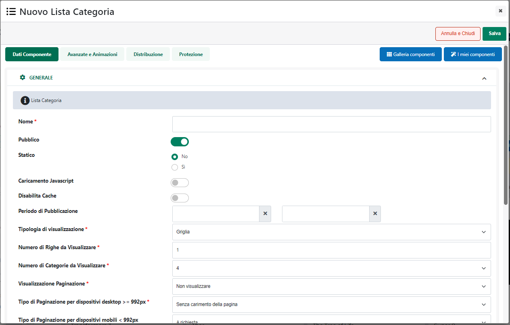

# CONFIGURAZIONE

Una volta inserito il Componente all'interno della pagina web, verrà
aperta in automatico **la sua maschera di gestione e configurazione**

suddivisa in varie sezioni.

All'interno della sezione "**Dati Componente**" sarà possibile inserire
il contenuto e settare i principali parametri di configurazione del
componente.

In particolare, per la tipologia di Componente in questione, sarà
possibile impostare un valore per i seguenti parametri:

**Nome** (obbligatorio), consente di inserire un nome per il Componente
Paragrafo che si sta realizzando

**Pubblico (selezionato a default):** consente di impostare la
visibilità del componente lato sito web.

**Periodo di Pubblicazione:** consente di associare al Componente in
oggetto uno specifico periodo di pubblicazione, definendone l'effettiva
data di pubblicazione e la corrispondente data di oscuramento.

**ATTENZIONE!** Per maggiori informazioni relativamente ai parametri
**Nome, Pubblico, Periodo di Pubblicazione** si veda anche quanto
indicato all'interno del capitolo "*Configurazione Componenti --
Caratteristiche generali* -- *Dati Componente* " di questo manuale

**Caricamento Javascript**: se selezionato, consente di caricare il
relativo componente in maniera asincrona al termine del caricamento
della pagina web.

**Statico**: consente di decidere se il componente in esame deve o meno
essere reso statico. In questo senso considerando che, tipicamente,
questo tipo di componente :

- viene distribuito su tutte le pagine di categoria

- mostra articoli diversi a seconda della pagina di categoria in cui è
  inserito

nelle suddette condizioni non dovrebbe ovviamente essere staticizzato in
quanto potrebbe poi mostrare sul front end dati non corretti.

**ATTENZIONE!** Per maggiori informazioni relativamente ai parametri
**Caricamento Javascript** e **Statico** si veda anche quanto indicato
all'interno del capitolo "*Configurazione Componenti -- Caratteristiche
generali* -- *Staticizzazione e caricamento asincrono*" di questo
manuale

**Disabilita Cache:** consente di disabilitare la possibilità di
inserire in cache il componente in esame.

Per maggiori informazioni relativamente alla gestione della cache in
Passweb si veda anche il relativo capitolo di questo manuale
("*Configurazione -- Cache*")

**Tipologia di visualizzazione:** consente di definire la tipologia del
contenitore delle categorie merceologiche che dovrà essere pubblicato
all'interno del sito.

E' possibile selezionare uno dei seguenti valori:

- **Griglia:** selezionando questa opzioni le categorie presenti
  all'interno del componente verranno visualizzate in una griglia
  paginata perfettamente responsiva e organizzata su di un certo numero
  di righe e di colonne impostabili mediante i successivi parametri
  presenti all'interno di questa stessa maschera di configurazione

- **Slider:** selezionando questa opzione le categorie presenti
  all'interno del componente verranno disposte su di un\'unica riga
  all'interno di uno slider a scorrimento orizzontale.

**Autoplay (solo per configurazioni di tipo Slider):** consente di
decidere se abilitare o meno l'autoplay dello slider.

Se impostato sul valore "**Si avvia lo slider al caricamento**", al
caricamento della pagina web verrà attivato lo scorrimento automatico
delle varie Slide.

Se impostato a **NO** per passare da una Slide all'atra sarà necessario
cliccare su uno dei controlli di scorrimento abilitati.

**ATTENZIONE!** una volta abilitato l'autoplay, occorre comunque
ricordare che nel momento in cui l'utente dovesse decidere di cliccare
sui pulsanti di controllo, lo scorrimento automatico verrà arrestato.

**Tempo di pausa per autoplay (ms)**: visibile solo nel caso in cui il
precedente parametro "Autoplay" sia stato impostato sul valore "SI avvia
lo slider al caricamento".

Consente di impostare l'intervallo di tempo (in millisecondi) che dovrà
intercorrere tra il passaggio da una Slide all'altra.

**Numero massimo di slide caricabili (solo per configurazioni di tipo
Slider):** consente di impostare il numero massimo di slide che dovranno
essere caricate all'interno del componente.

**Tempo di animazione:** consente di impostare la durata, in
millisecondi, dell\'animazione di passaggio da una slide all'altra.

**Numero di Righe da Visualizzare (solo per visualizzazioni a
griglia):** consente di impostare il numero di righe della griglia di
visualizzazione delle categorie.

**ATTENZIONE!** Nel caso in cui per il componente "Lista Categorie" sia
stata impostata come tipologia di visualizzazione lo Slider, queste
verranno disposte sempre e soltanto su di un\'unica riga

**Numero di Categorie da visualizzare:** consente di impostare il numero
di categorie per riga.

In relazione a questo parametro vanno fatte poi alcune considerazioni di
fondamentale importanza legate al comportamento responsivo del
componente.

In particolare dunque è bene ricordare che:

- Nel caso in cui sia stata impostata come tipologia di visualizzazione
  la griglia, indipendentemente dal numero di categorie che si è scelto
  di visualizzare all'interno di ogni singola riga, per risoluzioni
  **inferiori ai 992 px** verranno sempre visualizzate 2 sole categorie
  per riga.

Analogamente per risoluzioni **inferiori a 768 px** la griglia si
linearizzerà mostrando una categoria per ogni riga

- Nel caso in cui sia stata impostata come tipologia di visualizzazione
  lo slider, indipendentemente dal numero di categorie che si è scelto
  di visualizzare all'interno della singola riga, per risoluzioni
  **inferiori ai 992 px** lo slider mostrerà sempre e soltanto una sola
  categoria alla volta

**Posizione bottoni Slider (solo per visualizzazioni a slider):**
consente di decidere, selezionando una delle possibili combinazioni
presenti all'interno del corrispondente menu a tendina, dove dovranno
essere collocati i pulsanti di scorrimento dello slider.

**Visualizzazione Paginazione (solo per visualizzazioni a griglia):**
consente di decidere se e dove visualizzare (rispetto al Componente
stesso) i collegamenti alle varie pagine.

**Numero di Pagine (solo per visualizzazioni a griglia):** consente di
impostare, selezionandolo dal relativo menu a tendina, il numero di
pagine che dovranno essere visualizzate nei controlli di paginazione.
Ovviamente oltre al numero indicato all'interno di questo campo nei
controlli di paginazione saranno sempre visibili anche la prima e
l'ultima pagina disponibili.

**Questo campo viene visualizzato solo nel caso in cui il parametro
"Visualizza Paginazione" sia stato impostato su di un valore diverso da
"Non Visualizzare".**

**Paginazione con Precedente e Successivo (solo per visualizzazioni a
griglia):** se selezionato, nei controlli di paginazione, verranno
visualizzati anche i pulsanti "Precedente" e "Successivo".

**Questo campo viene visualizzato solo nel caso in cui il parametro
"Visualizza Paginazione" sia stato impostato su di un valore diverso da
"Non Visualizzare".**

**Tipo di Paginazione per dispositivi desktop (**\>= **992px) (solo per
visualizzazioni a griglia):** consente di definire il tipo di
paginazione da utilizzare, per il componente in oggetto, su dispositivi
desktop (risoluzione maggiore o uguale a 992px)

E' possibile selezionare uno dei seguenti valori:

- **Senza caricamento della pagina:** in questo caso ad ogni cambio
  pagina verranno ricaricati solo ed esclusivamente i dati presenti
  all'interno del componente in oggetto

- **Con caricamento della pagina:** in questo caso ad ogni cambio pagina
  verrà ricaricata l'intera pagina web (con la possibilità da parte
  dell'utente, di dover utilizzare la scroll bar per visualizzare i
  risultati presenti all'interno della nuova pagina)

- **A richiesta:** selezionando questa tipologia di paginazione verrà
  visualizzato sopra e/o sotto il componente (dipendentemente da come è
  stato impostato il precedente parametro "Visualizza Paginazione") un
  pulsante "**Mostra Altri Risultati**" che l'utente dovrà utilizzare
  per richiedere la visualizzazione delle categorie eventualmente
  presenti nelle successive pagine.

- **Scroll infinito (Lazy Loading):** selezionando questa tipologia di
  paginazione le categorie distribuite all'interno delle varie pagine,
  verranno visualizzate automaticamente mano a mano che l'utente
  scorrerà la pagina web verso l'alto

**Tipo di Paginazione per dispositivi mobile (\<** **992px) (solo per
visualizzazioni a griglia):** consente di definire il tipo di
paginazione da utilizzare, per il componente in oggetto, su dispositivi
mobile (risoluzione minore a 992px). E' possibile selezionare uno dei
seguenti valori:

- **Come Paginazione Desktop:** selezionando questa opzione verrà
  adottato lo stesso tipo di paginazione impostata anche per dispositivi
  desktop ( risoluzione \> = 992px)

- **A richiesta:** selezionando questa tipologia di paginazione verrà
  visualizzato sopra e/o sotto il componente (dipendentemente da come è
  stato impostato il precedente parametro "Visualizza Paginazione") un
  pulsante "**Mostra Altri Risultati**" che l'utente dovrà utilizzare
  per richiedere la visualizzazione delle categorie presenti nelle
  successive pagine.

- **Scroll infinito (Lazy Loading):** selezionando questa tipologia di
  paginazione le categorie distribuite all'interno delle varie pagine,
  verranno visualizzate automaticamente mano a mano che l'utente
  scorrerà la pagina web verso l'alto

**Elementi per pagina (solo per visualizzazioni a griglia):** consente
di indicare una lista di valori, sperati da virgole, corrispondenti al
numero di elementi che potranno essere visualizzati in ogni singola
pagina del componente. Gli unici caratteri ammessi all'interno di questo
campo sono quelli numerici (0-9) e la virgola che dovrà essere
utilizzata come carattere separatore.

Nel momento in cui questo campo dovesse essere valorizzato in maniera
corretta, sul sito verrà poi visualizzato un menu a tendina contenente
l'elenco dei valori immessi.

Selezionando uno dei valori presenti in elenco il componente verrà
ricaricato e popolato con il numero di categorie per pagina indicati
dall'utente.

**ATTENZIONE! Modificando il numero di categorie per pagina il
componente ripartirà sempre dalla prima pagina**

**Visualizzazione Risultati:** se selezionato, consentirà di
visualizzare, nella parte bassa del componente, una stringa di testo
contenente il numero complessivo degli articoli presenti all'interno del
componente stesso.

Il testo di questa stringa può essere modificato e personalizzato alla
sezione \"Gestione Testi/Messaggi del Sito\" agendo sui testi del
componente in oggetto.

**Filtro Articoli:** consente di impostare una condizione di pre
filtraggio mediante la quale poter stabilire quali articoli dovranno
essere considerati o meno nella generazione della Lista Categorie.

**ATTENZIONE!** L'applicazione di un filtro articoli su di un componente
"Lista Categorie" potrebbe limitare, ovviamente, il numero di voci
presenti all'interno del componente e, allo stesso modo, potrebbe anche
andare ad impattare sull'indicazione del numero di articoli
eventualmente presente in corrispondenza di ciascuna voce.

**In conseguenza di ciò l'applicazione di un filtro articoli su di un
componente "Lista Categorie"** **andrebbe necessariamente considerata
soltanto nel momento in cui sia stata impostata un'analoga condizione di
pre filtraggio anche sul componente "Catalogo Ecommerce", in maniera
tale da mantenere correttamente allineati i due componenti.**

In caso contrario infatti potrebbero verificarsi situazioni in cui
cliccando su una delle voci del menu l'utente verrebbe ricondotto alla
relativa pagina di categoria che potrebbe però essere priva di articoli
(a causa di una condizione di pre filtraggio applicata al componente
"Catalogo Ecommerce") o quanto meno non contenere esattamente lo stesso
numero di articoli indicato a fianco della relativa voce.

Applicando invece anche alla Lista Categorie la stessa condizione di pre
filtraggio impostata sul componente Catalogo Ecommerce, le voci presenti
all'interno di questo componente, così come l'indicazione del numero di
articoli associati a ciascuna voce, rifletteranno esattamente gli
articoli effettivamente visualizzati in Catalogo.

**Campo di Ordinamento:** consente di indicare la specifica modalità di
ordinamento che dovrà essere adottata in relazione ai vari elementi
presenti all'interno del componente in oggetto.

E' possibile selezionare uno dei seguenti valori:

- **Casuale:** selezionando questa opzione gli elementi presenti
  all'interno del componente "Lista Categorie" verranno ordinati in
  maniera randomica

- **Codice:** selezionando questo valore gli elementi del componente
  "Lista Categorie" verranno ordinati sulla base di quello che è il
  codice, definito all'interno del gestionale, per la corrispondente
  categoria merceologica

- **Descrizione:** selezionando questo valore gli elementi del
  componente "Lista Categorie" verranno ordinati sulla base di quella
  che è la descrizione definita all'interno del gestionale per la
  corrispondente categoria merceologica (ordinamento di tipo Stringa)

- **Personalizzato:** selezionando questo valore gli elementi del
  componente "Lista Categorie" verranno ordinati sulla base del valore
  (numerico) assegnato in Passweb alla corrispondente categoria
  merceologica (campo **"Posizione nel Menu di Categoria"**)

> **NOTA BENE:** a differenza delle precedenti opzioni, l'ordinamento
> "Personalizzato" è un ordinamento di tipo numerico.
>
> Impostando questo tipo di ordinamento, nel caso in cui due o più
> elementi dello stesso livello abbiano lo stesso valore di ordinamento
> (stesso numero) queste verranno ordinate in base al codice della
> corrispondente categoria merceologica.
>
> Nel caso in cui invece per alcuni elementi non venga impostato nessun
> valore di ordinamento (campo **"**Posizione nel Menu di Categoria"
> vuoto) questi verranno collocati nelle ultime posizioni ed ordinati
> tra loro in base al codice della corrispondente categoria
> merceologica.

**Abilita le protezioni sulle singole voci:** selezionando questo
parametro verranno automaticamente nascoste tutte le voci collegate a
pagine di categoria articoli che l'utente attualmente connesso non è
abilitato a vedere.

Per maggiori informazioni su come abilitare delle restrizioni di
visualizzazione sulle specifiche pagine del sito si veda anche la
sezione "Live Editing per Varianti Responsive -- Pagine" di questo
manuale.

**Visualizza Numero di Articoli a fianco del Nome:** selezionando questo
parametro verrà visualizzato, a fianco del nome di ogni categoria
merceologica, il numero esatto di articoli presenti all'interno della
categoria stessa e di eventuali sue sottocategorie

**Nascondi le Categorie che non hanno Articoli associati:** selezionando
questo valore sarà possibile nascondere all'interno della lista
categorie tutte le voci corrispondenti a categorie merceologiche che non
contengono articoli.

**ATTENZIONE!** Questa opzione è incompatibile con la paginazione del
componente. Nel momento in cui si dovesse decidere di abilitarla verrà
quindi disabilitata, automaticamente, ogni eventuale opzione di
paginazione impostata mediante i precedenti parametri.

**Link al prodotto se unico:** selezionando questo parametro nel momento
in cui la categoria in esame dovesse contenere un solo articolo,
cliccando sul relativo elemento presente all'interno del componente
"Lista Categorie", anziché essere ricondotto alla pagina di categoria
l'utente verrà portato immediatamente alla pagina prodotto relativa
all'unico articolo presente

**Contestuale alla pagina:** consente di definire quali categorie
dovranno essere visualizzate all'interno del componente. E' possibile
selezionare uno dei seguenti valori:

- **SI:** in questo caso all'interno del componente verrà visualizzata
  una cella per ogni categoria figlia della categoria merceologica
  corrispondente alla Pagina Catalogo in cui il componente è stato
  inserito

- **NO:** in questo caso all'interno del componente verrà visualizzata
  sempre e comunque una cella per ogni categoria di livello 0
  indipendentemente dalla pagina Catalogo in cui il componente stesso è
  stato inserito.

**ATTENZIONE!** Il parametro "Contestuale alla pagina" ha effetto solo
ed esclusivamente nel momento in cui il componente "Lista Categorie"
dovesse essere inserito all'interno di una Pagina Catalogo (pagina blu).

In tutti gli atri casi (Pagine Generiche e Pagine Ecommerce) all'interno
del componente verrà visualizzata sempre e comunque una cella per ogni
categoria di livello 0

Il pulsante "**Salva**" nella parte alta della maschera consentirà di
salvare le modifiche apportate al Componente in oggetto.

**NOTA BENE:** per maggiori informazioni relativamente alle sezioni
"**Avanzate e Animazioni**", "**Distribuzione**" e "**Protezione**",
presenti nella maschera di gestione e configurazione di tutti i
componenti Passweb, si veda anche il capitolo " Varianti Responsive --
Configurazione Componenti -- Caratteristiche Generali " di questo
manuale.

Per quel che riguarda la logica di gestione del suo contenuto, anche
**il Componente "Lista Categorie" può essere considerato a tutti gli
effetti come un "Componente di tipo Contenitore".**

Sarà quindi possibile inserire al suo interno tutta una serie di campi
necessari per poter definire che tipo di informazioni dovranno essere
visualizzate per ogni singola cella del componente. Tali campi, in ogni
caso, per poter esser gestiti liberamente, dovranno inevitabilmente
esser trattati a loro volta come Componenti autonomi editabili
singolarmente.

Una volta inserito quindi il Componente "Lista Categorie" all'interno di
una delle pagine consentite, per poterlo poi personalizzare sarà
necessario, attivare la modalità di gestione dei componenti, portarsi
sul Componente in esame e, alla comparsa del R.O.C. cliccare sull'icona
"**Accedi ai componenti interni"**

**Per maggiori informazioni relativamente alla gestione dei Componenti
di tipo Contenitore si veda anche il corrispondente capitolo di questo
manuale ("Live Editing per Varianti Responsive -- Componenti --
Componenti di tipo Contenitore")**

In particolare all'interno di un componente di tipo "Lista Categorie"
sarà possibile inserire due differenti tipologie di componenti.

- **Componenti Comuni:** contiene componenti generici che potranno
  essere utilizzati per completare graficamente il componente in esame.
  Per maggiori informazioni relativamente all'utilizzo di questi
  componenti si vedano le corrispondenti sezioni di questo manuale.

- **Componenti E-Commerce:** contiene tutti i componenti E-Commerce,
  ossia quei componenti necessari per abilitare e gestire determinate
  funzionalità oltre che, ovviamente, per poter definire che tipo di
  informazioni gestionali dovranno essere visualizzate per ogni singola
  cella presente all'interno del componente "Lista Categorie".

> **NOTA BENE:** per maggiori informazioni relativamente a come gestire
> i Componenti Ecommerce interni al componente "Lista Categorie" si veda
> la corrispondente sezione di questo manuale (Live Editing per Varianti
> Responsive -- Lista Componenti E-Commerce -- Componenti Interni ai
> Componenti Ecommerce).

L'inserimento di questi componenti avviene utilizzando le solite
tecniche di interazione con l'editor (Drag and Drop o Point and Click)
già esaminate all'interno di questo manuale (per maggiori informazioni
si rimanda allo specifico capitolo di questo manuale).

In ogni caso, comunque, il Componente "Lista Categorie" sarà costituito
da un certo numero di celle, dipendente dalla struttura delle categorie
merceologiche definite sul gestionale e dalla specifica pagina in cui il
componente in oggetto è stato inserito.

**I vari componenti (siano essi Componenti Comuni o Componenti
E-Commerce) potranno essere inseriti indistintamente all'interno di una
qualsiasi di queste celle (penserà poi l'applicazione a ripeterli, in
maniera completamente automatica all'interno di tutte le altre celle)**

