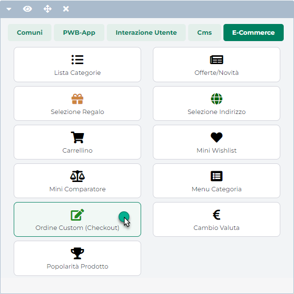
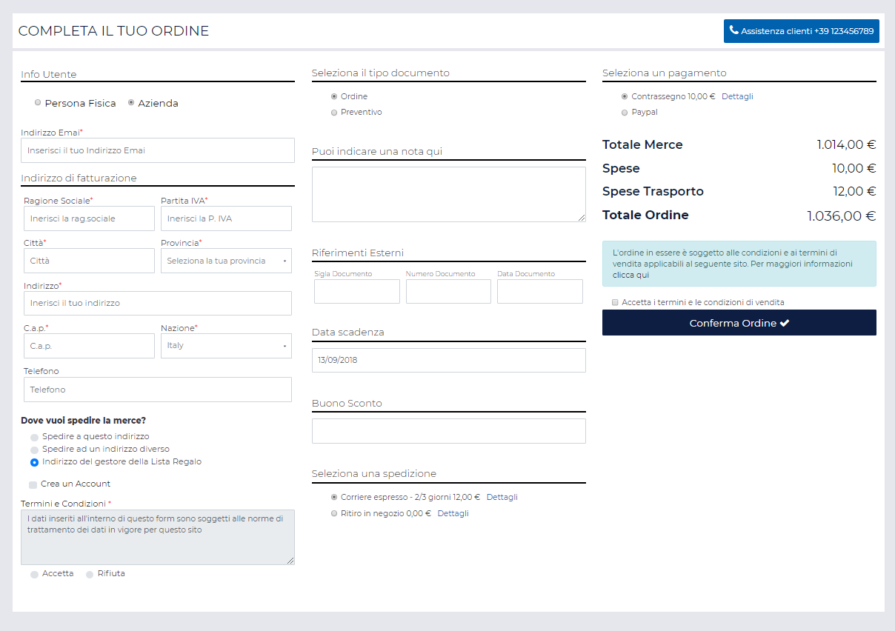
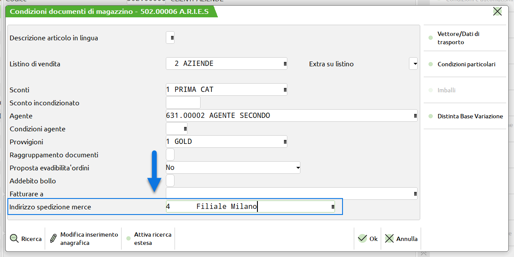
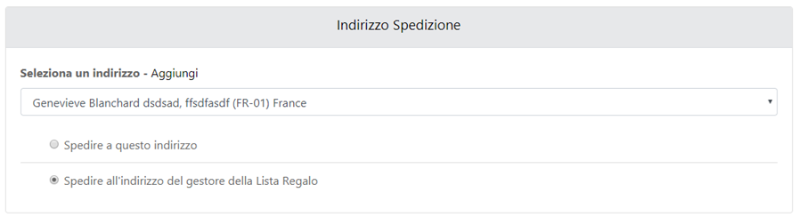
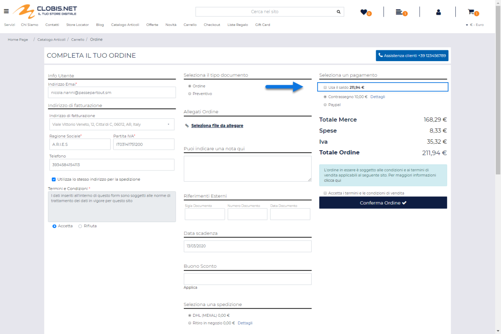
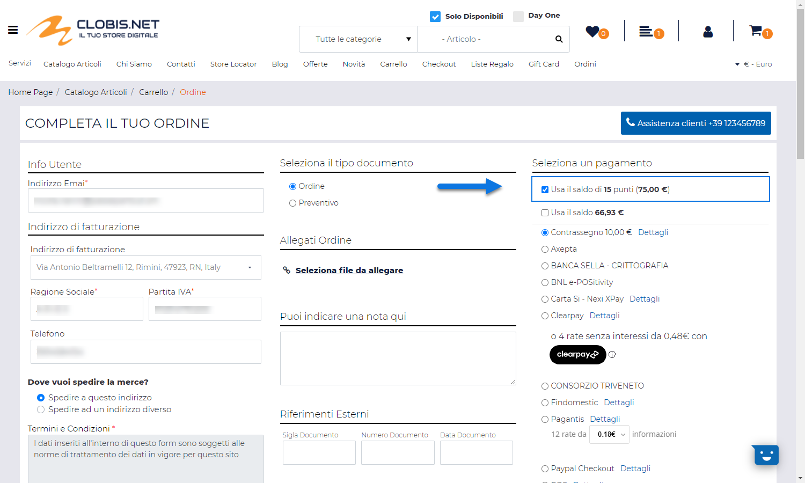
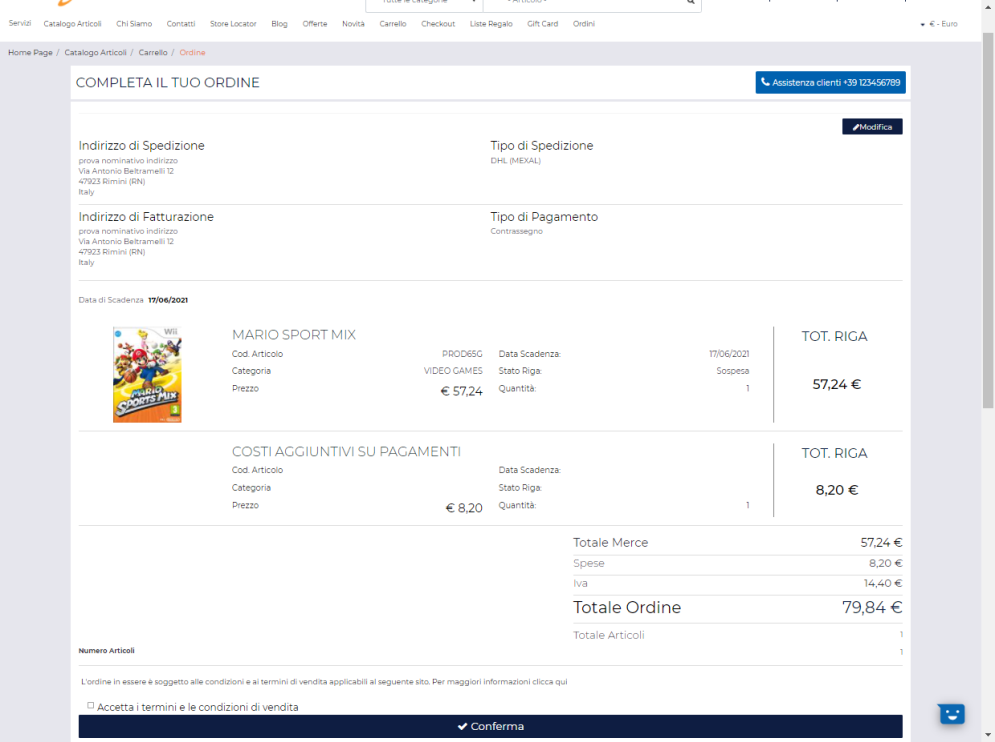

# COMPONENTE ORDINE CUSTOM (CHECKOUT)

Il Componente **"Ordine Custom(Checkout)"** può essere inserito,
ovviamente, soltanto all'interno della pagina "Ordine"

e consente di visualizzare **il modulo di Conferma Ordine** attraverso
cui l'utente dovrà necessariamente passare per poter confermare il
proprio ordine web, selezionando, tra le altre cose ad esempio, il
particolare tipo di pagamento che intende adottare, l'indirizzo a cui
farsi spedire la merce o ancora che tipo di spedizione selezionare tra
quelle proposte all'interno del sito.

Tale Componente è dunque di estrema importanza al fine di poter
consentire ai vari utenti di effettuare dei nuovi ordini.

**ATTENZIONE! Nel caso in cui l'esigenza dovesse essere quella di
consentire agli utenti del sito di inserire i propri dati (tra cui
l'indirizzo di spedizione) direttamente dalla pagina di Checkout,
realizzando magari un ordine come utente Guest (solo Ecommerce Mexal) o
comunque senza passare prima dalla pagina di Registrazione/Profilo è
necessario utilizzare il Componente "Ordine Custom (Checkout)"
configurandolo in modo tale da abilitare il modulo di One Step
Checkout.**

Per maggiori informazioni in merito all' attivazione e alla gestione di
questo modulo si veda anche il successivo capitolo ("*One Step
Checkout*") di questo manuale**.**

**ATTENZIONE!** **Nel caso in cui non dovesse essere gestito il modulo
di One Step Checkout, prima di poter accedere alla pagina di Checkout
per portare a termine il proprio ordine, verranno sempre effettuati i
seguenti controlli:**

**[PRESENZA DI ALMENO UN INDIRIZZO DI SPEDIZIONE VALIDO.]{.underline}**

Per poter completare correttamente la procedura di conferma ordine è
necessario disporre, ovviamente, di almeno un indirizzo di spedizione.

Nel caso in cui tale condizione non sia verificata l'utente verrà
l'utente verrà automaticamente indirizzato, con il parametro
"erraddress" nella querystring dell' url (es:
http://www.sito.passweb.it/it/profilo-utente? erraddress), alla pagina
di profilo dove verrà anche visualizzato un apposito messaggio
informativo personalizzabile alla sezione "Testi / Messaggi del sito"
selezionando il componente "Profilo Utente" ed agendo in corrispondenza
del campo "**Messaggio Indirizzo mancante**"

**ATTENZIONE!** Nel caso in cui l'esigenza dovesse essere quella di far
inserire l'indirizzo di spedizione direttamente in fase di checkout
senza passare dalla pagina Profilo, è possibile abilitare ed utilizzare
al posto del checkout classico il modulo di "One Step Checkout". Per
maggiori informazioni in merito all'attivazione e alla gestione di
questo modulo si veda anche il corrispondente capitolo ("*Lista
Componenti Ecommerce -- Componente Ordine Custom -- One Step Checkout*")
di questo manuale.

**[CONDIZIONI RELATIVE ALLA FATTURAZIONE ELETTRONICA]{.underline}**

1.  Nel momento in cui **un utente Italiano di tipo Azienda** dovesse
    tentare di accedere alla pagina di Checkout per chiudere il suo
    Ordine, verrà effettuato un controllo per verificare se all'interno
    del componente "Profilo Utente" (che dovrà quindi essere stato
    inserito nella corrispondente pagina del sito) sia stato inserito o
    meno un Componente "**Campo di Testo**" mappato sul "**Codice
    Destinatario SDI**".

> In caso positivo **se tale campo dovesse essere obbligatorio e non
> valorizzato**, l'utente verrà automaticamente indirizzato, con il
> parametro "errsdi=1" nella querystring dell'url (es:
> http://www.sito.passweb.it/it/profilo-utente?errsdi=1), alla pagina di
> profilo dove verrà anche visualizzato un apposito messaggio
> informativo personalizzabile alla sezione "Testi / Messaggi del sito"
> selezionando il componente "Profilo Utente" ed agendo in
> corrispondenza del campo "**Messaggio Codice Destinatario SDI
> mancante**"

2.  Nel momento in cui **un utente Italiano di tipo Azienda** dovesse
    tentare di accedere alla pagina di Checkout per chiudere il suo
    Ordine, verrà effettuato un controllo per verificare se all'interno
    del componente "Profilo Utente" (che dovrà quindi essere stato
    inserito nella corrispondente pagina del sito) sia stato inserito o
    meno un Componente "**Campo di Testo**" mappato con il campo
    "**PEC**" della corrispondente anagrafica gestionale.

> In caso positivo **se tale campo dovesse essere obbligatorio e non
> valorizzato**, l'utente verrà automaticamente indirizzato, con il
> parametro "errpec=1" nella querystring dell'url (es:
> http://www.sito.passweb.it/it/profilo-utente?errpec=1), alla pagina di
> profilo dove verrà anche visualizzato un apposito messaggio
> informativo personalizzabile alla sezione "Testi / Messaggi del sito"
> selezionando il componente "Profilo Utente" ed agendo in
> corrispondenza del campo "**Messaggio PEC mancante**"

3.  Nel momento in cui **un utente Italiano di tipo Azienda che ha
    dichiarato di essere un Ente Pubblico,** dovesse tentare di accedere
    alla pagina di Checkout per chiudere il suo Ordine, verrà effettuato
    un controllo per verificare se all'interno del componente "Profilo
    Utente" (che dovrà quindi essere stato inserito nella corrispondente
    pagina del sito) sia stato inserito o meno un Componente "**Campo di
    Testo**" mappato sul "**Codice Ufficio PA**".

> In caso positivo **se tale campo dovesse essere obbligatorio e non
> valorizzato**, l'utente verrà automaticamente indirizzato, con il
> parametro "errfpa=1" nella querystring dell'url (es:
> http://www.sito.passweb.it/it/profilo-utente?errfpa=1), alla pagina di
> profilo dove verrà anche visualizzato un apposito messaggio
> informativo personalizzabile alla sezione "Testi / Messaggi del sito"
> selezionando il componente "Profilo Utente" ed agendo in
> corrispondenza del campo "**Messaggio Codice Ufficio PA mancante**"

4.  Nel momento in cui un qualsiasi utente del sito di tipo Azienda o
    Privato, dovesse tentare di accedere alla pagina di Checkout per
    chiudere il suo Ordine, verrà effettuato un controllo per verificare
    se all'interno del componente "Profilo Utente" (che dovrà quindi
    essere stato inserito nella corrispondente pagina del sito) sia
    stato inserito o meno un Componente "Campo Radio" mappato su
    "**Fattura elettronica**".

> In caso positivo **se tale campo dovesse essere obbligatorio e non
> valorizzato**, l'utente verrà automaticamente indirizzato, con il
> parametro "errfte=1" nella querystring dell'url (es:
> http://www.sito.passweb.it/it/profilo-utente?errfte=1), alla pagina di
> profilo dove verrà anche visualizzato un apposito messaggio
> informativo personalizzabile alla sezione "Testi / Messaggi del sito"
> selezionando il componente "Profilo Utente" ed agendo in
> corrispondenza del campo "**Messaggio impostazione Fattura Elettronica
> mancante"**

**ATTENZIONE!** I controlli indicati ai punti precedenti verranno
effettuati solo ed esclusivamente nel caso in cui non sia stato attivato
il modulo di One Step Checkout. In queste condizioni infatti il form
utente sarà visibile direttamente alla pagina Ordine e quindi sarà da
qui che dovranno essere correttamente valorizzati eventuali campi
obbligatori prima di poter concludere l'ordine

Una volta effettuato l'accesso alla pagina di Checkout per poter poi
confermare il proprio ordine l'utente potrebbe dover inserire (in step
distinti o all'interno di un unico modulo) le seguenti informazioni
(tutte o solo parte di esse):

a)  **Informazioni Utente** (es. dati di spedizione, dati di
    fatturazione, eventuali credenziali ecc...)

b)  **Tipologia del documento che intende generare** (Ordine o
    Preventivo)

c)  **Eventuali note aggiuntive**

d)  **Eventuali riferimenti esterni e/o la specifica causale del
    movimento di magazzino da utilizzare**

e)  **Eventuali ulteriori informazioni aggiuntive gestite mediante
    apposito Set di Opzioni Ordine**

f)  **Eventuali codici sconto**

g)  **Indirizzo di spedizione merce**

> Di norma per i siti Ecommerce collegati a Mexal come indirizzo di
> spedizione merce viene utilizzato, a default, **l'indirizzo di
> spedizione inserito nel relativo campo della maschera "Condizioni
> Documenti di Magazzino" del gestionale**

> Nel caso in cui per il cliente che sta effettuando l'ordine non sia
> stato impostato nel campo sopra evidenziato uno specifico indirizzo di
> spedizione merce, verrà automaticamente selezionato l'indirizzo
> primario del cliente ossia quello indicato nella sua anagrafica Mexal.
>
> **ATTENZIONE!** **Solo ed esclusivamente nel caso di ordine inerente
> ad una Lista Regalo,** nello step relativo alla selezione
> dell'indirizzo di spedizione verrà visualizzato un apposito Radio
> Button con le due opzioni "Spedire a questo indirizzo" e "Spedire
> all'indirizzo del gestore della Lista Regalo" che consentiranno
> rispettivamente di:

- **Spedire a questo indirizzo:** consente, se selezionato, di
  utilizzare come indirizzo di spedizione merce quello indicato
  espressamente dall'utente che sta effettuando l'ordine

- **Spedire all'indirizzo del gestore della Lista Regalo:** consente di
  utilizzare come indirizzo di spedizione merce quello impostato
  direttamente dal gestore della Lista in fase di creazione della Lista
  stessa.

> Per maggiori informazioni in merito alla gestione delle Liste Regalo
> si veda anche la sezione "*Varianti Sito Responsive -- Componenti
> Ecommerce -- Componente Lista Regalo*" di questo manuale
>
> **ATTENZIONE!** nel caso in cui siano attive determinate funzionalità
> (gestione iva oss, promozioni basate su determinate zone di spedizione
> ...) il cambiamento dell'indirizzo di spedizione potrebbe anche
> comportare dei cambiamento nei totali del documento

h)  **Modalità di spedizione merce**

> **ATTENZIONE!** Nel caso in cui in ordine siano presenti soltanto
> articoli di tipo "Gift Card Virtuali", la sezione relativa alla
> selezione della modalità di spedizione, per ovvie ragioni (le Gift
> Card Virtuali non sono articoli che richiedono una spedizione) verrà
> automaticamente nascosta
>
> Per maggiori informazioni relativamente alla gestione delle Gift Card
> (Fisiche o Virtuali) si veda anche quanto indicato all'interno dei
> relativi capitoli di questo manuale

i)  **Tipologia di pagamento che intende adottare**

> Nel caso in cui l'utente che sta effettuando l'ordine abbia un Saldo
> Gift Card spendibile su questo stesso ordine, all'interno di questa
> sezione, oltre alle diverse opzioni di pagamento, comparirà anche il
> check "**Usa il saldo**" con a fianco l'importo da poter utilizzare
> per pagare l'ordine in esame

> **ATTENZIONE!** l'importo visualizzato in corrispondenza del check
> "**Usa il saldo**" **è quello effettivamente spendibile per l'ordine
> corrente e non il saldo globale delle Gift Card caricate sull'account
> dell'utente (**che è invece visibile solo all'interno del componente
> "Gift Card")
>
> Verranno quindi già determinati, in maniera completamente automatica,
> gli importi effettivamente spendibili per l'ordine corrente sulla base
> di quanto indicato, in fase di configurazione di ogni singola Gift
> Card, in relazione ai campi "**Applicazione utilizzo**" e
> "**Condizioni**".
>
> Per maggiori informazioni relativamente a come poter pagare un ordine
> utilizzando delle Gift Card si veda la corrispondente sezione di
> questo manuale (Varianti sito responsive -- Lista Componenti Ecommerce
> -- Componente Gift Card -- Come effettuare acquisti utilizzando un
> Carta Regalo ).
>
> Allo stesso modo, nel momento in cui sul sito dovesse essere attivo un
> sistema di raccolta punti e l'utente che sta effettuando l'ordine
> dovesse avere un saldo punti maggiore di zero, all'interno della
> sezione relativa ai pagamenti comparirà anche il check "**Usa il saldo
> di X punti (Y €)**"

> con l'indicazione dunque del numero massimo di punti gestibili per
> l'ordine in esame e il corrispondente importo espresso nella valuta
> corrente
>
> Relativamente al numero di punti visualizzati all'interno di questa
> sezione e al corrispondente importo in valuta, occorre poi considerare
> che:

- Il numero di punti utilizzabili verrà arrotondato per difetto o per
  eccesso (rispetto al Totale Merce / Ordine) dipendentemente
  dall'impostazione settata per il campo "**Arrotondamento punti
  copertura**" presente tra i parametri di configurazione generali della
  raccolta punti attualmente attiva sul sito

- Nel computo totale dei punti utilizzati verranno considerati per
  primi, in automatico, quelli con la scadenza più prossima

- In caso di modifica di un ordine sospeso verranno riconsiderati anche
  gli eventuali punti spesi nell'ordine iniziale

- L'importo in valuta visualizzato in corrispondenza del check "**Usa il
  saldo**" dipende da come è stato configurato il sistema di raccolta
  punti attualmente attivo sul sito e, nello specifico, dal valore
  assegnato al singolo punto

> Per maggiori informazioni in merito alla possibilità di attivare
> all'interno del proprio sito ecommerce un sistema di raccolta punti si
> veda anche quanto indicato nel capitolo "*Utenti -- Punti*" di questo
> manuale
>
> Per maggiori informazioni relativamente invece a come poter pagare
> degli ordini utilizzando i punti accumulati a seguito di precedenti
> acquisti si veda quanto indicato all'interno della sezione "*Varianti
> sito responsive -- Lista Componenti Ecommerce -- Componente Punti
> Premio -- Come effettuare acquisti utilizzando Punti Premio"* di
> questo manuale.

**ATTENZIONE!** se ad effettuare l'ordine è un Agente **(Ecommerce
Mexal)** per conto di un suo cliente è indispensabile che, prima di
procedere alla registrazione dell'ordine, l'Agente abbia correttamente
selezionato, in Area Riservata, lo specifico cliente per cui effettuare
l'ordine.

**Nel caso in cui un Agente provi ad effettuare un ordine senza aver
prima indicato uno specifico cliente, il modulo di Checkout ordine non
verrà visualizzato (questo per evitare che venga registrato come
intestatario del documento un codice conto di tipo Fornitore, il che
produrrebbe, in fase di inserimento ordini in Mexal, un errore
pregiudicando la corretta comunicazione tra il sito ed il gestionale).**

Una volta inserite tutte le informazioni richieste, dopo aver confermato
anche la tipologia di pagamento che si intende adottare, potrebbe essere
visualizzato (dipendentemente dalle impostazioni settate per il
componente) un riepilogo definitivo dell'ordine con tutti i dati
inseriti.

**NOTA BENE:** per poter visualizzare nel riepilogo del documento il
**totale degli articoli** inseriti in ordine è necessario impostare,
all'interno della sezione "Gestione Testi/Messaggi del Sito", per il
componente "Checkout Custom (Ordine)" un specifico testo in
corrispondenza dell'elemento "Totale Articoli"

**ATTENZIONE! i Totali del documento verranno visualizzati solo ed
esclusivamente nel caso in cui tra i componenti interni al Componente
Ordine sia presente anche il componente Prezzo e solo ed esclusivamente
nel momento in cui il componente Prezzo sia effettivamente visibile
all'utente che sta effettuando l'ordine.**

Arrivati a questo punto prima di confermare in maniera definitiva
l'ordine, l'utente dovrà accettare esplicitamente le condizioni di
vendita selezionando l'apposito check posizionato, solitamente, subito
prima del pulsante di Conferma.

L'etichetta visualizzata a fianco del check di approvazione delle
condizioni di vendita è personalizzabile, così come il messaggio
visualizzato in caso di mancata approvazione da parte dell'utente,
sempre all'interno della sezione "*Sito -- Gestione Testi/Messaggi del
Sito*" selezionando il componente "Ordine Custom (Checkout)" ed agendo
sui rispettivi campi "**Check Condizioni d'ordine**" e "**Messaggio
Errore Condizioni Ordine**".

**NOTA BENE:** nel caso in cui ad effettuare l'ordine sia un Agente per
conto di un cliente le Condizioni di Vendita con il relativo check di
approvazione **non verranno mai visualizzate**, indipendentemente dal
fatto di aver valorizzato o meno il campo "Condizioni Ordine"
precedentemente considerato.

Una volta approvate anche le condizioni di vendita, cliccando poi sul
pulsante di "Conferma" l'acquisto verrà confermato in maniera
definitiva.

