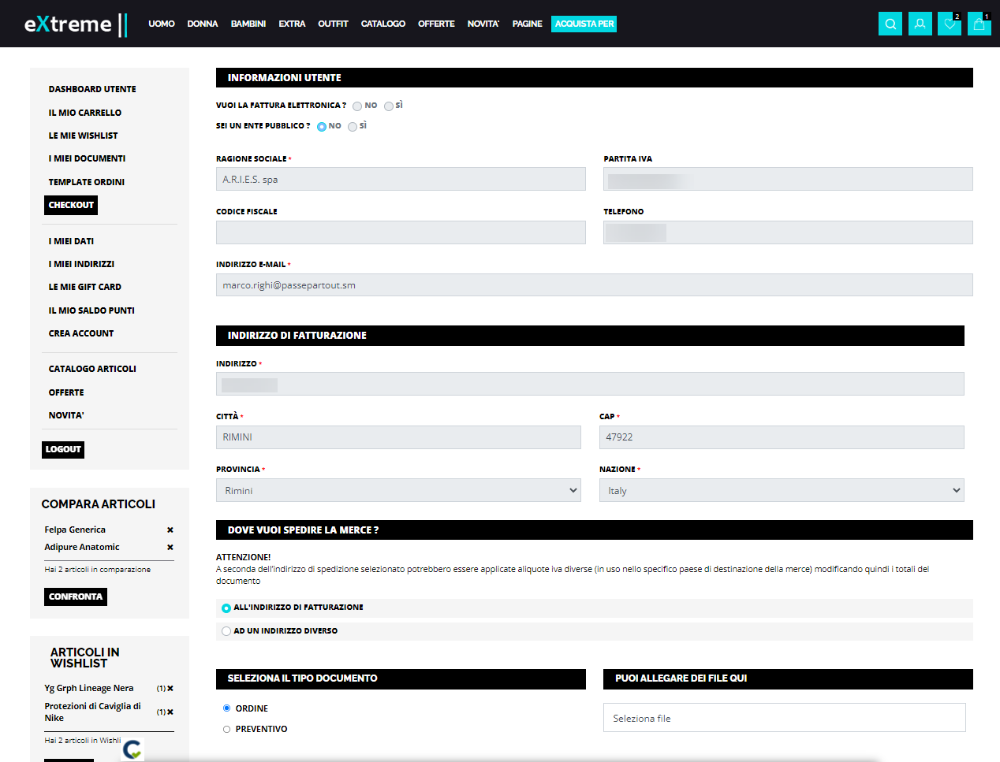

# CHECKOUT SENZA STEP INCOLONNATO

Impostando il parametro "**Tipologia Fase di Checkout**" presente nella
maschera di configurazione del componente "Ordine Custom Checkout)"
sull'opzione "**Visualizzazione senza Step Incolonnato**"

la procedura di conferma ordine sarà gestita in un unico step
all'interno del quale l'utente dovrà inserire, in diverse sezioni, tutte
le informazioni necessarie per poter confermare l'acquisto.

Come evidenziato nella figura sopra riportata, in questa particolare
configurazione le diverse sezioni del modulo d'ordine (es. Informazioni
Utente, Tipo Documento, Nota ecc...) verranno collocate tutte
all'interno di una stessa colonna e disposte una sotto l'altra

**ATTENZIONE!** In ogni caso la presenza o meno di determinati campi
all'interno dell'unica colonna dipenderà ancora una volta dalle
specifiche impostazioni di configurazione adottate per la gestione
dell'ordine.

In queste condizioni inoltre, essendo tutto gestito all'interno di un
unico step, eventuali costi aggiuntivi legati a pagamenti e/o a metodi
di spedizione già selezionati verranno immediatamente visualizzati anche
nei relativi totali del documento

Infine, anche in questo caso la visualizzazione o meno del riepilogo
articoli immediatamente al di sporta dei totali del documento dipenderà
dalle impostazioni settate per il parametro "**Mostra Riepilogo
Affiancato**" presente nella maschera di configurazione del componente

Anche in questa particolare configurazione, la visualizzazione o meno
del riepilogo articoli all'interno dell'unico step di impostazione dei
parametri dell'ordine, dipenderà da come è stato settato il parametro
"**Mostra Riepilogo Affiancato**" presente nella maschera di
configurazione del componente stesso.

In questo senso è anche opportuno ricordare che nel momento in cui si
dovesse decidere di non far passare l'utente per l'ulteriore step di
riepilogo prima di confermare in maniera definitiva l'ordine, sarà poi
necessario inserire il riepilogo articoli direttamente all'interno
dell'unico step di impostazione dei parametri dell'ordine, in caso
contrario infatti l'utente non avrebbe modo di ricontrollare gli
articoli che sta effettivamente acquistando se non lasciando la pagina
di checkout e tornando, ad esempio, in carrello.

