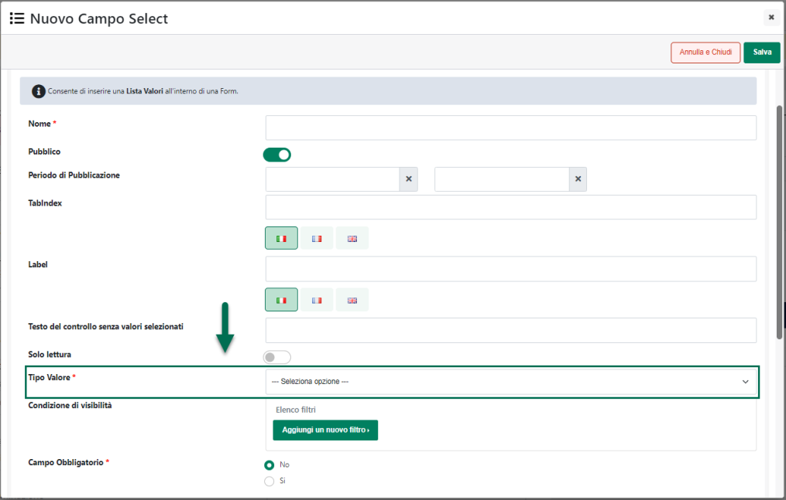

# CAMPO LISTA VALORI

Nel momento in cui l'esigenza dovesse essere quella di far selezionare,
all'interno del modulo di One Step Checkout ad utenti già autenticati,
come indirizzo di spedizione e/o di fatturazione uno degli indirizzi
presenti all'interno del proprio profilo, sarà necessario per prima cosa
inserire nel form di registrazione il componente "**Campo Lista
Valori**" configurandolo poi in maniera tale che possa effettivamente
soddisfare questa esigenza.

In questo senso una volta inserito il componente in esame all'interno
del form di Registrazione presente nel modulo di One Step Checkout,
verrà aperta la sua maschera di gestione e configurazione dove tra le
opzioni disponibili per il parametro "**Tipo Valore**" troveremo ora
anche l'opzione "**Indirizzi Utente**"

{width="4.607638888888889in"
height="2.938888888888889in"}

Selezionando questa opzione sarà quindi possibile inserire all'interno
del modulo di One Step Checkout una select box popolata con tutti gli
indirizzi dell'utente attualmente loggato, indirizzi questi che potranno
poi essere utilizzati, dipendentemente dai restanti parametri di
configurazione del componente, come indirizzo di fatturazione e/o di
spedizione merce.

In queste condizioni infatti impostando il campo "**Tipo di Dato di
Destinazione**" sul valore "**Campo Cliente**", all'interno del
successivo parametro "**Campo di Destinazione**" sarà possibile
selezionare anche le opzioni "**Indirizzo di fatturazione**" e
"**Indirizzo di spedizione**" che consentiranno di utilizzare
l'indirizzo selezionato dall'utente all'interno del relativo menu a
tendina, rispettivamente, come Indirizzo di fatturazione e/o di
spedizione merce per l'ordine in esame.

{width="4.601388888888889in"
height="2.932638888888889in"}

Riassumendo, nel caso in cui i parametri "Tipo Valore", "Tipo di dato di
Destinazione" e "Campo di Destinazione" siano impostati come di seguito
indicato

- **Tipo di Valore = Indirizzi Utente**

- **Tipo di Dato di Destinazione = Campo Cliente**

- **Campo di Destinazione = Indirizzo di Fatturazione**

per utenti autenticati, all'interno del modulo di One Step Checkout
verranno automaticamente nascosti tutti i campi relativi alla
definizione dell'indirizzo primario (es. Indirizzo, Località, Cap,
Nazione ecc...) e al loro posto verrà visualizzata una select box
contenente tutti gli indirizzi utilizzabili dall'utente in esame
(l'indirizzo primario più tutti i suoi indirizzi secondari).

{width="4.9875in"
height="3.3555555555555556in"}

Inoltre:

- L'indirizzo selezionato a default all'interno della select box sarà
  quello primario dell'utente ossia quello presente nella sua Anagrafica
  Gestionale

- Modificando il valore di default il nuovo indirizzo selezionato
  **verrà impostato immediatamente come indirizzo primario,
  indipendentemente dal fatto che l'ordine venga poi concluso o meno,**
  andando quindi a sovrascrivere, in sincronizzazione l'indirizzo
  presente nell'anagrafica gestionale dell'utente

Nel caso in cui l'esigenza dovesse essere quella di far selezionare
all'utente, come indirizzo di fatturazione, uno qualsiasi dei propri
indirizzi lasciandogli comunque anche la possibilità di codificarne, se
necessario, uno nuovo, sarà sufficiente configurare il componente "Campo
Lista Valori" assicurandosi di aver impostato uno specifico valore (es.
"Aggiungi un nuovo indirizzo") per il parametro "**Testo del controllo
senza valori selezionati**"

{width="4.595138888888889in"
height="2.938888888888889in"}

In queste condizioni infatti nel momento in cui l'utente dovesse
selezionare dal relativo menu a tendina, non uno dei suoi indirizzi, ma
il valore precedentemente indicato all'interno del parametro "Testo del
controllo senza valori selezionati" verranno nuovamente visualizzati
tutti i campi relativi alla definizione dell'indirizzo primario e
l'utente potrà quindi utilizzarli normalmente per codificare un nuovo
indirizzo (che anche in questo caso verrà utilizzato come indirizzo
primario andando quindi a sovrascrivere, in fase di sincronizzazione i
precedenti dati gestionali)

{width="4.9875in"
height="3.3555555555555556in"}

Allo stesso modo nel caso in cui i parametri "Tipo Valore", "Tipo di
dato di Destinazione" e "Campo di Destinazione" siano impostati come di
seguito indicato

- **Tipo di Valore = Indirizzi Utente**

- **Tipo di Dato di Destinazione = Campo Cliente**

- **Campo di Destinazione = Indirizzo di Spedizione**

per utenti autenticati, all'interno del modulo di One Step Checkout
verranno automaticamente nascosti tutti i campi relativi alla
definizione di indirizzi secondari (es. Indirizzo n.2, Località n.2, Cap
n.2, Nazione n.2 ecc...) e al loro posto verrà visualizzata una select
box contenente tutti gli indirizzi utilizzabili dall'utente in esame
(l'indirizzo primario più tutti i suoi indirizzi secondari).

In queste condizioni inoltre

- L'indirizzo selezionato a default all'interno della select box sarà il
  primo indirizzo secondario dell'utente (vale a dire il primo indirizzo
  presente anche all'interno del componente "Rubrica Indirizzi")

- Selezionando uno qualsiasi degli altri indirizzi presenti in elenco
  questo verrà utilizzato come indirizzo di spedizione merce per
  l'ordine in esame e sulla base di esso verranno quindi calcolate e
  visualizzate, ad esempio, le diverse possibili opzioni di trasporto.
  In queste condizioni però la selezione di uno degli indirizzi presenti
  in elenco non determinerà alcuna variazione all'Anagrafica Indirizzi
  di spedizione dell'utente in esame

Anche in questo caso infine, nel momento in cui l'esigenza dovesse
essere quella di far selezionare all'utente, come indirizzo di
spedizione, uno qualsiasi dei propri indirizzi lasciandogli comunque
anche la possibilità di codificarne, se necessario, uno nuovo, sarà
sufficiente configurare il componente "Campo Lista Valori" assicurandosi
di aver impostato uno specifico valore (es. "Aggiungi un nuovo
indirizzo") per il parametro "**Testo del controllo senza valori
selezionati**"

In queste condizioni infatti nel momento in cui l'utente dovesse
selezionare dal relativo menu a tendina, non uno dei suoi indirizzi, ma
il valore precedentemente indicato all'interno del parametro "Testo del
controllo senza valori selezionati" verranno nuovamente visualizzati
tutti i campi relativi alla definizione dell'indirizzo secondario
presenti all'interno del form di registrazione e l'utente potrà quindi
utilizzarli normalmente per codificare un nuovo indirizzo spedizione.

**ATTENZIONE!** Il nuovo indirizzo di spedizione verrà sempre aggiunto
all'Anagrafica Indirizzi di spedizione dell'utente in esame e non andrà
mai a sovrascrivere i dati relativi ad indirizzi già presenti in questa
stessa anagrafica

**ATTENZIONE!** nel caso in cui siano attive determinate funzionalità
(gestione iva oss, promozioni basate su determinate zone di spedizione
...) il cambiamento dell'indirizzo di spedizione potrebbe anche
comportare dei cambiamento nei totali del documento

In generale dunque sul front end del sito il modulo di One Step Checkout
si comporterà in maniera diversa a seconda del fatto che l'utente che
sta effettuando l'ordine abbia o meno già effettuato l'autenticazione al
sito.

In particolare **nel caso in cui l'utente non abbia ancora effettuato
l'autenticazione** e decida quindi di concludere l'ordine come "Guest",
all'interno del modulo di checkout verranno visualizzati normalmente i
campi relativi alla definizione dell'indirizzo di fatturazione ed,
eventualmente, anche quelli relativi alla definizione dell'indirizzo di
spedizione merce.

{width="4.9875in"
height="3.3555555555555556in"}

**Nel caso in cui invece l'utente abbia già effettuato
l'autenticazione** al sito, nelle condizioni in esame, i campi relativi
alla definizione dell'indirizzo di fatturazione ed, eventualmente anche
quelli relativi alla definizione dell'indirizzo di spedizione merce,
verranno automaticamente nascosti e al loro posto compariranno apposite
select box che l'utente potrà utilizzare per selezionare come indirizzo
fatturazione e/o spedizione uno degli indirizzi memorizzati nel suo
profilo.

