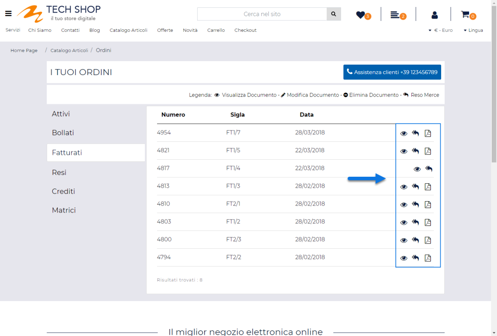
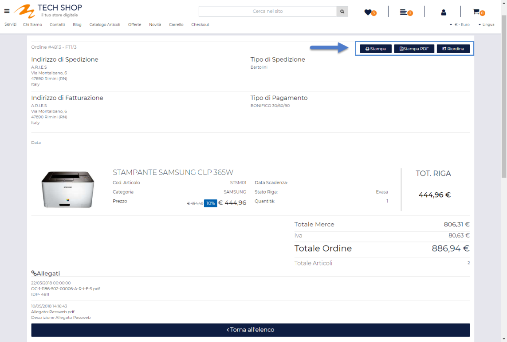
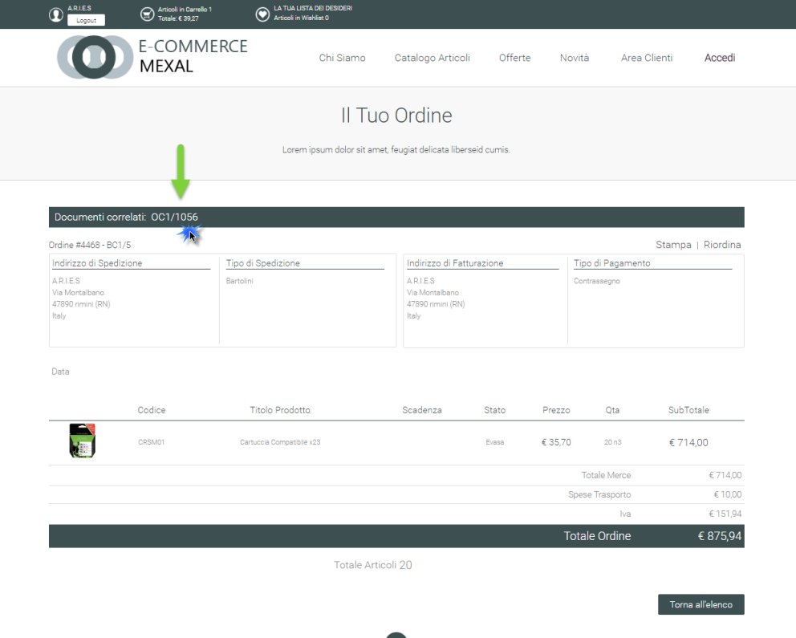
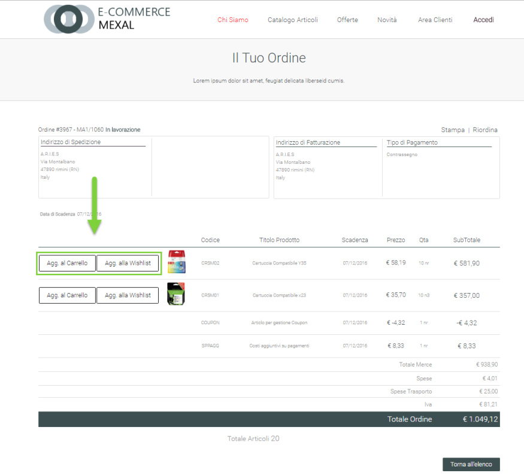

# GESTIONE FRONT END

Dipendentemente dalla particolare tipologia di documento considerato e
da quello che è il suo stato attuale è possibile effettuare sul
documento stesso diverse operazioni:

In particolare il pulsante:

- **Visualizza:** sempre presente, consente di visualizzare il dettaglio
  del relativo documento.

- **Modifica:** presente unicamente nella sezione relativa ai documenti
  attivi e per ordini che si trovano nello stato di SOSPESO.

> Consente di modificare, per quanto possibile, il relativo documento;
> in particolare cliccando su questo pulsante l'utente verrà ridiretto
> alla pagina Carrello dove verranno già inseriti, in maniera
> automatica, gli articoli del documento originale che possono essere
> effettivamente acquistati (quindi quelli nello stato E).
>
> Gli articoli in stato S (quelli non acquistabili che hanno di fatto
> determinato la sospensione dell'ordine) verranno invece eliminati dal
> carrello.
>
> L'utente potrà quindi decidere di concludere l'ordine con i soli
> articoli effettivamente acquistabili, di annullare l'intero ordine o
> di aggiungere anche altri articoli, oltre a quelli attualmente
> acquistabili, prima di passare effettivamente al checkout.

- **Annulla:** come per il pulsante "Modifica" anche il pulsante
  "Annulla" potrà essere visualizzato solo al verificarsi di determinate
  condizioni. Nello specifico, per quel che riguarda **i documenti
  Ecommerce (Ordini/Preventivi)** il pulsante Annulla verrà visualizzato
  unicamente in corrispondenza di ordini posti nello stato Sospeso e NON
  pagati mediante carta di credito.

> Per quel che riguarda invece la gestione delle prenotazioni è
> necessario distinguere tra le prenotazioni di servizi/trattamenti e le
> prenotazioni di tavoli.
>
> Nel caso di **prenotazioni di servizi/trattamenti (siti Ho.Re.Ca.
> collegati a Beauty)** il pulsante Annulla verrà visualizzato, nelle
> condizioni sopra indicate, solo per le prenotazioni NON pagate
> mediante Carta di Credito e che fanno riferimento, ovviamente, ad una
> data successiva a quella odierna.
>
> **NOTA BENE:** non sarà quindi possibile in alcun modo da parte
> dell'utente Annullare, operando direttamente sul sito, la prenotazione
> di un servizio/trattamento già pagato mediante carta di credito o che
> fa riferimento ad una data precedente alla data odierna (e quindi già
> scaduto)
>
> Nel caso invece di **prenotazioni di tavoli (siti Ho.Re.Ca. collegati
> a Menu)** il pulsante Annulla sarà sempre visualizzato e un utente
> avrà sempre la possibilità di annullare la prenotazioni di un tavolo,
> posto, ovviamente, che la prenotazione in oggetto faccia riferimento
> ad una data successiva alla data odierna
>
> **ATTENZIONE!** Annullando la prenotazione di un servizio/trattamento
> o di un tavolo il corrispondente documento verrà posto, lato
> gestionale, nello stato di "**Mancata**"

- **Stampa PDF**: presente solo ed esclusivamente nel caso in cui per il
  documento in esame sia presente **un allegato di tipo "Stampa".**
  Consente di effettuare il download della stampa pdf del relativo
  documento.

> Per maggiori informazioni relativamente a come poter gestire gli
> allegati ai vari documenti importandoli da Docuvision oppure
> inserendoli direttamente dal Back end del proprio sito Passweb, si
> veda anche le sezione "*Ordini -- Configurazione Ordini --
> Impostazioni Generali*" e "*Ordini -- Gestione Ordini*" di questo
> manuale

- **RMA:** presente unicamente nella sezione relativa alle Fatture e in
  corrispondenza di quei documenti la cui data rientra nell'intervallo
  di giorni entro cui può ancora essere effettuata una richiesta di reso
  merce, consente all'utente di avviare questo tipo di richiesta.
  Cliccando su questo pulsante l'utente verrà infatti ricondotto alla
  pagina Reso del sito dove potrà visualizzare il dettaglio degli
  articoli presenti nel documento di partenza e in relazione ai quali
  può essere avviata una richiesta di reso merce.

**ATTENZIONE!** Il testo dei pulsanti appena esaminati può essere
personalizzato alla sezione "Gestione Testi e Messaggi del Sito"

Visualizzando il dettaglio di un documento sarà inoltre possibile
effettuare, anche in questo caso dipendentemente dalla particolare
tipologia di documento considerato, diversi tipi di operazioni

In questo senso i pulsanti "**Stampa**", "**Stampa PDF**" e
"**Riordina**" consentono rispettivamente di:

- **Stampa:** consente di stampare il documento attualmente visualizzato

- **Stampa PDF:** presente solo ed esclusivamente nel caso in cui per il
  documento in esame sia presente **un allegato di tipo "Stampa".**
  Consente di effettuare il download della stampa pdf del relativo
  documento

- **Riordina:** consente di aggiungere in carrello tutti gli articoli
  presenti nel dettaglio del documento selezionato (posto ovviamente che
  tali articoli siano ancora gestiti all'interno del sito e che non
  siano articoli di tipo Spesa)

Nel caso di **evasioni parziali** nel dettaglio del documento verranno
riportati anche i riferimenti di tutti i documenti (bolle, fatture, resi
ecc..) ad esso correlati.

Ognuno di questi riferimenti sarà inoltre un link al dettaglio del
relativo documento. Sfruttando questi collegamenti l'utente avrà quindi
la possibilità di navigare in maniera interattiva fra i documenti
correlati.

Infine, visualizzando il dettaglio di un **documento di tipo Matrice**
si avrà la possibilità di aggiungere direttamente ogni singolo articolo
presente in questo stesso documento, con le quantità presenti nella
relativa riga, in Carrello (pulsante "**Aggiungi in Carrello**") oppure
alla Wishlist (pulsante "**Aggiungi alla Wishlist**")

Anche in questo caso, come per il riordino sarà effettivamente possibile
aggiungere in carrello o in Wishlist uno degli articoli presenti
all'interno di una Matrice solo ed esclusivamente se questo stesso
articolo è ancora gestito all'interno del sito e non è, ovviamente, un
articolo di tipo spesa

