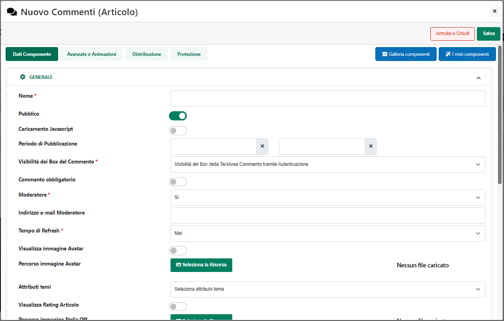
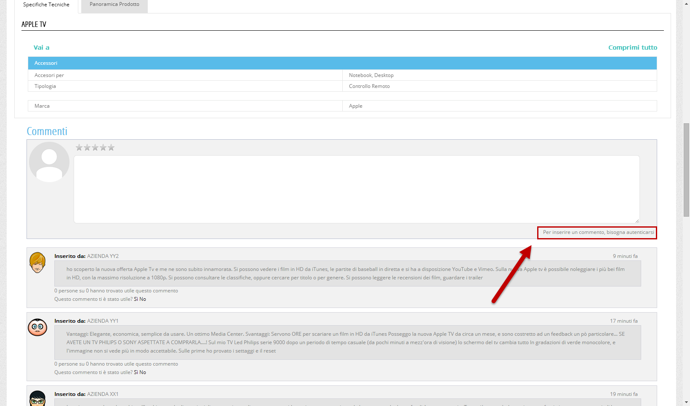
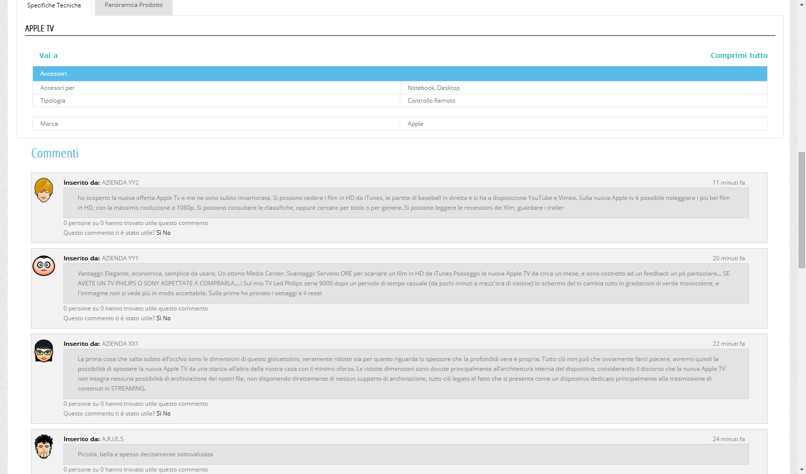
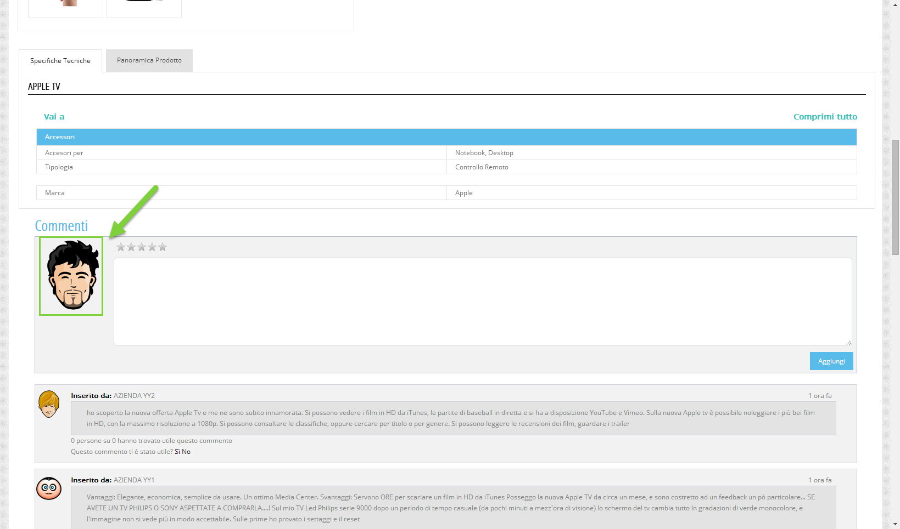
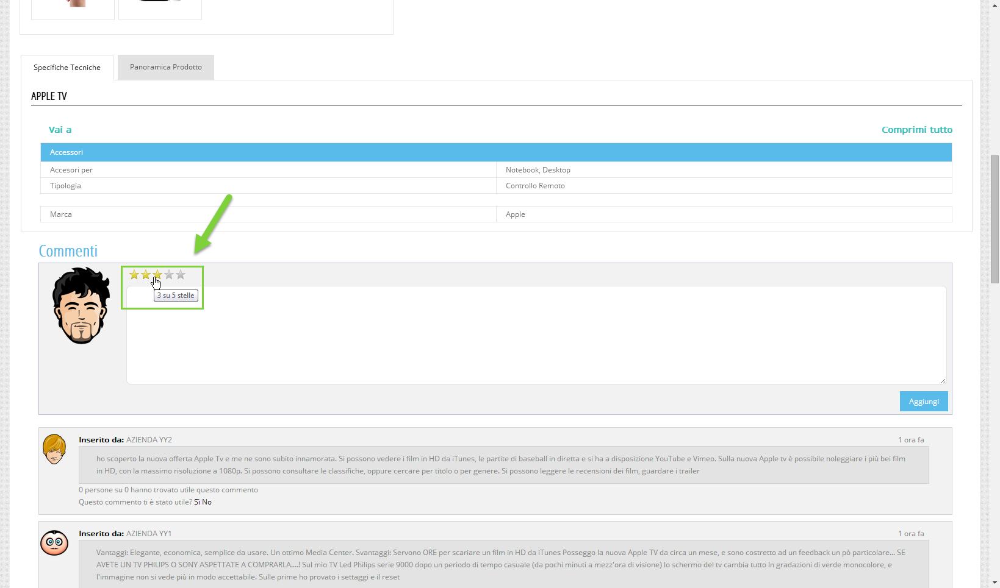
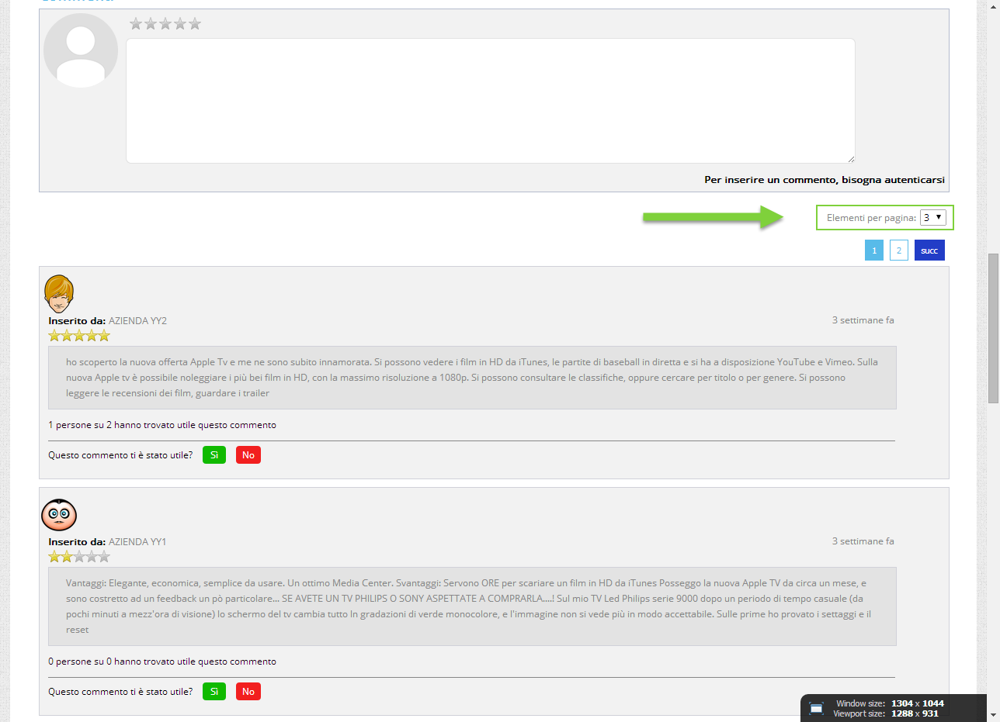

# CONFIGURAZIONE

Una volta inserito il Componente all'interno della pagina web, verrà
aperta in automatico **la sua maschera di gestione e configurazione**

suddivisa in varie sezioni.

All'interno della sezione "**Dati Componente**" sarà possibile settare i
principali parametri di configurazione del componente in oggetto.

In particolare, per la tipologia di Componente in questione, sarà
possibile impostare un valore per i seguenti parametri:

**Nome** (obbligatorio), consente di inserire un nome per il Componente
Paragrafo che si sta realizzando

**Pubblico (selezionato a default):** consente di impostare la
visibilità del componente lato sito web.

**Periodo di Pubblicazione:** consente di associare al Componente in
oggetto uno specifico periodo di pubblicazione, definendone l'effettiva
data di pubblicazione e la corrispondente data di oscuramento.

**ATTENZIONE!** Per maggiori informazioni relativamente ai parametri
**Nome, Pubblico, Periodo di Pubblicazione** si veda anche quanto
indicato all'interno del capitolo "*Configurazione Componenti --
Caratteristiche generali* -- *Dati Componente* " di questo manuale

**Caricamento Javascript**: se selezionato, consente di caricare il
relativo componente in maniera asincrona al termine del caricamento
della pagina web.

**ATTENZIONE!** Per maggiori informazioni relativamente al parametro
**Caricamento Javascript** si veda anche quanto indicato all'interno del
capitolo "*Configurazione Componenti -- Caratteristiche generali* --
*Staticizzazione e caricamento asincrono*" di questo manuale

**Visibilità del Box del Commento:** consente di abilitare la
possibilità di effettuare commenti e la visualizzazione dei commenti
effettuati ai soli utenti autenticati o ad un qualsiasi visitatore del
sito. In particolare sarà possibile selezionare uno dei seguenti valori:

- **Visibilità del Box della Text Area Commento e del Box dei Commenti
  senza autenticazione:** selezionando questo valore tutti gli utenti
  del sito, autenticati e non autenticati, avranno la possibilità di
  visualizzare i commenti effettuati da altri utenti.

> In queste condizioni, inoltre verrà visualizzata a tutti gli utenti
> anche la text-area per l'inserimento di un nuovo commento, ma al posto
> del pulsante "**Aggiungi**" verrà visualizzato un testo per informare
> l'utente della possibilità di inserire nuovi commenti solo previa
> autenticazione.

- **Visibilità del Box della Text Area Commento tramite
  Autenticazione:** selezionando questo valore tutti gli utenti del
  sito, autenticati e non, avranno la possibilità di visualizzare i
  commenti effettuati da altri utenti sul singolo prodotto. Come nel
  caso precedente nuovi commenti potranno essere inseriti solo ed
  esclusivamente dagli utenti autenticati.

> In queste condizioni, inoltre, la text-area per l'inserimento di un
> nuovo commento verrà visualizzata ai soli utenti autenticati.

- **Visibilità del Box della Text Area Commento e del Box dei Commenti
  tramite autenticazione:** selezionando questo valore la possibilità di
  effettuare nuovi commenti così come la possibilità di visualizzare i
  commenti presenti sul singolo prodotto verrà abilitata ai soli utenti
  autenticati.

**Commento obbligatorio:** selezionando questo parametro sarà poi
obbligatorio, per poter assegnare un voto allo specifico prodotto,
esprimere anche un commento.

**Moderatore:** consente di impostare la modalità di visualizzazione dei
nuovi commenti. In particolare sarà possibile selezionare uno dei
seguenti valori:

- **No:** in queste condizioni i commenti verranno gestiti senza
  moderatore per cui ogni nuovo commento verrà immediatamente pubblicato
  all'interno del sito (il fatto poi che il commento stesso sia visibile
  a tutti o ai soli utenti autenticati dipenderà dalle impostazioni del
  precedente parametro)

- **Si:** in queste condizioni la pubblicazione all'interno del sito di
  un nuovo commento non sarà immediata ma dovrà necessariamente essere
  validata ed approvata dal moderatore. Per maggiori informazioni
  relativamente a come approvare e pubblicare all'interno del sito il
  commento effettuato da un utente si veda anche la sezione "Sito --
  Gestione CMS" di questo manuale

**Indirizzo e-mail Moderatore:** consente di impostare l'indirizzo mail
cui verrà inviata una notifica ogni qual volta verrà effettuato un nuovo
commento. La notifica conterrà anche il testo del commento inserito (o
da inserire) all'interno del sito.

**Tempo di refresh:** consente di impostare la frequenza di refresh
della porzione del componente contenente i commenti già effettuati.

**Visualizza immagine Avatar:** consente di visualizzare, se
selezionato, l'immagine del proprio Avatar a fianco del box di
inserimento di nuovi commenti.

**Percorso immagine Avatar:** consente di impostare l'immagine di
default da utilizzare per l'Avatar degli utenti che non ne abbiano
indicato uno proprio.

**Visualizza Rating Articolo:** consente di visualizzare, se
selezionato, un controllo, costituito a default da 5 stelle, che
l'utente dovrà utilizzare per dare un voto al prodotto che intende
commentare.

**ATTENZIONE!! Nel caso in cui sia stato selezionato il precedente
parametro "Commento obbligatorio", per poter assegnare un voto al
prodotto sarà necessario esprimere anche un commento.**

**Percorso immagine Stella Off/On:** consente di impostare le immagini
da utilizzare all'interno del controllo per il rating del prodotto. A
default per l'immagine Off viene utilizzata una stella vuota (colore
grigio) mentre come immagine On viene utilizzata una stella piena
(colore giallo)

**Numero di commenti da visualizzare per pagina:** consente di impostare
il numero di commenti che dovranno essere visualizzati per ogni singola
pagina. Nel caso in cui il numero complessivo di commenti sia superiore
a quello impostato in questo campo, verrà attivato un sistema di
paginazione per consentire all'utente di visualizzare tutti i commenti.

**Visualizzazione Paginazione:** consente di decidere se e dove
visualizzare (rispetto al Componente stesso) i controlli di paginazione
che si attiveranno nel caso in cui il numero di commenti complessivo sia
superiore a quello impostato nel precedente campo.

**Numero di Pagine:** consente di impostare, selezionandolo dal relativo
menu a tendina, il numero di pagine che dovranno essere visualizzate nei
controlli di paginazione. Ovviamente oltre al numero indicato
all'interno di questo campo nei controlli di paginazione saranno sempre
visibili anche la prima e l'ultima pagina disponibili.

**Questo campo viene visualizzato solo nel caso in cui il parametro
"Visualizza Paginazione" sia stato impostato su di un valore diverso da
"Non Visualizzare".**

**Paginazione con Precedente e Successivo:** se selezionato, nei
controlli di paginazione, verranno visualizzati anche i pulsanti
"Precedente" e "Successivo".

**Questo campo viene visualizzato solo nel caso in cui il parametro
"Visualizza Paginazione" sia stato impostato su di un valore diverso da
"Non Visualizzare".**

**Tipo di Paginazione:** consente di definire come dovrà comportarsi il
componente in oggetto ad ogni cambio di pagina. E' possibile selezionare
uno dei seguenti valori:

- **Senza caricamento della pagina:** in questo caso ad ogni cambio
  pagina verranno ricaricati solo ed esclusivamente i dati presenti
  all'interno del componente in oggetto

- **Con caricamento della pagina:** in questo caso ad ogni cambio pagina
  verrà ricaricata l'intera pagina web (con la possibilità da parte
  dell'utente, di dover utilizzare la scroll bar per visualizzare gli
  articoli presenti all'interno della nuova pagina)

**Elementi per pagina:** consente di indicare una lista di valori,
sperati da virgole, corrispondenti al numero di elementi che potranno
essere visualizzati in ogni singola pagina del componente. Gli unici
caratteri ammessi all'interno di questo campo sono quelli numerici (0-9)
e la virgola che dovrà essere utilizzata come carattere separatore.

Nel momento in cui questo campo dovesse essere valorizzato in maniera
corretta, sul sito verrà poi visualizzato, in corrispondenza del
componente in oggetto, un menu a tendina contenente l'elenco dei valori
immessi (compreso anche, ovviamente, il valore indicato all'interno del
precedente parametro "Numero di commenti da visualizzare per Pagina").

Selezionando uno dei valori presenti in elenco il componente verrà
ricaricato e popolato con il numero di articoli per pagina indicati
dall'utente.

**ATTENZIONE! Modificando il numero di articoli per pagina il componente
ripartirà sempre dalla prima pagina**

**Visualizzazione Risultati:** se selezionato, consentirà di
visualizzare, nella parte bassa del componente, una stringa di testo
contenente il numero complessivo di commenti.

**Campo di ordinamento:** consente di impostare l'ordinamento dei
commenti presenti all'interno del componente. E' possibile ordinare
questi commenti per data oppure in base alla valutazione sull'utilità
del commento ad essi attribuita.

**Modo di ordinamento:** consente di decidere se l'ordinamento settato
tramite il precedente campo dovrà essere di tipo Crescente o Decrescente

**Massimo Caratteri Commento:** consente di impostare il numero massimo
di caratteri (da 0 a 999) che potranno essere utilizzati per i nuovi
commenti

**Posizionamento dei Campi:** consente di posizionare gli elementi
principali del componente secondo uno schema prestabilito.

Nello specifico, gli elementi soggetti al tipo di posizionamento
impostato mediante questo parametro saranno:

- I commenti

- Il form per l'inserimento di nuovi commenti

E' possibile selezionare uno dei seguenti valori:

- Affiancati a destra

- Affiancati a sinistra

- Affiancati e giustificati

- Affiancati e opposti

- Centrati e affiancati

- Centrati e Incolonnati

- Incolonnati a destra

- Incolonnati a sinistra

- Custom

**ATTENZIONE!** Nel caso in cui si decidesse di utilizzare uno dei
preset presenti in elenco poi il posizionamento degli elementi sarà
esattamente quello indicato e non potrà essere modificato in alcun modo.

**L'opzione Custom consente invece di non applicare nessun preset
particolare.** **In queste condizioni dunque il posizionamento dei vari
elementi potrà essere variato liberamente agendo sulle corrette
proprietà CSS mediante lo style editor di Passweb e/o mediante i
relativi strumenti di editing avanzato.**

**Ordinamento di visualizzazione dei campi:** visualizzato solo nel caso
in cui il precedente parametro non sia stato impostato sul valore
Custom.

Consente di definire l'ordine di visualizzazione degli elementi
principali del componente in esame, permettendo dunque, già in fase di
configurazione del componente stesso di decidere quale elemento dovrà
essere visualizzato prima e quale dopo.

**ATTENZIONE!** Anche in questo caso l'opzione Custom, non attiva nessun
tipo di preset per cui l'ordine di visualizzazione dei rispettivi
elementi potrà essere variato liberamente agendo sulle corrette
proprietà CSS mediante lo style editor di Passweb e/o mediante i
relativi strumenti di editing avanzato.

Il pulsante "**Salva**" nella parte alta della maschera consentirà di
salvare le modifiche apportate al Componente in oggetto.

**NOTA BENE:** per maggiori informazioni relativamente alle sezioni
"**Avanzate e Animazioni**", "**Distribuzione**" e "**Protezione**",
presenti nella maschera di gestione e configurazione di tutti i
componenti Passweb, si veda anche il capitolo " Varianti Responsive --
Configurazione Componenti -- Caratteristiche Generali " di questo
manuale.

Per quel che riguarda la logica di gestione del suo contenuto, anche
**il Componente "Commenti Associati" può essere considerato a tutti gli
effetti come un "Componente di tipo Contenitore".** Sarà infatti
possibile inserire al suo interno dei campi che, per poter esser gestiti
liberamente, dovranno inevitabilmente esser trattati a loro volta come
Componenti autonomi editabili singolarmente.

Una volta inserito il Componente all'interno della pagina, per poterne
poi personalizzare i contenuti sarà necessario attivare la modalità di
gestione dei componenti, portarsi sul Componente in esame e, alla
comparsa del R.O.C. cliccare sull'icona "**Accedi ai componenti
interni"**

**Per maggiori informazioni relativamente alla gestione dei Componenti
di tipo Contenitore si veda anche il corrispondente capitolo di questo
manuale ("Live Editing per Varianti Responsive -- Componenti --
Componenti di tipo Contenitore")**

In particolare all'interno di un componente di tipo "Commenti Associati"
sarà possibile inserire due differenti tipologie di componenti.

- **Componenti Comuni:** contiene componenti generici che potranno
  essere utilizzati per completare graficamente il layout del
  componente. Per maggiori informazioni relativamente all'utilizzo di
  questi componenti si vedano le corrispondenti sezioni di questo
  manuale.

- **Componenti Ecommerce:** contiene quei componenti necessari a
  visualizzare i singoli elementi di ogni commento (es. Autore, Testo
  del Commento, Data Commento, Rating ecc...).

> **NOTA BENE:** per maggiori informazioni relativamente a come gestire
> i componenti interni ad un componente "Commenti Associati" si veda la
> corrispondente sezione di questo manuale (Live Editing per Varianti
> Responsive -- Lista Componenti Ecommerce -- Componenti Interni ai
> Componenti Ecommerce).

L'inserimento di questi componenti all'interno del Componente "Commenti
Associati" avviene utilizzando le solite tecniche di interazione con
l'editor (Drag and Drop o Point and Click) già esaminate all'interno di
questo manuale (per maggiori informazioni si rimanda allo specifico
capitolo di questo manuale).

