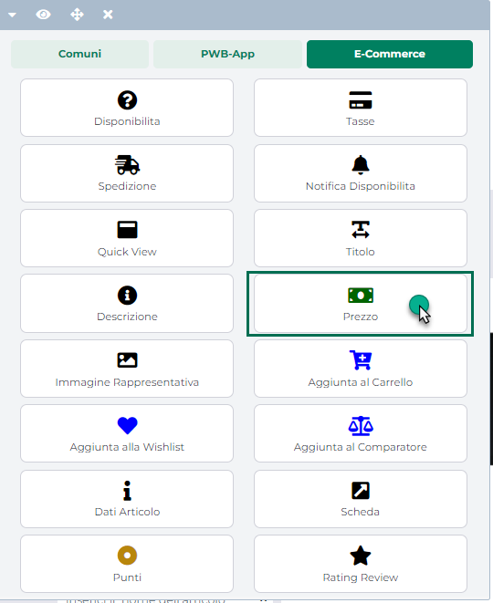
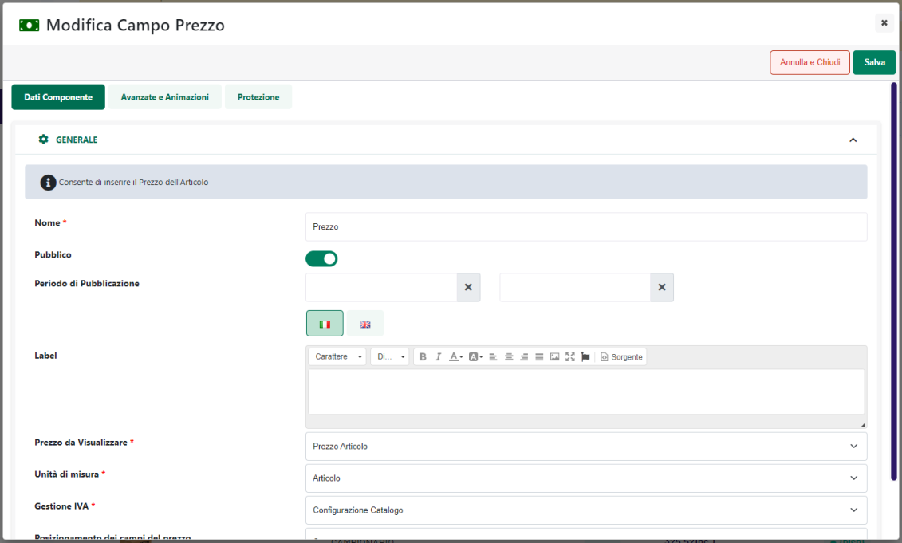
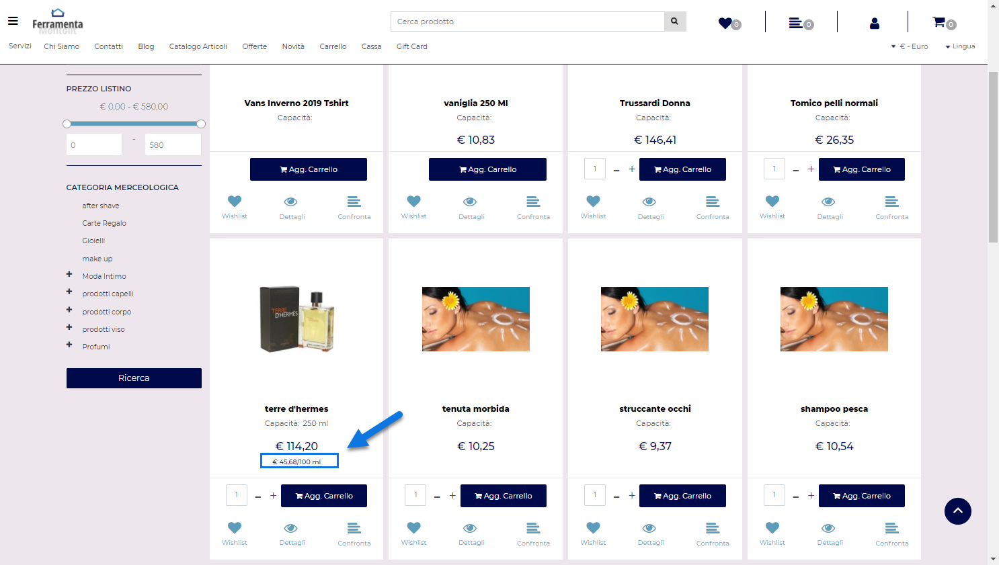
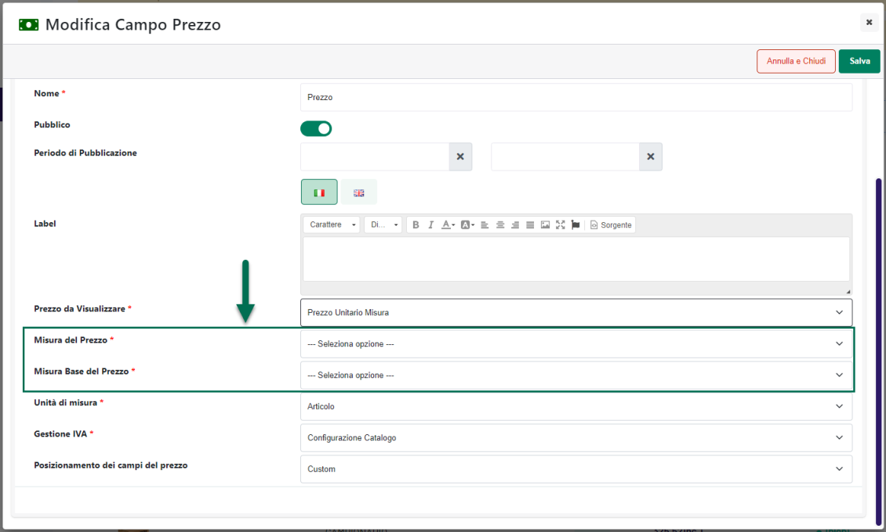

# COMPONENTI E-COMMERCE -- PREZZO

Il Componente Ecommerce **"Prezzo"** consente di mostrare il prezzo di
acquisto dei vari articoli presenti all'interno del sito.

Oltre a questa informazione che, per ovvie ragioni è di fondamentale
importanza, grazie a questo componente sarà possibile stampare
all'interno della pagina web anche altre informazioni molto utili come
ad esempio il prezzo unitario di articoli gestiti a confezioni o, nel
caso ad esempio di articoli come i profumi, il prezzo per "Unità di
misura" ossia il prezzo di vendita rapportato ad una certa quantità
predefinita di prodotto (es. prezzo per 100ml)

{width="2.5340277777777778in"
height="3.1041666666666665in"}

**Inserendo questo Componente all'interno di un Componente E-Commerce di
primo livello (es. Catalogo E-commerce), esso verrà quindi sostituito,
articolo per articolo, con il corrispondente prezzo definito all'interno
del gestionale.**

In questo senso occorre sempre ricordare che il prezzo mostrato per i
vari articoli può dipendere da diversi fattori quali ad esempio il
particolare listino applicato, il fatto di aver effettuato o meno il
login al sito, eventuali condizioni particolari applicate, sul
gestionale, allo specifico cliente/articolo ecc. ... (per maggiori
informazioni in merito si veda anche quanto indicato all'interno del
successivo capitolo "*Dettagli sul Prezzo di Acquisto*" di questo
manuale)

**ATTENZIONE! In ogni caso questo valore riflette una specifica
condizione del gestionale ed è sempre aggiornato all'ultima
sincronizzazione.**

Una volta inserito il Componente all'interno della pagina web, verrà
aperta in automatico **la sua maschera di gestione e configurazione**

{width="5.134722222222222in"
height="3.092361111111111in"}

suddivisa in varie sezioni.

All'interno della sezione "**Dati Componente**" sarà possibile inserire
il contenuto e settare i principali parametri di configurazione del
componente.

In particolare, per la tipologia di Componente in questione, sarà
possibile impostare un valore per i seguenti parametri:

**Nome:** consente di definire un nome per il Componente "Prezzo" che si
sta editando

**Pubblico (selezionato a default):** consente di impostare la
visibilità del componente lato sito web. Se selezionato il
corrispondente componente verrà correttamente pubblicato e visualizzato
all'interno del sito. Nel caso in cui invece tale parametro non sia
selezionato, il corrispondente componente passerà in modalità "Offline",
sarà quindi visibile all'interno del Wizard, dove potrà essere
normalmente gestito, ma non verrà pubblicato e visualizzato all'interno
del sito.

**Periodo di Pubblicazione:** consente di associare al Componente in
oggetto uno specifico periodo di pubblicazione, definendone l'effettiva
data di pubblicazione e la corrispondente data di oscuramento.

Nel primo dei due campi disponibili occorrerà quindi indicare,
utilizzando l'apposito calendario, la data di inizio pubblicazione. Nel
secondo campo andrà invece specificata la data di fine pubblicazione.

> **ATTENZIONE!** Le date indicate all'interno di questi campi verranno
> considerate solo ed esclusivamente nel caso in cui il precedente
> parametro "Pubblico" sia stato selezionato

**Label:** consente di impostare una label che verrà poi visualizzata
all'interno del sito in corrispondenza del componente in oggetto

**Prezzo da Visualizzare:** consente di impostare la tipologia di prezzo
(prezzo di vendita, prezzo unitario per articoli a confezione ecc...)
che dovrà essere visualizzato all'interno del componente in oggetto. E'
possibile selezionare uno dei seguenti valori:

- **Prezzo Articolo (opzione di default):** in questo caso verrà
  visualizzato **il prezzo di vendita dell'articolo** ossia quello che
  verrà effettivamente considerato in fase di check out ordine. Come
  precedentemente evidenziato il valore visualizzato all'interno di
  questo campo, per i vari articoli, può dipendere da diversi fattori
  quali ad esempio il particolare listino applicato al cliente
  attualmente loggato, il fatto di aver effettuato o meno il login al
  sito, eventuali condizioni particolari applicate allo specifico
  cliente/articolo ecc...

> **ATTENZIONE!:** all'interno di componenti quali "Catalogo Ecommerce"
> "Offerte/Novità" ecc... è sempre necessario inserire un componente
> prezzo con il parametro in oggetto configurato sul valore "**Prezzo
> Articolo**" in quanto solo in questo caso il componente visualizzerà
> l'esatto importo che il cliente dovrà poi corrispondere per acquistare
> il relativo articolo
>
> **Per articoli gestiti a confezione, in queste condizioni, il
> componente visualizzerà il prezzo dell'intera confezione**.

- **Prezzo Unitario Articolo (valido solo per articoli a Confezione):**
  selezionando questa opzione, per articoli gestiti a confezione, il
  componente visualizzerà il prezzo di un singolo articolo.

> **ATTENZIONE!:** nel caso di articoli NON gestiti a confezione,
> selezionando l'opzione "Prezzo Unitario Articolo" all'interno del
> componente Prezzo non verrà visualizzato alcun valore.
>
> **In ogni caso in queste condizioni il valore visualizzato all'interno
> del componente è un dato di sola visualizzazione che non riflette
> dunque il reale importo che il cliente dovrà corrispondere per
> acquistare il relativo articolo**

- **Prezzo Listino:** consente di indicare uno specifico listino
  gestionale (selezionandolo per questo dal successivo campo
  "**Listino**") in relazione al quale visualizzare il prezzo
  dell'articolo all'interno del componente in oggetto.

> In queste condizioni inoltre il prezzo effettivamente visualizzato
> terrà conto o meno di eventuali condizioni cliente (sconti
> incondizionati, particolarità prezzo/sconto, sconti quantità ecc...)
> dipendentemente da quanto impostato per i successivi parametri
> "**Prezzo**" e "**Sconto**".
>
> **In ogni caso comunque, come già per il "Prezzo Unitario", anche in
> queste condizioni il valore visualizzato all'interno del componente
> sarà un dato in sola visualizzazione che non riflette dunque il reale
> importo che il cliente dovrà corrispondere per acquistare il relativo
> articolo.**
>
> Tale opzione potrebbe risultare particolarmente utile nel caso in cui,
> ad esempio, si volesse visualizzare sul sito oltre al reale prezzo di
> vendita dell'articolo, anche il prezzo di questo stesso articolo in un
> altro listino del gestionale (es. "Prezzo al rivenditore" e "Prezzo
> all'utente finale").

- **Prezzo Unitario Listino (valido solo per articoli a Confezioni):**
  selezionando questa opzione, per articoli gestiti a confezione, il
  componente visualizzerà il prezzo di un singolo articolo in relazione
  allo specifico Listino indicato all'interno del successivo campo
  "**Listino**"

> **ATTENZIONE!:** nel caso di articoli NON gestiti a confezione,
> selezionando l'opzione "Prezzo Unitario Listino" all'interno del
> componente Prezzo non verrà visualizzato alcun valore.
>
> Anche in questo caso il valore visualizzato all'interno del componente
> terrà conto o meno di eventuali condizioni cliente (sconti
> incondizionati, particolarità prezzo/sconto, sconti quantità ecc...)
> dipendentemente da quanto impostato per i successivi parametri
> "**Prezzo**" e "**Sconto**" e sarà un dato in sola visualizzazione.

- **Prezzo Unitario Misura:** selezionando questa opzione sarà possibile
  utilizzare il componente in esame per stampare all'interno della
  pagina web il prezzo di vendita dell'articolo rapportato ad una
  specifica quantità base dello stesso prodotto.

> Supponendo quindi di vendere profumi in flaconi da 250 ml, l'opzione
> "Prezzo Unitario Misura" consentirà di inserire all'interno della
> pagina web, ad esempio, il prezzo di vendita dell'articolo in esame
> per 100 ml di prodotto.

{width="5.417361111111111in"
height="3.0555555555555554in"}

> Il template utilizzato per stampare questa informazione può essere
> gestito all'interno della sezione "**Testi / Messaggi del Sito**"
> agendo sul componente "Prezzo" in corrispondenza del campo "Prezzo
> Misura".
>
> A default il testo in questione è impostato sul valore
> **(\$price\$/\$baseMeasure\$)** dove i due segnaposto "\$price\$" e
> "\$baseMisure\$" verranno sostituiti rispettivamente dal valore del
> prezzo rapportato alla specifica unità di misura e da questa stessa
> unità di misura.
>
> **ATTENZIONE!** Dipendentemente dalla tipologia di prodotto gestito
> potrebbe essere obbligatorio stampare, oltre al prezzo di vendita,
> anche lo stesso prezzo rapportato ad una quantità base del prodotto
> come richiesto dal Codice del Consumo, D.Lgs. 206/2005, art. 14-17
>
> Considerando che il prezzo per una certa quantità di prodotto non è
> un' informazione presente all'interno del gestionale, il valore del
> "Prezzo unitario Misura" verrà calcolato a runtime **partendo dal
> prezzo di vendita** dello stesso prodotto (comprensivo quindi di
> eventuali sconti o particolarità in essere) e utilizzando i valori
> indicati per lo stesso articolo all'interno dei due attributi
> specificati in corrispondenza dei successivi parametri "**Misura del
> Prezzo**" e "**Misura Base del Prezzo**"

{width="5.129166666666666in"
height="3.092361111111111in"}

> Nello specifico il prezzo risultante verrà calcolato utilizzando la
> seguente formula:
>
> **Prezzo Unitario Misura = (Prezzo Articolo / Misura del Prezzo) x
> Misura Base del Prezzo**
>
> **[ESEMPIO]{.underline}**
>
> Supponiamo di avere, per un determinato articolo, i seguenti dati:
>
> Prezzo di vendita = 15€
>
> Misura del prezzo = 750 ml
>
> Misura Base del prezzo = 100ml
>
> In queste condizioni il valore del Prezzo Unitario Misura sarà
> esattamente di:
>
> Prezzo Unitario Misura = (15/750)x100 = 2 €
>
> **ATTENZIONE!** I valori utilizzati per i singoli articoli all'interno
> dei due attributi "Misura del Prezzo" e "Misura Base del Prezzo"
> potranno contenere sia dei numeri (anche decimali con la , come
> carattere di separazione) che l'indicazione della specifica unità di
> misura (es. ml). **E' consigliabile quindi utilizzare attributi
> articolo di tipo "Testo"**
>
> **Nel momento in cui per un dato articolo dovesse essere indicata, per
> questi attributi, la sola unità di misura (es. ml) nella formula
> utilizzata per il calcolo del Prezzo Unitario Misura verrà utilizzato
> il valore 1**
>
> Di seguito viene riportato un elenco di possibili valori accettati per
> gli attributi "Misura del Prezzo" e "Misura Base del Prezzo" con a
> fianco il relativo valore che verrà poi effettivamente utilizzato
> nella formula di calcolo del "Prezzo Unitario Misura"
>
> **Valore Attributo**: 750 ml 🡪 **Valore utilizzato nella formula**:
> 750
>
> **Valore Attributo**: 750ml 🡪 **Valore utilizzato nella formula**: 750
>
> **Valore Attributo**: 750,10 ml 🡪 **Valore utilizzato nella formula**:
> 750,10
>
> **Valore Attributo**: 750,10ml 🡪 **Valore utilizzato nella formula**:
> 750,10
>
> **Valore Attributo**: 750 🡪 **Valore utilizzato nella formula**: 750
>
> **Valore Attributo**: 750,10 🡪 **Valore utilizzato nella formula**:
> 750,10
>
> **Valore Attributo**: ml 🡪 **Valore utilizzato nella formula**: 1

**Misura del Prezzo** -- solo per "**Prezzo da Visualizzare = Prezzo
Unitario Misura**"

Consente di specificare l'attributo articolo utilizzato per indicare
l'unità di misura e l'effettiva quantità di prodotto venduto per la
singola unità. Nel caso ad esempio di flaconi di profumi potrebbe essere
l'attributo utilizzato per indicare la capacità dello specifico flacone
(es. 750 ml)

**Misura Base del Prezzo** -- solo per "**Prezzo da Visualizzare =
Prezzo Unitario Misura**"

Consente di specificare l'attributo articolo utilizzato per indicare
l'unità di misura base alla quale si riferirà il valore calcolato per il
"Prezzo Unitario Misura" (es. 100ml)

**Listino --** solo per "**Prezzo da Visualizzare = Prezzo Listino**"
oppure per "**Prezzo da Visualizzare = Prezzo Unitario Listino**"

Consente di indicare lo specifico listino gestionale che dovrà essere
utilizzato per determinare il prezzo degli articoli da visualizzare
all'interno del componente in oggetto**.**

**Prezzo** -- solo per "**Prezzo da Visualizzare = Prezzo Listino**"
oppure per "**Prezzo da Visualizzare = Prezzo Unitario Listino**".

Consente di indicare come dovrà essere gestito il calcolo del prezzo che
verrà visualizzato all'interno del componente. E' possibile selezionare
uno dei seguenti valori:

- **Cliente**: selezionando questa opzione il prezzo visualizzato
  all'interno del componente verrà determinato tenendo conto anche di
  eventuali condizioni cliente (particolarità prezzo, particolarità sul
  listino ...)

- **Listino**: selezionando questa opzione il prezzo visualizzato
  all'interno del componente sarà esattamente quello del listino
  indicato in corrispondenza del precedente parametro (non verranno
  quindi considerate in alcun modo eventuali condizioni cliente)

**ATTENZIONE!** Nel momento in cui il campo in questione dovesse essere
lasciato vuoto, verrà considerata l'impostazione settata per il
parametro "**Listino**" presente all'interno della sezione "**Catalogo
-- Configurazione Parametri -- Catalogo Mexal/Ho.Re.Ca**." del Wizard

**Sconto**: visualizzato solo per "**Prezzo da Visualizzare = Prezzo
Listino**" oppure per "**Prezzo da Visualizzare = Prezzo Unitario
Listino**".

Consente di indicare come dovrà essere gestito il calcolo di eventuali
sconti utili a determinare il prezzo che verrà poi visualizzato
all'interno del componente. E' possibile selezionare uno dei seguenti
valori:

- **Cliente**: selezionando questa opzione il prezzo visualizzato
  all'interno del componente verrà determinato tenendo conto anche di
  eventuali condizioni cliente (particolarità sconto, sconto
  incondizionato, sconti quantità ...)

- **Nessuno**: selezionando questa opzione il prezzo visualizzato
  all'interno del componente verrà determinato senza prendere in
  considerazione nessun tipo di sconto

**ATTENZIONE!** Nel momento in cui il campo in questione dovesse essere
lasciato vuoto, verrà considerata l'impostazione settata per il
parametro "**Sconto**" presente all'interno della sezione "**Catalogo --
Configurazione Parametri -- Catalogo Mexal/Ho.Re.Ca**." del Wizard

**Unità di misura:** consente di definire l'unità di misura in base alla
quale dovrà essere calcolato il prezzo degli articoli da visualizzare
all'interno del componente in oggetto. E' possibile selezionare uno dei
seguenti valori:

- **Articolo:** selezionando questa opzione il prezzo degli articoli da
  visualizzare all'interno del componente in esame verrà calcolato sulla
  base di quella che è l'unità di misura attualmente in uso per il
  singolo articolo.

> Il fatto di utilizzare quindi, per il calcolo del prezzo, l'unità di
> misura primaria o quella secondaria dipenderà direttamente dal fatto
> di aver abilitato o meno per l'articolo in esame la funzionalità di
> gestione dell'unità di misura secondaria.
>
> Per maggiori informazioni relativamente alla gestione dell'Unità di
> misura secondaria si rimanda agli specifici capitoli di questo manuale
> presenti all'interno della sezione *"Configurazione Gestionale --
> Mexal/Ho.Re.Ca. Parametri Configurazione Gestionale"*.

- **Primaria:** selezionando questa opzione il prezzo degli articoli da
  visualizzare all'interno del componente in esame verrà calcolato
  sempre sulla base dell'Unità di misura Primaria (indipendentemente dal
  fatto di aver abilitato o meno la gestione dell'Unità di Misura
  Secondaria)

- **Secondaria:** selezionando questa opzione il prezzo degli articoli
  da visualizzare all'interno del componente in esame verrà calcolato
  sempre sulla base dell'Unità di misura Secondaria (indipendentemente
  dal fatto di aver abilitato o meno la gestione dell'Unità di Misura
  Secondaria)

> **ATTENZIONE!** In queste condizioni se per un determinato articolo
> non dovesse essere stata impostata, lato gestionale, nessuna Unità di
> Misura Secondaria, il prezzo visualizzato all'interno del componente
> sarà quello calcolato in base alla sua Unità di misura Primaria

**Gestione IVA:** consente di impostare la modalità di calcolo e di
visualizzazione del prezzo. E' possibile selezionare una delle seguenti
opzioni:

- **Configurazione Catalogo:** selezionando questa opzione il prezzo
  verrà calcolato (e conseguentemente visualizzato) come **Ivato o Non
  Ivato** dipendentemente dalle impostazioni settate per il parametro
  "**Prezzo**" presente all'interno della maschera "**Configurazione
  Catalogo**" del Wizard (sezione "Generale"). Per maggiori informazioni
  in merito a questo parametro si rimanda a quanto indicato nel relativo
  capitolo di questo manuale

- **Ivato**: selezionando questa opzione il prezzo verrà calcolato (e
  conseguentemente visualizzato) come prezzo Ivato

- **Non Ivato**: selezionando questa opzione il prezzo verrà calcolato
  (e conseguentemente visualizzato) come prezzo Non Ivato

**ATTENZIONE!** il parametro in esame ha effetto sulla visualizzazione
del prezzo unicamente all'interno di componenti quali il Catalogo
Ecommerce, la Scheda Prodotto, le Offerte / Novità ecc... **All'interno
di componenti quali il Carrello e il Checkout la visualizzazione del
prezzo ivato o non ivato dipenderà invece sempre e soltanto dalla
specifica tipologia di documento che si è scelto di gestire per il
cliente che sta effettuando l'ordine**

**Posizionamento dei Campi del prezzo:** consente di posizionare gli
elementi principali del componente secondo uno schema prestabilito.

Nello specifico, gli elementi soggetti al tipo di posizionamento
impostato mediante questo parametro saranno:

- Prezzo

- Prezzo Minimo

- Prezzo Origine e Sconto

E' possibile selezionare uno dei seguenti valori:

- Affiancati a destra

- Affiancati a sinistra

- Affiancati e giustificati

- Affiancati e opposti

- Centrati e affiancati

- Centrati e Incolonnati

- Incolonnati a destra

- Incolonnati a sinistra

- Custom

**ATTENZIONE!** Nel caso in cui si decidesse di utilizzare uno dei
preset presenti in elenco poi il posizionamento degli elementi sarà
esattamente quello indicato e non potrà essere modificato in alcun modo.

**L'opzione Custom consente invece di non applicare nessun preset
particolare.** **In queste condizioni dunque il posizionamento dei vari
elementi potrà essere variato liberamente agendo sulle corrette
proprietà CSS mediante lo style editor di Passweb e/o mediante i
relativi strumenti di editing avanzato.**

**Ordinamento di visualizzazione dei campi:** visualizzato solo nel caso
in cui il precedente parametro non sia stato impostato sul valore
Custom.

Consente di definire l'ordine di visualizzazione degli elementi
principali del componente in esame, permettendo dunque, già in fase di
configurazione del componente stesso di decidere quale elemento dovrà
essere visualizzato prima e quale dopo.

**ATTENZIONE!** Anche in questo caso l'opzione Custom, non attiva nessun
tipo di preset per cui l'ordine di visualizzazione dei rispettivi
elementi potrà essere variato liberamente agendo sulle corrette
proprietà CSS mediante lo style editor di Passweb e/o mediante i
relativi strumenti di editing avanzato.

Il pulsante "**Salva**" nella parte alta della maschera consentirà di
salvare le modifiche apportate al Componente in oggetto.

**NOTA BENE:** per maggiori informazioni relativamente alle sezioni
"**Avanzate e Animazioni**", "**Distribuzione**" e "**Protezione**",
presenti nella maschera di gestione e configurazione di tutti i
componenti Passweb, si veda anche il capitolo " Varianti Responsive --
Configurazione Componenti -- Caratteristiche Generali " di questo
manuale.

