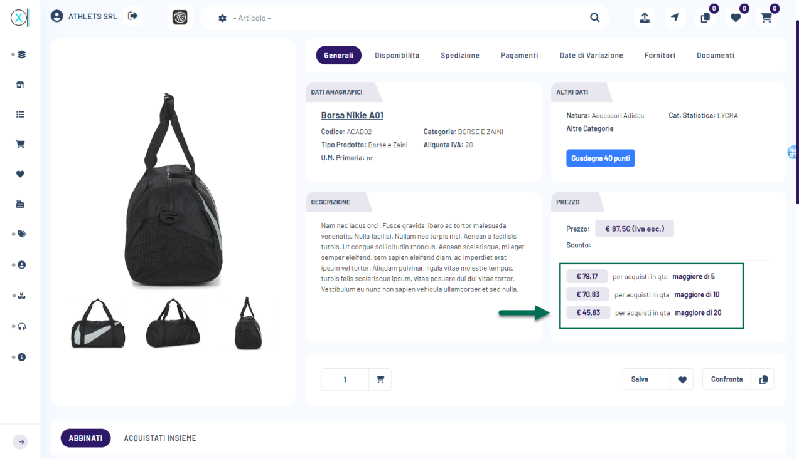
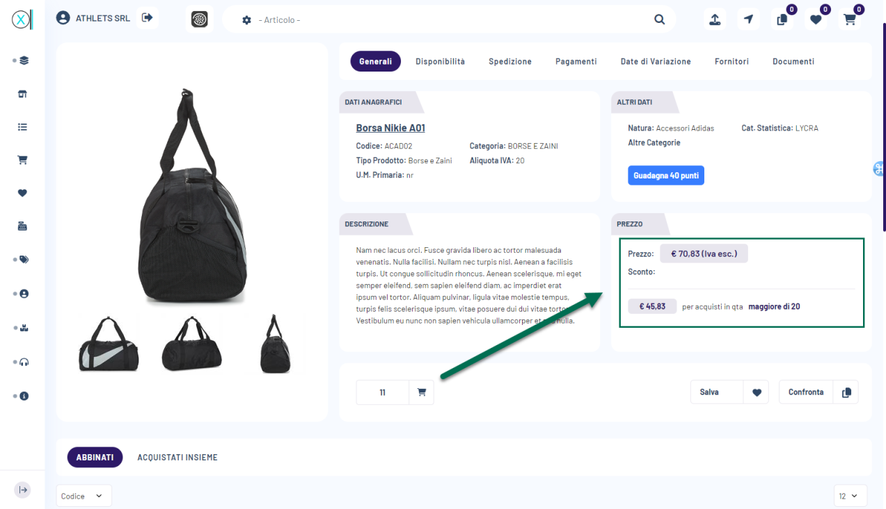
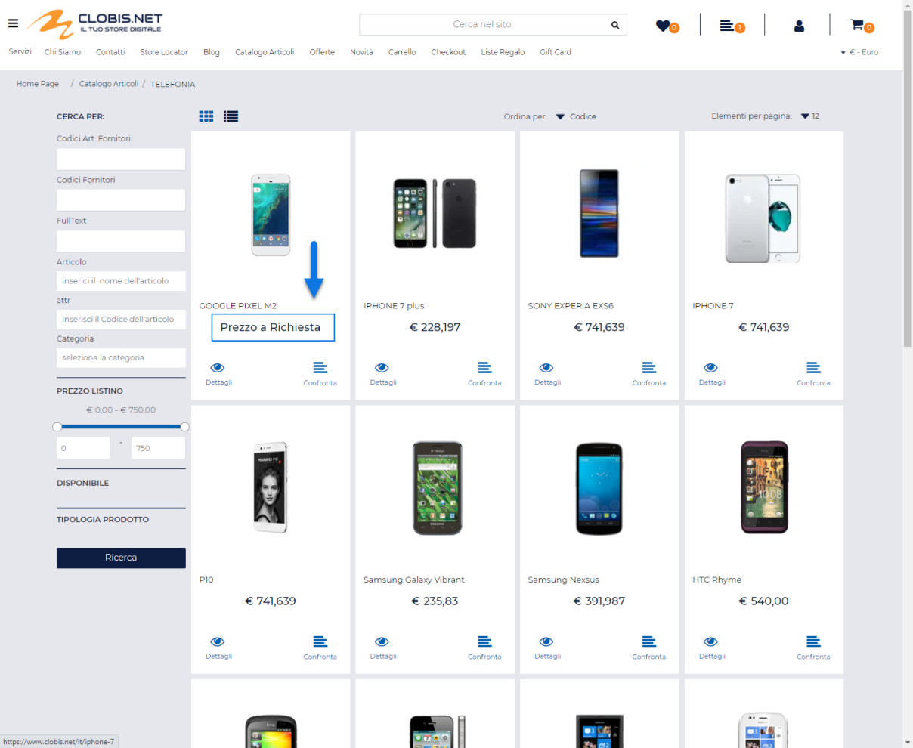
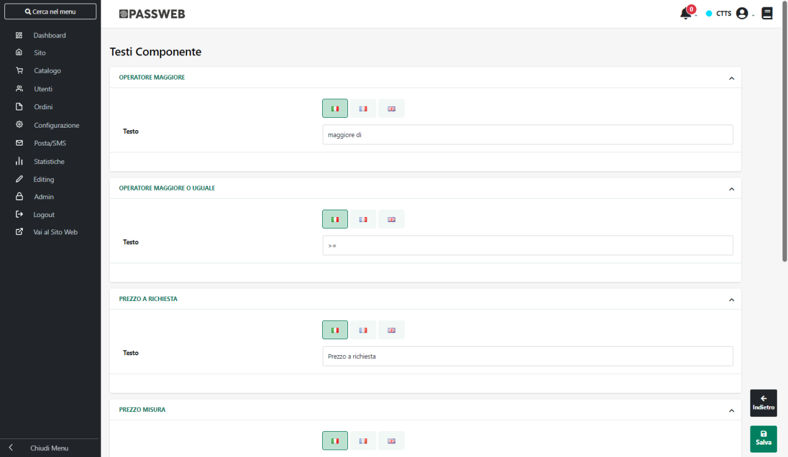
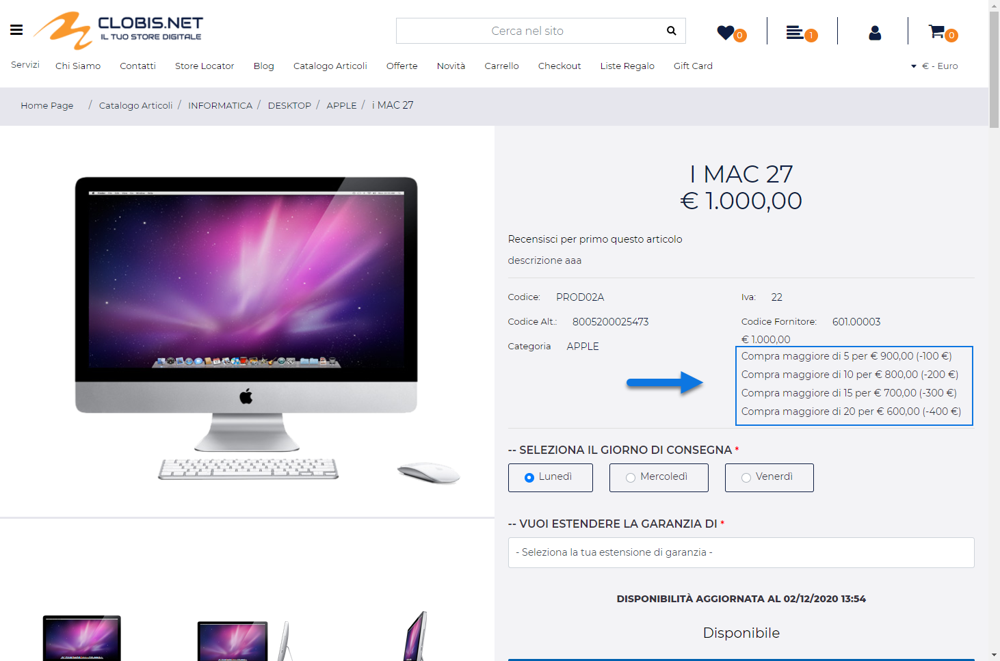
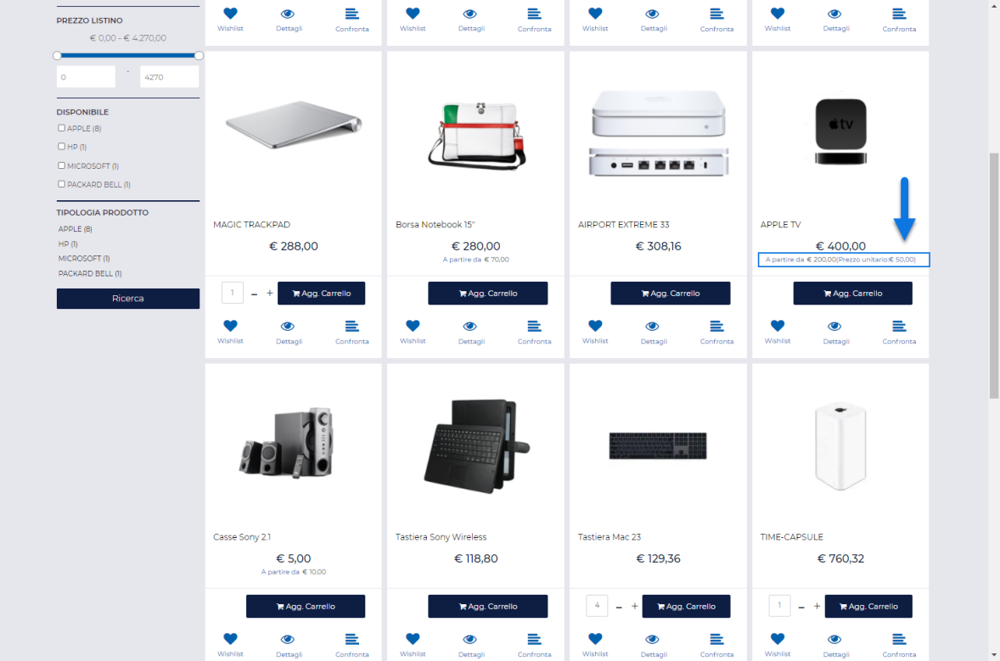

# DETTAGLI SUL PREZZO DI ACQUISTO

Come evidenziato nel precedente capitolo il prezzo mostrato sul sito per
i vari articoli può dipendere da diversi fattori quali:

- il listino utilizzato

- il fatto di aver effettuato o meno il login

- eventuali condizioni particolari applicate, sul gestionale, allo
  specifico cliente/articolo

- l'attivazione della funzionalità del prezzo a richiesta

- ecc. ...

Se ad esempio per un determinato articolo **dovessero essere gestite
delle particolarità prezzo / sconto in base alla quantità** **oppure
degli Sconti per quantità** (Ecommerce Mexal), sul sito, all'interno del
componente Prezzo, potranno essere visualizzate, oltre ovviamente al
prezzo di acquisto dello specifico prodotto, anche determinate
informazioni relative proprio a queste stesse particolarità.

{width="5.791666666666667in"
height="3.3375in"}

In queste condizioni variando la quantità del prodotto da acquistare
(mediante l'apposito campo di input presente nel componente di "Aggiunta
in carrello"), verranno aggiornati automaticamente, in base alla
quantità indicata e allo scaglione della particolarità che verrà
effettivamente applicato, anche:

- il prezzo / sconto di vendita

- il valore del "prezzo unitario misura" (solo per articoli che hanno
  attivato la relativa funzionalità)

- il valore del "prezzo unitario articolo" (solo per articoli a
  confezione)

{width="5.791666666666667in"
height="3.3375in"}

In merito a questi aggiornamenti automatici del prezzo / sconto in base
alla quantità inserita in carrello occorre però fare alcune osservazioni
di fondamentale importanza.

Nello specifico è bene ricordare che

- **verranno aggiornati automaticamente solo i componenti Prezzo che
  sono effettivamente visibili nella pagina** al momento della
  variazione della quantità indicata nel componente di aggiunta in
  carrello

- relativamente ai componenti di tipo "Catalogo Ecommerce", "Abbinati",
  "Popolarità" ... **si consiglia di inserire all'interno di ogni
  singola cella un solo componente di "Aggiunta in carrello"**. Nel
  momento in cui dovessero infatti essere gestiti, per una stessa cella,
  due o più componenti di aggiunta in carrello la variazione della
  quantità indicata all'interno di uno di essi potrebbe provocare
  l'aggiornamento di tutti i componenti Prezzo visibili all'interno
  della cella stessa, ma non determinerebbe anche l'aggiornamento
  automatico delle quantità indicate negli altri componenti di aggiunta
  in carrello.

> In conseguenza di ciò potrebbero anche verificarsi situazioni poco
> chiare all'utente finale che potrebbe, magari, vedersi visualizzato un
> prezzo non coerente con la quantità indicata in un componente di
> aggiunta in carrello ad esso vicino.
>
> **In ogni caso comunque quando l'articolo verrà aggiunto in carrello
> verrà considerata sempre la quantità indicata nel componente di
> aggiunta effettivamente utilizzato e, di conseguenza, il prezzo /
> sconto del prodotto saranno coerenti con questa stessa quantità**.

- unica eccezione rispetto a quanto indicato nel punto precedente è
  rappresentata dal componente "Quick View". In questo caso infatti è
  possibile inserire, ad esempio, un componente di aggiunta in carrello
  oltre che nella cella del Catalogo Ecommerce anche nel Quick View di
  quella stessa cella.

> In queste condizioni variando la quantità inserita nel componente di
> aggiunta in carrello presente all'interno del quick view verrà
> eventualmente aggiornato soltanto il prezzo / sconto inserito
> anch'esso all'interno del quick view (ma non quello eventualmente
> presente nella cella padre)

- relativamente ai Campionari semplici, in Passweb non sono gestite
  particolarità Prezzo / Sconto in base alle quantità eventualmente
  impostate sui singoli componenti.

> Nello specifico il prezzo dei componenti del campionario terrà conto
> di eventuali particolarità Prezzo/Sconto in base alla quantità solo in
> relazione alla quantità unitaria del campionario e quindi al numero di
> pezzi con cui il singolo componente è presente, inizialmente, in
> campionario.
>
> **ATTENZIONE!** **Variando la quantità dell'articolo campionario da
> inserire in carrello non varierà in nessun modo il prezzo/sconto dei
> singoli componenti**.

- nel caso di articoli strutturati a taglie/colori, con:

  - taglia/colore gestita mediante la relativa tabella Mexal

  - configuratore tabellare

  - particolarità prezzo/sconto in base alla quantità per un determinato
    figlio

> il prezzo eventualmente inserito in tabella mostrerà i vari scaglioni
> prezzo/sconto per quantità definiti nella particolarità **ma non si
> aggiornerà in tempo reale** variando la quantità di una delle righe
> presenti in tabella.
>
> In queste condizioni quindi il prezzo effettivamente applicato terrà
> conto correttamente delle quantità complessive inserite per ogni
> singola taglia/colore presente in tabella, ma potrà essere
> visualizzato solo all'interno della pagina Carrello

Analogamente nel momento in cui per un determinato articolo dovesse
essere stata attivata la funzionalità di "**Prezzo a Richiesta**", al
posto del prezzo di acquisto verrà visualizzata una determinata
etichetta.

{width="5.497222222222222in"
height="4.502777777777778in"}

L'etichetta del "Prezzo a Richiesta" così come quello che dovrà
effettivamente essere mostrato in relazione a particolarità prezzo e/o
sconto in base alla quantità, o per articoli a confezione sono tutte
cose che possono essere personalizzate agendo all'interno della sezione
"**Gestione Testi/Messaggi del Sito** -- **Testi dei Componenti**" del
Wizard selezionando, ovviamente, il componente "**Prezzo**".

{width="5.809722222222222in"
height="3.3743055555555554in"}

Nello specifico i campi presenti all'interno di questa maschera
consentono rispettivamente di:

**Tooltip Quantità-Prezzo Catalogo / Prodotto:** consente di
personalizzare il messaggio visualizzato all'interno del componente e
relativo alle particolarità prezzo / sconto in base alla quantità, nel
caso in cui il componente stesso sia stato inserito rispettivamente in
una cella di componenti quali il Catalogo Ecommerce le Offerte /Novità,
gli Abbinati ecc.. oppure all'interno di una Scheda Prodotto.

In entrambi i casi per costruire questo messaggio è possibile utilizzare
i seguenti segnaposto:

- **Ciclo -- Quantità**: consente di inserire il segnaposto:

> \$quantityItems:{
>
> }\$
>
> mediante il quale poter ciclare tra i diversi scaglioni della
> particolarità prezzo /sconto visualizzando poi ciascuno di essi
>
> **ESEMPIO**
>
> Supponendo di inserire all'interno del campo "**Tooltip
> Quantità-Prezzo Catalogo"** uno snippet di codice come quello qui di
> seguito riportato
>
> \< ul class=\"list-group\" \>
>
> **\$quantityItems:{**
>
> \< li class=\"list-group-item\" \>
>
> Compra \$it.quantity\$ per \$it.price\$
>
> \</li\>
>
> **}\$**
>
> \</ul\>
>
> potremo ottenere, per articoli con particolarità prezzo / sconto in
> base alla quantità, un dettaglio di questo tipo:
>
> **Compra maggiore di 5 per € 900**
>
> **Compra maggiore di 10 per € 800**
>
> **...**

- **Ciclo -- Quantità Maggiormente conveniente**: solo per "**Tooltip
  Quantità-Prezzo Catalogo**". Consente di inserire il segnaposto

> \$quantityBestItems:{
>
> }\$
>
> mediante il quale poter ciclare tra i diversi scaglioni della
> particolarità prezzo /sconto visualizzando poi solo quello più
> conveniente
>
> **ESEMPIO**
>
> Supponendo di avere a che fare con una particolarità prezzo in base
> alla quantità definita sui seguenti scaglioni:

- Quantità 5 Prezzo 900 €

- Quantità 10 Prezzo 800 €

- Quantità 20 prezzo 600 €

inserendo all'interno del campo "**Tooltip Quantità-Prezzo Catalogo"**
uno snippet di codice come quello qui di seguito riportato

> **\$quantityBestItems:{**
>
> A partire da \$it.price\$
>
> **}\$**
>
> potremo ottenere, per gli articoli soggetti a questa particolarità, un
> dettaglio di questo tipo
>
> **A partire da € 600,00**

**ATTENZIONE!** Sulla base di quanto appena detto e degli esempi
indicati risulta semplice comprendere come **tutti gli altri segnaposto
(Quantità, Prezzo, Sconto ...) dovranno necessariamente essere inseriti
all'interno di uno dei due cicli sopra indicati**. In caso contrario i
dettagli relativi alle particolarità prezzo / sconto potrebbero non
essere visualizzati

- **Quantità**: consente inserire il seguente segnaposto:

> **\$it.quantity\$**
>
> Mediante il quale poter visualizzare la quantità in relazione a cui
> poter ottenere un determinato prezzo e la relativa condizione da
> soddisfare, ossia se la quantità da acquistare per ottenere il prezzo
> indicato dovrà essere "maggiore" oppure "maggiore uguale" a quella
> indicata.

- **Quantità senza operatore**: consente inserire il seguente segnaposto

> **\$it.quantitynop\$**
>
> mediante il quale poter visualizzare la quantità in relazione a cui
> poter ottenere un determinato prezzo senza indicare però la condizione
> da soddisfare.

- **Operatore**: consente di inserire il seguente segnaposto

> **\$it.operatorqty\$**
>
> mediante il quale poter visualizzare la condizione da soddisfare per
> ottenere un determinato prezzo. Tale segnaposto verrà quindi
> sostituito con quanto inserito all'interno dei campi "**Operatore
> maggiore**" e/o "**Operatore maggiore o uguale**"

- **Prezzo**: consente di inserire il seguente segnaposto

> **\$it.price\$**
>
> mediante il quale poter visualizzare il prezzo dell'articolo nel
> momento in cui se ne dovesse acquistare una quantità ben precisa

- **Sconto**: consente di inserire il seguente segnaposto

> **\$it.discount\$**
>
> mediante il quale poter visualizzare lo sconto che verrebbe applicato
> nel momento in cui si dovesse acquistare una ben determinata quantità
> dell'articolo in esame

- **Prezzo e Sconto**: consente di inserire il seguente segnaposto

> **\$it.pricewithdiscount\$**
>
> mediante il quale poter visualizzare il prezzo dell'articolo, seguito
> dall\'eventuale sconto racchiuso tra parentesi, nel momento in cui se
> ne dovesse acquistare una quantità ben precisa

**ESEMPIO**

Facendo riferimento alla figura di seguito riportata e, nello specifico
ad esempio, al messaggio "**Compra maggiore di 5 per € 900 (-100€)**"
avremo che

{width="5.361805555555556in"
height="3.5458333333333334in"}

- "**maggiore di**" è il valore del segnaposto "**Operatore**"

- 5 è il valore del segnaposto "**Quantità**"

- **€ 900** è il valore del segnaposto "**Prezzo**"

- **(-100 €)** è il valore del segnaposto "**Sconto**

<!-- -->

- **Se è un articolo a confezione**: consente di inserire il segnaposto

> **\$if(packaging)\$**
>
> **\$endif\$**
>
> mediante il quale poter distinguere gli articoli gestiti a confezione.
>
> Quanto inserito tra le due istruzioni sopra evidenziate verrà quindi
> visualizzato solo nel caso in cui l'articolo in esame dovesse essere
> gestito a confezioni.
>
> **ATTENZIONE!** anche questa istruzione condizionale dovrebbe comunque
> essere inserita all'interno di uno dei due cicli precedentemente
> analizzati
>
> Tipicamente all'interno di questa istruzione condizionale andrà poi
> inserito il successivo segnaposto "**Prezzo Unitario**" in maniera
> tale da poter visualizzare il prezzo unitario che assumerebbe
> l'articolo in esame in relazione ai diversi scaglioni della
> particolarità

- **Prezzo Unitario --** per articoli gestiti a confezione.

> Consente di inserire il seguente segnaposto
>
> **\$it.unitprice\$**
>
> mediante il quale poter visualizzare il prezzo unitario dell'articolo
> soggetto alla particolarità Prezzo / Sconto, nel momento in cui se ne
> dovesse acquistare una certa quantità
>
> **ATTENZIONE!** Il segnaposto in esame dovrebbe, per ovvie ragioni,
> essere inserito all'interno dell'istruzione condizionale gestita
> mediante il segnaposto "**Se è un articolo a confezione**"

**ESEMPIO**

Supponendo di avere a che fare con un articolo gestito a confezioni di 4
unità e soggetto ad una particolarità prezzo in base alla quantità
definita sui seguenti scaglioni:

- Quantità 5 Prezzo 900 €

- Quantità 10 Prezzo 600 €

- Quantità 20 prezzo 400 €

inserendo all'interno del campo "**Tooltip Quantità-Prezzo Catalogo"**
uno snippet di codice come quello qui di seguito riportato

> \$quantityBestItems:{
>
> A partire da \$it.price\$ **\$if(packaging)\$** (Prezzo unitario:
> **\$it.unitprice\$**) **\$endif\$**
>
> }\$

potremo ottenere, per l'articolo in esame, un dettaglio di questo tipo

**A partire da € 200,00 (Prezzo unitario: € 50,00 )**

{width="5.361805555555556in"
height="3.5458333333333334in"}

**Operatore maggiore / maggiore o uguale:** consente di personalizzare
il testo relativo al segnaposto "Operatore" precedentemente esaminato

**Prezzo a richiesta:** consente di personalizzare il messaggio
visualizzato all'interno del componente nel momento in cui per
l'articolo in esame dovesse essere attiva la funzionalità di "Prezzo a
Richiesta"

