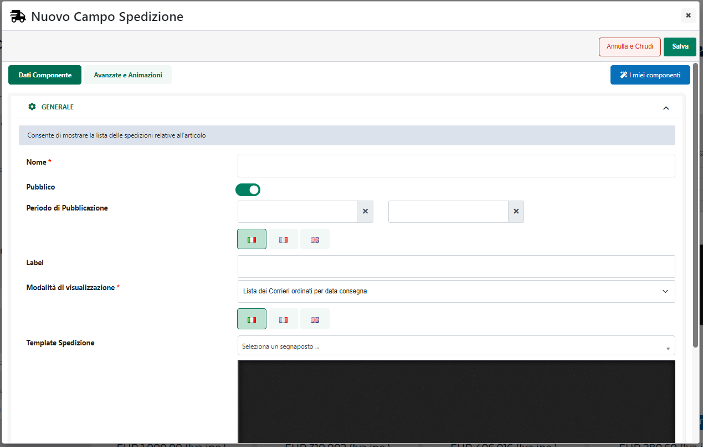
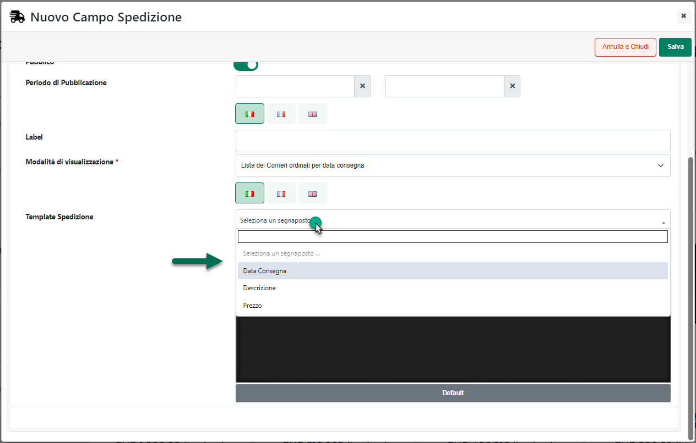

# COMPONENTI E-COMMERCE -- SPEDIZIONE

Il Componente Ecommerce **"Spedizione"**

{width="2.5340277777777778in"
height="3.1041666666666665in"}

può essere inserito all'interno dei seguenti componenti Ecommerce di
primo livello:

- Catalogo

- Offerte/Novità

- Popolarità Prodotto

- Risultati Ricerca

- Scheda Prodotto

- Articoli Abbinati E-Commerce

- Comparatore

- Selezione Regalo

- Lista Regalo

- Prodotti Correlati CMS

e consente di visualizzare, per ciascun articolo, eventuali tempi e
costi di consegna **il tutto, ovviamente, in relazione alla singola
unità di prodotto e quindi al prezzo attuale dell'articolo stesso**

{width="6.165972222222222in"
height="4.0368055555555555in"}

Relativamente alle informazioni visualizzate all'interno di questo
componente è bene sottolineare che:

- Verranno visualizzati tempi e costi di consegna in relazione ai soli
  Metodi di Trasporto di tipo Passweb per i quali è stato selezionato il
  parametro "**Abilita stima costi/consegna**" (sezione "**Parametri del
  Vettore**" nella maschera di configurazione dello specifico Metodo di
  Trasporto)

{width="5.791666666666667in"
height="3.3555555555555556in"}

> **ATTENZIONE! Per poter visualizzare, sul trasporto di tipo Passweb,
> il parametro "Abilita stima costi/consegna" è necessario attivare, su
> Passstore, il modulo "Stima Trasporto"**

- La visualizzazione dei tempi di stimata consegna richiede
  necessariamente l'attivazione e la corretta configurazione del modulo
  **"Consegne a Domicilio"**. Per maggiori informazioni relativamente
  all'utilizzo di questo modulo si consiglia di fare riferimento al
  relativo capitolo di questo manuale ("*Ordini -- Consegne*")

Una volta inserito il Componente all'interno della pagina web, verrà
aperta in automatico **la sua maschera di gestione e configurazione**

{width="4.638194444444444in"
height="2.9506944444444443in"}

suddivisa in varie sezioni.

All'interno della sezione "**Dati Componente**" sarà possibile inserire
il contenuto e settare i principali parametri di configurazione del
componente.

In particolare, per la tipologia di Componente in questione, sarà
possibile impostare un valore per i seguenti parametri:

- **Nome:** consente di definire un nome per il Componente che si sta
  editando

- **Pubblico (selezionato a default):** consente di impostare la
  visibilità del componente lato sito web. Se selezionato il
  corrispondente componente verrà correttamente pubblicato e
  visualizzato all'interno del sito. Nel caso in cui invece tale
  parametro non sia selezionato, il corrispondente componente passerà in
  modalità "Offline", sarà quindi visibile all'interno del Wizard, dove
  potrà essere normalmente gestito, ma non verrà pubblicato e
  visualizzato all'interno del sito.

- **Periodo di Pubblicazione:** consente di associare al Componente in
  oggetto uno specifico periodo di pubblicazione, definendone
  l'effettiva data di pubblicazione e la corrispondente data di
  oscuramento

> Nel primo dei due campi disponibili occorrerà quindi indicare,
> utilizzando l'apposito calendario, la data di inizio pubblicazione.
> Nel secondo campo andrà invece specificata la data di fine
> pubblicazione.
>
> **ATTENZIONE!** Le date indicate all'interno di questi campi verranno
> considerate solo ed esclusivamente nel caso in cui il precedente
> parametro "Pubblico" sia stato selezionato

- **Label:** consente di assegnare una specifica label al componente in
  esame

- **Modalità di visualizzazione:** consente di indicare, tra tutti
  quelli correttamente configurati (parametro "**Abilita stima
  costi/consegna**" selezionato) quali metodi di spedizione dovranno
  essere effettivamente visualizzati all'interno del componente e come
  dovranno essere ordinati. E' possibile selezionare una delle seguenti
  opzioni:

  - **Lista dei Corrieri ordinati per data di consegna**: consente di
    visualizzare l'elenco di tutti i metodi di spedizione correttamente
    configurati, ordinati per data di consegna (richiede ovviamente
    l'utilizzo del modulo "Consegne a domicilio").

  - **Lista dei Corrieri ordinati per costo**: consente di visualizzare
    l'elenco di tutti i metodi di spedizione correttamente configurati,
    ordinati per costo

  - **Lista dei Corrieri gratuiti**: consente di visualizzare l'elenco
    dei soli metodi di trasporto a costo zero

  - **Corriere più rapido**: consente di visualizzare, tra tutti i
    metodi di spedizione correttamente configurati, quello più rapido
    (richiede ovviamente l'utilizzo del modulo "Consegne a domicilio").

  - **Corriere più economico**: consente di visualizzare, tra tutti i
    metodi di spedizione correttamente configurati, quello più
    economico.

  - **Corriere gratuito**: spedizione con costo zero. Nel momento in cui
    dovessero essere presenti più metodi di spedizione a costo zero,
    selezionando questa opzione ne verrà comunque mostrato soltanto uno.
    Tale opzione si rivela quindi particolarmente utile nel momento in
    cui si volesse evidenziare, ad esempio, il fatto che alcuni articoli
    hanno la spedizione gratuita e altri no

- **Template Spedizione:** consente di impostare il testo da utilizzare
  per stampare all'interno della pagina web eventuali tempi e costi di
  consegna per ciascuna delle spedizioni considerate.

> E' possibile utilizzare uno dei seguenti segnaposto:

{width="4.631944444444445in"
height="2.9569444444444444in"}

- **Descrizione**: verrà sostituito con quanto impostato all'interno del
  campo "**Descrizione**" presente nella maschera di configurazione del
  corrispondente metodo di trasporto

- **Prezzo**: verrà sostituito con il costo della relativa spedizione.
  Per maggiori informazioni relativamente a come verrà calcolato il
  costo in questione si rimanda a quanto indicato nel successivo
  capitolo di questo manuale ("*Visualizzazione dei costi di
  spedizione"*)

> **ATTENZIONE!** Nel caso in cui il costo della spedizione dovesse
> essere pari a 0, il segnaposto in esame verrà sostituito con quanto
> impostato all'interno del campo "**Costo spedizione 0€**" presente
> nella maschera di configurazione del corrispondente metodo di
> trasporto

- **Data di consegna**: verrà sostituito con la data di presunta
  consegna. Per maggiori informazioni relativamente a come definire la
  data di presunta consegna in relazione ad uno specifico metodo di
  trasporto si rimanda a quanto indicato nel successivo capitolo di
  questo manuale ("*Visualizzazione dei tempi di consegna"*)

> Il pulsante "**Default**" consente di caricare all'interno del campo
> in esame il template utilizzato inizialmente da Passweb

**NOTA BENE:** per maggiori informazioni relativamente alle sezioni
"**Avanzate e Animazioni**", "**Distribuzione**" e "**Protezione**",
presenti nella maschera di gestione e configurazione di tutti i
componenti Passweb, si veda anche il capitolo " Varianti Responsive --
Configurazione Componenti -- Caratteristiche Generali " di questo
manuale.

