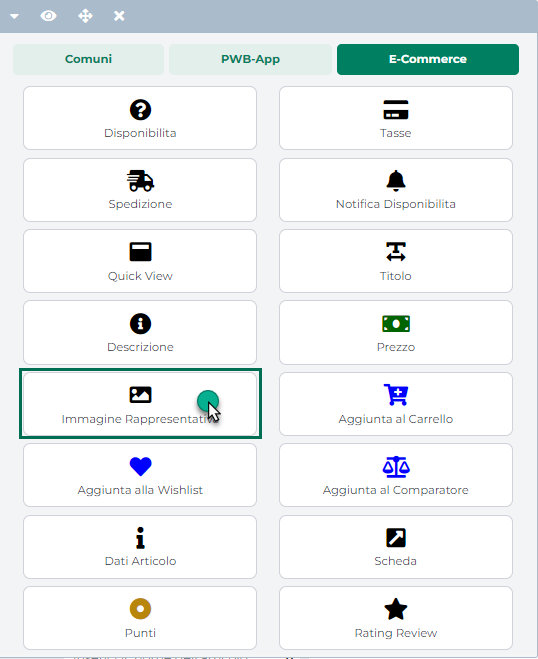
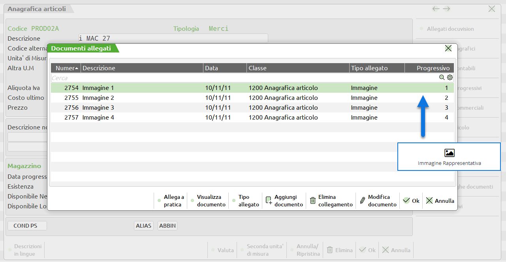
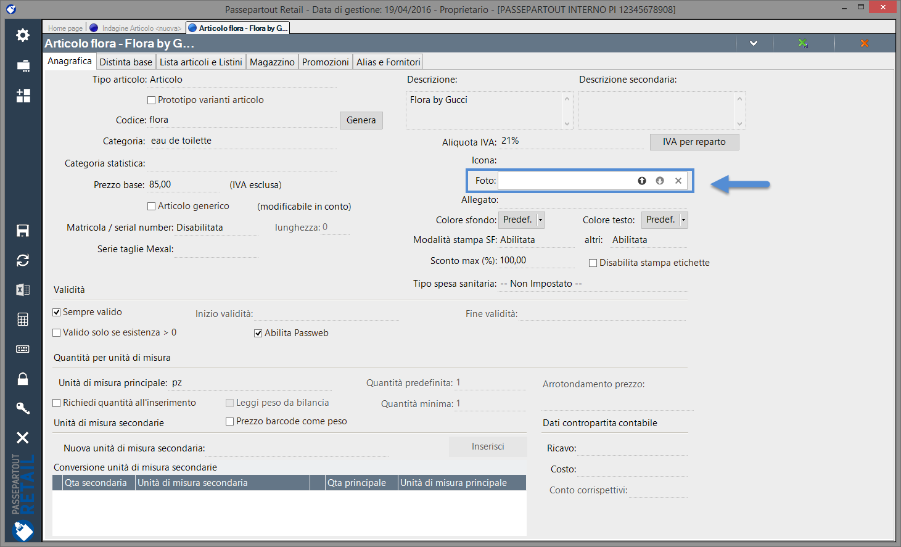
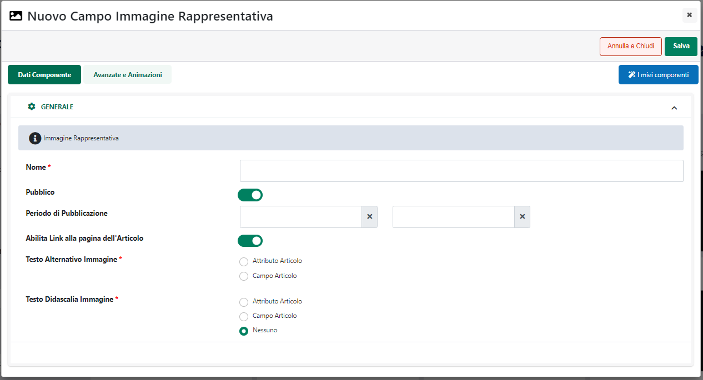
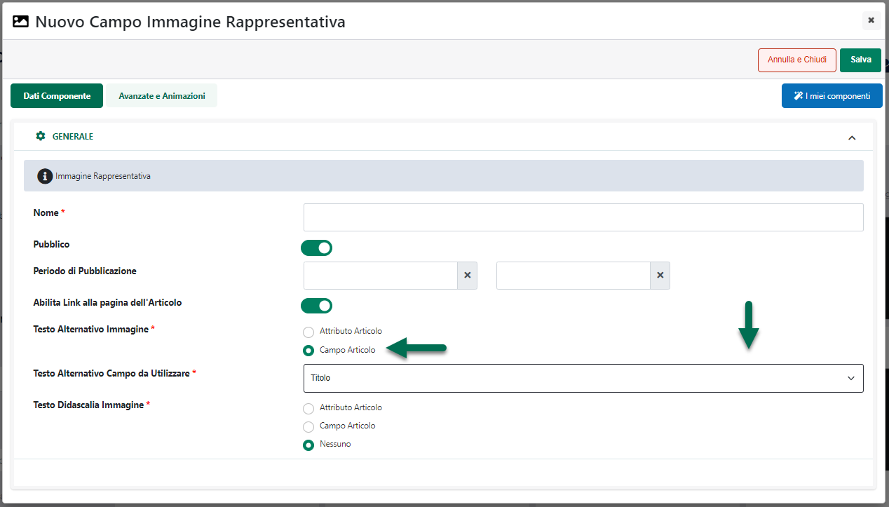

# COMPONENTI E-COMMERCE -- IMMAGINE RAPPRESENTATIVA (IMMAGINE DEL CATALOGO)

Il Componente Ecommerce **"Immagine Rappresentativa"** consente di
inserire all'interno di Componenti E-Commerce di primo livello quali ad
esempio Catalogo E-commerce, Risultati Ricerca, Offerte/Novità,
Abbinati, Campionario ecc... una specifica immagine tra quelle associate
ai vari articoli presenti all'interno del sito.

In particolare:

- **Nel caso in cui sia stata associata in Mexal, nell'anagrafica
  dell'articolo, una specifica immagine alla risorsa "Immagine
  Articolo"** questa verrà sempre considerata da Passweb come
  "**Immagine del catalogo**" e verrà quindi sostituita al Componente
  Immagine Rappresentativa inserito all'interno del corrispondente
  Componente Ecommerce di primo livello

- **Nel caso in cui NON sia stata associata in Mexal, nell'anagrafica
  dell'articolo, nessuna immagine alla risorsa "Immagine Articolo" e
  venga gestito tutto dunque tramite Docuvision**, bisognerà allora
  considerare che **la prima immagine caricata per l'articolo
  all'interno di Docuvision**, verrà considerata da Passweb, come
  **"Immagine del catalogo"** e verrà quindi sostituita al Componente
  Immagine inserito all'interno del corrispondente Componente Ecommerce
  di primo livello.

> **NOTA BENE:** per maggiori informazioni relativamente
> all'associazione mediante Docuvision delle varie risorse (immagini,
> schede tecniche e descrizioni aggiuntive) agli articoli gestiti
> all'interno del sito e alla loro importazioni in Passweb, si rimanda
> al relativo capitolo ("Associazione delle immagini e delle schede
> tecniche articolo all'interno del gestionale") di questo manuale.

- **Nel caso di siti Ecommerce collegati ad uno dei gestionali
  Ho.Re.Ca.** il componente **Immagine Rappresentativa** verrà
  sostituito con l'immagine caricata per il singolo articolo all'interno
  del campo "**Foto**" presente nell'Anagrafica Articoli del gestionale

- **Nel caso in cui NON sia stata associata sul gestionale (Mexal o
  Hore.Ca.) nessuna immagine all'articolo, ne attraverso la sua
  anagrafica ne tanto meno attraverso Docuvision**, Passweb potrà,
  eventualmente, considerare come "**Immagine del catalogo**",
  l'immagine caricata nel campo **"Immagine catalogo di Default"**
  presente all'interno della sezione "*Catalogo - Configurazione
  Parametri Catalogo-- Parametri Immagini*" del Wizard.

**ATTENZIONE!** Volendo è anche possibile gestire le immagini articolo
direttamente su Passweb caricandole all'interno della corrispondente
sezione del Wizard. Per maggior informazioni in merito si veda anche la
sezione *"Catalogo -- Configurazione Parametri Catalogo -- Gestione
Articoli -- Articoli"* di questo manuale.

> **NOTA BENE:** per maggiori informazioni relativamente alle immagini
> articolo presenti all'interno del componente "Scheda Prodotto" si veda
> il successivo capitolo di questo manuale

Una volta inserito il Componente all'interno della pagina web, verrà
aperta in automatico **la sua maschera di gestione e configurazione**

suddivisa in varie sezioni.

All'interno della sezione "**Dati Componente**" sarà possibile inserire
il contenuto e settare i principali parametri di configurazione del
componente.

In particolare, per la tipologia di Componente in questione, sarà
possibile impostare un valore per i seguenti parametri:

- **Nome:** consente di definire un nome per il Componente che si sta
  editando

- **Pubblico (selezionato a default):** consente di impostare la
  visibilità del componente lato sito web. Se selezionato il
  corrispondente componente verrà correttamente pubblicato e
  visualizzato all'interno del sito. Nel caso in cui invece tale
  parametro non sia selezionato, il corrispondente componente passerà in
  modalità "Offline", sarà quindi visibile all'interno del Wizard, dove
  potrà essere normalmente gestito, ma non verrà pubblicato e
  visualizzato all'interno del sito.

- **Periodo di Pubblicazione:** consente di associare al Componente in
  oggetto uno specifico periodo di pubblicazione, definendone
  l'effettiva data di pubblicazione e la corrispondente data di
  oscuramento.

> Nel primo dei due campi disponibili occorrerà quindi indicare,
> utilizzando l'apposito calendario, la data di inizio pubblicazione.
> Nel secondo campo andrà invece specificata la data di fine
> pubblicazione.
>
> **ATTENZIONE!** Le date indicate all'interno di questi campi verranno
> considerate solo ed esclusivamente nel caso in cui il precedente
> parametro "Pubblico" sia stato selezionato

- **Abilita link alla pagina dell'Articolo:** consente di
  abilitare/disabilitare sul componente in esame un link di collegamento
  alla relativa pagina prodotto.

- **Testo Alternativo Immagine:** consente di personalizzare gli
  attributi **title** e **alt** relativi all'immagine articolo. In
  particolare nel caso in cui il campo in esame sia impostato sul
  valore:

  - **Campo Articolo:** sarà possibile selezionare dal sottostante menu
    a tendina ("**Testo Alternativo Campo da Utilizzare**") una delle
    due opzioni **Titolo** o **Codice.**

> Nel primo caso gli attributi **title** e **alt** dell'immagine
> articolo verranno valorizzati con la stessa informazione utilizzata
> anche per il Componente Titolo.
>
> Nel secondo caso verranno valorizzati, ovviamente, con il codice del
> relativo articolo

- **Attributo Articolo:** sarà possibile selezionare dal sottostante
  menu a tendina ("**Testo Alternativo Attributo da Utilizzare**") uno
  qualsiasi degli Attributi Articolo (siano essi di tipo Mexal o
  Passweb) precedentemente codificati all'interno della corrispondente
  sezione del Wizard.

> In queste condizioni gli attributi **title** e **alt** dell'immagine
> articolo verranno valorizzati con il valore impostato per l'attributo
> selezionato

- **Testo Didascalia Immagine:** consente di gestire il cosiddetto
  "**caption**" sull'immagine, ossia del testo in formato HTML che verrà
  poi utilizzato come "didascalia" all'immagine stessa.

> E' possibile selezionare uno dei seguenti valori:

- **Nessuno:** in questo caso non verrà gestito nessun tipo di
  didascalia sull'immagine articolo

- **Campo Articolo:** in questo caso il testo della didascalia relativa
  all'immagine articolo coinciderà con il valore dello specifico campo
  indicato all'interno del successivo parametro "**Testo Didascalia
  Campo da utilizzare**"

- **Attributo Articolo:** in questo caso il testo della didascalia
  relativa all'immagine articolo coinciderà con il valore dello
  specifico attributo indicato all'interno del successivo parametro
  "**Testo Didascalia Attributo da utilizzare**"

<!-- -->

- **Testo Didascalia Posizione**: permette di decidere se la didascalia
  dovrà essere visualizzata sopra o sotto l'immagine articolo.

**NOTA BENE:** per maggiori informazioni relativamente alle sezioni
"**Avanzate e Animazioni**", "**Distribuzione**" e "**Protezione**",
presenti nella maschera di gestione e configurazione di tutti i
componenti Passweb, si veda anche il capitolo " Varianti Responsive --
Configurazione Componenti -- Caratteristiche Generali " di questo
manuale.

